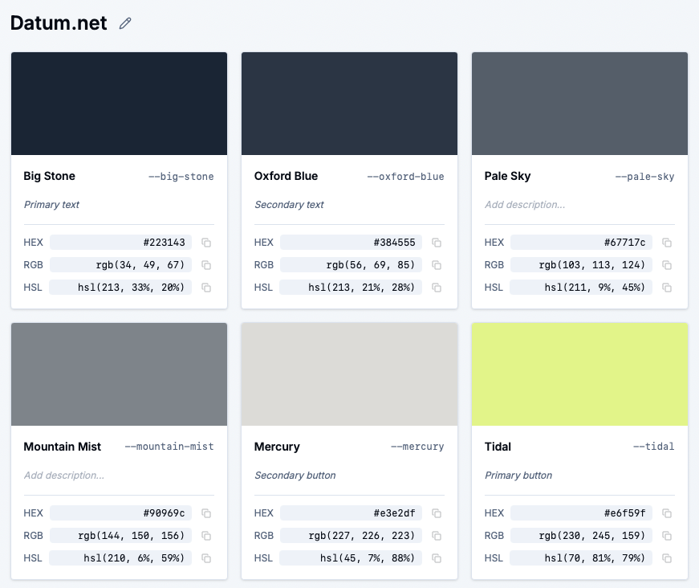

We just rolled out two game-changing features to the [CSS Color Converter & Variable Tool](https://www.sewwa.com/color-palette): **editable palette names** and **color descriptions**. These might seem like small additions, but they'll make your workflow so much smoother.

## What's New

### 1. Name Your Palettes

Remember when every palette was just "Palette 1", "Palette 2", "Palette 3"? Not anymore. Now you can:

- **Click to edit** any palette name directly in the UI
- **Auto-save** happens instantly—no save button needed
- **Visual indicator** (pencil icon) shows you can edit
- **Keyboard shortcuts**: Press `Enter` to save, `Escape` to cancel

Just click on the palette name above your color cards, type your custom name like "Brand Colors" or "Dashboard Theme", and you're done. It's that simple.

### 2. Add Color Descriptions

Ever copied CSS variables and forgot what each color was for? We've got you covered. Now you can:

- **Add descriptions** to each color in your palette
- **Inline editing** right on the color card
- **Auto-save** as you type
- **See descriptions in CSS** as helpful comments

When you generate your CSS variables, descriptions appear as inline comments next to each variable:

```css
/**
 * Generated by Sewwa Color Converter
 * https://www.sewwa.com/color-palette
 * Palette: My Brand Colors
 */
:root {
  --royal-blue: #4169e1; /* Primary button color */
  --tomato-alpha-50: rgba(255, 99, 71, 0.5); /* Error state indicator */
  --lime-green: #32cd32; /* Success notification */
}
```

No more guessing what `--royal-blue` is used for. Your future self (and your teammates) will thank you.



## Why It Matters

### Before These Features

Working with color palettes was functional but... forgetful. You'd generate a palette, use it in your project, and a week later wonder: "Wait, what was this palette for again?" Or you'd share CSS variables with your team and get questions like "What's this color supposed to be used for?"

You'd end up:
1. Creating separate documentation files
2. Adding comments manually in your CSS
3. Keeping mental notes (that you'd forget)
4. Explaining colors over and over in code reviews

### Now It's Different

With palette names and color descriptions:

- **Better organization**: Instantly know what each palette is for
- **Self-documenting CSS**: Descriptions travel with your code
- **Team collaboration**: No more "what does this color do?" questions
- **Faster workflow**: Everything auto-saves, no extra steps

It's like having a built-in documentation system that follows your colors everywhere they go.

## Real-World Use Cases

### Design System Documentation

Create a palette called "Primary Brand Colors" and add descriptions like:
- "Main brand color for headers and CTAs"
- "Hover state for primary buttons"
- "Background tint for hero sections"

When you copy the CSS, your entire team gets context with the code.

### Component-Specific Palettes

Name your palette "Dashboard Cards" and describe each color:
- "Card background with 10% opacity"
- "Border color for active states"
- "Text color for card titles"

Perfect for component libraries where context matters.

### Accessibility Notes

Add descriptions that include accessibility info:
- "WCAG AA compliant for text on white"
- "High contrast for focus states"
- "Used only for decorative elements"

Your CSS becomes a knowledge base.

## Try It Out

Visit [https://www.sewwa.com/color-palette](https://www.sewwa.com/color-palette) and:

1. **Generate a palette** (or load one from history)
2. **Click the palette name** above the color cards to rename it
3. **Type descriptions** in the input fields below each color name
4. **Generate CSS variables** and see your descriptions appear as comments

Everything auto-saves, so you can focus on what matters: building great designs.

---

**Have feedback or feature requests?** Let us know [here](https://github.com/sewwa-cloud/color-converter-roadmap).

