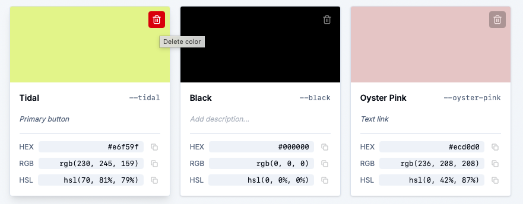
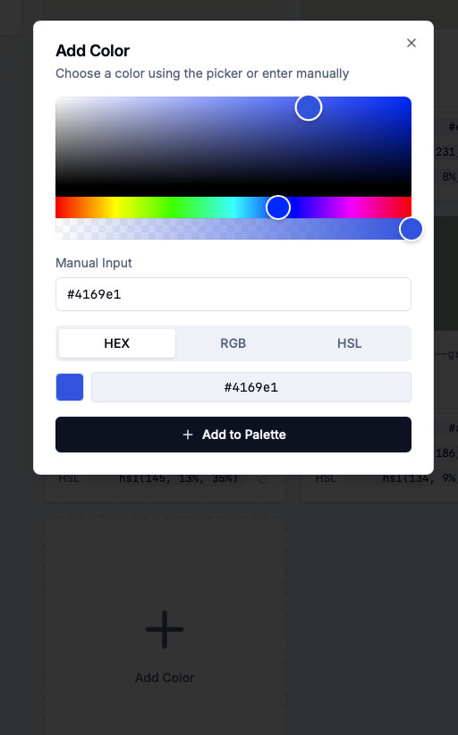

We've been listening to your feedback, and we're excited to share two powerful new features that will transform how you work with color palettes. Whether you're a designer crafting the perfect color scheme or a developer building your next project, these updates will make your workflow smoother and more intuitive.

## 🗑️ Delete Colors with Confidence

Let's face it - we've all been there. You're working on a palette, and suddenly you realize one color just doesn't fit. In the past, you'd have to regenerate the entire palette or manually edit your CSS. Not anymore.

### What's New

Now, every color card comes with a sleek delete button that appears when you hover over it. But here's the best part - we've added a confirmation dialog to prevent those "oops, I didn't mean to delete that" moments. Because let's be honest, we've all had those.

**How it works:**
- Hover over any color card to reveal the trash icon (with a smooth opacity transition, because we care about the details)
- Click the icon to open a friendly confirmation dialog
- Review what you're about to delete - we show you the color name so you know exactly what's going
- Confirm or cancel - you're in control

The delete button starts at 50% opacity and smoothly transitions to 100% when you hover, giving you a clean, professional interface that doesn't clutter your workspace. It's the little things that make a big difference.

## ➕ Add Colors on the Fly

Ever been in the middle of refining a palette and thought, "I wish I could just add one more color without starting over"? Well, wish no more.

### The Magic

We've added a beautiful "Add Color" card at the end of your palette grid. It's impossible to miss with its dashed border and prominent plus icon. Click it, and a full-featured color picker dialog opens - complete with everything you need.

**What you get:**
- **Visual Color Picker**: The same professional HexAlphaColorPicker you know and love, right in the dialog
- **Manual Input**: Type colors directly in any format - HEX, RGB, HSL, you name it. Just paste `#ff6347` or `rgb(255, 99, 71)` and watch it work
- **Format Selection**: Choose how you want the color added - as HEX, RGB, or HSL
- **Live Preview**: See exactly what you're adding before you commit

The best part? The manual input syncs perfectly with the visual picker. Change one, and the other updates automatically. It's like having two ways to do the same thing, and both work flawlessly together.

## 🎨 Why This Matters

These features might seem simple, but they solve real problems:

1. **No More Regeneration**: Made a mistake? Just delete the color. Need to add one? Just add it. Your workflow stays smooth.

2. **Confidence in Actions**: The confirmation dialog means you can work quickly without fear of accidental deletions. We've got your back.

3. **Flexibility**: Whether you prefer clicking through a color picker or typing hex codes like a pro, both methods work perfectly.

4. **Professional Polish**: Smooth animations, thoughtful UI details, and intuitive interactions make the tool feel premium.

## 🚀 Try It Yourself

Ready to experience these features? Head over to our [Color Converter](https://www.sewwa.com/color-converter) and:

1. Generate a palette (or load one from history)
2. Hover over any color card to see the delete button
3. Click the "Add Color" card at the end to add new colors
4. Experiment with both the visual picker and manual input

We're constantly improving based on your feedback, so if you have ideas for what's next, we'd love to hear them. Happy color converting! 🎨
