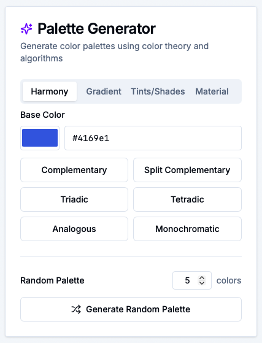
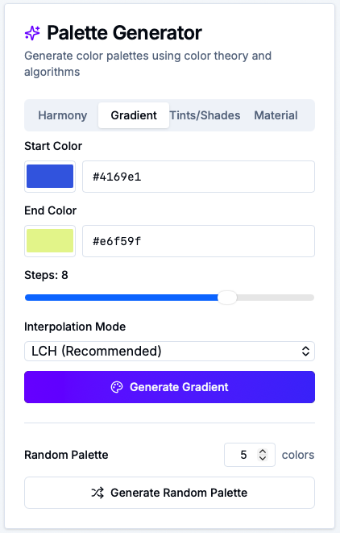
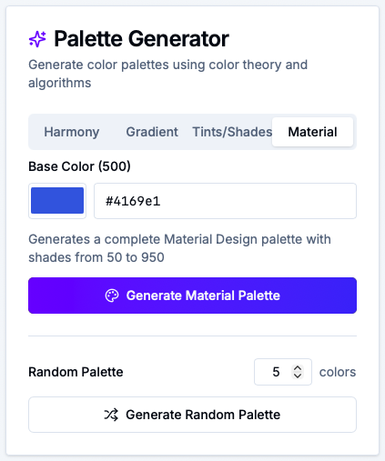

If you've ever stared at a blank canvas thinking, *"What colors should I use?"* — this update is for you.

Our new **Palette Generator** turns color theory and smart algorithms into a simple, friendly tool that helps you create beautiful, production‑ready color palettes in seconds. No more jumping between random color sites and your CSS. Now it all happens in one place.

---

## ✨ Say Hello to Smart Palette Generation

Until now, the Color Converter focused on **taking colors you already had** and turning them into clean CSS variables.

That’s still there — but now you can also **generate** palettes from scratch using:

- Classic **color harmonies**
- Smooth **gradients**
- Thoughtful **tints & shades**
- A full **Material Design** scale
- And even **random palettes** for inspiration

Every generated palette plugs directly into the same workflow you already know: history, naming, descriptions, and CSS export.

---

## 🎯 1. Color Harmonies Without the Color Theory Headache

Color harmony is powerful, but doing it by hand is… not fun.

In the **Harmony** tab, you pick a single base color and let the generator handle the rest. With one click, you can create:

- **Complementary** – Perfect for strong contrast (e.g. CTA button vs background)
- **Split Complementary** – A safer, more flexible contrast scheme
- **Triadic** – Three colors evenly spaced around the color wheel
- **Tetradic** – Four colors for richer, more complex palettes
- **Analogous** – Soft, natural combinations (great for UI themes)
- **Monochromatic** – Light and dark variations of a single hue

You focus on the **vibe**. The tool takes care of the math.

When you generate a harmony:

- It appears instantly in the **right‑side results area**
- You can rename the palette, add descriptions, delete or add colors
- It’s automatically saved to **history**, so you can come back to it later

---

## 🌈 2. Gradients That Actually Look Good

Gradients can be beautiful — or a mess.

The **Gradient** tab helps you build **smooth, consistent transitions** between two colors:

- Choose a **start** and **end** color
- Pick how many **steps** you want (3–10)
- Select the **interpolation mode**:
  - **LCH / LAB** – perceptually smooth, ideal for modern UIs
  - **HSL** – hue‑based transitions
  - **RGB** – classic but less visually uniform

Click **“Generate Gradient”**, and you get a ready‑made palette that:

- Shows up as color cards (with HEX/RGB/HSL formats)
- Can be exported immediately as CSS variables
- Gets saved to history so you can reuse it across projects

No guessing, no fiddling, just gradients that feel professional.

---

## 🌓 3. Tints & Shades for Real‑World Design Systems

Real design systems need more than just “one good blue”.

In the **Tints/Shades** tab, you:

- Pick a **base color**
- Choose how many **variations** you want on each side (tints & shades)

With one click, you get:

- Lighter **tints** for backgrounds and subtle elements
- Your **base** right in the middle
- Darker **shades** for text, borders, and emphasis

This is perfect if you’re:

- Building a **design system** from scratch
- Tweaking an existing brand color into a full usable scale
- Making your UI feel more polished and consistent

---

## 🧩 4. Full Material Design Palette in One Click

Love the idea of Material Design’s color system but don’t want to hand‑craft all the steps?

The **Material** tab lets you:

- Pick a single **base color** (treated as the 500 level)
- Generate a complete **Material‑style palette** from `50` to `950`

You instantly get 11 shades you can map to:

- `--primary-50`, `--primary-100`, … `--primary-950`
- Light, dark, hover, focus, and disabled states
- Component backgrounds, borders, and text

It’s a design‑system‑ready color scale, tailored to your brand.

---

## 🎲 5. Random Palettes for When You Just Need Ideas

Sometimes you don’t know what you want until you see it.

At the bottom of the generator, the **Random Palette** section lets you:

- Choose how many colors you want (3–10)
- Click **“Generate Random Palette”**

Behind the scenes, we use smart distribution of hues, saturation, and lightness so the result *actually* looks like a usable palette — not a chaotic rainbow.

Perfect for:

- Quick **inspiration**
- Early‑stage **mood exploration**
- Breaking out of your usual color habits

---

## 🔗 Fully Integrated with Your Existing Workflow

The best part? The Palette Generator doesn’t feel like a separate tool — it’s fully wired into the existing Color Converter experience.

When you generate a palette, you can:

1. **See it as color cards**  
   Each color shows:
   - Name and CSS variable
   - HEX, RGB, and HSL (with alpha support)
   - One‑click copy for each format

2. **Rename and annotate**  
   - Click the palette name to rename it
   - Add descriptions to each color (e.g. “primary button”, “muted background”)
   - Save your changes so they persist in history

3. **Edit without fear**  
   - Delete colors with a confirmation dialog
   - Add new colors via the “Add Color” card
   - Keep everything synced with your history

4. **Export as CSS variables**  
   - Switch between **HEX**, **RGB**, and **HSL** tabs
   - Copy a complete, ready‑to‑paste variables block for your project

It’s not just a generator — it’s a full **idea → palette → production CSS** pipeline.

---

## 🚀 Try the Palette Generator Today

Ready to give it a spin?

Head over to our [Color Converter & Palette Generator](https://www.sewwa.com/color-converter) and:

1. Open the **Palette Generator** card in the left column  
2. Try a **harmony**, **gradient**, **tints/shades**, or **Material** palette  
3. Generate a few **random palettes** for fun and save your favorites  
4. Rename, annotate, and export them as CSS variables  

We built this feature to help you move **faster**, design **smarter**, and feel more confident about your color choices.

If you have ideas for what we should add next — accessibility overlays, image‑based palettes, advanced harmonies, or something totally different — we’d love to hear from you.

Happy palette‑building! 🎨