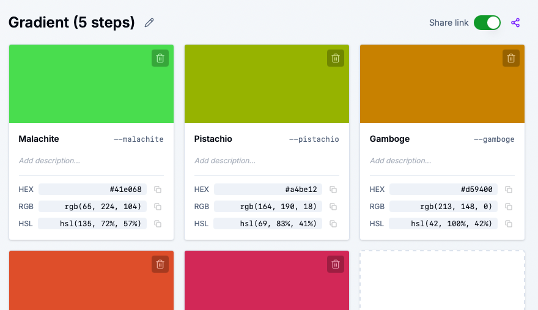
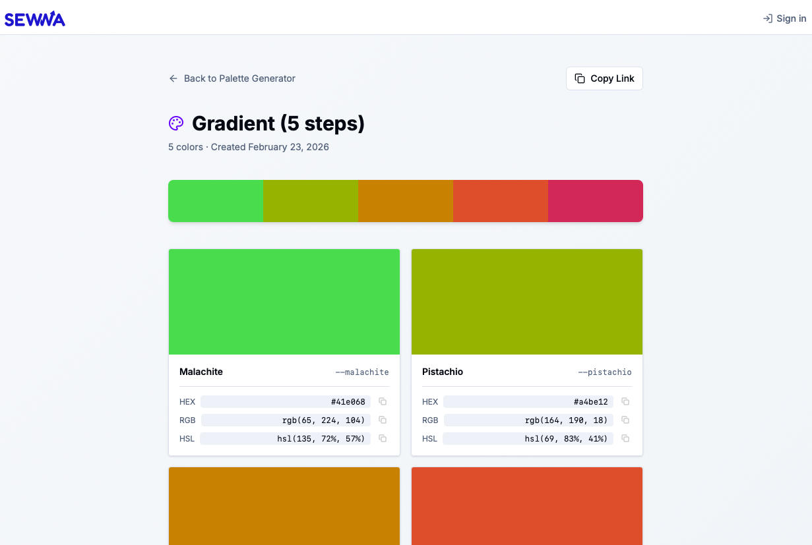

Ever wanted to send a palette to a teammate, client, or friend without screenshots or messy exports?

We've added a **Share Palette** feature so you can share any palette with a single link. Turn it on, copy the URL, and anyone can view your colors and grab the CSS variables — no account needed on their end.

---

## ✨ How It Works

If you're logged in, you'll see a **Share link** toggle right next to the Save button when you're viewing a palette.

- **Toggle on** → Your palette gets a public URL (e.g. `sewwa.com/color-palette/p/my-awesome-palette`)
- **Toggle off** → The link stops working; your palette is private again
- **Share icon** → When the toggle is on, a purple share icon appears. Click it to copy the link to your clipboard

It's that simple. You control when a palette is shareable.

---

## 🔗 What Recipients See

When someone opens your share link, they get a clean, read-only view of your palette:

- **Palette name** and color count
- **Color strip preview** at the top
- **Individual color cards** with:
  - Large color swatch
  - Semantic name and CSS variable
  - HEX, RGB, and HSL values with copy buttons
- **CSS Variables section** with tabs for HEX, RGB, and HSL — one click to copy the full block

No login, no clutter. Just your palette, ready to use.

---

## 🎯 Built for Real Workflows

**For designers & developers**

- Share palettes with clients for approval
- Send design-system colors to your dev team
- Drop a link in Slack, Figma comments, or docs

**For collaboration**

- Everyone sees the same palette
- Copy values in any format (HEX, RGB, HSL)
- Export CSS variables without opening the main app

**For you**

- Toggle sharing on or off anytime
- Only logged-in users can share (keeps things tidy)
- Each palette gets a unique, readable slug based on its name

---

## 🚀 Try It Out

1. Go to [Color Converter & Palette Generator](https://www.sewwa.com/color-palette)
2. Log in (required to share)
3. Open a palette from your history or create a new one
4. Turn on the **Share link** toggle next to the Save button
5. Click the share icon to copy the link
6. Send it to anyone — they can view and copy without signing up

The share page is mobile-friendly and works in any browser. Your palettes, your control.

If you have feedback or ideas for what we should add next, we'd love to hear from you.

Happy sharing! 🎨
