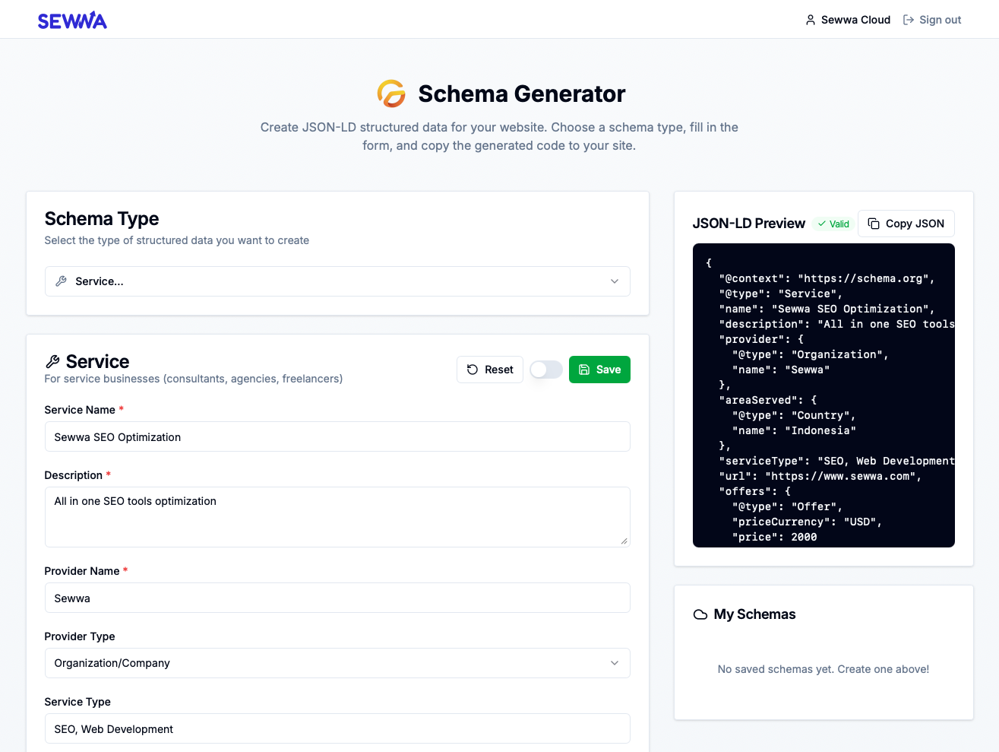
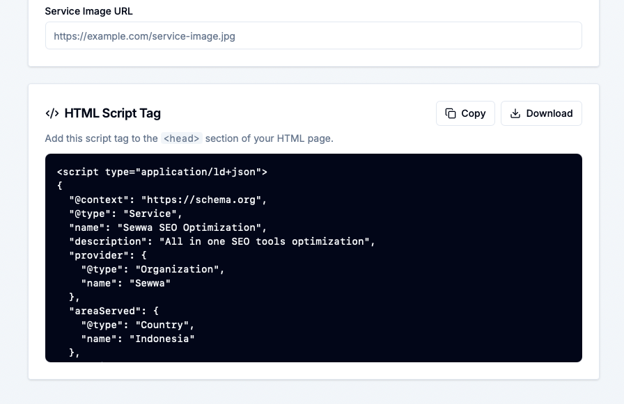
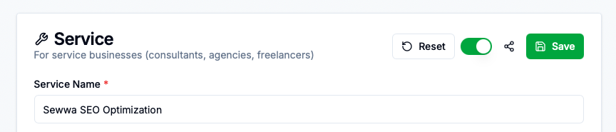

Let's be real—structured data is one of those things every developer knows they *should* implement, but often puts off because it feels tedious. You're digging through schema.org documentation, manually constructing JSON-LD objects, and hoping you didn't miss a required field. Sound familiar?

That's exactly why we built **Schema Generator**. It's the tool we wished existed when we were spending way too much time wrestling with structured data markup.

## The Problem We're Solving

Picture this: You've just launched a new product page, blog post, or local business listing. You know that adding JSON-LD structured data will help search engines understand your content better, potentially earning you rich snippets in search results. But then you realize:

- You need to look up the correct schema.org type
- You have to figure out which fields are required vs optional
- You're manually writing JSON and hoping the syntax is correct
- You have to test it with Google's Rich Results Tester
- And if you make a mistake? Good luck debugging that JSON

Before Schema Generator, this meant opening multiple browser tabs, reading through dense documentation, and a lot of trial and error. It was time-consuming and error-prone.

## What Makes Schema Generator Different

### 📋 18 Schema Types Ready to Go

No more hunting through schema.org documentation. Schema Generator comes with **18 pre-built schema types** organized into intuitive categories:

**Business & Organization**
- Organization, Local Business, Person, Service

**Content & Media**
- Article, FAQ, How-To, Video, Recipe, Review

**Commerce & Events**
- Product, Course, Event, Job Posting

**Technical & Navigation**
- Website, Breadcrumb

Each schema type has its own tailored form with the right fields, placeholders, and validation. Just pick your type and start filling in the blanks.

### 📝 Smart Forms That Guide You

Every schema type comes with a dynamic form that:

- Shows **only the fields relevant** to that schema type
- Provides **helpful placeholders** so you know what to enter
- Marks **required vs optional fields** clearly
- Supports complex field types like **arrays** (for FAQ items, product offers) and **nested objects** (for addresses, authors)

No more guessing what fields a Product schema needs versus an Article schema. The form adapts to your choice.

### ⚡ Real-Time JSON-LD Preview

As you fill in the form, Schema Generator generates valid JSON-LD in real-time. You can see:

- The complete JSON-LD output with proper `@context` and `@type`
- A preview of how Google might interpret your structured data
- Ready-to-copy code in multiple formats (JSON only or full `<script>` tag)

The preview updates instantly as you type, so you always know exactly what you're getting.

### 💾 Save & Organize Your Schemas

Schema Generator remembers your work:

- **Guest users**: Save up to 5 schemas locally in your browser
- **Signed-in users**: Unlimited cloud storage with sync across devices

Each saved schema keeps track of:
- The schema type and name
- When it was created and last updated
- All your form data for easy editing later

Perfect for when you're iterating on a schema or managing multiple pages on a site.

### 🔗 Shareable Public Links (Cloud Users)

Need to share a schema with a client or teammate? Signed-in users can:

- Toggle any schema to **public**
- Get a **shareable URL** like `sewwa.com/schema-generator/s/your-schema`
- Recipients see a clean page with the JSON-LD and ready-to-copy script tag

Great for collaboration, client handoffs, or keeping a public library of your schemas.

### 🔄 Local to Cloud Sync

Started as a guest and decided to sign in? Schema Generator detects your local schemas and offers to **sync them to your cloud account** with one click. No lost work, no manual migration.

### 📦 Export Options for Every Workflow

When your schema is ready, you can:

- **Copy as JSON** – Just the raw JSON-LD object
- **Copy as Script Tag** – The complete `<script type="application/ld+json">` block ready to paste into your HTML
- **Download as file** – Perfect for version control or programmatic use

## Why We Built This

Honestly? We got tired of the friction around structured data. Existing tools were either:

- Too basic (just a text editor with no guidance)
- Too complicated (enterprise SEO platforms with features we didn't need)
- Scattered across multiple websites

We wanted something that:

- **Just works** without a steep learning curve
- **Guides you** to create valid, complete schemas
- **Remembers your work** so you don't lose progress
- **Makes sharing easy** for collaborative workflows
- **Stays out of your way** so you can focus on shipping

So we built it. And now we're sharing it because we figured if we needed it, other developers probably do too.

## Who's This For?

If you're a developer, SEO specialist, or content creator who:

- Wants to add structured data but doesn't know where to start
- Is tired of manually writing JSON-LD
- Needs to create schemas for multiple pages or sites
- Wants to collaborate on structured data with a team
- Appreciates tools that respect your time

Then Schema Generator is for you. It's free, it's fast, and it's designed to get out of your way so you can focus on building great content.

## Try It Out

Ready to see it in action? Head over to [https://www.sewwa.com/schema-generator](https://www.sewwa.com/schema-generator) and:

1. **Pick a schema type** from the dropdown (try FAQ or Article to start)
2. **Fill in the form** – notice how the preview updates in real-time
3. **Copy the generated code** and paste it into your site's `<head>`
4. **Save your schema** to come back and edit it later

Here's a quick example—create an FAQ schema with a few questions and answers:

- Question: "What is structured data?"
- Answer: "Structured data is a standardized format for providing information about a page and classifying the page content."

The tool will generate complete, valid JSON-LD that you can drop straight into your website.

## The Bottom Line

Structured data shouldn't be a chore. With Schema Generator, you can go from "I need to add schema markup" to "done and shipped" in minutes, not hours.

We built this tool because we needed it. We're sharing it because we think you might need it too.

So next time you're implementing JSON-LD, give Schema Generator a shot. Your search rankings (and your sanity) will thank you.

---

**Ready to generate some schemas?** [Try Schema Generator now →](https://www.sewwa.com/schema-generator)

*Have feedback or feature requests? We'd love to hear from you! Submit them [here](https://github.com/sewwa-cloud/schema-factory-roadmap).*
