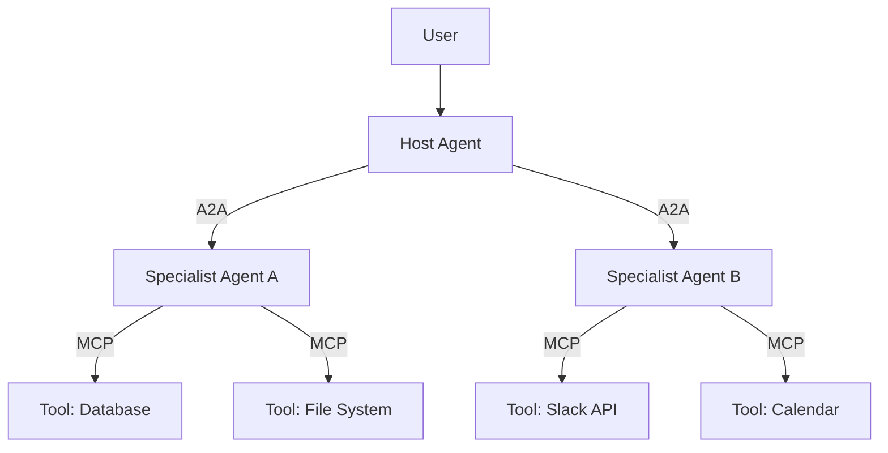
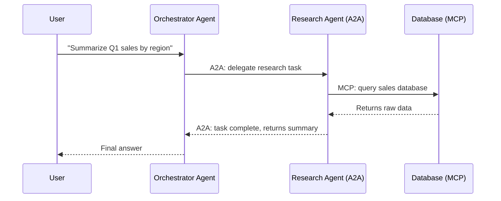

Most developers first encounter MCP when they're setting up a Claude integration and stumble across a config file with the word "server" in it. A few days later, they see "A2A" in a Google announcement and assume it's competing with the first thing. Then they get confused, close the tab, and go back to building.

That confusion is understandable. But these two protocols are genuinely important — not in a "buzzword of the quarter" way, but in a "this is becoming the plumbing of everything agentic" way. And the window for understanding them before they're just assumed knowledge is closing fast.

So let's break it down clearly.

---

## The Problem Both Protocols Are Trying to Solve

Before MCP existed, connecting an AI model to any external tool — a database, a file system, a Slack workspace — meant writing a custom integration from scratch. Every time. If you had five AI tools and ten data sources, you were looking at up to 50 bespoke connectors. Anthropic called this the "N×M problem," and it's a good name for it.

The result was a fragmented ecosystem where every team reinvented the same wheel slightly differently, nothing was reusable, and the cognitive overhead of wiring things together competed with the actual work of building the AI feature itself.

MCP solves the vertical problem — how an agent connects to tools and data. A2A solves the horizontal one — how agents talk to *each other*.

They're not competing. They're two layers of the same stack.

---

## What MCP Actually Does

MCP — Model Context Protocol — is an open standard introduced by Anthropic in November 2024. Think of it as USB-C for AI integrations. One universal connector instead of a drawer full of proprietary cables.

The architecture is straightforward. There's a **host** (the AI application — say, Claude Desktop or Cursor), a **client** inside that host, and a **server** that exposes whatever external resource you want the agent to access. The server can expose three kinds of things:

- **Tools** — actions the model can invoke, like querying an API or running a function
- **Resources** — data the model can read, like files or database records
- **Prompts** — reusable templates and structured workflows

The beauty of this design is that once someone builds an MCP server for, say, GitHub, *every* MCP-compatible AI host can use it immediately. The work compounds. By 2026, Gartner estimates that 75% of API gateway vendors will have MCP features — which tells you this isn't a niche experiment anymore.

OpenAI officially adopted MCP in March 2025. Google DeepMind followed. By now, the spec is governed by the Agentic AI Foundation under the Linux Foundation, with co-founders including Anthropic, Block, and OpenAI. It's about as close to an industry standard as the agentic world has.

One analogy that actually sticks: if an AI agent is a knowledge worker, MCP is the employee badge that lets them swipe into different rooms. Without it, they're stuck in the hallway.

---

## What A2A Actually Does

A2A — Agent-to-Agent protocol — was introduced by Google in April 2025 with backing from 50+ partners. Within a year, that number grew to 150+ organizations. IBM's competing Agent Communication Protocol (ACP) merged into A2A in August 2025. As of April 2026, it's effectively the only show in town for inter-agent communication.

Where MCP is about an agent accessing tools, A2A is about agents accessing *each other*.

The core mechanism is the **Agent Card** — a JSON document that every A2A-compliant agent publishes at a well-known URL (`/.well-known/agent-card.json`). This card describes what the agent can do, how to reach it, and what kind of tasks it accepts. Other agents discover and delegate to it using this card, without needing any custom integration code.

A2A introduced version 1.0 in early 2026, which added **Signed Agent Cards** — cryptographic signatures that let a receiving agent verify the card was actually issued by the domain owner. Without this, a malicious actor could stand up a fake agent pretending to be a trusted supplier or service. With it, decentralized agent discovery becomes viable in production.

The other key difference from MCP: A2A is **intentionally stateful**. It manages long-running tasks through a Task object with explicit lifecycle states — submitted, working, input-required, completed, failed. An agent can delegate a multi-hour job to a specialist, go do other things, and come back to check status. MCP doesn't handle this; it's more of a request-response model.

---

## Where They Fit Together

Here's a concrete way to think about the split:

**MCP** answers: *What can this agent do, and what can it see?*
**A2A** answers: *Who can this agent collaborate with, and how?*

Google's own documentation uses a restaurant supply chain analogy. A kitchen manager agent needs to check inventory (MCP queries a database), consult a specialist pricing agent about today's rates (A2A communication), then place an order (another protocol handles the transaction). Each protocol handles its own layer cleanly.

The practical implication for developers is that you don't choose between them — you reach for each one at the right layer. If you're connecting an agent to a data source, you want MCP. If you're building a system where agents delegate work to other agents, you want A2A.

Where it gets interesting — and slightly contested — is in the middle. The line between a "smart tool" and an "agent" is blurring. Some developers argue that MCP servers can be sophisticated enough to handle what A2A is designed for. Google's position is that they're solving categorically different problems. For most practical purposes today, that distinction holds.

---

## Why This Matters Beyond the Technical Details

The agentic AI market is projected to grow from around $9 billion in 2026 to over $139 billion by 2034. That growth only happens if agents can be composed reliably — if a company can mix a security agent from one vendor, a customer service agent from another, and a data pipeline agent they built in-house, and have all three work together without a massive integration project.

MCP and A2A are what make that composability possible. Without them, every multi-agent system becomes a custom integration project. With them, agents become more like microservices — independently deployable, interoperable by default.

There's a reason enterprises are moving fast here. Forrester predicts 30% of enterprise app vendors will launch their own MCP servers in 2026. A2A v1.0 has production deployments at Microsoft, AWS, Salesforce, SAP, and ServiceNow. This isn't speculative infrastructure. It's being shipped now.

For developers, the timing question is real. The teams who understand these protocols today are making architecture decisions that will pay off as their systems scale. The teams who skip them are building point-to-point integrations they'll eventually need to replace.

---

## Common Misconceptions Worth Clearing Up

**"A2A competes with MCP."** It doesn't. They operate at different layers. The confusion comes from both being described as "agent protocols," but the scope is different. Think of MCP as how an agent interacts with the world of tools, and A2A as how agents interact with each other.

**"MCP replaces RAG."** No. MCP is a communication standard; RAG is a retrieval technique. A vector database accessed through an MCP server is a perfectly normal setup. They compose rather than compete.

**"This is all too early-stage to adopt."** The spec governance moved to the Linux Foundation. A2A v1.0 is in production at major enterprises. MCP has near-universal adoption among AI tool vendors. The "wait and see" window has mostly closed.

---

## What to Do With This

If you're building anything agentic in 2026, here's the practical takeaway:

For any new integration that connects an AI to an external tool or data source, design it as an MCP server. The upfront investment is slightly higher than a one-off integration, but you get instant compatibility with the entire MCP ecosystem — every AI host that supports the standard can use what you build.

For systems where agents need to delegate work to other agents — especially across team or vendor boundaries — A2A gives you a framework that handles discovery, task lifecycle, and security without rolling your own. Start with the Agent Card spec and the official A2A samples before writing custom orchestration logic.

And if you're evaluating AI platforms, vendors, or APIs: ask whether they support MCP and A2A. By mid-2026, the answer tells you a lot about how seriously they're investing in the agentic ecosystem.

The protocols themselves are not the exciting part. What's exciting is what becomes possible when agents can be assembled from composable, interoperable pieces — the way software was transformed when microservices made it possible to deploy and scale individual components independently. MCP and A2A are building that foundation for agents.

[→ Read also: Agentic AI Revolution: Transforming Web Development in 2026](/2026-04-12--agentic-ai-web-developers/)

---

## FAQ

**Do I need both MCP and A2A, or just one?**
It depends on what you're building. If you're connecting a single agent to external tools, MCP is what you need. If your system involves multiple agents delegating work to each other — especially across different frameworks or vendors — you'll want A2A on top of MCP. Most serious multi-agent systems end up using both.

**Is MCP only for Anthropic/Claude?**
No. MCP is an open standard and has been adopted by OpenAI, Google DeepMind, and a wide range of toolmakers. It's now governed by the Linux Foundation. Any AI application can implement an MCP client or server regardless of which underlying model it uses.

**How do agents find each other with A2A?**
Through Agent Cards — JSON documents published at a well-known URL on each agent's domain. These cards describe the agent's capabilities and contact information. Other agents discover and connect to them via this standard path, without needing any pre-configured integration.

**What are the security concerns with MCP?**
Real ones. Security researchers flagged issues in 2025 including prompt injection, overly permissive tool access, and "lookalike" tools that could impersonate trusted ones. Best practice is to treat every MCP server as untrusted until reviewed, apply least-privilege access (only expose the tools actually needed), and keep an eye on the evolving security guidance from the MCP spec team.

**Where can I start learning more?**
The official MCP spec lives at `modelcontextprotocol.io`. For A2A, start with Google's agent protocol developer guide and the A2A samples repository. Both have solid documentation and working code examples that are more useful than most third-party tutorials.
