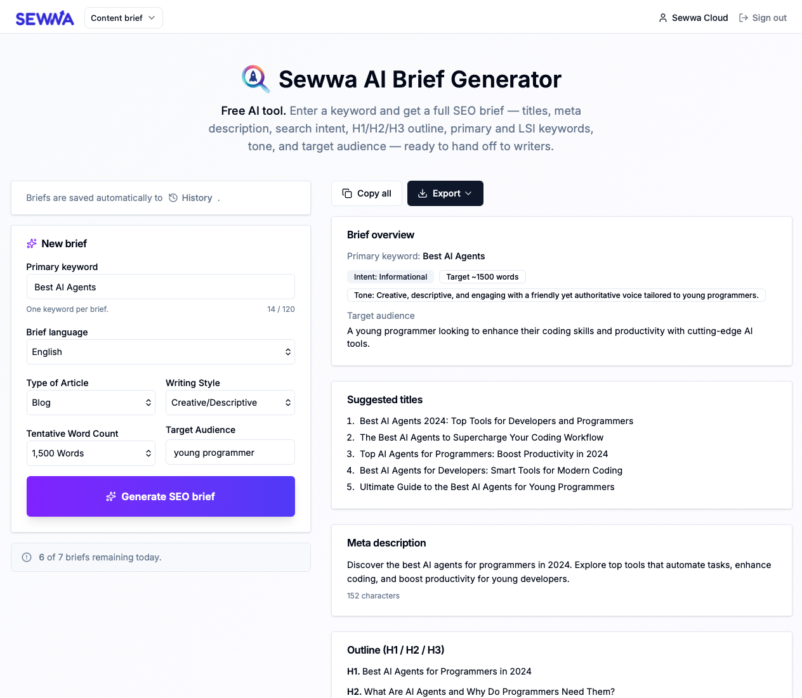

If you've ever had to write — or commission — a "well-optimized" blog post, you know the routine. You stare at a keyword, open six tabs of competitor articles, copy headings into a doc, argue with yourself about whether the intent is informational or transactional, paste meta description drafts into a character counter, and two hours later you have… an outline. Maybe.

That's the problem we built **Sewwa AI Brief Generator** to solve. Type one keyword, get a complete SEO content brief you can hand straight to a writer — in seconds, not hours.

## The Problem With "Just Writing a Quick Brief"

A proper SEO brief isn't long, but it's annoying to produce:

- You need a few **title options** that are actually clickable, not just stuffed with the keyword
- You need a **meta description** under 160 characters that still sounds human
- You have to decide the **search intent** — informational, transactional, commercial, navigational — and let that shape the outline
- You need an **H1 / H2 / H3 outline** that covers the topic end-to-end
- You need **10–15 LSI / related keywords** so the article ranks for more than just the head term
- You need a **tone** and a **target audience** so the draft doesn't come back in corporate voice when you wanted "friendly blogger"

Existing tools that do this well — Frase, Semrush, Surfer — are **$45–$139 per month** and built for enterprise SEO teams. Overkill for solo bloggers, freelance writers, and small business owners. So most people skip the brief entirely and get mediocre drafts. Or they spend two hours in Google Docs.

We wanted the 5-minute version.

## What the Brief Generator Actually Gives You

### One Keyword In, a Full Brief Out

Drop in a keyword — `family car insurance`, `asuransi mobil keluarga`, whatever you're targeting — and the generator returns a structured brief with:

- **3 suggested article titles** — ready to A/B, or pick your favorite
- **Meta description** — under 160 characters, character count shown
- **Search intent** classification — Informational / Navigational / Transactional / Commercial
- **Target word count** — calibrated to the intent and topic depth
- **Full H1 / H2 / H3 outline** — with notes on what each section should cover
- **Primary keyword + 10–15 LSI / related keywords** — the supporting terms your article should actually mention
- **Recommended tone of voice**
- **Target audience description**

That's the whole package. No toggling between tools, no assembling the brief yourself.

### Tune the Brief Without Overthinking It

You don't have to just accept whatever the AI decides. Before generating, you can steer the output with optional controls:

- **Type of article** — listicle, how-to, guide, comparison, review, etc., or let the AI pick
- **Writing style** — casual, professional, conversational, authoritative, and more
- **Tentative word count** — pick your target length, or let the AI calibrate it
- **Target audience** — e.g. `young professionals 25–35`, `first-time home buyers in Jakarta` (signed-in feature)

Leave them on "Auto" and the AI infers the best fit from the keyword. Set them explicitly when you have a specific editorial direction in mind.

### Bilingual: Indonesian or English

Most SEO tools are English-only. That's a problem if your blog or your client's site is in Indonesian — you either translate everything, or you settle for awkward, literally-translated keyword lists.

The Brief Generator speaks **Indonesian and English natively**. Pick the language and the entire brief — titles, outline, meta description, LSI keywords, audience — comes back in that language, written the way a native speaker would actually write it.

### Export Options for Every Workflow

Once you've got a brief you like, getting it out is easy:

- **Copy all** — plain text, straight to clipboard (works for everyone, including guests)
- **PDF** — nicely formatted, good for client handoffs
- **Word (.doc)** — drop it into Microsoft Word and edit
- **Markdown (.md)** — perfect for writers working in Obsidian, Notion, or a Git-based workflow

PDF, Word, and Markdown exports require a free Sewwa account. Copy-to-clipboard works for everyone.

### History: Every Brief You've Generated, Saved

Signed-in users get automatic **brief history**. Every brief you generate is saved, searchable, and re-openable — so you can come back a week later, tweak the outline, and re-export. No more "where did I save that brief?" scavenger hunts.

Guests get the full generator, just without the history and export features.

## Why We Built This

Honestly, because we kept needing it.

The existing options fell into two camps:

- **Too expensive and too complex** — enterprise SEO suites with dashboards, crawlers, rank trackers, and a learning curve, when all we wanted was a brief
- **Too generic** — "AI content generators" that produce full articles instead of a brief you can actually hand to a human writer

We wanted something focused:

- **One input** (a keyword), **one output** (a usable brief)
- **Fast enough** that generating a brief is cheaper than procrastinating
- **Bilingual** so it's actually useful for the Indonesian market, not just as an afterthought
- **Free for the core use case**, with a higher daily quota for people who create an account

So we built it. And like every tool in the Sewwa suite, we're shipping the free tier publicly so anyone can use it.

## Who This Is For

This tool is probably for you if you're:

- A **blogger** who wants structured briefs before writing, without paying $49/month for a tool you'll use twice a week
- A **freelance content writer** who wants to hand clients a real brief, not a vibes-based outline
- An **SME owner** managing your own site who needs SEO guidance without becoming an SEO expert
- An **editor or content lead** briefing a team of writers and tired of writing the same brief template over and over
- A **non-English market creator** — especially Indonesian — who's sick of tools that treat your language as a bolt-on

If you fall into any of those, you'll get value out of this in the first 30 seconds.

## Try It Out

It's live and free at [www.sewwa.com/content-brief-generator](https://www.sewwa.com/content-brief-generator).

To get a feel for it:

1. **Type a keyword** — try something concrete like `indoor plants for small apartments` or `asuransi mobil murah`
2. **(Optional) pick an article type and writing style** — or leave them on Auto
3. **Click Generate SEO brief**
4. **Copy or export** the result

A few seconds later you'll have a full brief: three title options, a meta description, the search intent, a word-count target, a complete H1/H2/H3 outline with section notes, your primary keyword, a cluster of LSI keywords, a recommended tone, and a target audience description.

Paste it into your CMS, hand it to a writer, or use it as your own writing scaffold.

## The Bottom Line

Writing a good brief by hand takes 60–120 minutes. Writing a bad brief takes 10 minutes, and you pay for it later in revisions. The Brief Generator gets you a structured, bilingual, export-ready brief in under a minute — for free.

If you're publishing content for SEO and you're still writing briefs from a blank page, this is the part of your workflow that's most overdue for automation. Try it once; see what your next draft looks like when the writer actually has a real brief in front of them.

## More Free Tools From Sewwa

The Brief Generator isn't the only thing we've built. If you're putting together a website or a content workflow, you might also like:

- **[Sewwa Color Palette Generator](https://www.sewwa.com/color-palette)** — create beautiful color palettes instantly, convert between HEX / RGB / HSL, and export straight to CSS variables. Great for branding a new blog or landing page.
- **[Sewwa Schema Generator](https://www.sewwa.com/schema-generator)** — generate JSON-LD structured data (Article, FAQ, Product, and more) for your pages so search engines actually understand your content. Pairs nicely with the briefs you generate here.

All three tools are free to use and share the same Sewwa account, so your palettes, schemas, and briefs are saved in one place.

---

**Ready to generate your first brief?** [Try Sewwa AI Brief Generator now →](https://www.sewwa.com/content-brief-generator)

*Have feedback or a feature request? We'd love to hear it — [open an issue](https://github.com/sewwa-cloud) or ping us directly.*
