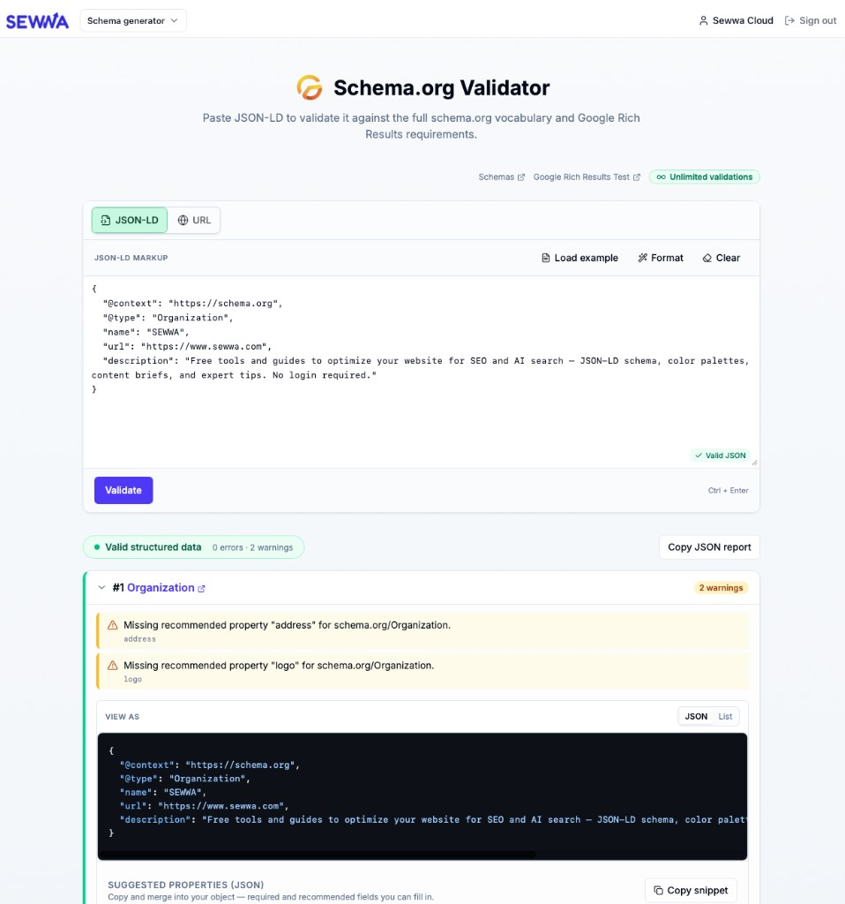
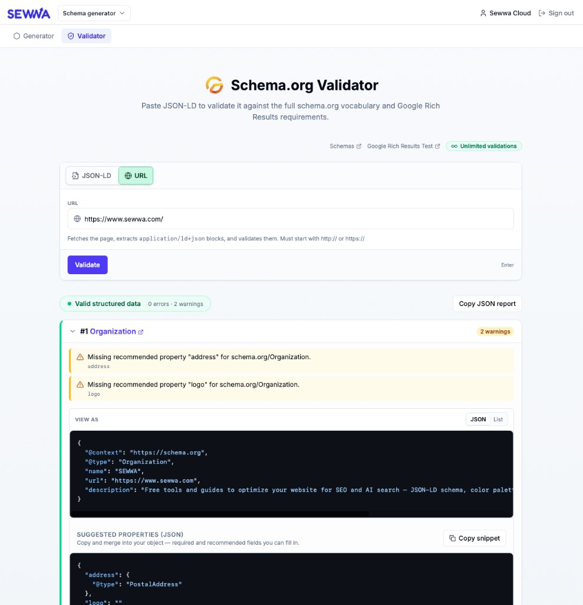

Shipping structured data is not only about generating JSON-LD quickly. It is about confidence: confidence that the markup is complete, syntactically valid, and ready for search engines.

That is why we continue to invest in the **[Schema.org Validator](https://www.sewwa.com/schema-generator/validator)** alongside the **[Schema Generator](https://www.sewwa.com/schema-generator/)**—and we have expanded how you can run those checks.

## The Schema.org Validator: JSON-LD and live URLs

The standalone **[Validator](https://www.sewwa.com/schema-generator/validator)** gives you two ways to run the same engine:

### Validate pasted JSON-LD

Paste raw JSON-LD from an export, a CMS, or another tool. We validate it against the full **schema.org** vocabulary and **Google Rich Results**-oriented rules: parse errors, required shape (`@context`, `@type`), `@graph` support, and field-level issues with clear errors and warnings.

You still get a full report, **JSON** and **List** views, suggested snippets for missing recommended fields, and **Copy JSON report** for sharing or tickets.

### Validate from a public URL (new)

Many teams already ship JSON-LD in the page. Instead of copy-paste, you can enter a **https** (or `http`) URL. Our API **fetches the HTML**, pulls every `application/ld+json` block, and runs the same validation pipeline. The report shows the resolved URL as the **source** so you know which page was checked.

This is built for “what does search actually see on this page?”—without extra browser extensions. Fetches are time-limited, size-capped, and protected against common SSRF cases so the feature stays safe to operate at scale.

> **Note:** A guest validation quota still applies to anonymous use; signed-in users on Sewwa Cloud can run unlimited checks.

## What else we added in the generator

The **[Schema Generator](https://www.sewwa.com/schema-generator/)** complements the validator: you can start structured data in the form, then open the full validator when you need to check exports or a live URL.

This release also introduces complementary validation paths, so you can catch issues whether you are building from the form or auditing existing markup.

### Form-aware validation in the generator

When you build a schema from our step-by-step form, we validate against field definitions before save:

- required fields
- URL and email format
- date and datetime validity
- numeric min/max constraints
- nested array item validation (for fields like FAQ items, recipe ingredients, and similar)

Validation issues are shown inline at field level, and save is blocked until issues are resolved.

### One-click Google Rich Results handoff

From generated and pasted JSON-LD flows, you can still click **Validate with Google Rich Results Test**: JSON-LD is copied to the clipboard and the Rich Results Test opens in a new tab.

That gives you a fast first pass in Sewwa, then a direct path to Google’s own checker for final confirmation.

### Sync hardening for local-to-cloud

Sync failures are no longer silent. We added validation and clearer feedback:

- invalid local schemas are skipped with explicit error toasts
- successful syncs are tracked precisely
- partial success or failure is surfaced clearly

## Why We Built This

The main problem is not generation speed. It is the gap between “generated” and “safe to publish,” and the gap between “I have a live page” and “I can prove what is in the JSON-LD without manual extraction.”

**URL validation** closes that second gap: you can point at a staging or production URL and get a structured report in one step.

**Paste validation** still matters for CMS exports, third-party tools, and migration work.

**Form validation** keeps new markup clean before it ever ships.

In practical terms, this work improves:

- **Reliability**: less invalid or incomplete markup reaching production
- **Speed**: fewer back-and-forth retries during save and QA
- **Clarity**: inline field feedback and explicit validator messages
- **Portability**: existing JSON-LD and live pages can be checked without rebuilding from a form

## What This Means for Teams

If your workflow includes SEO, content publishing, or technical QA, you can shorten the validation loop:

1. Build schema in the [form](https://www.sewwa.com/schema-generator/) and fix inline issues before save.
2. For a page that is already live, use **Validate from URL** in the [Validator](https://www.sewwa.com/schema-generator/validator).
3. For snippets from elsewhere, paste into the **JSON-LD** tab.
4. When you need Google’s view, use the one-click handoff to Rich Results Test.

## Closing

Schema generation is step one. Validation is what makes it production-ready—and live URL checks make that step realistic for the way sites are actually built.

We will keep expanding rules and coverage. If you have feedback on specific schema types or checks you want prioritized, we would like to hear it.
