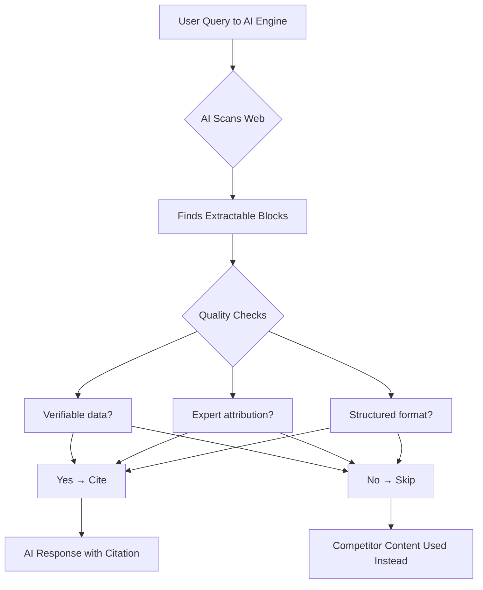

Here's a stat that should make every content marketer sit up straight: AI-referred sessions jumped **527% year-over-year** in the first five months of 2025. And it's not slowing down. By the time you're reading this, nearly half of all informational queries are being resolved by AI before a user ever touches an organic link.

That's not a trend. That's a structural shift in how the web works.

Traditional SEO got you _ranked_. GEO — Generative Engine Optimization — gets you _quoted_. And in 2026, being quoted by ChatGPT, Perplexity, or Google AI Overviews is worth more than most first-page rankings ever were.

---

## What Exactly Is GEO (And Why Should You Care)?

GEO stands for **Generative Engine Optimization** — the practice of structuring and optimizing your content so that AI-powered search engines choose to cite your brand when generating answers to user queries.

Think of it this way: traditional SEO is about winning a beauty contest judged by an algorithm. GEO is about becoming the source an AI trusts enough to quote in front of millions of people.

The distinction matters enormously. When Google shows your result, users still have to choose to click. When ChatGPT or Perplexity cites your content, your answer _is_ the answer. You're not competing for attention — you're embedded in the response itself.

And the numbers back this up. Gartner predicts a **25% drop in traditional search engine volume** by 2026, with AI chatbots and virtual agents capturing that share. Over 68% of Google searches now end without a click. The "click era" isn't dying — it's already on life support.

For most businesses, this is terrifying. For the ones who adapt early, it's a massive opportunity.

---

## GEO vs. Traditional SEO: What's Different?

The easiest way to understand GEO is to see exactly where it diverges from conventional SEO thinking.

| Dimension         | Traditional SEO             | GEO                                       |
| ----------------- | --------------------------- | ----------------------------------------- |
| Goal              | Rank in SERPs               | Get cited in AI responses                 |
| Success metric    | Click-through rate          | Citation rate                             |
| Content format    | Keyword-optimized pages     | Answer-ready, structured content          |
| Authority signals | Backlinks, domain authority | Expert quotes, verifiable data, E-E-A-T   |
| Target platforms  | Google, Bing                | ChatGPT, Perplexity, Gemini, AI Overviews |
| Content freshness | Helpful but not critical    | Critical — especially for Perplexity      |

Here's the thing though: GEO doesn't replace SEO. It layers on top of it. The most competitive brands in 2026 are treating GEO as an additional optimization layer — same content, smarter structure, richer signals.

You still need to rank. But ranking without GEO in 2026 is like having a store in a great location with no signage. People walk past and don't know you exist.

---

## The Data Behind GEO: Why This Actually Works

This isn't just theory. Princeton University researchers published a landmark study showing that optimizing content with cited sources, verified statistics, and expert quotes can improve your visibility in AI-generated responses by **30 to 40%**.

More specifically, here's what the research found:

**Expert quotes are the single most powerful lever.** When attributed quotes are properly marked up with HTML `<blockquote>` tags, AI models treat them as high-trust signals — rewarding your content with a **41% boost in citation visibility**. That's not marginal. That's a transformative lift from one formatting change.

**Specific, verifiable data beats vague claims every time.** Swapping phrases like "highly reliable" for concrete figures like "99.9% uptime and a 15% reduction in latency" can increase your citation rate by roughly **32%**. AI engines are trained to prefer precision. Vague language gets filtered out.

**Combined strategies compound.** The combination of Fluency Optimization and Statistics Addition outperforms any single GEO tactic by more than **5.5%**. There's no silver bullet — it's the stack that wins.

And the market opportunity? Enormous. While 86% of enterprise SEO teams have integrated some GEO initiative, most SMB marketing teams haven't started yet. You're not late. But you're not early either. This is the window.

---

## Core GEO Strategies: The Tactical Breakdown

### 1. Answer Capsule First, Context Second

The biggest mistake content creators make is burying the answer. AI engines scan your page looking for a clean, extractable response to the user's query. If they have to wade through three paragraphs of background before finding your actual answer, they'll find someone else's content that leads with it.

The technique is simple: place a comprehensive, standalone answer immediately after your primary heading, before any introductory context. This "answer capsule" should be 2–4 sentences that fully address the query on its own. Think of it as a self-contained snippet the AI can lift without needing the surrounding context.

Traditional article structure:

```
H2: What is X?
[Background paragraph 1]
[Background paragraph 2]
[Answer somewhere in paragraph 3]
```

GEO-optimized structure:

```
H2: What is X?
[Direct answer in 2–3 sentences]
[Background and elaboration follow]
```

### 2. Use Cited Expert Quotes — and Mark Them Up Properly

AI systems are trained on the web, and they've learned that properly attributed quotes signal credibility. This is one of the highest-leverage GEO tactics available.

Practically speaking, this means: find a relevant quote from a named expert in your industry, attribute it clearly, and wrap it in `<blockquote>` tags. The quote doesn't need to be exclusive or even recent — it just needs to be accurate, attributed, and relevant.

```html
<blockquote>
	<p>
		"Generative AI is fundamentally changing how users discover and consume information online."
	</p>
	<cite>— [Expert Name], [Title] at [Organization]</cite>
</blockquote>
```

Do this for every major claim in your article. You're not just improving GEO — you're also strengthening your E-E-A-T signals for traditional Google ranking. It's a double win.

### 3. Replace Vague Language with Specific Numbers

This one feels small but it's not. Go through your existing content and hunt down every instance of relative language — "many," "most," "significant," "rapidly," "often." Replace each one with a specific number or verifiable figure.

- ❌ "AI search is growing rapidly"
- ✅ "AI-referred sessions grew 527% year-over-year in the first five months of 2025"

- ❌ "Most enterprise teams are adopting GEO"
- ✅ "86% of enterprise SEO teams have integrated AI search optimization in 2026"

The specificity signals to AI that your content is fact-based and citable rather than opinion-based and generic. And you get the side effect of your content becoming genuinely more useful to human readers too.

### 4. Build FAQ Sections — and Make Them Exhaustive

Perplexity, ChatGPT, and Google AI Overviews all heavily index FAQ-style content. When a user asks a question, the AI is essentially looking for the best-formatted answer to that question already on the web. If you've already answered it in FAQ format, you've essentially pre-loaded your citation.

For each major topic page or blog post, add a dedicated FAQ section at the bottom. Aim for 5–8 questions that represent the most common follow-up queries around your main topic. Use schema markup to make these discoverable:

```json
{
	"@context": "https://schema.org",
	"@type": "FAQPage",
	"mainEntity": [
		{
			"@type": "Question",
			"name": "What is the difference between GEO and SEO?",
			"acceptedAnswer": {
				"@type": "Answer",
				"text": "SEO optimizes content to rank in traditional search results. GEO optimizes content to be cited in AI-generated answers from platforms like ChatGPT, Perplexity, and Google AI Overviews."
			}
		}
	]
}
```

### 5. Structure Content as Autonomous, Extractable Blocks

AI doesn't read your article the way a human does. It extracts chunks. Every section of your content should be able to stand alone and make sense without the surrounding context.

This means:

- Each H2 section should open with a direct statement of what it covers
- Avoid "as we discussed above" or "as mentioned earlier" references
- Each paragraph should contain a complete thought, not half of one
- Use concrete examples within the section, not references to examples elsewhere

This is a mental model shift: stop writing for linear reading and start writing for non-linear extraction.



---

## Platform-Specific GEO Tactics

Not all AI engines are equal. Each platform has its own ranking signals, and knowing the differences lets you prioritize your effort.

**Google AI Overviews** favor content that already ranks well in traditional SERPs, has strong structured data markup, and demonstrates clear E-E-A-T signals. If your site has a history of topical authority with Google, you have a head start here. Focus on schema markup, author bios with credentials, and citation-rich content.

**Perplexity AI** is uniquely obsessed with recency. It rewards content that's been updated recently (implementing 2–3 day refresh schedules for high-priority pages has shown measurable results), and it heavily weights topic cluster architecture — pillar pages linked to deep dives, FAQs, and supporting content. Think of your site as a knowledge graph, not a collection of individual articles.

**ChatGPT** tends to favor content from established, credible publishers — academic sites, government sources, well-known industry outlets. For brands, this means building your authority signal through guest posts on reputable sites, PR coverage with links, and expert community citations. The more your brand appears across the web as a reference rather than a self-promoter, the more ChatGPT trusts you.

---

## Common GEO Mistakes to Avoid

**Optimizing for GEO without maintaining SEO.** GEO is a layer on top of SEO, not a replacement. If your pages don't rank in traditional search, AI engines that index the web (like Perplexity) won't find them. Keep your technical SEO solid: Core Web Vitals, crawlability, canonicalization — all of it still matters.

**Using vague, AI-generated filler content.** Ironic as it sounds, AI engines are getting better at detecting generic, low-specificity content — and they deprioritize it. If your content reads like it was written by a language model that didn't do any research, it probably won't get cited by language models. Invest in original data, real expert input, and specific examples.

**Ignoring content freshness.** Especially for Perplexity, content age is a hard ranking factor. A comprehensive article from 18 months ago is being beaten by a thinner article updated last week. Build a refresh cadence into your editorial calendar — at minimum, review and update your top-performing pages every 90 days.

**Skipping structured data.** FAQ schema, Article schema, Author schema — these aren't optional extras. They're the signals AI engines use to understand what your content is and who produced it. A page with no structured data is leaving citation opportunities on the table.

---

## Measuring GEO Performance

This is where most teams get stuck. Unlike traditional SEO, you can't just check a rank tracker. Citation rate is the core metric, and it requires manual monitoring — at least until better tooling matures.

The practical approach for 2026: build a list of 20–30 target queries that represent your most important topics. Once a week, run each query through ChatGPT, Perplexity, and Google AI Overviews. Note whether your content is cited, linked, or mentioned. Track this over time.

Green flags: your citation rate is improving week-over-week on target queries. AI responses are quoting your specific data or expert quotes. Your brand is mentioned even when your site isn't directly linked.

Red flags: a competitor's content is consistently being cited for queries you own in traditional search. AI responses are using your data without attribution (this happens — it means your content is influencing responses but you're not getting credit for the signal yet).

Treat 8–12 weeks as your minimum evaluation window before drawing conclusions. GEO is a long game, but the compounding effect is real.

---

## Conclusion

GEO isn't the future of SEO. It's the present.

The shift to AI-powered search has already happened. The question isn't whether you need to optimize for ChatGPT and Perplexity — it's how quickly you can build the systems to do it consistently. Expert quotes, specific data, answer capsules, structured FAQ sections, and content that's written to be extracted rather than just read. These aren't complicated tactics. But they require a genuine change in how you think about content.

The brands that win the next five years won't be the ones who publish the most. They'll be the ones whose content AI engines trust enough to quote.

Start there.

---

## Frequently Asked Questions

**What is Generative Engine Optimization (GEO)?**
GEO is the practice of optimizing your content to be cited by AI-powered search engines like ChatGPT, Perplexity, and Google AI Overviews when they generate answers to user queries. Unlike traditional SEO, which aims for rankings in search result pages, GEO aims for citations inside AI-generated responses.

**Is GEO replacing SEO?**
No. GEO is an additional layer on top of traditional SEO, not a replacement. Content still needs to be discoverable by search engines to be indexed by AI platforms. Strong technical SEO, backlink profiles, and Core Web Vitals still matter — GEO optimizes what happens after your content is found.

**How long does it take to see GEO results?**
Most practitioners see measurable improvement in citation rates within 8–12 weeks of consistently implementing GEO tactics. Track citation rates weekly across your target queries across ChatGPT, Perplexity, and Google AI Overviews.

**What types of content get cited most by AI search engines?**
Research shows that comparison articles (32.5% of citations), opinion pieces (10%), and comprehensive guides lead in AI citation rates. Content with specific statistics, expert quotes, and FAQ sections consistently outperforms generic informational content.

**Do I need to create separate content for GEO?**
Not necessarily. The most efficient approach is to retrofit your existing high-value content pages with GEO optimizations: add expert quotes, replace vague language with specific numbers, add FAQ sections with schema markup, and restructure sections to lead with direct answers.

---

→ Read also: [Zero-click search & AI Overviews: SEO survival guide for 2026](/zero-click-search-seo-strategy-ai-overviews-2026/)

→ Read also: [Technical SEO in 2026: speed, vitals & AI crawlers](/technical-seo-2026-speed-vitals-ai-crawlers/)

→ Read also: [AI SEO checklist for 2026](/ai-seo-checklist-2026/)
