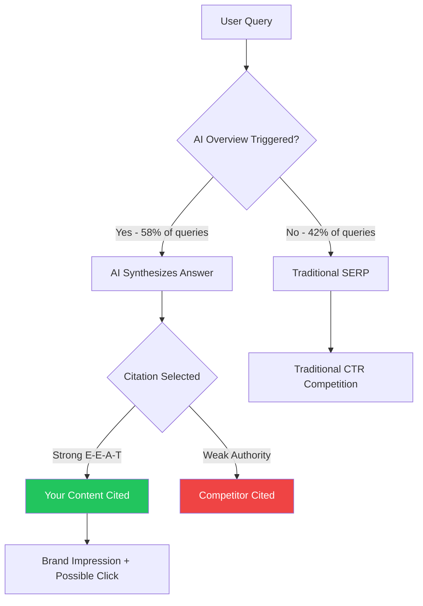

Let's not sugarcoat it: the SEO game changed — again — and this time the shift is more fundamental than any algorithm update we've seen before. More than 80% of all Google searches now end without a single click to any website. For queries that trigger AI Overviews, that number climbs to 83%. If you've been wondering why your organic traffic has been sliding despite solid rankings, well, now you have your answer.

But here's the thing: this isn't the death of SEO. It's a metamorphosis. The rules changed, but the game is still on. Let me walk you through what's happening and — more importantly — exactly what you should do about it.

---

## The Scale of the Shift (And Why It's Not Going Away)

Back in 2023, "zero-click search" was something SEOs mentioned in conference talks with mild concern. By 2026, it's the defining reality of organic search.

Google's AI Overviews now covers roughly 58% of all US queries — up from just 12% in mid-2024. Organic click-through rates on queries featuring AI Overviews have dropped 61%, from 1.76% to 0.61%. Paid search fared even worse, with a 68% CTR decline on those same queries.

What's driving this? Three things working together. First, AI Overviews are genuinely good — they synthesize information well enough that most users don't need to click through for basic informational queries. Second, Google has a financial incentive to keep users on its own properties longer. Third, user behavior has adapted: people now _expect_ to get their answer right on the SERP, and they're comfortable with that.

The categories hit hardest? Health, technology, recipes, and general how-to queries. Exactly the content categories that most content marketers have been building around for the last decade.

So what does this mean in practice? It means if your SEO strategy is still measured purely by clicks and sessions, you're optimizing for a metric that is structurally in decline. Time to reframe.

---

## Redefining What "Winning" Looks Like

Here's a mental model shift that changes everything: **being cited in an AI Overview is the 2026 equivalent of ranking #1**.

When AI Overviews cites your content, it's doing something interesting — it's borrowing your authority while simultaneously showing users the synthesized answer. That citation link is still there. Users who want to dig deeper still click it. And perhaps more importantly, your brand is being associated with the authoritative answer in a user's mind, even if they don't click through.

This is what search marketers now call "AI citation" or "SERP presence" — a form of visibility that goes beyond traditional rankings. And the data backs it up: in studies analyzing AI Overview citations, pages ranking #6–#10 with strong E-E-A-T signals were cited 2.3× more frequently than #1-ranked pages with weak authority signals. Let that sink in. Position on the page matters less than the quality and authority signals of your content.

So success metrics in 2026 need to include:

- Citation rate in AI Overviews
- Brand impressions in SERP features (even without clicks)
- Share of Voice in your topic cluster
- Branded search volume growth (a proxy for brand authority)
- Conversion rate from the traffic you _do_ get (quality over quantity)

→ Read also: [AI SEO checklist for 2026](/ai-seo-checklist-2026/)

---

## The Content Strategy That Actually Works Now

The biggest strategic mistake SEOs are making right now is continuing to produce the same type of content that AI can summarize in one paragraph. If your article is "What is [X]?" or "How to do [Y] in 5 steps" — congratulations, you've written training data for an AI that will replace your traffic.

So what content resists AI summarization? Content that is complex, opinionated, experience-based, or highly specific.

**Bottom-of-funnel content wins.** Transactional queries, comparison content, tool-specific walkthroughs, and niche technical deep-dives are categories where AI Overviews struggle to give a satisfying answer. "Best project management tool for a 3-person remote design agency" is a query that AI can't confidently answer without risking a lawsuit. "What is project management?" is a query that's been completely surrendered to AI Overviews.

**Original data and research are moats.** If your content contains proprietary statistics, original survey data, or first-hand case studies, AI can't replicate it. More importantly, it wants to _cite_ it. Publishing original research — even small-scale surveys — dramatically increases your citation probability in AI Overviews.

**First-person expertise signals matter more than ever.** Content that clearly comes from a human with real experience — using "I", sharing personal stories, showing actual screenshots of results, naming specific clients or projects (with permission) — is increasingly preferred by AI systems for citation. Google and other AI search engines are explicitly trying to surface human expertise rather than AI-generated summaries.

**Long-form, comprehensive content still works — but differently.** The goal isn't to rank for every keyword variation. It's to be recognized as the most comprehensive resource on a topic, which increases the probability of being cited across multiple query variations in AI Overviews. Content clusters and pillar pages are now more strategically valuable than ever because AI systems consider multiple related pages when generating their responses.

---

## Technical Optimization for AI Overviews

Getting cited by AI Overviews isn't magic — there are concrete technical things you can do to increase your chances.

**Structure your content for machine extraction.** AI systems parse your HTML. Clean answer paragraphs of 40–55 words are easier to extract. Use question-format H2s and H3s that match the natural language of user queries. Numbered steps are easier for AI to summarize. Tables make data machine-readable. This isn't new advice — it's the same stuff that worked for featured snippets — but it now has higher stakes.

**Schema markup is not optional.** Pages with FAQ schema are 60% more likely to be featured in AI Overviews. Article schema, HowTo schema, and BreadcrumbList help AI systems understand your content context. If you haven't implemented structured data comprehensively, this is now a top-priority technical SEO task.

**Answer-first writing structure.** The old journalistic "inverted pyramid" approach — answer first, then support — is exactly what AI Overviews prefer. Don't bury the answer in paragraph four. State it clearly in the opening paragraph, then expand. This structure serves both featured snippets and AI Overviews simultaneously.

**Page speed still matters — maybe more.** AI Overview citations tend to favor pages that are fast and technically sound. A slow page with great content might lose a citation to a slightly less comprehensive but much faster page. Core Web Vitals remain a real ranking signal, and they're now a citation signal too.

---

## Building E-E-A-T for the AI Era

E-E-A-T — Experience, Expertise, Authoritativeness, Trustworthiness — has always been important. But in 2026, it functions as a hard filter, not just a ranking booster. According to analysis of AI Overview citations, 96% of cited sources have strong E-E-A-T signals. That's not a soft preference. That's a near-requirement.

So how do you build E-E-A-T that actually registers with AI search systems?

**Author pages that prove real expertise.** Your writers need biographical pages that include their credentials, professional history, publications, and external mentions. A thin "About the Author" blurb doesn't cut it. If your author has been quoted in TechCrunch, list it. If they gave a conference talk, link it. AI systems crawl and cross-reference this information.

**External citations and media mentions are gold.** A mention in a respected industry publication carries dramatically more weight than dozens of your own blog posts. Digital PR — proactively pitching data, insights, and expert quotes to journalists — is now a legitimate and important SEO tactic. Media coverage is external validation that AI systems actively look for.

**NAP and entity consistency across the web.** Your brand should have a consistent presence across LinkedIn, Twitter/X, industry directories, Wikipedia (if warranted), and major reference sources. Inconsistency in how your brand appears across the web creates trust ambiguity for AI systems.

**Transparency signals.** Clear author attribution, publication dates, "last updated" timestamps, clear privacy policies, and transparent editorial standards all contribute to the trust component of E-E-A-T. These signals are easy to implement and surprisingly underutilized.

→ Read also: [SEO in the zero-click era: citations over clicks](/seo-zero-click-era-2026/)

---

## The Queries Worth Chasing in 2026

Not all queries are equally affected by zero-click search. Smart SEOs are now doing query-type analysis as part of their keyword strategy.

**High zero-click risk (proceed cautiously):**

- Pure informational queries ("what is X", "how does Y work")
- Health and medical information
- Simple recipe queries
- Basic how-to tutorials that AI can fully answer

**Lower zero-click risk (prioritize these):**

- Comparison queries ("X vs Y for Z use case")
- Local and geo-specific queries
- Highly specific technical queries
- Opinion and recommendation queries
- Bottom-funnel commercial queries
- Queries requiring recent or proprietary data

**The local SEO opportunity.** Local queries are one of the clearest bright spots. AI Overviews are much less effective for "best coffee shop near me" or "plumber in [city]" type queries — these require real-time local data, reviews, and geographic context that AI summarization doesn't handle well. Local SEO is arguably _more_ valuable in 2026 than it was before AI Overviews.

---

## Common Mistakes to Avoid

A few things that well-intentioned SEOs are doing wrong right now:

**Panic-publishing thin AI-generated content to cover more queries.** This is the opposite of what works. AI-generated content at scale produces exactly the type of thin, generic content that AI Overviews replace. You're essentially creating competition for your own rankings while building no real authority.

**Abandoning informational content entirely.** Some informational content still drives traffic — particularly complex, multi-part questions that don't have a clean 40-word answer. Don't wholesale abandon the top of the funnel; be more selective about _which_ informational content you produce.

**Ignoring brand-level SEO.** A lot of SEO teams are still operating purely at the keyword and page level. In 2026, brand-level signals — how your brand is talked about across the web — directly influence AI citation probability. SEO and brand marketing are now the same function.

**Measuring the wrong things.** Comparing 2026 organic sessions to 2023 sessions and declaring SEO dead is like comparing phone call volume in 2010 to SMS volume in 2016 and concluding people stopped communicating. The channel evolved. Measure AI Overview citation rate, branded impressions, and conversion quality, not just raw traffic.

---

## Conclusion

Zero-click search and AI Overviews aren't bugs in Google's system — they're features that reflect where user behavior is heading. Fighting them is a losing battle. Adapting to them is where the opportunity is.

The SEOs who win in 2026 are the ones who understand that **visibility ≠ clicks**, and that building genuine topical authority — through original content, real expertise, external citations, and technical excellence — is what earns you citations in AI systems. That kind of authority is harder to build than publishing 50 thin articles, but it's also much harder for competitors to replicate.

The zero-click era isn't the end of SEO. It's the beginning of a higher-quality version of it.

---

## Frequently Asked Questions

**Is SEO still worth investing in if most searches don't result in clicks?**
Yes, but the ROI model shifts. Brand visibility in AI Overviews builds trust and influences purchase decisions even without direct clicks. The traffic you do get is higher-intent, which typically means better conversion rates. SEO is now more about authority and visibility than raw traffic volume.

**How do I know if my content is being cited in AI Overviews?**
Google Search Console shows impressions from AI Overviews-enabled queries. Tools like Semrush, Ahrefs, and dedicated AI visibility platforms (like Brandwatch AI or similar) are beginning to offer AI Overview monitoring. Manual spot-checking your target queries in Chrome is also a quick way to audit this.

**Does schema markup really make a significant difference for AI Overview citations?**
Yes — the data is clear. Pages with relevant schema markup (FAQ, HowTo, Article) are significantly more likely to be cited. Structured data makes your content machine-parseable, which is exactly what AI Overview generation requires.

**Should I change how I do keyword research?**
Partly. Traditional keyword research metrics (volume, difficulty) are still useful but should now be filtered through a "zero-click risk" lens. Prioritize queries where the user's intent requires more than a brief AI summary — complex comparisons, specific recommendations, local queries, and transactional intent queries.

**How important is site speed for AI Overview citations?**
Very. Fast, technically clean pages are preferred for citation — both because they deliver better user experience on click-through and because technical quality is one of the proxy signals AI systems use for content trustworthiness.

---

→ Read also: [Generative engine optimization (GEO): the complete 2026 guide](/generative-engine-optimization-geo-guide-2026/)
