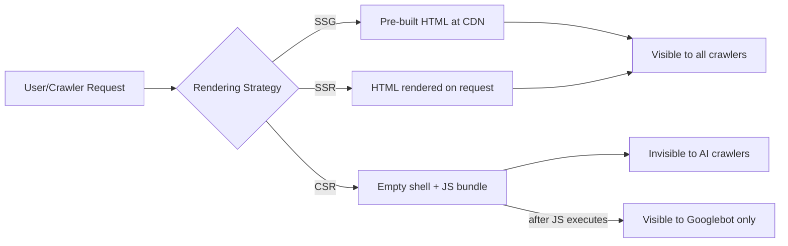

Here's a number that should make you pause: an analysis of more than 500 million GPTBot fetches found **zero evidence of JavaScript execution**. Zero. None. Not a single hydrated component, not a single client-side fetch, not a single rendered SPA shell.

If your site lives behind a `useEffect`, AI search engines have been looking right through it.

This is the new tax on JavaScript-heavy stacks in 2026. Googlebot grew up — it renders modern JS just fine. But the new wave of crawlers powering ChatGPT, Claude, Perplexity, and every AI Overview you've been chasing? They're stuck in 2010, fetching raw HTML and moving on. And they're not small players anymore. GPTBot alone generated **569 million requests** across Vercel's network in a single month, with traffic up **305% year-over-year**.

If you're building with React, Next.js, or Astro, the framework you picked — and how you configured it — now decides whether your content even has a shot at being cited by an LLM. Let's break down what's actually happening under the hood and what to do about it.

## Why AI Crawlers Behave So Differently from Googlebot

Googlebot has a renderer. GPTBot, ClaudeBot, PerplexityBot, and most of their cousins do not. That's the entire story in one sentence — but the implications are enormous.

When Googlebot hits a page, it does a two-pass dance: fetch the HTML, queue the page for rendering, spin up a headless Chromium, execute the JavaScript, then re-index the result. This is slow (pages requiring JS rendering can sit in the secondary queue for days or weeks) but it works. Eventually, your client-rendered content shows up in the index.

AI crawlers skip the second pass entirely. They request the URL, parse what comes back in that initial HTTP response, and that's the page as far as they're concerned. No DOM construction. No hydration. No waiting for `Suspense` boundaries to resolve. If the meaningful content isn't in that first byte stream, it doesn't exist.

→ Read also: [Generative Engine Optimization (GEO) Guide](/generative-engine-optimization-geo-guide-2026/)

The reasoning is partly economic. Running a headless browser at the scale these crawlers operate is expensive — orders of magnitude more compute than a plain HTTP fetch. When you're making hundreds of millions of requests per month to feed an LLM's training corpus or a real-time search index, you cut the rendering step. The trade-off is that JavaScript-dependent content becomes invisible.

There's also a knock-on effect most people miss: roughly **92% of ChatGPT agent queries rely on Bing's search index**, and Bingbot's JS rendering capability is famously limited. So even if you're optimizing for "AI search" in the abstract, you're really optimizing for an ecosystem of bots that overwhelmingly read static HTML.

## The Three Rendering Strategies, Ranked by AI-Friendliness

Before we get into framework-specific advice, you need to internalize the rendering hierarchy. Every page on your site falls into one of these buckets:



**Static Site Generation (SSG)** is the gold standard for AI visibility. Pages are built at deploy time, served from a CDN edge with TTFB often under 50ms, and contain every byte of meaningful content in the initial response. AI crawlers love this because there's literally nothing to compute — just HTML.

**Server-Side Rendering (SSR)** is the close second. The server generates HTML on every request, so the response stream contains your real content. The downside is latency and infrastructure cost compared to SSG, but for AI crawlers the experience is identical: they see the full page on first byte.

**Client-Side Rendering (CSR)** is where things go sideways. The server returns a near-empty `<div id="root"></div>` and a bundle. Googlebot will eventually render it. AI crawlers won't. If your product pages, pricing tables, or FAQ content depend on a `useEffect` hook firing in the browser, those exist only for human visitors with JavaScript enabled.

The kicker: a single case study showed that after one team enabled prerendering for their SPA, **AI bots accounted for 47.95% of all incoming requests** — almost half of their traffic. That content had been completely invisible to those crawlers before. The audience was there waiting; the door was just locked.

## React: The Default Trap

Plain React (Create React App, Vite + React, anything that ships a client-only bundle) is the worst-case scenario for AI SEO. The default output is an empty HTML shell with a script tag. Everything interesting happens after `ReactDOM.render` runs in the browser.

If you're stuck on a CSR-only React app and can't migrate to a meta-framework, you have three options, in order of effort:

**1. Add prerendering for crawler user agents.** Services like Prerender.io or self-hosted Puppeteer setups detect crawler user agents and serve pre-rendered HTML to them while regular users get the SPA. This is a band-aid, not a strategy, but it works and it's the fastest path to AI visibility for a legacy app. Just make sure you're prerendering for `GPTBot`, `ClaudeBot`, `PerplexityBot`, `OAI-SearchBot`, and `CCBot` — not just Googlebot.

**2. Move to React Server Components via a meta-framework.** This is where the React ecosystem is heading, and for good reason. Server Components produce real HTML on the server, ship zero component code to the client for the rendered portions, and only hydrate the genuinely interactive bits. We'll dig into this in the Next.js section below.

**3. Migrate to a framework that's HTML-first by default.** Astro is the obvious candidate, especially for content sites. We'll get to that too.

The point is: vanilla React in 2026 is a SEO liability for AI search, and "we'll add SSR later" is the technical debt equivalent of "we'll fix it in post." Pick a framework that gives you HTML by default, or accept that you're optimizing for one crawler (Googlebot) out of dozens.

## Next.js: Powerful, But Configuration Matters

Next.js dominates enterprise React adoption with roughly **67% market share**, and the App Router with React Server Components is genuinely a SEO upgrade — when you use it correctly. The trap is that Next.js gives you enough rope to hang yourself. The same framework that produces beautiful, AI-crawlable static pages can also ship a fully client-rendered nightmare if you sprinkle `"use client"` at the top of every component.

Here's the mental model. In the App Router, every component is a Server Component by default. That means it executes on the server, renders to HTML, and ships nothing to the client. The moment you add `"use client"`, you've opted into a hybrid model where that component (and its children) get hydrated on the client.

For AI SEO, the rule is brutal but simple: **content lives in Server Components, interactivity lives in Client Components, and never the twain shall mix sloppily.**

A typical mistake looks like this:

```tsx
// app/products/[slug]/page.tsx
'use client'; // ← this kills your AI SEO

import { useState, useEffect } from 'react';

export default function ProductPage({ params }) {
	const [product, setProduct] = useState(null);

	useEffect(() => {
		fetch(`/api/products/${params.slug}`)
			.then((r) => r.json())
			.then(setProduct);
	}, [params.slug]);

	if (!product) return <div>Loading...</div>;
	return <article>{/* product content */}</article>;
}
```

GPTBot fetches this and sees `<div>Loading...</div>`. End of story.

Here's the same page done right:

```tsx
// app/products/[slug]/page.tsx
import { getProduct } from '@/lib/products';
import AddToCartButton from './AddToCartButton'; // client component

export async function generateMetadata({ params }) {
	const product = await getProduct(params.slug);
	return {
		title: `${product.name} — ${product.brand}`,
		description: product.shortDescription,
	};
}

export default async function ProductPage({ params }) {
	const product = await getProduct(params.slug);

	return (
		<article>
			<h1>{product.name}</h1>
			<p>{product.description}</p>
			<p>Price: ${product.price}</p>
			<AddToCartButton productId={product.id} />
		</article>
	);
}
```

Now the entire content tree renders on the server. `AddToCartButton` is the only client component, and it gets hydrated independently. AI crawlers see the full product page in the initial HTML response. Googlebot sees the same thing. Users get progressive enhancement. Everyone wins.

A few specific Next.js optimizations worth doing right now:

- **`generateStaticParams`** for any route that has a finite, knowable set of slugs. This pushes pages from SSR into SSG territory, dropping TTFB to near zero and making AI crawler visits essentially free.
- **`dynamic = "force-static"`** in route segments where you want guaranteed static behavior, even if a child component looks dynamic.
- **Audit your `"use client"` directives ruthlessly.** Every one is a potential SEO leak. The `next-rsc-info` Chrome extension shows you the server/client boundary on any Next.js page.
- **Stream your responses** with React Suspense for slow data fetches. AI crawlers won't wait for the stream to finish, but they'll consume what's already been flushed — so put your critical content above the streaming boundary.

→ Read also: [Technical SEO in 2026: speed, vitals & AI crawlers](/technical-seo-2026-speed-vitals-ai-crawlers/)

→ Read also: [AI SEO checklist for 2026](/ai-seo-checklist-2026/)

## Astro: HTML-First by Architecture

Astro's whole pitch is "ship the minimum JavaScript necessary," and that pitch happens to be perfectly aligned with what AI crawlers want. By default, an Astro page ships **zero JavaScript**. Components render to HTML at build time (or on-demand via SSR), the result hits the client as plain HTML, and only the explicit "islands" you mark for hydration get any JS at all.

The performance numbers reflect this architectural choice. Astro pages load roughly **40% faster than equivalent Next.js pages** and ship about **90% less JavaScript** for content-focused sites. For Core Web Vitals, this translates to LCP and INP scores that are typically 2–3x better than a comparable Next.js setup without aggressive optimization.

A typical Astro page looks like this:

```astro
---
// src/pages/blog/[slug].astro
import { getCollection } from 'astro:content';
import Layout from '@/layouts/BlogLayout.astro';
import NewsletterSignup from '@/components/NewsletterSignup.tsx';

export async function getStaticPaths() {
	const posts = await getCollection('blog');
	return posts.map((post) => ({
		params: { slug: post.slug },
		props: { post },
	}));
}

const { post } = Astro.props;
const { Content } = await post.render();
---

<Layout title={post.data.title} description={post.data.description}>
	<article>
		<h1>{post.data.title}</h1>
		<Content />
	</article>

	<NewsletterSignup client:visible />
</Layout>
```

The entire article ships as static HTML. The newsletter form is the only interactive piece, and `client:visible` means it doesn't even download its JavaScript until it scrolls into view. GPTBot grabs the HTML and gets every word of the post. ClaudeBot does the same. Perplexity gets a complete, citable article in a single round-trip.

Cloudflare's acquisition of Astro in January 2026 has poured even more momentum into this architecture. The framework is now the default for content-heavy sites, marketing pages, documentation, and anywhere SEO is the primary KPI.

When **not** to use Astro: complex application UIs with dense interactivity, real-time dashboards, anything where the page is essentially an app rather than a document. There the islands model becomes awkward and you're better off with Next.js or Remix.

## The Comparison Table You Came Here For

For a typical content-driven site, here's how the three stacks compare on the metrics that matter for AI SEO:

| Metric                                     | React (CSR)             | Next.js (App Router, RSC)                        | Astro                                 |
| ------------------------------------------ | ----------------------- | ------------------------------------------------ | ------------------------------------- |
| Visible to GPTBot/ClaudeBot out of the box | ❌ No                   | ✅ Yes (if you avoid `"use client"` for content) | ✅ Yes                                |
| Default JavaScript shipped                 | Full bundle             | Hybrid (RSC + hydrated islands)                  | Zero                                  |
| Typical LCP on content page                | 2.5–4s                  | 1.2–2.5s                                         | 0.5–1.2s                              |
| Typical INP                                | 200–400ms               | 100–200ms                                        | < 100ms                               |
| Setup effort for SSG                       | High (manual prerender) | Low (`generateStaticParams`)                     | Native (default)                      |
| Best for                                   | Legacy SPAs only        | Apps with auth, real-time, complex state         | Content sites, blogs, docs, marketing |

The takeaway isn't "Astro always wins" — it's that the default behavior of each framework determines what a normal team without specialized SEO knowledge will ship. Astro defaults to AI-friendly. Next.js can be AI-friendly but requires discipline. Plain React requires significant retrofitting.

## Common Mistakes That Quietly Kill AI Visibility

A few patterns I see in audits over and over:

**Hydration-gated content.** A page renders correctly on the server, but the actual product description is loaded by a `useEffect` hook on the client. The server response shows a skeleton loader, not the content. AI crawlers see the skeleton.

**Infinite scroll without pagination fallback.** Your listing page loads ten items, then loads more as the user scrolls. AI crawlers see the first ten. Always provide a paginated fallback at clean URLs (`/category/page/2`, `/category/page/3`) so the full inventory is reachable.

**Dynamic meta tags via `useEffect`.** This one bites everyone at least once. You set the page title and description with `useEffect`. Googlebot eventually sees the right tags after rendering. AI crawlers see whatever was in the initial HTML — usually a generic site-wide default. Use server-side metadata APIs (`generateMetadata` in Next.js, frontmatter in Astro) every single time.

**Cookie walls and JS-gated paywalls.** If your content is hidden behind a "Accept cookies" modal that requires JS interaction to dismiss, AI crawlers can't get past it. Serve full content on first paint and use server-side cookie consent logic instead.

**Trusting `robots.txt` to hide things from AI.** Worth mentioning in passing: blocking `GPTBot` in robots.txt does work for OpenAI's crawler, and they generally respect it. But the AI search ecosystem is far broader than a single bot, and many crawlers either don't respect robots.txt or rebrand frequently. If you genuinely want to block AI training, robots.txt is a starting point, not a strategy.

## How to Audit Your Site Right Now

Stop reading and run this check on your own site. Open a terminal:

```bash
curl -A "GPTBot/1.0" https://yourdomain.com/your-most-important-page \
  | grep -o "<title>[^<]*</title>"
```

Then:

```bash
curl -A "GPTBot/1.0" https://yourdomain.com/your-most-important-page \
  | grep -c "your-most-important-keyword"
```

If the title is wrong or the keyword count is zero, congratulations — you just diagnosed your AI SEO problem in two commands.

For a more thorough audit, fetch the raw HTML and visually compare it to the rendered page in a browser. The gap between those two is exactly what AI crawlers are missing.

A small tool idea while we're here: I keep wanting to build a Chrome extension that overlays "what GPTBot sees" on top of any page — basically a one-click view-source filtered to show only what's in the initial HTML response, with hydration-only content highlighted in red. If anyone reading this wants to ship it, I'd happily collaborate. The need is real and the existing tooling is clunky.

## Conclusion

JavaScript SEO in 2026 is a tale of two crawlers. Googlebot has accommodated us — it renders modern JS, indexes RSC streams, and mostly handles whatever framework you throw at it. The AI crawlers building the next generation of search products have not. They want HTML, and they want it on the first request.

The good news: serving them what they want is the same thing that makes your site faster, more accessible, and more reliable for human users. Server-rendered HTML is good for everyone. The frameworks have caught up — Next.js with React Server Components is genuinely SEO-friendly when you use it right, and Astro makes the AI-friendly path the default.

If you take one thing away: audit your most important pages with a `curl` command using `GPTBot` as the user agent, and look at what comes back. That response is your AI SEO. Everything else is hope.

The teams winning AI search visibility in 2026 aren't the ones with the cleverest prompts or the most schema markup. They're the ones whose servers ship complete, meaningful HTML on the first byte. Old advice, new urgency.

## FAQ

**Do AI crawlers ever execute JavaScript?**
A few experimental ones do, but the major production crawlers (GPTBot, ClaudeBot, PerplexityBot, OAI-SearchBot, CCBot) do not as of 2026. Treat JavaScript execution as a Googlebot-only feature.

**Will Google AI Overviews see my JS-rendered content?**
Mostly yes, because Google's AI Overviews are built on top of Google's existing index, which does render JavaScript. But Google's two-pass indexing means JS-dependent pages get indexed slower and less reliably than static HTML, which still hurts your odds of being cited.

**Is it worth migrating from Next.js to Astro just for AI SEO?**
Only if your site is content-heavy and you're not already getting the SEO benefits of RSC in Next.js. A well-configured Next.js App Router site with proper Server Components is competitive with Astro. The migration only makes sense if you're stuck with a CSR-heavy Next.js setup that can't be easily refactored.

**How do I track if AI crawlers are reaching my site?**
Filter your server logs for user agents containing `GPT`, `Claude`, `Perplexity`, `CCBot`, `OAI-SearchBot`, and `Anthropic`. Tools like Cloudflare Analytics and Vercel's edge logs surface this natively. Track the trend month-over-month — sustained growth means your content is getting noticed by the AI ecosystem.

**Should I block AI crawlers via robots.txt?**
Depends entirely on your business model. If you sell information access (paywalled news, premium research), blocking probably makes sense. If you're a brand that wants to be cited in AI answers, the opposite — make yourself maximally accessible.

---

Sources:

- [JavaScript Rendering and AI Crawlers (Passionfruit)](https://www.getpassionfruit.com/blog/javascript-rendering-and-ai-crawlers-can-llms-read-your-spa)
- [The Rise of the AI Crawler (Vercel)](https://vercel.com/blog/the-rise-of-the-ai-crawler)
- [Do LLMs Render JavaScript? (ClickRank)](https://www.clickrank.ai/llms-render-javascript/)
- [Technical SEO Checklist 2026 (DebugBear)](https://www.debugbear.com/blog/technical-seo-checklist)
- [Astro vs Next.js Performance (PkgPulse)](https://www.pkgpulse.com/guides/astro-vs-nextjs-2026)
- [SEO-Friendly React Server Components (Makers Den)](https://makersden.io/blog/seo-friendly-react-leverage-server-components-server-ssr)
- [JavaScript SEO in 2026 (Rewati Khare)](https://www.rewatikhare.com/post/javascript-seo-in-2026-what-google-actually-handles-vs-what-still-bites-you)
