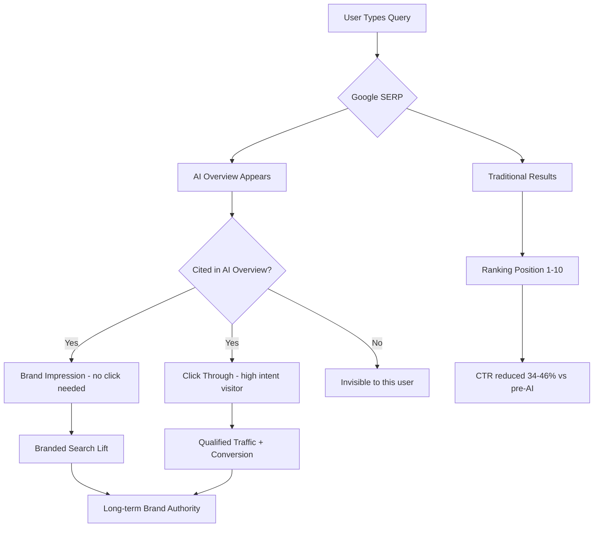

Here's a number that should make every SEO person uncomfortable: **64.82% of Google searches now end without a single click.** Not a misclick. Not a bounce. Just… nothing. The user got what they needed and moved on, never touching your carefully optimized blue link.

Welcome to the zero-click era. And no, it's not going away.

Google's AI Overviews have fundamentally changed the rules of organic search. The question isn't whether this affects you — it does. The real question is: what do you do about it?

## What's Actually Happening (And Why It's Not All Bad)

Let's start with the honest picture. AI Overviews now appear in over 25% of all US searches as of early 2026, and for informational queries — the bread and butter of most content sites — that number climbs to nearly 40%. Studies across 68,000 real queries found that when an AI Overview appears, organic CTR on the top result drops by an average of 34.5%. Some research puts that number as high as 46.7%.

That's a serious hit.

But here's where it gets interesting: **63% of businesses report that AI Overviews have had a _positive_ effect on their visibility.** Confusing, right? How can traffic drop but visibility improve?

The answer is that we've been measuring the wrong thing. Click-through rate was always a proxy for what we actually wanted — brand awareness, trust, and eventually, conversions. AI Overviews disrupted the proxy, but the underlying goal is still achievable. You just need a different playbook.

Think of it this way: when your content gets cited inside an AI Overview, Google is essentially recommending you to every person who sees that answer. Even if they don't click, your brand name just appeared in front of someone who was actively looking for information in your space. That's an impression that used to cost money on display networks — now it's free, if you earn it.

## The New SEO Metric Stack You Need to Track

Before we get into tactics, let's talk about measurement. Your old dashboard is lying to you.

If you're still judging SEO success purely on organic clicks and position rankings, you're flying blind in 2026. Here's what actually matters now:

**AI answer inclusion rate** — how often does your content get cited in AI Overviews for your target queries? Tools like SE Ranking and Semrush are starting to track this directly.

**Brand mention frequency** — how often is your brand name appearing in AI-generated answers, even without a direct link? This is a leading indicator of authority.

**AI referral traffic** — visitors who clicked through _from_ an AI Overview citation. These tend to be highly qualified because the AI already pre-sold them on your relevance.

**Zero-click brand impressions** — track branded search volume over time. If people are seeing your name in AI answers, branded search typically increases even as non-branded CTR falls.

**Session depth signals** — when someone does click through, are they staying? Bouncing immediately signals to Google that your content didn't deliver. Long sessions reinforce your citation-worthiness.

One more thing worth tracking: domain authority correlations with AI Overview citations have dropped dramatically (r=0.18 in recent studies). More interesting? **47% of AI Overview citations now come from pages ranking below position #5.** The democratization of AI citations is real — you don't have to be a DR90 monster to get cited.

## How Google's AI Actually Picks What to Cite

This is where most SEO guides go vague. Let's be specific.

Google's AI isn't just grabbing the top-ranked page and summarizing it. It's looking for **semantic completeness** — pages that fully answer a query within a self-contained block of text. Research shows content scoring 8.5/10 or higher on semantic completeness is **4.2x more likely to be cited** than content that partially addresses a topic.

What does that look like in practice? The AI system scans for passages that:

- Contain a direct answer in the first 134–167 words of a section
- Include supporting context and relevant qualifications
- Don't require the reader to visit three other pages to understand the point
- Use clear, structured language (headings, short paragraphs, no fluff)

It's not keyword density. It's answer density. There's a meaningful difference.

Multi-modal content also matters more than most people realize. Pages combining text, images, video, and structured data see **156% higher citation selection rates** compared to text-only pages. A well-placed diagram or an embedded video doesn't just improve UX — it signals to Google's AI that this is a complete, high-quality resource.

And freshness still counts. Content with recent stats, peer-reviewed citations, and updated information gets an **89% higher selection probability** over stale content. If you published something in 2023 and haven't touched it since, it's basically invisible to AI citation systems now.

## Seven Concrete Tactics to Get Cited in AI Overviews

Enough theory. Here's what actually moves the needle.

### 1. Write in "Answer Blocks"

Structure your content so each major section starts with a direct 50–70 word answer to the question that section addresses. Then expand. This mirrors how AI Overview citations work — the system extracts the most complete answer it can find for a specific sub-query. If your content is written as flowing narrative prose, it's harder to extract. If it's structured as question → direct answer → context → examples, it's citation gold.

### 2. Go Deep on Topic Clusters, Not Individual Pages

AI Overviews favor sites that demonstrate **topical authority** — not just one good page, but interconnected coverage of an entire subject. A single excellent article on "React Server Components" is less likely to get cited than a site with ten interconnected pieces covering RSC fundamentals, performance implications, migration guides, and common pitfalls. Plan your content as ecosystems, not standalone pieces.

→ Read also: [Zero-click visibility & AI answers](/zero-click-visibility-ai-answers/)

### 3. FAQ Schema Is Non-Negotiable Now

The use of `FAQPage` schema has exploded in 2026 for a reason: AI search heavily cites FAQ-format content. This isn't just about rich snippets in traditional SERPs — structured FAQ data is directly parseable by AI systems looking for question-answer pairs. Every piece of content you publish should end with a 3–5 question FAQ block, properly marked up with JSON-LD.

Here's the minimal implementation:

```json
{
  "@context": "https://schema.org",
  "@type": "FAQPage",
  "mainEntity": [
    {
      "@type": "Question",
      "name": "What is a Google AI Overview?",
      "acceptedAnswer": {
        "@type": "Answer",
        "text": "A Google AI Overview is an AI-generated summary that appears at the top of search results, synthesizing information from multiple sources to directly answer a user's query."
      }
    }
  ]
}
```

### 4. Build E-E-A-T Signals Systematically

Experience, Expertise, Authoritativeness, Trustworthiness — these aren't just buzzwords anymore. They're the trust signals that determine whether Google's AI will cite you or pass. Practically speaking, that means:

- Author bio pages with real credentials and verifiable experience
- Original research, surveys, or unique data (even small-scale studies)
- Mentions on third-party platforms: Reddit, LinkedIn, industry forums, podcasts
- Press releases and digital PR that generate brand mentions across the web

The last point is underrated. Press releases specifically have been shown to improve SERP feature visibility including AI Overview citations. You don't need TechCrunch — getting mentioned on relevant industry sites matters.

### 5. Update Content Aggressively

Freshness is measurable. If you have strong content that's 18+ months old, updating it with current statistics and a "Last Updated" date can meaningfully improve AI citation eligibility. Don't just add a new paragraph — refresh the data, update the examples, and make sure it reflects the current reality of the topic. Treat content like a living document, not a published-and-done artifact.

### 6. Optimize for "People Also Ask" Aggressively

PAA boxes are AI citation training grounds. Pages that consistently appear in PAA have strong positioning for AI Overview citation as well. The optimization approach: use question-based H2 headings (literally phrased as questions your audience asks), write concise direct answers under each one, and use FAQ schema to reinforce the structure. Tools like AlsoAsked and AnswerThePublic are still your best friends for PAA keyword research.

### 7. Build Brand Presence Off Google

This is the most counterintuitive SEO advice you'll read today: spend more time off Google. LLMs get their knowledge from Reddit, LinkedIn, YouTube transcripts, Quora, and industry forums. If your brand and your team's insights are showing up in those places, you're feeding the training data that makes AI systems more likely to cite you. Participate genuinely in communities. Answer questions. Share original takes. Build an audience that exists independent of search.

## The Measurement Shift: From Click Optimization to Visibility Optimization

Here's the hard part: this transition requires selling a new success model to clients and stakeholders.

"We got cited in 15 AI Overviews this month but clicks are down 20%" is a difficult conversation to have if everyone is still anchored to organic traffic as the primary KPI. You need to reframe before you start executing.

One framework that works: **SERP Visibility Score**. Instead of just tracking ranking positions and clicks, score each target query by: (a) does a traditional ranking exist, (b) is there a featured snippet or AI Overview, (c) is your brand cited in it, (d) what's the estimated impression count regardless of clicks. This gives a much more accurate picture of actual search presence.

The brands that are winning in 2026 aren't panicking about AI Overviews eating their clicks. They're recognizing that **brand recognition is now the primary SEO output**, with direct traffic, branded search, and email signups as the downstream metrics that prove it's working.



## Common Mistakes That Kill Your AI Overview Chances

Let's talk about what to stop doing.

**Thin, keyword-stuffed content** is now actively harmful, not just ineffective. AI systems identify and penalize shallow coverage. A 500-word post that ranks for a keyword but doesn't actually answer anything in depth won't get cited — it might not even rank for long.

**Ignoring structured data** is leaving citations on the table. If your site doesn't have Article schema, FAQPage schema, and at minimum basic Organization schema, you're at a systematic disadvantage. These signals are low-effort, high-impact.

**Treating every page as a standalone asset** misses the topical authority play entirely. If Google's AI can't see that your site deeply covers a topic from multiple angles, it won't trust you as a citation source for that topic.

**Measuring only clicks** leads to bad decisions. If you paused high-performing content because clicks dropped, but that content was actually driving significant AI Overview impressions and indirect branded search lift, you made the wrong call. Upgrade your measurement first.

## Conclusion: The New SEO Win Condition

The goal post has moved. Chasing position #1 in 2026 without accounting for AI Overviews is like optimizing for desktop traffic in 2015 without a mobile strategy — you're optimizing for the wrong surface.

The new win condition is **recognition at the moment of need**. Your brand name appearing in an AI-generated answer means you exist in the user's consideration set before they've visited a single site. That's marketing value that doesn't disappear just because CTR dropped.

The tactics are real and learnable: semantic completeness, topic clusters, FAQ schema, aggressive E-E-A-T building, content freshness, and multi-platform presence. None of this is magic — it's disciplined execution of fundamentals that have always mattered, now amplified by AI.

60% of searches end without a click. That used to sound like a threat. In the right hands, it's an opportunity.

---

## Frequently Asked Questions

**What are Google AI Overviews and how do they affect SEO?**
Google AI Overviews are AI-generated summaries appearing at the top of search results that synthesize answers from multiple sources. They reduce organic CTR by 34–47% on average but create new citation-based visibility opportunities for brands that optimize for inclusion.

**How do I get my content cited in Google AI Overviews?**
Focus on semantic completeness (fully answering queries in self-contained 134–167 word blocks), implement FAQPage schema markup, build topical authority through content clusters, maintain content freshness with updated statistics, and build E-E-A-T signals through original research and third-party mentions.

**Does domain authority still matter for AI Overview citations?**
Less than before. Domain authority correlates with AI Overview citations at only r=0.18, and 47% of citations come from pages ranking below position #5. Content quality and semantic completeness now matter more than raw domain authority.

**What metrics should I track in the zero-click search era?**
Track AI answer inclusion rate, brand mention frequency in AI results, AI referral traffic, branded search volume trends, and zero-click brand impressions — in addition to traditional rankings and traffic.

**Is zero-click search the end of SEO?**
No — but it requires a strategic shift from click optimization to visibility optimization. Brands that appear consistently in AI Overviews build recognition and trust that converts downstream through branded search, direct traffic, and email signups.
