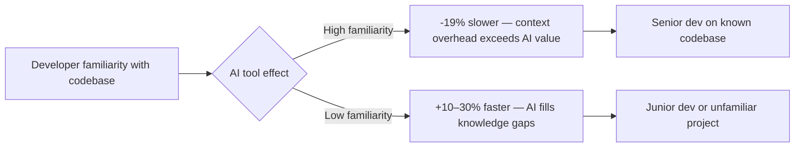

Every senior developer I know has the same story. They adopt an AI coding tool, feel instantly more capable, and tell their manager they're probably 20-30% more productive. Then someone runs the actual numbers.

Turns out, they're 19% _slower_.

That's the finding from METR's randomized controlled trial — one of the most rigorous studies on AI coding productivity to date. Sixteen experienced open-source developers. 246 real tasks. Mature codebases. And a result that made half of Silicon Valley uncomfortable: when AI tools were available, experienced developers took longer to finish their work, not less.

The kicker? Before the study, those same developers _predicted_ AI would make them 24% faster. After the study, they _estimated_ they'd been 20% faster. The perception gap between "felt productive" and "was actually productive" is staggering — and it matters a lot if you're making decisions about your team's tooling.

## The Numbers That Didn't Make the Marketing Deck

Let's get the data on the table first, because vendor marketing has done a thorough job burying it.

The METR study found experienced developers were **19–20% slower** with AI tools on tasks in codebases they knew well. Meanwhile, junior developers using AI tools on similar work showed productivity gains of **10–30%**. That's not a small difference — that's a complete reversal of outcome based on experience level.

Pull request data tells a similar story. Junior developers see roughly 40% productivity gains. Senior developers? About 7%. And that 7% comes with a catch: senior developers using AI produce **9.4x more code churn** than their non-AI counterparts, according to GitClear's analysis. Code churn — lines written and then deleted or heavily rewritten — is a real cost that doesn't show up in "lines of code produced" metrics.

Faros AI's data is even more striking. Under high AI adoption, code churn increased **861%**. Eight hundred and sixty one percent. That's not productivity. That's velocity theater.

There's also a new term floating around Silicon Valley right now: **tokenmaxxing**. It refers to developers who use enormous AI token budgets as a badge of honor — the more tokens consumed, the more "productive" they appear. TechCrunch reported in April 2026 that engineering managers see code acceptance rates of 80–90%, but miss the churn that happens in the following weeks when engineers revise that AI-generated code. Real-world acceptance rates? Between 10 and 30 percent of generated code.

Jellyfish found that engineers with the largest token budgets produced the most pull requests — but at twice the throughput at **ten times the cost**. That's not a productivity tool. That's an expensive way to feel busy.

## Why This Happens (It's Not What You Think)

The instinctive reaction is to blame the AI. "The models aren't good enough yet." But that's not the real issue.

The problem is **context switching and cognitive mode-shifting**. Here's what actually happens when a senior developer uses AI on a codebase they know deeply:

1. They have a clear mental model of what needs to happen
2. They start typing — but stop to prompt the AI instead
3. The AI generates something that looks plausible but is subtly wrong
4. They spend time reviewing, identifying the error, correcting it
5. They re-prompt, get a revised version, review again
6. By the time they accept or reject the suggestion, they've broken their flow state

For a junior developer, this process is net positive — they didn't have a sharp mental model to begin with, so the AI's suggestion gives them direction they wouldn't otherwise have. For a senior developer, the interruption cost exceeds the output benefit. They already _knew_ what to write. The AI just added steps.

Traditional AI coding tools with 4,000–8,000 token context windows make this worse by requiring constant manual prompting and re-priming. Every time you switch from "thinking about the problem" to "explaining the problem to the AI," you pay a cognitive tax.

The METR study also found something specific: **developers with high familiarity with their repository were slowed down more than developers on unfamiliar codebases.** The inverse is true too — on an unfamiliar codebase, the AI's suggestions are more useful because the developer has less competing mental context to lose.

## The Perception Problem Is Its Own Problem

Here's what makes this genuinely dangerous: developers _feel_ more productive when using AI tools, even when they aren't.

The METR developers estimated they were 20% faster after the study. They were actually 19% slower. That's a 39 percentage point gap between perceived and actual productivity.

Why does this happen? Because AI tools create the sensation of progress. You're generating code. You're filling screens. You're shipping pull requests. But a lot of that activity is churn — code that gets written, reviewed, partially accepted, then rewritten. The motion of production without the output of real productivity.

This matters enormously for engineering teams. If your senior developers believe AI makes them faster, they'll advocate for more AI tooling, argue against time estimates that account for validation overhead, and resist attempts to measure actual output vs. perceived output. The self-reporting bias becomes organizational policy.

## Senior Devs Who _Do_ Win With AI (And What They Do Differently)

Here's where it gets interesting. The data isn't "AI tools are useless for senior developers." It's more nuanced than that.

Fastly's research found that senior developers who _do_ adapt their workflow to AI ship **2.5x more than junior developers**, with 32% reporting over half their production code comes from AI versus 13% for juniors. So the ceiling for a senior dev using AI well is significantly higher — the problem is most aren't using it well.

What separates the developers getting 2.5x output from the ones getting -19%?

**They use AI for the right tasks.** Senior developers get value from AI on unfamiliar territory: a new library they haven't used before, a language they know conceptually but haven't written in a while, boilerplate-heavy domains like infrastructure-as-code or test setup. They don't use AI on the core business logic they understand deeply — that's where the overhead isn't worth it.

**They've moved from autocomplete to agentic workflows.** The developers getting the most out of AI in 2026 aren't using it as a smarter autocomplete. They're using agentic tools — Claude Code being the most cited example — to handle entire task pipelines: write tests, implement the code, run the tests, fix failures, open a PR. The key difference is that they _delegate entire tasks_, not individual lines. Delegation doesn't interrupt flow state. Inline suggestion does.

**They invest in context upfront.** The developers winning with AI create structured context files — `AGENTS.md` or equivalent — that contain the project's tech stack, coding conventions, test commands, and architectural patterns. This isn't just documentation; it's AI fuel. A well-structured context file means the AI's first suggestion is much more likely to be usable, reducing the review-and-retry cycle dramatically.

**They measure churn, not output.** The best AI-assisted teams have started tracking code churn alongside PR velocity. If your AI adoption is generating beautiful throughput metrics but your churn rate has exploded, you're paying a hidden tax that will show up eventually — either in bugs reaching production or in the next sprint's refactoring load.

→ Read also: [Agentic AI for developers in 2026](/agentic-ai-for-developers-2026/)

## The Agentic Shift: Why It Changes the Equation

There's an important caveat to the METR study: the research used early-2025 AI tools, and conversations with participants suggested they felt significantly more sped up by AI in early 2026 than their study estimates reflected. The models have improved. The tools have improved. But more importantly — the _pattern of use_ has shifted.

The key evolution is the move from **inline AI** (suggestion as you type) to **agentic AI** (AI as a task executor). These are fundamentally different interactions with different overhead profiles.

Inline AI requires you to stay in the loop constantly. Every suggestion is a micro-decision. Every accepted line is a judgment call. The cognitive load is distributed across hundreds of tiny interruptions throughout your day.

Agentic AI asks you to define a task clearly, hand it off, and review the result. The cognitive load is concentrated at two points: task specification (upfront) and output review (at the end). Between those points, you can work on something else entirely, or simply not be interrupted.

Framework adoption for agentic AI nearly doubled year-over-year — from 9% of organizations in early 2025 to almost 18% by early 2026. The developers who made that shift earliest are the ones reporting genuine, measurable productivity gains.

The most commonly reported effective workflow in 2026 looks like this:

1. Write a spec or task description in natural language
2. Hand it to an agentic tool (Claude Code being the most cited for complex tasks)
3. Let the agent write code, run tests, and iterate — without your involvement
4. Review the diff and PR when it's done
5. Accept, revise, or reject at the PR level — not the line level

This workflow doesn't interrupt flow state. It doesn't require cognitive mode-switching. And it scales — you can have multiple agents working in parallel on separate tasks while you focus on architecture and strategy.

## What Engineering Managers Need to Hear

If you're managing a team and you're seeing high AI adoption with improved PR velocity, pause before celebrating. Ask three questions:

**What's our code churn rate?** If it's elevated, your team is generating code faster than they're shipping quality. The debt is accumulating.

**Are our senior developers actually faster, or do they feel faster?** These are different questions with different answers. The METR study showed the gap can be nearly 40 percentage points. Self-reported productivity surveys are almost useless without correlating output data.

**What are we actually measuring?** If your success metric is "lines of code" or "PRs opened," you're measuring the wrong thing. Net productivity — working features delivered, bugs introduced per feature, time to production — is the right benchmark. It's harder to measure, but it's the number that actually matters.

The ROI reality is also worth stating plainly. At current market rates, agentic AI tools cost **$200–$2,000+ per engineer per month** in token costs alone, on top of seat licenses. Most teams average $200–600/month per engineer. The realistic ROI at median usage is around **1.6x** — positive, but nowhere near the 10x that vendor marketing implies. Top-quartile teams achieve 4–6x, but they've invested heavily in workflow design, not just tool adoption.

## How to Actually Fix Your Workflow

Enough diagnosis. Here's what to do.

**Audit where you're using AI, not just how much.** Keep a loose log for two weeks. Every time you use an AI tool, note whether it was on familiar code or unfamiliar code, and whether the first suggestion was usable or required significant revision. You'll quickly see where AI is actually adding value versus where it's creating overhead disguised as productivity.

**Switch from inline to batch for complex work.** If you're on a codebase you know well, try turning off inline autocomplete for a week. Use AI only for defined tasks — "implement this function to spec," "write tests for this module," "refactor this file to remove the dependency on X." Compare your actual output, not your perceived output.

**Build your context files properly.** Before you even think about which AI tool to use, invest an hour creating an `AGENTS.md` or equivalent project context document. Include your stack, your conventions, your test commands, your architecture principles. This single change has a bigger impact on AI suggestion quality than switching from one tool to another.

**Use the right tool for the right job.** The most effective senior dev setup in 2026 tends to be: Cursor or your regular IDE for daily editing and familiar code where you want precise control; Claude Code or equivalent agentic tool for complex, multi-file tasks on less familiar territory where you want full delegation. Don't use a sledgehammer for a nail.

**Measure the right things.** Advocate internally for measuring code churn alongside velocity. It's not about penalizing AI use — it's about getting an honest picture of whether AI adoption is generating real output or just motion.

## Conclusion: The Tool Isn't the Problem. The Workflow Is.

The METR study didn't find that AI coding tools are bad. It found that using them the way most senior developers use them — as an always-on inline suggestion engine — adds overhead that outweighs the benefit for experienced developers on familiar codebases.

The developers thriving with AI in 2026 aren't using it more. They're using it more strategically. They've recognized that the value of AI in software development isn't "faster typing." It's **delegation at a level that doesn't interrupt thinking**.

Junior developers benefit from AI as a teacher and scaffolding tool. Senior developers benefit from AI as an autonomous executor of well-defined tasks. Those are different use cases that require different workflows, different tools, and different success metrics.

The 19% slowdown is real. But it's not a verdict on AI. It's a diagnosis of a mismatch between workflow and tool design. Fix the workflow, and the number flips.

---

## Frequently Asked Questions

**Why do AI coding tools make senior developers slower?**
Senior developers on familiar codebases already have strong mental models of what needs to happen. Inline AI suggestions interrupt that mental flow — requiring constant micro-decisions to accept, reject, or revise. The cognitive overhead of managing AI suggestions exceeds the time saved by generating code automatically.

**What is "tokenmaxxing" and why is it a problem?**
Tokenmaxxing refers to the trend of developers using massive AI token budgets as a productivity signal. The problem: high token consumption correlates with high code churn (code generated and then deleted or rewritten), not actual output quality. Studies show real-world code acceptance rates of 10–30%, despite 80–90% initial acceptance metrics.

**Do senior developers benefit from AI tools at all?**
Yes — but differently than junior developers. Senior developers who switch from inline autocomplete to agentic task delegation (handing off entire tasks to AI agents) report significant productivity gains. The key is using AI for unfamiliar territory and well-defined tasks, not as a constant inline assistant on code they already understand deeply.

**What's the difference between inline AI and agentic AI for developers?**
Inline AI (like standard Copilot autocomplete) provides suggestions as you type, requiring constant micro-decisions and interrupting flow state. Agentic AI (like Claude Code in task mode) executes a defined task autonomously — writing code, running tests, iterating — and presents results for review. Agentic AI concentrates cognitive load at task definition and output review, rather than distributing it across hundreds of interruptions.

**What should engineering managers measure to assess AI coding tool ROI?**
Track code churn rate (lines written vs. lines later deleted/rewritten), net feature delivery velocity, bugs introduced per feature shipped, and actual time-to-production — not just PR volume or lines of code. Self-reported productivity surveys have up to a 40-point gap from measured productivity, so rely on objective output data.
