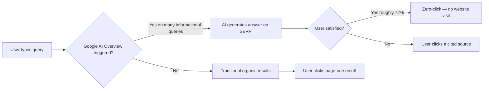

You did everything right. You ranked on page one. You had the featured snippet. Traffic was climbing. Then, sometime in the past year, your Google Search Console started looking like a horror movie — impressions stayed the same, but clicks fell off a cliff. Welcome to 2026, where being number one on Google no longer means what it used to.

This isn't a temporary blip. It's a structural shift — and if your SEO strategy hasn't adapted, you're already behind.

---

## The Numbers Don't Lie: AI Overviews Are Eating Your Clicks

Let's start with the data, because it's pretty brutal.

According to Seer Interactive's research, organic CTR for queries that trigger an AI Overview plummeted from 1.76% to 0.61% — that's a **61% collapse**. Ahrefs found that the presence of an AI Overview correlated with **58% lower average CTR** for the top-ranking page. And ALM Corp's February 2026 analysis showed classic organic click share down between **11 and 23 percentage points across every vertical** they measured.

Meanwhile, zero-click searches have climbed from 54% to 72%. Two out of three Google searches now end without anyone clicking anything. The query gets answered on the page — and users move on.

Here's the kicker: Google's AI Overview now reaches **over 2 billion monthly users**. Informational queries trigger AI Overviews at rates as high as 80–88% in certain industries. B2B technology queries specifically saw their AI Overview trigger rate jump from 36% to 82% in just twelve months.

So yes — if you're still optimizing purely for keyword rankings, you're optimizing for a game that's rapidly becoming irrelevant.



---

## Rankings Are Not Dead — But They're Not Enough Anymore

Here's where I want to push back a little on the doom-and-gloom narrative. Rankings still matter. Organic traffic hasn't vanished. And there's actually an interesting silver lining buried in the data: **brands that get cited in AI Overviews earn 35% more organic clicks and 91% more paid clicks** than their competitors. Being inside the AI answer is a massive amplifier.

The problem isn't that SEO doesn't work. The problem is that most SEO strategies were built for a world where the goal was to get users _to_ your page. Now, the first goal is to get Google to _cite_ you — and the second goal is to give cited users a compelling reason to click through.

That's a fundamentally different value proposition.

Think of it this way: old SEO was about being the destination. New SEO is about being the authority that gets quoted, the way a journalist quotes an expert source. Your brand needs to become the source that AI systems trust and reference — and that requires a different kind of work.

---

## Why Most SEO Strategies Are Failing Right Now

### They're still chasing keywords instead of entities

Traditional keyword optimization asks: "what phrase do I want to rank for?" Entity-based optimization asks: "what concept do I want to be _known for_?" These are completely different questions.

AI systems don't just read your content — they build knowledge graphs. They map relationships between entities: companies, people, topics, products. Pages with 15+ recognized entities show significantly higher citation rates in AI Overviews. If Google's AI can't confidently identify _what_ your page is about in an entity sense, it won't cite you.

This means you need to be explicit. Name your concepts. Link to authoritative definitions. Use proper noun references. Structure your content so that an LLM reading it would immediately understand: "this page is about [X], written by [Y], published on [Z], and it authoritatively addresses [topic cluster]."

### They're producing thin, AI-generated content at scale

Here's an uncomfortable truth: the same AI tools that are disrupting search are now flooding the web with mediocre content. In 2026, **86% of SEO professionals use AI in their workflows** — but most of them are using it to produce more content faster, not better content more strategically.

Google's March 2026 Core Update was brutal about this. Nearly **80% of top-three search results shifted positions**, with Google clearly prioritizing official first-party sources, brand-owned domains, and content backed by real-world experience. Thin AI-generated pages got hammered.

The signal is clear: **E-E-A-T (Experience, Expertise, Authoritativeness, Trust) has never mattered more.** And the "Experience" part is the new frontier. Did someone who actually _did the thing_ write this? Did they reference original data? Did they share a perspective you can only have if you've lived it?

AI can write competent content. It cannot fake genuine experience. That's your moat.

### They're not thinking about semantic completeness

This one is technical but critically important. Research shows that content scoring **8.5/10 or higher on semantic completeness is 4.2× more likely to be cited** in AI Overviews. What does semantic completeness mean? It means your page answers not just the primary question, but also the related questions, the follow-up questions, and the definitional questions that naturally cluster around a topic.

AI Overviews extract favor passages of **134–167 words**. They're looking for tight, well-structured answers to specific sub-questions within a broader topic. If your content is one long stream of paragraphs without clear question-answer structures, you're making it harder for AI to extract citable passages.

### They're ignoring structured data (but not in the way you think)

Here's where it gets nuanced — and where the latest research gives us a more honest picture.

One major Ahrefs study tracked 1,885 pages that added schema markup and found **no significant uplift in AI citations from schema alone**. That's an important finding that cuts against a lot of breathless "schema is the key to AI Overviews" content.

But here's the real insight: the correlation between structured data and AI citations is real — it's just that the mechanism is indirect. Sites that implement structured data properly tend to also publish stronger content, build more authority, earn more links, and maintain better technical foundations. The schema is a signal of overall content quality hygiene, not a magic bullet.

That said, **FAQPage schema does show genuine independent lift** — pages with FAQPage markup are 3.2× more likely to appear in Google AI Overviews. And JSON-LD remains the preferred format for AI parsers, with Google's official guidance explicitly recommending it for AI-optimized content.

The lesson: use schema, but don't treat it as a shortcut. It's one piece of a larger credibility stack.

---

## The 2026 Citation Playbook: What Actually Works

Enough diagnosis. Here's the treatment.

### 1. Restructure Your Content Around Answer Blocks

AI Overviews are built to extract discrete, self-contained answers. Structure your content to make this easy. Lead each section with a direct answer to the implicit question, then expand. Use H2 and H3 headers as question proxies — even if they're not written as literal questions, they should clearly signal "this section answers X."

Keep your "answer block" — the tight 100–200 word summary at the top of each section — as clean and factually dense as possible. That's the passage most likely to get extracted and cited.

### 2. Publish Original Data and Research

Content featuring **original statistics sees 30–40% higher visibility in AI responses**. If you can run surveys, analyze proprietary data, or publish original research — even small-scale — you become a primary source. AI systems are designed to cite primary sources. Secondary sources (articles that summarize what someone else found) are much easier to skip.

This doesn't have to be a massive study. Even a poll of 200 customers, or an internal data analysis from your own platform, can produce citable original statistics.

### 3. Build Real Author Authority

96% of AI Overview citations come from sources with strong E-E-A-T signals. That means author pages matter. Author bios matter. Author schema (`Person` schema with `knowsAbout`, `sameAs` linking to LinkedIn and Twitter/X profiles) matters.

If your articles have no visible author, or the author has no demonstrable expertise, you're at a structural disadvantage. Start building author profiles now — not just names, but genuine profiles with credential signals, publication history, and cross-platform presence.

### 4. Optimize for Multi-Platform Presence

Here's a data point that will surprise you: as of March 2026, **Reddit is the #1 most-cited domain across ChatGPT, AI Mode, Gemini, Perplexity, and Google AI Overviews**. LinkedIn rose to #2 overall and #1 for professional queries, with citation frequency doubling between November 2025 and February 2026.

This means your SEO strategy needs to extend beyond your own domain. Genuine participation in Reddit communities, LinkedIn articles, and other platform-native content is now an SEO play. Not spam — genuine contributions that build your brand's citation footprint across the web.

### 5. Implement the Core Schema Stack

Even though schema isn't magic, implementing it correctly removes friction for AI parsers. The six schema types that matter most in 2026 are: `Article`, `HowTo`, `FAQ`, `Speakable`, `Author`, and `Organization`.

Here's a minimal but solid `Article` + `Author` JSON-LD implementation you can drop into any page:

```json
{
  "@context": "https://schema.org",
  "@type": "Article",
  "headline": "Why Your SEO Strategy Is Failing in the Age of AI Overviews",
  "datePublished": "2026-05-15",
  "dateModified": "2026-05-15",
  "author": {
    "@type": "Person",
    "name": "Your Name",
    "url": "https://yoursite.com/about",
    "sameAs": [
      "https://linkedin.com/in/yourprofile",
      "https://twitter.com/yourhandle"
    ],
    "knowsAbout": ["SEO", "Content Marketing", "AI Search"]
  },
  "publisher": {
    "@type": "Organization",
    "name": "Your Site Name",
    "url": "https://yoursite.com",
    "logo": {
      "@type": "ImageObject",
      "url": "https://yoursite.com/logo.png"
    }
  },
  "mainEntityOfPage": {
    "@type": "WebPage",
    "@id": "https://yoursite.com/your-article-url"
  }
}
```

For FAQ sections, add `FAQPage` schema for any structured Q&A blocks — that's where you see the most measurable lift.

### 6. Rethink Your Content Metrics

If you're still measuring SEO success purely by keyword rankings and organic sessions, you're flying blind. In 2026, you need to track:

- **AI Overview appearance rate** (how often does your domain appear as a cited source?)
- **Brand mentions and unlinked citations** across the web
- **Visibility across multiple search platforms** (ChatGPT Search, Perplexity, Gemini, Google AI Mode — not just traditional Google)
- **Branded search volume** as a proxy for authority building
- **Conversion rate from organic traffic** — fewer clicks means each click has to work harder

The shift is from raw traffic volume to traffic quality and citation authority. A page cited in AI Overviews that sends 500 highly-intentioned visitors is worth more than a page that sends 2,000 confused ones.

---

## Common Mistakes to Avoid Right Now

**Chasing AI Overview placement with thin "answer" pages.** Some SEOs are building pages that are essentially just Q&A blocks stuffed with keywords, hoping to get extracted. Google's systems are increasingly good at identifying content that exists to game AI extraction versus content that genuinely serves users. The former gets penalized.

**Ignoring your existing high-authority content.** If you have older pages with strong backlinks and genuine authority, those are your best candidates for AI citation — not new pages. Refresh them with current data, add proper schema, tighten the answer blocks, and you'll often see faster gains than building new content from scratch.

**Treating this as a technical problem only.** Yes, schema and technical SEO matter. But 96% of AI citations go to E-E-A-T-strong sources. No amount of JSON-LD will compensate for thin content and weak brand authority.

**Optimizing only for Google.** In 2026, ChatGPT Search, Perplexity, and Gemini collectively handle a significant share of AI-mediated queries. An AEO (Answer Engine Optimization) strategy needs to work across all of these platforms, not just Google's AI Overviews.

---

## Conclusion

The SEO game hasn't ended — it's just leveled up. The fundamentals that always worked (quality content, genuine expertise, strong technical foundations, authoritative backlinks) still work. What's changed is the _goal_: you're no longer just trying to earn a high blue-link ranking. You're trying to become the source that AI systems trust enough to quote.

That requires a different kind of investment. Less volume, more depth. Less keyword coverage, more entity authority. Less page-one obsession, more brand citation footprint.

The good news? Most of your competitors haven't made this shift yet. The brands that understand that **recognition is the new ranking** will build an enormous compounding advantage over the next 12–24 months. The ones that keep churning out keyword-optimized content and hoping the algorithm will catch up are going to have a bad time.

Which side of that equation do you want to be on?

→ Read also: [Google AI Mode SEO strategy for 2026](/google-ai-mode-seo-strategy-2026/)

→ Read also: [Schema generator & validator](/schema-generator-validator-update/)

→ Read also: [Generative Engine Optimization (GEO) guide](/generative-engine-optimization-geo-guide-2026/)

---

## FAQ

**What is an AI Overview in Google Search?**
Google AI Overviews are AI-generated summaries that appear at the top of search results for many queries. They synthesize information from multiple sources and may cite some of those sources — but most users get their answer without clicking through to any website.

**Does structured data (schema markup) help with AI Overview citations?**
Schema markup correlates with higher AI citation rates, but a major Ahrefs study found that adding schema alone doesn't produce significant citation uplift. The correlation exists because sites that properly implement schema tend to have stronger content quality overall. That said, FAQPage schema shows genuine independent lift — 3.2× higher likelihood of appearing in AI Overviews.

**How do I measure if my content is being cited in AI Overviews?**
You can check Google Search Console for "AI Overview" appearance data. Third-party tools like SE Ranking, Semrush, and Ahrefs also track AI Overview appearances. Additionally, running manual searches for your target queries and looking for your domain in cited sources is a good qualitative check.

**What's the difference between SEO and AEO?**
Traditional SEO (Search Engine Optimization) focuses on ranking in organic search results. AEO (Answer Engine Optimization) focuses on getting your content cited or used as a source by AI-powered answer engines — including Google AI Overviews, ChatGPT Search, Perplexity, and Gemini. In 2026, a complete strategy needs to address both.

**Is organic traffic dead?**
No. Zero-click searches have increased significantly, but users who do click through from AI-cited sources tend to be highly intentional. Brands cited in AI Overviews actually see 35% more organic clicks than non-cited competitors. The volume may be lower, but the quality and conversion potential are higher.
