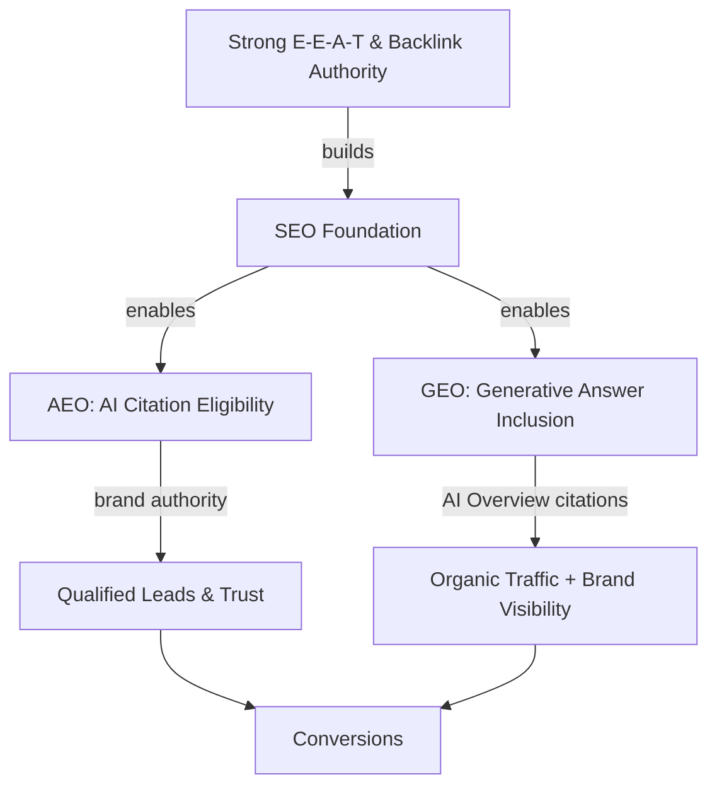

If you've noticed your organic traffic quietly bleeding out over the last year, you're not imagining it. Google AI Overviews now reach over 2 billion users monthly, and according to Ahrefs, the top-ranking page on a query with an AI Overview active sees a **58% lower click-through rate** than it would without one. That's not a dip. That's a structural shift.

Here's the uncomfortable truth: the old playbook — find keywords, write content, build backlinks, rank, get clicks — is no longer sufficient on its own. Search in 2026 happens across three different surfaces, each with its own logic: traditional search results, answer engines like ChatGPT and Perplexity, and generative AI engines like Google AI Overviews and Gemini. If your strategy only covers one of these, you're invisible on the other two.

That's where the **three-layer strategy** comes in: SEO, AEO, and GEO working in concert, not in isolation.

---

## What's Actually Changed in Search

Before diving into the layers, it's worth understanding _why_ this shift is happening — because it's not just a Google update you can wait out.

AI models are now the interface between your content and your audience. When someone asks ChatGPT "what's the best CRM for a small agency" or types a query into Perplexity, they don't get ten blue links. They get a synthesized answer, usually with two or three cited sources. One of those could be you. Or it could be your competitor.

Gartner predicts a **30% drop in traditional search volume** by the end of 2026 as users migrate to AI-assisted search. Meanwhile, 73% of businesses are completely invisible in ChatGPT right now — they simply don't show up as sources. And companies optimizing across all three channels are capturing 60–80% more organic reach than single-channel competitors.

The objective has shifted from _winning clicks on a results page_ to _becoming a cited authority inside an AI-synthesized answer_. Those are fundamentally different games.

---

## Layer 1: SEO — The Foundation You Can't Skip

Let's be clear: traditional SEO isn't dead. It's the foundation that everything else sits on. Without solid on-page SEO, technical health, and backlink authority, you won't perform well in AEO or GEO either — because AI engines pull signals from the same web.

What good SEO looks like in 2026:

**Technical health is table stakes.** Core Web Vitals matter more than ever because AI-powered features like AI Overviews still use Google's crawlers, which penalize slow, poorly structured pages. LCP under 2.5 seconds, CLS under 0.1, INP under 200ms. Not optional.

**E-E-A-T is the real moat.** Experience, Expertise, Authoritativeness, Trustworthiness — Google doubled down on these signals in 2025, and they're now directly correlated with whether your content gets cited in AI-generated answers. Author bios, first-hand case studies, original data, external mentions — these all feed E-E-A-T.

**Structure still matters.** Clear heading hierarchies (H1 → H2 → H3), descriptive meta titles and descriptions, and internal linking that maps topical authority — none of this has gone away. The difference is that now your structure also helps AI models understand what your page is _about_ at a passage level, not just a page level.

**Internal linking as topical authority mapping.** Build topic clusters around pillar pages. When Google (and AI crawlers) see that you have twenty interlinked pieces of content all reinforcing the same topical area, they're more likely to treat you as an authority — and that flows directly into GEO citation signals.

The silver lining on the CTR side: brands that _are_ cited in AI Overviews earn **35% more organic clicks** and 91% more paid clicks than non-cited competitors. SEO is no longer just about ranking — it's about earning citation eligibility.

---

## Layer 2: AEO — Optimizing for Citation, Not Clicks

Answer Engine Optimization is where most brands are sleeping. The concept is simple: optimize your content to be the answer that AI engines like ChatGPT, Perplexity, Claude, and Gemini pull from when generating responses.

The crucial mindset shift here is that AEO doesn't optimize for clicks. It optimizes for **citations**. The user might never visit your site, but if an AI system recommends your brand by name — or pulls a stat from your research — you get authority, trust, and qualified leads who already believe in you before they arrive.

Here's what AEO actually looks like in practice:

**Write "answer-first" content.** Every section should open with a clear, direct answer to the implied question before expanding on it. Think of it as BLUF (Bottom Line Up Front). AI systems are extracting _passages_, not pages — your content needs to be self-contained at the paragraph level.

**Use FAQ schema and structured data.** `FAQPage` schema markup directly tells answer engines what questions your content addresses and what the answers are. This is one of the fastest, most concrete wins in the AEO playbook.

**Include citable specifics.** Concrete numbers, statistics, dates, and named examples are what AI models love to pull. "Content marketing increases traffic" is unpullable. "Companies that publish 2+ blog posts per week see 3.5x more traffic (HubSpot, 2025)" is citable. Be specific everywhere you can.

**Configure AI bot access.** Make sure `robots.txt` doesn't accidentally block GPTBot, ClaudeBot, PerplexityBot, or other AI crawlers. If they can't read your content, you simply don't exist for those platforms.

**The llms.txt question.** You may have heard about `llms.txt` — a file at your site root that curates your best content for LLMs. The honest answer: as of mid-2026, no major AI company has publicly committed to using it in production search systems, and the actual bot traffic touching these files is negligible. That said, it _does_ help AI coding assistants like Cursor and Claude read your docs efficiently. Worth 30 minutes to add; don't bet your strategy on it.

---

## Layer 3: GEO — Getting Into the AI-Generated Answer

Generative Engine Optimization is the newest layer, and arguably the most technically interesting. GEO specifically targets Google AI Overviews, Google Gemini, and similar generative AI surfaces that synthesize answers from across the web.

The core mechanism is Retrieval-Augmented Generation (RAG). When a generative engine processes a query, it retrieves a set of candidate documents, evaluates them for relevance and authority, and generates an answer by synthesizing across sources. Your job is to be in that retrieval set _and_ be citable enough to make it into the synthesis.

What GEO requires that plain SEO doesn't:

**Passage-level semantic relevance.** Each section of your article needs to function as a standalone unit that makes sense without the surrounding context. An AI retrieval system doesn't read the full page before deciding whether your content is relevant — it evaluates chunks. Write every H2 section as if it might be read in isolation.

**Entity consistency and brand mentions.** AI systems maintain knowledge graphs about entities — brands, people, concepts. Every time your brand is mentioned authoritatively across the web (news coverage, industry roundups, citations in other articles), you're reinforcing your entity authority. This is why digital PR isn't just a "nice to have" in 2026 — it's a GEO signal.

**Original data and unique insights.** Generic content that restates common knowledge gets filtered out of AI synthesis. Original research, proprietary data, contrarian takes backed by evidence — these are what get cited. If your article says the same thing as the top 10 results, why would an AI system choose yours over the established players?

**Structured, crawlable pages.** GEO and SEO overlap significantly here. Fast-loading, well-structured HTML with clear heading hierarchies and schema markup makes it much easier for RAG systems to chunk and evaluate your content correctly.

---

## The Integrated Stack: How the Three Layers Work Together

Here's the thing that gets lost in a lot of "SEO vs AEO vs GEO" content: **they're not competing strategies**. They reinforce each other.

Good SEO builds the domain authority and content structure that makes AEO and GEO possible. AEO optimizations — FAQ schema, citable statistics, clear answer formatting — make your content more useful and readable, which Google rewards in traditional rankings too. And GEO's emphasis on original data and entity authority is just... good content strategy.

The recommended order for most sites:

1. **SEO first** if you don't have a solid foundation. Technical health, content structure, basic E-E-A-T signals.
2. **AEO second** — it's the fastest and cheapest layer to add. Retrofit FAQ schema, add citable statistics to existing content, check your AI bot access configs.
3. **GEO third** — this requires more investment but flows naturally from doing the first two well. Focus on original research, entity mentions, and passage-level content design.

---

## Common Mistakes to Avoid

**Treating AEO like SEO.** The biggest one. SEO optimizes for click-through; AEO optimizes for citation. If you're A/B testing AEO content based purely on CTR metrics, you're measuring the wrong thing. Track brand mentions in AI responses, entity authority signals, and leads who say "I found you on ChatGPT."

**Ignoring multi-platform presence.** Optimizing only for Google is no longer enough. ChatGPT alone has hundreds of millions of active users. Perplexity, Claude, and Gemini each have distinct citation preferences. The brands winning in 2026 are visible across all of these surfaces.

**Letting your robots.txt block AI crawlers.** It sounds basic, but it's surprisingly common — especially on sites that added restrictive crawl rules during the AI content panic of 2024. Verify that GPTBot, ClaudeBot, and PerplexityBot have access to your important pages.

**Over-relying on structured data without content quality.** Schema markup is a signal, not a substitute for content that actually answers questions well. You can't schema-markup your way into AI citations if the underlying content is thin or generic.

**Not measuring the right things.** Traditional rank tracking won't tell you how visible you are in AI answers. Start monitoring your brand's AI citation rate — tools like AirOps, Semrush's AI Toolkit, and dedicated GEO analytics platforms are emerging to fill this gap.

---

## What to Do This Week

If you're starting from zero on AEO and GEO, the highest-ROI moves right now are:

- **Audit your robots.txt** for AI crawler blocks — 30 minutes, potentially huge impact.
- **Add FAQPage schema** to your top 5 traffic pages — structured data is one of the most direct AEO signals.
- **Identify your most-cited statistics** and update them with 2026 data — stale stats get replaced by fresher sources in AI synthesis.
- **Write one original data piece** — a survey, an analysis of your own customer data, a benchmark study. Original data earns citations in a way that opinion pieces can't.
- **Check your brand visibility in ChatGPT and Perplexity** — literally ask them about your category and see if you come up. That's your baseline.

---

## Conclusion

The search landscape in 2026 isn't broken — it's just more layered. Traditional SEO still matters; it's just no longer the only game in town. The brands that will win the next three years are the ones treating SEO, AEO, and GEO as a unified strategy, not three competing initiatives.

Get cited. Get mentioned. Get found — wherever your audience is searching. That's what search optimization means now.

→ Read also: [Answer Engine Optimization: How to Get Cited by AI Search in 2026](/answer-engine-optimization-aeo-guide/)

→ Read also: [Why Your SEO Strategy Is Failing in the Age of AI Overviews](/why-your-seo-strategy-is-failing-ai-overviews/)

→ Read also: [Technical SEO in 2026: Speed, Vitals & AI Crawlers](/technical-seo-2026-speed-vitals-ai-crawlers/)
