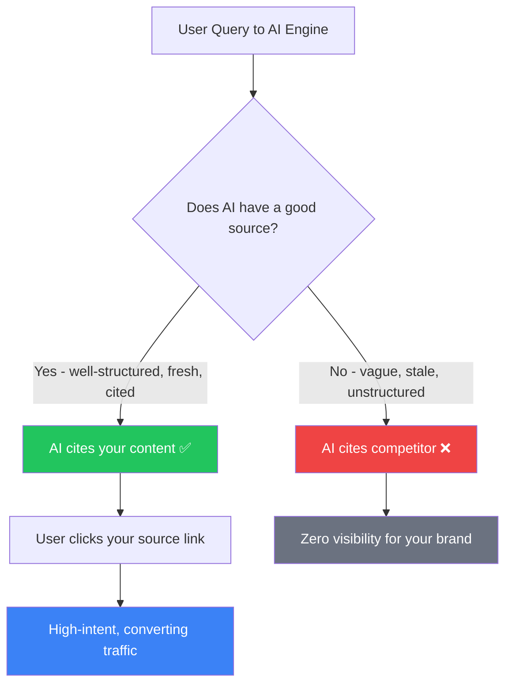

Ranking #1 on Google used to be the holy grail. But here's the thing — in 2026, ranking #1 doesn't mean you get the traffic anymore. AI Overviews eat your click before the user even sees your blue link. ChatGPT handles 800 million weekly queries. Perplexity is growing faster than any search engine in history. The game has changed, and the new winning move is getting _cited_ — not just _ranked_.

That's what Answer Engine Optimization (AEO) is about. And if you're still running purely traditional SEO playbooks in 2026, you're quietly losing ground to competitors who figured this out six months ago.

## The Numbers That Should Make Every SEO Stop and Think

Let me put this in perspective with some real data from 2026.

Google AI Overviews now appear in **47–64% of all search queries** — up from just 25–30% when the feature first rolled out in 2024. When an AI Overview is present, position-one organic CTR has collapsed from 27% to as low as **11%**. That's more than a 50% drop. For queries where the AI Overview fully answers the question, **58% of searches now end without a single click**.

Meanwhile, ChatGPT has 883 million monthly users. Perplexity's user base is growing exponentially. And here's a stat that should get your attention: Ahrefs reported that despite representing less than 1% of their total traffic, visitors arriving from AI platforms had a conversion rate exceeding **10%** — making them the highest converting channel on the site.

The audience finding you through AI search is smaller in volume but far more intent-driven. These are people who trust the AI enough to follow its source links — and when they do click, they're ready to act.

So the question isn't whether to care about AEO. It's how fast you can start implementing it.

## SEO vs AEO vs GEO: Getting the Vocabulary Straight

Before diving into tactics, it helps to understand what we're actually talking about because there's a lot of overlapping terminology floating around right now.

**SEO (Search Engine Optimization)** is the classic discipline: rank higher in Google's blue-link results through keywords, backlinks, technical structure, and authority signals. The goal is a click from the SERP. This is not dead — it's just no longer sufficient on its own.

**AEO (Answer Engine Optimization)** focuses on getting your content extracted as a direct answer within search — think Google AI Overviews, featured snippets, People Also Ask boxes, Bing Copilot, and voice assistants. AEO is about winning within the Google ecosystem where your content gets _surfaced_ rather than _linked to_.

**GEO (Generative Engine Optimization)** expands the scope further: it's about getting cited by standalone AI systems like ChatGPT, Claude, Perplexity, and Gemini — platforms that don't even start with a traditional search index. GEO is about becoming source material for AI-generated answers across the broader AI ecosystem.

In practice, AEO and GEO overlap significantly, and many practitioners use them interchangeably. The cleanest mental model: SEO gets you _found_, AEO gets you _cited inside Google_, and GEO gets you _cited by AI engines everywhere else_.

The winning strategy in 2026 runs all three simultaneously, with the same foundational content serving all channels.

## Why Traditional SEO Foundations Still Matter (A Lot)

Here's a trap worth avoiding: some folks read about AEO and GEO, then start treating them as a replacement for SEO. That's backwards.

AI engines need to find your content before they can cite it. Google's AI Overviews heavily favor content that's already ranking in the top 10 organic results — even though the citation overlap has weakened from 76% in mid-2025 to between 17–54% in early 2026. ChatGPT and Perplexity both crawl the web; if your site has crawlability issues, poor technical hygiene, or thin content, AI systems will ignore you the same way Google does.

The strongest AEO strategy is **search-first in its foundations and answer-first in its formatting**. Indexable pages, crawlable architecture, strong internal linking, and topical authority aren't optional prerequisites — they're what let the rest of this actually work.

## The Core AEO Content Framework

Now for the actionable part. Here's how to structure and write content that AI systems will actually cite.

### 1. Answer First, Always

This is the single highest-leverage change you can make today. AI engines extract the first 1–2 sentences of a section to determine if it answers the query. If your opening is a bunch of context-setting and backstory, the engine skips to a competitor who got to the point faster.

The format that works: start every H2 section with a 40–60 word direct answer to the implied question of that section. Then expand with context, evidence, and nuance. Think of it like the inverted pyramid journalism style — lead with the conclusion, then justify it.

Bad example: _"In today's rapidly evolving digital landscape, content marketing has undergone significant transformation..."_

Good example: _"AEO is the practice of structuring content so AI systems can extract and cite it as a direct answer. It works at the fact level — clear definitions, citable statistics, and structured sections — rather than at the page level like traditional SEO."_

The second one gets cited. The first one gets ignored.

### 2. Structure Every Page Like a Q&A

AI engines parse content by section, not by page. Each H2 and H3 should be a self-contained unit that can be understood and cited independently. Use explicit question-style headings when it makes sense — "What is AEO?", "How does FAQ schema improve citation rates?" — because content with close or exact language matches to common queries is significantly more likely to be cited.

Add a dedicated FAQ section at the bottom of key pages. Pages with FAQPage schema markup are **3.2x more likely to appear in Google AI Overviews**, and those without schema see only a 15% AI citation rate versus 41% for pages with proper FAQPage markup.

But here's the nuance: generic, minimally-populated schema actually underperforms having no schema at all (41.6% vs 59.8% citation rate). If you're going to implement structured data, do it properly — fill out every relevant attribute.

### 3. Be Stat-Heavy and Source-Cited

Data from Ahrefs and other studies shows that adding statistics improves AI visibility by **30–40%**. AI systems are trained to prefer authoritative, factual content. Every 150–200 words, drop a concrete statistic with a source citation. This isn't just good practice for readers — it signals to AI training pipelines and retrieval systems that your content is factual and trustworthy.

Real numbers beat vague claims every time. "SEO is changing" gets glossed over. "Position-one CTR dropped from 27% to 11% when AI Overviews are present (SISTRIX, March 2026)" gets cited.

### 4. Freshness Is Non-Negotiable

AI engines strongly favor recent content. Pages not updated in over 3 months see citation rates drop sharply. This isn't just about adding a "Last Updated" date — it means actually refreshing the data, updating statistics, and revising sections that reference time-sensitive information.

For AEO, content freshness is a ranking signal in the same way it is for traditional SEO, but the decay curve is steeper. Schedule quarterly reviews for your highest-priority pages.

## Getting Cited by ChatGPT, Perplexity, and Gemini

Google AI Overviews is one battlefield. But ChatGPT, Perplexity, and other AI platforms operate differently and require slightly different approaches.

Perplexity uses real-time web retrieval (RAG) for almost every query. That means fresh content published today can appear in Perplexity answers within days. It also draws heavily from Reddit and community Q&A sources — which means participating genuinely in relevant communities isn't just a nice-to-have; it's an AEO strategy.

ChatGPT relies more on training data plus browsing for recent queries. This makes brand mentions across the web especially important. Research shows that **brand mentions across multiple platforms correlate 3x more strongly with AI visibility than backlinks do**. Domains with millions of brand mentions on Quora and Reddit have roughly **4x higher citation rates** by AI systems than those with minimal community presence. Domains listed on Trustpilot, G2, Capterra, and similar review platforms have **3x higher chances** of being cited by ChatGPT.

This reframes what "off-page SEO" means in the AEO era. It's not primarily about link building — it's about earning brand mentions, co-citations, and community presence across the web's most authoritative platforms.

The practical play: get featured in roundup articles, pitch journalists for expert quotes, participate in relevant Reddit communities, and make sure your brand has complete profiles on third-party review and directory platforms. These activities serve both traditional SEO _and_ AEO simultaneously.

## Common Mistakes That Kill Your AI Citation Potential

After studying what works, it's worth calling out what doesn't:

**Over-optimizing for keywords instead of answers.** Keyword density thinking from 2015 doesn't serve AEO. Write for the question, not the keyword. If the target keyword is "email marketing automation," the AEO approach is to answer "What is email marketing automation?" directly and thoroughly — not to repeat the phrase five times per paragraph.

**Ignoring thin-content pages.** AI systems evaluate your entire domain for trustworthiness, not just individual pages. A cluster of thin, low-value pages drags down your citation potential across the site. Consolidate or improve them.

**No FAQ section.** This is the quickest win most sites are leaving on the table. Adding a structured FAQ section to your cornerstone content pages, with proper FAQPage schema, can meaningfully move your citation rates within weeks. Only 12.4% of websites implement any structured data at all — which means this is still an underexploited advantage.

**Treating AEO as separate from SEO.** The teams that win in 2026 don't have an "SEO team" and an "AEO team." They have a content team that writes for both simultaneously because the underlying signals — topical authority, quality content, technical hygiene — serve both goals.

## A Practical 30-Day AEO Quick-Start Plan

You don't need to rearchitect your entire content strategy overnight. Here's a focused starting point:

**Week 1 — Audit and prioritize.** Identify your 10 highest-traffic pages. Check whether each one leads with a direct answer, has a FAQ section, and uses proper schema markup. These are your quick-win targets.

**Week 2 — Restructure existing content.** Rewrite the opening paragraph of each target page to lead with a 40–60 word direct answer. Add or expand FAQ sections. Implement FAQPage schema if it's missing.

**Week 3 — Refresh data and citations.** Update statistics throughout each page. Add source citations for every key claim. Replace outdated figures with 2026 data.

**Week 4 — Off-page brand presence.** Audit your profiles on G2, Trustpilot, Capterra, and relevant directories. Make sure they're complete and up-to-date. Identify two or three relevant community spaces (Reddit, Quora, industry forums) where genuine participation makes sense.

Then measure. Run branded and non-branded queries in ChatGPT, Perplexity, and Google's AI search mode. Track when your content appears. Look for citation patterns by topic and format. Iterate based on what you see.

## The Bigger Picture

AEO isn't a replacement for SEO. It's the logical extension of it — the same fundamental discipline of earning trust and providing value, adapted for a world where AI systems are the new editorial gatekeepers.

The sites that get cited in AI answers are the same sites that have been doing good SEO for years: authoritative, well-structured, factually accurate, regularly updated. The difference is that AEO makes the formatting requirements explicit. Answer first. Structure clearly. Cite your sources. Be fresh.

If that sounds like good writing advice more than technical SEO advice — yeah, it kind of is. Which is honestly a good sign for everyone who was tired of gaming algorithms and just wants to create content that genuinely helps people.

The algorithm finally agrees with the readers.

---

## FAQ

**What is Answer Engine Optimization (AEO)?**
AEO is the practice of structuring your content so AI-powered search engines and chat platforms can extract and cite it as a direct answer to user queries. It works at the fact and section level — clear definitions, structured headings, direct answers — rather than at the traditional page-ranking level of SEO.

**How is AEO different from SEO?**
SEO focuses on getting your page ranked in traditional search result lists. AEO focuses on getting your content _cited_ within AI-generated answers — in Google AI Overviews, ChatGPT, Perplexity, and similar platforms. Both require strong technical foundations, but AEO additionally requires answer-first formatting, structured data, and a brand presence across the broader web.

**What is GEO (Generative Engine Optimization)?**
GEO extends AEO beyond Google into the standalone AI ecosystem — ChatGPT, Claude, Gemini, Perplexity. While AEO primarily targets winning within Google's AI features, GEO covers optimization for all platforms where AI generates answers from web content.

**Does schema markup actually help with AI citations?**
Yes, but execution matters. Pages with properly implemented FAQPage schema are 3.2x more likely to appear in Google AI Overviews. However, generic, minimally-populated schema underperforms having no schema at all. If you're going to implement it, fill out all relevant attributes thoroughly.

**How do I track if my content is being cited by AI?**
Run your target queries manually in ChatGPT, Perplexity, Google AI Overviews, and Bing Copilot. Note when your domain appears as a cited source. Tools like Profound, Semrush AEO tracking, and brand mention monitoring platforms are emerging specifically for this use case.

**What's the fastest win for AEO?**
Rewrite the opening of your key content pages to lead with a 40–60 word direct answer, and add a FAQ section with FAQPage schema. These two changes alone can materially improve your citation rates within weeks, especially in Google AI Overviews.

→ Read also: [SEO, AEO, and GEO: The Three-Layer Search Strategy You Need in 2026](/seo-aeo-geo-three-layer-strategy/)

→ Read also: [Technical SEO in 2026: Speed, Vitals & AI Crawlers](/technical-seo-2026-speed-vitals-ai-crawlers/)

→ Read also: [Why Your SEO Strategy Is Failing in the Age of AI Overviews](/why-your-seo-strategy-is-failing-ai-overviews/)
