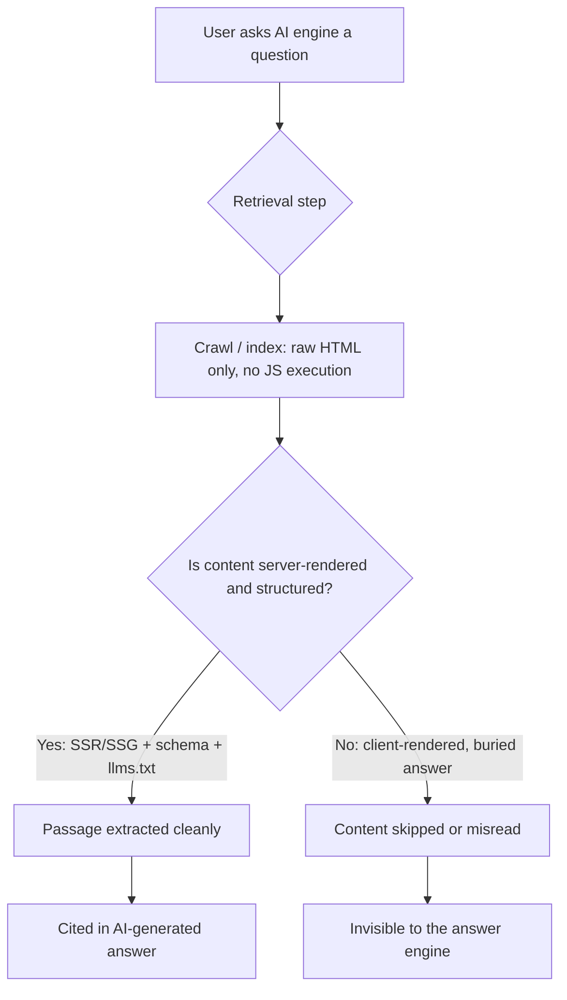

Somewhere in the last eighteen months, the ten blue links quietly stopped being the finish line. Roughly a quarter of Google searches now trigger an AI Overview before a user ever scrolls to a "real" result, and Google's own AI Overviews have crossed 2.5 billion monthly active users. If your content strategy still ends at "rank #1," you're optimizing for a shrinking slice of the pie.

That's the gap Answer Engine Optimization (AEO) is built to close. And here's the part most marketing-only guides skip: getting cited by an AI engine isn't primarily a content problem. It's a technical one. You can write the most authoritative paragraph on the internet, and if GPTBot can't read it, it doesn't exist.

## Why AEO Matters Now (And Why "Just Write Better Content" Isn't the Answer)

Let's ground this in numbers, because AEO attracts a lot of hand-waving.

AI search visits grew 42.8% year over year, jumping from 15.6 billion to 27.4 billion visits between Q1 2025 and Q1 2026. At the same time, AI Overviews reduce organic clicks on the top-ranking result by an average of 34.5%. Put those two stats together and you get the real story: search volume through AI surfaces is exploding, while the traditional click-through reward for ranking #1 is shrinking. The traffic didn't disappear — it moved into a citation, a summary bubble, or a conversational answer where your brand either gets name-checked or gets ignored.

This is why AEO and traditional SEO now run as parallel tracks with different scoreboards. SEO counts rankings and clicks. AEO counts citations and mentions inside AI-generated answers — in ChatGPT, Perplexity, Gemini, and Google's AI Overviews. You can win one and lose the other, and increasingly, brands need to win both.

There's also a trust dividend worth mentioning: brands showing up consistently in AI answers report shorter sales cycles and higher-converting traffic once a prospect does click through, because the AI citation already did some of the credibility work. That's a strong argument for treating AEO as a growth lever, not a side experiment.

→ Read also: [Core Web Vitals in the AI Overview Era: What Really Drives Citations](/core-web-vitals-ai-overview-citations-2026/)

## AEO vs. SEO: What Actually Changed Under the Hood

Traditional SEO optimizes for a crawler (Googlebot) that renders JavaScript, follows links, and builds an index you compete inside via ranking signals. AEO optimizes for a different kind of consumer entirely: a language model that retrieves a handful of passages, reads them once, and synthesizes an answer — often without ever sending the user to your site.

The practical consequence is that AEO rewards content that is *extractable*, not just *rankable*. A page can sit at position one on Google and still be functionally invisible to ChatGPT, simply because of how it's built. That single sentence is the whole thesis of this article, and it leads directly into the biggest blind spot most teams have.

## The JavaScript Blind Spot: Why AI Crawlers Can't See Your Best Content

Here's the uncomfortable technical reality: GPTBot, ClaudeBot, and PerplexityBot do not execute JavaScript. They don't wait for hydration, they don't run a headless browser, and they don't get a second attempt. Vercel's own analysis of more than 500 million GPTBot fetches found zero evidence of JavaScript execution. These bots fire a single HTTP request, read whatever HTML comes back in that first response, and move on.

Compare that to Googlebot, which uses a headless Chrome-based rendering pipeline and will happily wait for your React app to hydrate before indexing the final DOM. That difference means a client-side-rendered single-page app can rank respectably on Google while being completely invisible to every major AI answer engine — client-rendered content is effectively invisible to an estimated 70% of AI crawlers.

If you're running Next.js, Nuxt, SvelteKit, or Astro, this is where your rendering strategy stops being a performance decision and becomes an AEO decision:

- **Server-Side Rendering (SSR) or Static Site Generation (SSG)** for any page you want an AI engine to cite. Full HTML in the first response, no dependency on JS execution.
- **Avoid client-side-only data fetching** for primary content — hero copy, answer paragraphs, pricing, FAQs. Push that into `getServerSideProps`, React Server Components, or build-time generation.
- **Check your bot access logs.** GPTBot downloads JS assets in about 11.5% of requests and ClaudeBot in roughly 23.8%, but neither actually executes them — they're likely just checking file existence, not running code.

If you've already migrated to React Server Components in Next.js 15, you're in a good spot by default — RSC ships server-rendered HTML with zero client JS for the parts that don't need interactivity, which happens to be exactly what AI crawlers want to read.

→ Read also: [JavaScript SEO in 2026: How AI Crawlers Read React, Next.js, and Astro](/javascript-seo-ai-crawlers-react-nextjs-astro/)

## Structuring Content So AI Engines Can Actually Quote It

Once your content is server-rendered and reachable, the next constraint is structural. AI engines don't read your page the way a human does — they extract *passages*, not documents. That means every paragraph needs to survive being lifted out of context and dropped into a chat window on its own.

The pattern that's proven out across GEO (Generative Engine Optimization) research is often called **Answer-Evidence-Depth**:

1. **Answer** — the first 40–50 words state the direct answer to the implied question, no throat-clearing.
2. **Evidence** — the next 100–150 words back it with a stat, a source, or a concrete example.
3. **Depth** — the remainder expands into nuance, edge cases, or context for readers who want more.

This is a big departure from classic blog-writing instincts, where you build up to the point. AEO wants the point up front, every time, in every section — because the model might extract your third H2 without ever seeing your first.

On the markup side, three layers compound on each other:

**Schema markup** at the page level tells AI systems what entity they're looking at — Article, FAQPage, HowTo, Product. Pages with valid structured data are reportedly 2.3x more likely to surface in Google AI Overviews than equivalent pages without it, and combining schema with an llms.txt file has been linked to meaningfully higher content-understanding accuracy in early GEO studies.

**llms.txt** at the site root is the newer piece — a plain-language, Markdown-style manifest that summarizes your site and points AI systems to your most important pages. Anthropic, Stripe, Vercel, and Cloudflare all publish one now. It won't replace schema, but it's cheap to ship and gives crawlers a map instead of forcing them to guess.

Here's a minimal starting example:

```markdown
# YourBrand

> One-sentence description of what your company/site does.

## Docs
- [Getting Started](https://yoursite.com/docs/start): Setup guide
- [API Reference](https://yoursite.com/docs/api): Full endpoint docs

## Blog
- [Answer Engine Optimization Guide](https://yoursite.com/blog/aeo-2026): Technical AEO playbook
```

And a lean FAQPage schema snippet you can drop on any pillar page:

```json
{
  "@context": "https://schema.org",
  "@type": "FAQPage",
  "mainEntity": [{
    "@type": "Question",
    "name": "Does AEO replace traditional SEO?",
    "acceptedAnswer": {
      "@type": "Answer",
      "text": "No. AEO optimizes for citation inside AI-generated answers, while SEO optimizes for ranking position. They share technical foundations — crawlability, structured data, page speed — but measure success differently."
    }
  }]
}
```

**Open access for AI crawlers** is the third layer, and it's the one teams most often get wrong by accident. If your `robots.txt` blocks GPTBot, ClaudeBot, or PerplexityBot — sometimes inherited from an old "block all bots" rule — you've opted out of citation entirely, regardless of how good your content or schema is.

→ Read also: [Schema Generator Update: Validator, Live URL Checks, and Paste-to-Validate](/schema-generator-validator-update/)

## Platform by Platform: Perplexity, ChatGPT, and Google AI Overviews Aren't the Same Game

This is where a lot of AEO advice oversimplifies. Only about 11% of domains get cited by both ChatGPT and Perplexity, which tells you the retrieval logic underneath is genuinely different, not just cosmetically different.

**Perplexity** leans heavily on freshness and fact density. It rewards short, fact-dense paragraphs — think 60 to 100 words — with specific statistics and recent publication dates. Freshness carries roughly 40% weight on competitive queries, and content that hasn't been updated in six months can lose up to 3x its citation probability. If you're chasing Perplexity citations, a content refresh cadence isn't optional housekeeping — it's a ranking factor.

**ChatGPT** behaves more like a research assistant sifting through comparison tables and third-party validation. Question-based H2/H3 headers perform well, as do structured comparison tables and content that reads like a definitive guide rather than a blog post. ChatGPT's search layer also depends heavily on Bing's index, so Bing Webmaster Tools deserves a place in your AEO checklist even if you've ignored Bing for a decade.

**Google AI Overviews** reward structure and position within the page. CXL's analysis of 100 AI Overview citations found that 55% of quoted material came from the first 30% of the source page — another argument for front-loading your answer instead of building suspense.

The practical takeaway: pick your priority platform based on where your audience actually searches, then tune the content pattern to match. A generic "AI-friendly" paragraph that ignores these differences will underperform against content built for one platform's retrieval habits.

## Common AEO Mistakes (And the Quick Fixes)

**Mistake 1: Treating AEO as a copywriting task.** If your primary content is client-rendered, no amount of clever phrasing fixes the visibility problem. Fix the rendering pipeline first.

**Mistake 2: Burying the answer.** Blog-style scene-setting intros ("In the ever-evolving landscape of...") push your actual answer past the extraction window most engines use. Lead with the answer.

**Mistake 3: Blocking AI bots by accident.** Audit `robots.txt` for legacy rules that quietly disallow GPTBot, ClaudeBot, PerplexityBot, or OAI-SearchBot.

**Mistake 4: Letting content go stale.** Given Perplexity's freshness weighting alone, a quarterly content-refresh pass on your top pillar pages is now a citation-maintenance task, not just an SEO nicety.

**Mistake 5: Ignoring schema because "Google doesn't need it to rank."** Schema is now doing double duty — ranking signal for Google, comprehension aid for every AI engine reading your HTML.

## How AI Engines Actually Retrieve and Cite Your Content



## Conclusion

AEO in 2026 isn't a rebrand of SEO with a trendier acronym — it's what happens when your audience starts asking questions to a system that can't run JavaScript, only reads the first HTTP response, and extracts passages instead of ranking pages. The brands winning citations aren't necessarily the ones with the cleverest prompts or the most content volume. They're the ones who fixed their rendering pipeline, structured their answers to survive extraction, shipped schema and llms.txt, and kept their best pages fresh.

None of this requires abandoning traditional SEO — Core Web Vitals, crawlability, and search intent still matter, and Google's core and spam updates (the latest rolling out this August) still decide who shows up in the results AI Overviews are built from in the first place. AEO is an additional layer on that same foundation, not a replacement for it. Start with the technical audit — can GPTBot actually see your content? — and the content-structure work will have somewhere real to land.

## FAQ

**Does AEO replace traditional SEO?**
No. AEO optimizes for citation inside AI-generated answers, while SEO optimizes for ranking position. They share technical foundations — crawlability, structured data, page speed — but they're measured differently and both deserve budget.

**Can I check whether AI crawlers can actually read my site?**
Yes — fetch your key pages with a plain HTTP request (no JS execution) and see what HTML comes back, or check your server logs for GPTBot, ClaudeBot, and PerplexityBot user agents to confirm they're not hitting a blocked path or an empty shell.

**Is llms.txt required for AEO?**
Not required, but increasingly common among AI-forward companies (Anthropic, Stripe, Vercel, Cloudflare). It's low-cost to implement and complements — not replaces — page-level schema markup.

**How often should I refresh content for AEO?**
For competitive queries, aim for at least a quarterly review of your top pillar pages. Freshness carries outsized weight for platforms like Perplexity, where outdated content can lose citation probability significantly.

**Which platform should I prioritize — ChatGPT, Perplexity, or Google AI Overviews?**
Whichever matches where your audience already searches. Since only about 11% of domains get cited by both ChatGPT and Perplexity, tune your content pattern to your priority platform's retrieval behavior rather than trying to satisfy all of them identically.
