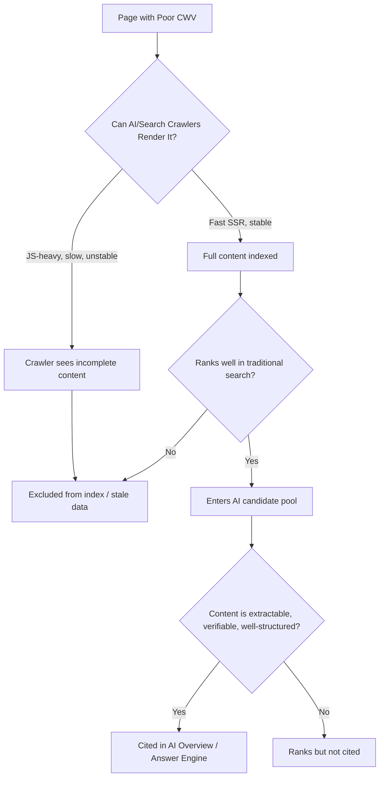

Here's a claim you've probably seen a dozen times this year: "Improve your Core Web Vitals and AI Overviews will start citing you." It sounds tidy. It fits neatly into a LinkedIn carousel. It's also not quite true — and believing it can send you optimizing the wrong layer of your stack while your actual citation problem sits untouched.

The real relationship between site performance and AI visibility is more interesting than either the hype or the dismissal admits. It's indirect, it's structural, and once you understand the mechanism, you'll know exactly where to spend your engineering hours instead of guessing.

## Why This Matters Right Now

Google AI Overviews now show up on somewhere between 47% and 64% of queries, depending on which tracker you trust, up from roughly a quarter of queries at their 2024 launch. When an AI Overview appears, click behavior collapses: only about 8% of users click through to an organic result, compared to 15% on a query without one. That's not a small dent. That's nearly half your potential clicks disappearing before the user ever scrolls.

But there's a twist in the data that changes the whole conversation. Sites that do get cited inside the AI Overview aren't losing out — they're winning bigger than before. Cited brands see roughly 35% more organic clicks and 91% more paid clicks than the site sitting in position one below the AI answer. Citation, in other words, has become the new page one. If you're not inside the box, you're increasingly invisible; if you are, you're capturing disproportionate share of an already-shrunk pie.

So the question isn't "should I care about AI Overviews." You already know the answer. The real question is: what actually gets you cited, and where does site performance fit into that picture?

## The Myth: "Fast Site = More AI Citations"

Let's deal with the uncomfortable part first, because most articles skip it. There is no documented mechanism where ChatGPT, Claude, Perplexity, or Google's AI Overview system reads your LCP score and decides you're more citation-worthy because of it. None of these systems expose Core Web Vitals as a ranking or citation input, and no controlled study has found a direct causal link.

A related myth deserves the same treatment: schema markup as a magic citation switch. In May 2026, Ahrefs published a study tracking 1,885 pages that added JSON-LD schema, checking whether citations moved across Google AI Overviews, Google AI Mode, and ChatGPT. The result: AI Mode and ChatGPT citation changes were statistically indistinguishable from noise, and the AI Overviews figure actually declined. A separate cross-platform empirical study reached a similar conclusion — schema markup does not reliably predict AI citation on its own.

If your technical SEO roadmap this quarter is "add more schema, ship faster Lighthouse scores, wait for citations to roll in," you're optimizing a lever that isn't directly connected to the outcome you want. That doesn't mean the lever is useless. It means it's connected differently than most people assume.

→ Read also: [Technical SEO in 2026: Speed, Vitals & AI Crawlers](/technical-seo-2026-speed-vitals-ai-crawlers/)

## The Real Mechanism: Crawlability → Rankability → Citability

Here's the chain that actually matters, and it's worth internalizing because it reframes everything downstream.

AI Overviews and most AI answer engines don't crawl the open web independently for every query. They pull from an existing index — Google's own index for AI Overviews, and a mix of their own crawlers plus search index data for tools like Perplexity and ChatGPT's browsing mode. Before a page can be cited, it has to be crawled, indexed, and judged rankable by the underlying search system. That's the gate. Core Web Vitals sit squarely inside that gate, not inside the citation decision itself.

Think of it as three layers stacked on top of each other:

**Layer one — can the crawler even see your content?** If your main content depends on heavy client-side JavaScript to render, and your INP or LCP numbers are poor because of it, there's a real risk that crawlers — including newer AI-specific bots like OAI-SearchBot, ClaudeBot, and PerplexityBot — encounter a shell instead of your actual content. Server-side rendered pages with clean, fast-rendering HTML are the most reliably parsed by both traditional and AI crawlers. This is JavaScript SEO 101, except now the audience for your rendered HTML has expanded from "Googlebot" to "half a dozen different bots with different JavaScript execution capabilities and different patience levels."

**Layer two — does your server survive the crawl volume?** One 2026 analysis found ChatGPT's crawler alone made 3.6x more requests than Googlebot on the same site — over 133,000 requests in 55 days. Google's crawl budget allocation in 2026 is dynamic: a fast, stable server gets more crawl activity; a slow or flaky one gets throttled back. If your infrastructure can't handle the combined weight of Googlebot plus four or five AI crawlers politely hammering your site, your crawl demand drops, your index freshness drops, and stale or missing pages simply aren't available to be cited — regardless of how good the content is.

**Layer three — does the page rank well enough to be candidate material?** Roughly 38% of pages cited in AI Overviews also rank in the top 10 for that query. That overlap has actually fallen — it was closer to 76% seven months earlier — meaning AI Overviews are increasingly pulling from a wider pool than just the top organic results. But being in the index and ranking reasonably well is still the baseline pool AI systems draw from. Core Web Vitals are one of the traditional ranking signals inside Google's broader page-experience system, which means poor CWV can knock you out of the candidate pool before AI citation logic ever runs.

Put together: Core Web Vitals don't cause citations. They control whether your content survives the three gates that happen *before* citation logic even gets a chance to evaluate you.



## Practical Implementation: Where to Actually Spend Your Time

Given that chain, here's where the engineering hours should go, roughly in priority order.

**Fix INP before you obsess over LCP.** INP replaced First Input Delay back in March 2024, and a "good" score is under 200 milliseconds. The dominant cause of a bad INP is long JavaScript tasks blocking the main thread — and that code lives in your application, not your server. Break long tasks into chunks under 50ms, yield to the main thread during heavy processing, and defer anything non-critical until after the page is interactive.

```javascript
// Instead of one long blocking task:
function processLargeDataset(items) {
  items.forEach(item => heavyProcessing(item));
}

// Yield to the main thread between chunks:
async function processLargeDatasetChunked(items) {
  const CHUNK_SIZE = 50;
  for (let i = 0; i < items.length; i += CHUNK_SIZE) {
    const chunk = items.slice(i, i + CHUNK_SIZE);
    chunk.forEach(item => heavyProcessing(item));
    await new Promise(resolve => setTimeout(resolve, 0));
  }
}
```

**Move critical content out of client-rendered JavaScript.** If you're on Next.js, Nuxt, or SvelteKit — now the default entry point for most professional web projects — lean on server components and static generation for anything that needs to be crawlable. Reserve client-side rendering for genuinely interactive, below-the-fold UI. This single decision does more for AI crawler visibility than any amount of schema tinkering.

**Give AI crawlers explicit access and monitor them separately.** Check your `robots.txt` and server logs for OAI-SearchBot, ClaudeBot, PerplexityBot, and Google-Extended. Don't assume they're being treated the same as Googlebot by your CDN's bot-management rules — plenty of default configurations rate-limit or block "unknown" bots, which quietly kills your AI visibility while your Google rankings look fine.

```txt
# robots.txt — explicitly allow known AI crawlers
User-agent: OAI-SearchBot
Allow: /

User-agent: ClaudeBot
Allow: /

User-agent: PerplexityBot
Allow: /

User-agent: Google-Extended
Allow: /

Sitemap: https://example.com/sitemap.xml
```

**Then, and only then, layer in structured data and content quality.** Schema still helps crawlers and search engines parse your page correctly, and for pages not yet receiving citations, it may still assist with indexing and understanding — the Ahrefs study specifically measured pages that were already heavily cited, which is a different scenario than a new page trying to get discovered. Once your technical foundation is solid, the actual citation lever is original evidence: first-hand data, expert quotes, clear comparisons, and concise, extractable answers that AI systems can verify against other sources.

→ Read also: [JavaScript SEO in 2026: How AI Crawlers Read React, Next.js, and Astro](/javascript-seo-ai-crawlers-react-nextjs-astro/)

## Common Mistakes and Advanced Tips

The most common mistake right now is treating AI Overview optimization as a separate discipline from technical SEO. It isn't. It's technical SEO with an extra, more demanding layer of crawlers on top, and most of the same fixes apply — they just matter more urgently because a slow or JS-locked page now has to satisfy Googlebot, ChatGPT's crawler, Perplexity's crawler, and Claude's crawler simultaneously, each with slightly different rendering capabilities and patience thresholds.

A second mistake is chasing CTR numbers as your primary KPI. With AI Overview click-through bottoming around 1.3% in December 2025 before recovering to 2.4% by February 2026, organic CTR alone is a noisy, lagging signal. Track AI referral traffic directly instead — filter Google Analytics for sources like `chat.openai.com` and `perplexity.ai`, and supplement it with manual monthly checks of how your brand shows up when you query your own target topics on each platform.

An advanced move worth trying: audit your server logs specifically for AI crawler behavior, the same way you'd audit for Googlebot crawl errors. If ClaudeBot or PerplexityBot is hitting 4xx or 5xx responses on your key pages, or if they're consistently unable to render your JavaScript-dependent sections, you have a concrete, fixable technical problem — one your CWV dashboard won't show you, because CWV measures real user experience, not bot experience.

## Conclusion

Core Web Vitals aren't a citation algorithm input, and treating them like one will leave you frustrated when your Lighthouse score hits 100 and your AI Overview appearances don't move. But dismissing performance work as irrelevant to AI visibility is just as wrong. CWV — especially INP and render-blocking JavaScript — determines whether crawlers can see your content at all, whether your server survives the new multi-bot crawl load, and whether you clear the ranking bar that puts you in the candidate pool AI systems draw citations from. Fix the gate first. Then compete on the evidence, clarity, and verifiability that actually wins the citation itself.

## FAQ

**Do Core Web Vitals directly affect AI Overview citations?**
No documented mechanism shows CWV as a direct citation factor for Google AI Overviews, ChatGPT, Claude, or Perplexity. They matter indirectly, by affecting whether your page gets crawled, indexed, and ranked well enough to enter the candidate pool AI systems cite from.

**Does adding schema markup guarantee more AI citations?**
No. A 2026 Ahrefs study of 1,885 pages found citation changes from adding schema were statistically close to zero for ChatGPT and Google AI Mode, with a measurable decline for AI Overviews on already-heavily-cited pages. Schema still helps with parsing and indexing, especially for new pages, but it's not a standalone citation trigger.

**Which Core Web Vital matters most for AI crawlability?**
INP and LCP tend to matter most, since both are commonly tied to heavy client-side JavaScript that can prevent crawlers from rendering your actual content. Server-side rendered pages with fast, stable HTML are parsed most reliably across both traditional and AI crawlers.

**How do I know if AI crawlers can access my site?**
Check server logs for user agents like OAI-SearchBot, ClaudeBot, PerplexityBot, and Google-Extended, confirm they aren't being blocked or rate-limited by your CDN's bot management rules, and verify your robots.txt explicitly allows them.
