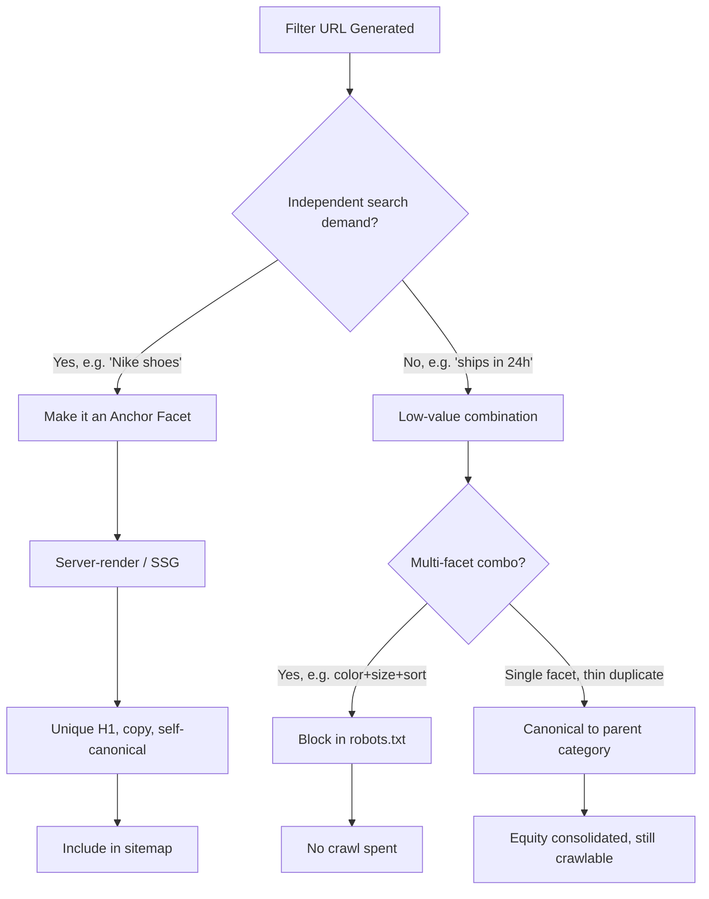

Take one product category. Add five filter types — brand, size, color, price, material — with eight options each. Do the math and you get 32,768 possible URL combinations from a single parent page. Multiply that across forty categories and you've quietly built a website with 1.3 million crawlable URLs, and almost none of them carry unique content or commercial intent.

That's faceted navigation. It's the filter sidebar every ecommerce site needs for users, and it's also the single biggest crawl budget killer in ecommerce SEO. Not GEO, not AI Overviews, not some new algorithm update — filters. The feature that makes your site usable is the same feature that can make it invisible to Google.

## Why This Still Matters in 2026

You'd think crawl budget would be old news by now. It isn't — if anything, it matters more. Google's own data shows that unoptimized sites get only about 40% of their strategic URLs crawled in a given month. That means 60% of your pages — including the new product you just launched — might sit unindexed for weeks while Googlebot burns its visit budget on `?color=red&size=m&sort=price-asc` variations of pages it already knows about.

Here's the part that makes this urgent right now: organic search itself is under pressure. AI Overviews now show up on roughly 65% of commercial queries in the US, and organic click-through rates have dropped 28–34% on informational queries and 12–19% on mid-funnel category pages. Meanwhile, AI-referred traffic to US retail sites grew 393% year over year in Q1 2026. Every crawl Google spends on a junk filter URL is a crawl it isn't spending discovering the pages that could still win organic and AI-referral traffic in a shrinking-click environment.

→ Read also: [Core Web Vitals in the AI Overview Era: What Really Drives Citations](/core-web-vitals-ai-overview-citations-2026/)

Fix crawl waste and you're not chasing a vanity metric. You're protecting the last channel where your product pages have a shot at getting found at all.

## The Anatomy of the Problem

Faceted navigation generates URLs faster than any content team could ever produce pages. A filter combination isn't a page in the editorial sense — nobody wrote unique copy for "Blue Nike Running Shoes Under $100 Sorted by Newest." But to a crawler, if it's a unique URL, it's a page to evaluate, and evaluating it costs budget.

The damage compounds in three ways. First, crawl waste: Googlebot spends time on near-duplicate pages instead of your real inventory. Second, index bloat: thin, near-identical pages dilute topical authority and can trigger algorithmic quality penalties across the site. Third, link equity dilution: internal links pointing at filter URLs instead of canonical category pages spread PageRank across thousands of dead ends instead of concentrating it where it counts.

One documented case makes the scale concrete: an enterprise site blocked 340,000 monthly filter crawls and cut crawl waste by 73%. The payoff wasn't abstract — new product pages started getting indexed within hours instead of weeks. That's the real cost of an unmanaged faceted system: it's not just wasted resource, it's a direct tax on how fast your revenue-generating pages get discovered.

## Three Tools, Three Very Different Jobs

This is where most teams get it wrong — they reach for one tool and expect it to solve all three problems (crawling, indexing, and equity consolidation) at once. It can't. You need to understand what each one actually does.

**Robots.txt disallow** stops the crawl request before it happens. No request, no budget spent. This is the strongest tool for crawl efficiency, but it's blunt: if a blocked URL is linked to from elsewhere, it can still get indexed with no snippet, just a bare URL in the SERP. It also means Googlebot can never read anything inside that page — including a noindex tag.

**Noindex meta tags** live inside the page's HTML. That's the catch: Googlebot has to crawl the page to see the noindex directive, spend the budget, and then discard the result. Noindex controls indexing reliably. It does nothing for crawl budget — arguably it's worse, since you're paying the crawl cost for a page you never wanted indexed in the first place.

**Canonical tags** tell Google which URL is the "real" one and consolidate ranking signals there. Google treats canonical as a hint, not a directive — it usually complies, but not always, especially when the canonical target and the filtered page differ substantially in content. Canonicals are your best tool for link equity consolidation. They do nothing to stop the crawl itself.

The rule that trips people up most: **never combine noindex with a robots.txt disallow on the same URL.** If Googlebot is blocked from crawling, it can't read the noindex tag inside the page — so a URL can stay indexed indefinitely despite your intent, because the directive that would remove it is unreachable.



## How to Actually Implement This

Start by splitting your facets into two buckets: anchor facets and everything else. Anchor facets are combinations with real, measurable search demand — "Nike running shoes," "waterproof hiking boots," "leather office chairs." These deserve to be treated as real landing pages: their own H1, their own product copy, their own self-referencing canonical, and a spot in your XML sitemap. Everything else — sort order, "in stock," multi-facet combinations nobody searches for — should never generate an indexable, crawlable URL in the first place.

A pragmatic Next.js pattern: use route-based static generation for anchor facets, and keep the long tail of ad-hoc combinations behind client-side query parameters that never touch the server render or the sitemap.

```javascript
// middleware.ts — block low-value facet combinations before they consume crawl budget
import { NextResponse } from 'next/server'
import type { NextRequest } from 'next/server'

const ANCHOR_FACETS = new Set(['brand', 'category']) // facets worth indexing individually

export function middleware(request: NextRequest) {
  const { searchParams, pathname } = request.nextUrl
  const params = [...searchParams.keys()]

  // Multi-facet combos (2+ params, or any param outside the anchor list) = crawl trap
  const hasNonAnchorParam = params.some((p) => !ANCHOR_FACETS.has(p))
  const isMultiFacet = params.length > 1

  if (isMultiFacet || hasNonAnchorParam) {
    const response = NextResponse.next()
    response.headers.set('X-Robots-Tag', 'noindex, follow')
    return response
  }

  return NextResponse.next()
}

export const config = {
  matcher: '/category/:path*',
}
```

For the anchor facets you do keep, pair them with `ItemList` and `Product` schema so Google can parse the page's content structure directly:

```json
{
  "@context": "https://schema.org",
  "@type": "ItemList",
  "itemListElement": [
    {
      "@type": "ListItem",
      "position": 1,
      "url": "https://example.com/sneakers/nike-air-zoom"
    },
    {
      "@type": "ListItem",
      "position": 2,
      "url": "https://example.com/sneakers/nike-revolution"
    }
  ]
}
```

Keep the markup honest — it has to match what a visitor actually sees on the page, or Google will simply discard it. And don't attach `Review` or `AggregateRating` schema to an `ItemList`; Google only supports reviews on individual `Product` entities, never on the list itself.

For anything that isn't an anchor facet, prefer AJAX-driven filtering with the History API (`pushState`) over full server-rendered URL changes. The user still gets a shareable-feeling URL and back-button behavior, but you control exactly which states are exposed to crawlers versus kept purely client-side.

→ Read also: [JavaScript SEO in 2026: How AI Crawlers Read React, Next.js, and Astro](/javascript-seo-ai-crawlers-react-nextjs-astro/)

## Common Mistakes (and the Fixes That Actually Work)

The most common mistake is treating this as a one-time cleanup instead of an ongoing system. New filters get added by the product team, new attribute combinations appear, and six months later you're back to crawl waste unless someone owns this as a recurring audit — pull a crawl report monthly and check what percentage of crawled URLs are filter combinations versus real pages.

The second mistake is blocking everything indiscriminately, including the facets that actually have search demand. Before you disallow a filter pattern in robots.txt, check Search Console and your keyword data for whether that specific combination gets searched. "Nike shoes" gets searched. "Nike shoes size 9 blue in stock sorted by price" does not — but teams often can't tell the difference at a glance, so they either over-block valuable pages or under-block junk ones. Pull the actual query data before deciding.

The third mistake, and probably the most damaging, is combining noindex and robots.txt disallow on the same URL pattern — covered above, but worth repeating because it's the single most common technical error in faceted navigation audits. If you're not sure whether a URL is currently blocked, crawled, or both, check it directly in Search Console's URL Inspection tool before assuming your directive is working.

Finally, don't forget internal linking hygiene. If your main navigation, breadcrumbs, or related-product modules link to filtered URLs instead of the clean category page, you're actively feeding the crawl trap you just tried to close off. Audit where your internal links actually point, not just where your indexing rules say they should.

## Conclusion

Faceted navigation SEO isn't glamorous. It won't get you a blog post about beating some flashy new AI Overview feature. But in an environment where organic clicks are already shrinking, wasting crawl budget on `?sort=price-desc&color=red` combinations is one of the most fixable, highest-leverage technical SEO problems an ecommerce site can have. Split your facets into anchors worth indexing and noise worth blocking. Pick the right tool for each job — robots.txt for crawl prevention, noindex for indexing control, canonical for equity consolidation — and never stack noindex behind a disallow. Do that, and your next product launch gets found in hours, not weeks.

## FAQ

**Does faceted navigation always hurt SEO?**
No. Faceted navigation only hurts SEO when it's unmanaged — when every filter combination generates an indexable, crawlable URL with duplicate content. Managed correctly, with anchor facets indexed deliberately and the rest blocked or canonicalized, filters can add organic visibility instead of draining it.

**Should I noindex or block filter pages in robots.txt?**
For high-volume, low-demand combinations, robots.txt disallow is generally the better default in 2026 because it prevents the crawl from happening at all. Reserve noindex for cases where you need Google to actually crawl and evaluate the page first — for example, temporarily deindexing a facet you previously allowed.

**How do I know which facet combinations deserve their own indexable page?**
Check Search Console query data and standard keyword research for the combination. If people actually search for it — "waterproof hiking boots," "Nike size 9" — it's a candidate. If the combination only exists because your filter UI allows it, it isn't.

---

Sources:

- [Ecommerce faceted navigation: SEO best practices to avoid Crawl/Index bloat](https://resignal.com/blog/seo-friendly-faceted-navigation-to-avoid-crawl-efficiency-or-creating-index-bloat/)
- [Faceted navigation in SEO: Best practices to avoid issues](https://searchengineland.com/guide/faceted-navigation)
- [Faceted Navigation Indexation: SEO Decision Matrix](https://www.digitalapplied.com/blog/faceted-navigation-indexation-2026-seo-decision-matrix)
- [Faceted Navigation Crawl Budget: 2026 Fixes](https://seoengico.com/blog/faceted-navigation-pagination-crawl-budget-2026)
- [Faceted Navigation SEO: Index, Noindex or Canonical Guide](https://www.get-ryze.ai/blog/faceted-navigation-seo-for-ecommerce-index-noindex-or-canonical)
- [Top 10 Ecommerce SEO Trends for 2026 — SeoProfy](https://seoprofy.com/blog/ecommerce-seo-trends/)
- [8 Ecommerce SEO Trends for 2026 — 12AM Agency](https://12amagency.com/blog/ecommerce-seo-trends/)
- [Crawl Budget Optimization for Large E-Commerce Sites — HigherVisibility](https://www.highervisibility.com/seo/learn/crawl-budget-wins-for-large-e-commerce-sites/)
- [Managing Crawl Budget for Ecommerce Sites: The 2026 Technical Guide](https://jaydeepharia.com/managing-crawl-budget-for-ecommerce-sites/)
- [ItemList Schema Guide — Rank Math](https://rankmath.com/kb/itemlist-schema/)
- [Faceted Navigation for eCommerce Websites: Guide for SEOs](https://www.goinflow.com/blog/ecommerce-faceted-navigation-seo/)
