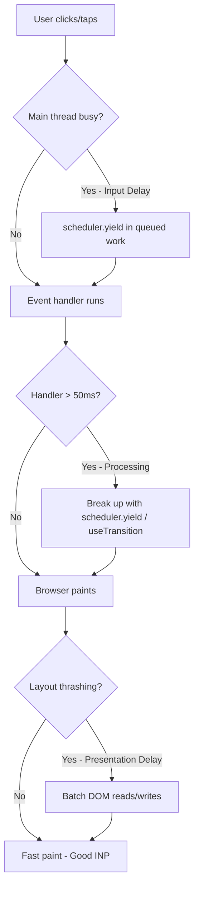

Your LCP is green. Your CLS is green. PageSpeed Insights gives you a smug 96 out of 100. And yet somewhere, a real user just tapped your "Add to Cart" button and waited. Not long — maybe 300, 400 milliseconds — but long enough to feel it. That's INP, and it's quietly become the metric that separates sites that merely load fast from sites that actually *feel* fast.

Here's the thing about Interaction to Next Paint: it doesn't care how pretty your Lighthouse report looks on page load. It cares about the exact moment a person clicks, taps, or types, and how long your JavaScript makes them wait before the screen responds. That's a much harder problem than shipping a fast first paint, and in 2026 it's the metric most teams still get wrong — not because they don't know it exists, but because fixing it requires touching code, not just config.

## Why INP Deserves Your Attention Right Now

INP replaced First Input Delay as an official Core Web Vital back in March 2024, and by now the excuse of "we didn't know it was a ranking signal" has expired. What's changed heading into 2026 is the measurement itself: Google tightened the methodology behind the Core Web Vitals update to better capture *sustained* interaction latency, not just the first tap on a page. In other words, it's no longer enough to be snappy once — you have to stay snappy across the whole session.

The field data tells an interesting story. As of the May 2026 Chrome UX Report release, roughly 86.6% of origins pass INP individually, which actually makes it the strongest-performing of the three Core Web Vitals on its own — ahead of LCP (68.6%) and CLS (81.3%). Sounds reassuring, until you look at the combined number: only 55.9% of tracked origins pass all three vitals at the same time. INP isn't the worst offender in isolation, but it's frequently the metric that quietly drags down an otherwise-good page, especially on interaction-heavy templates like product filters, checkout flows, and search-as-you-type.

And this matters for more than rankings. Google's own Web Vitals team found that improving INP from around 500ms down to 200ms correlates with up to a 22% improvement in user engagement. That's not an SEO abstraction — that's cart abandonment, bounce rate, and time-on-site, all moving because a page stopped making people wait.

→ Read also: [Core Web Vitals in the AI Overview Era: What Really Drives Citations](/core-web-vitals-ai-overview-citations-2026/)

## What Actually Causes Bad INP

INP isn't one number — it's three phases stacked together, and knowing which one is broken tells you exactly what to fix.

**Input delay** is the gap between the click and your code even starting to respond. This is almost always caused by the main thread being busy with something else — a long task that started before the user interacted, and hasn't finished yet. **Processing time** is your actual event handler doing its work: state updates, re-renders, DOM manipulation, whatever runs inside your `onClick`. **Presentation delay** is the tail end — the browser painting the new frame, which balloons when you're forcing large layout recalculations or animating expensive properties.

In practice, the biggest villain is almost always the same one: a long task. Any chunk of JavaScript that monopolizes the main thread for more than 50ms blocks everything else — including the browser's ability to respond to input — until it's done. The HTTP Archive's own analysis keeps landing on the same culprit year after year: third-party scripts are the single biggest contributor to poor INP. Tag managers with fifteen-plus tags loaded, A/B testing tools like Optimizely or VWO injecting synchronous scripts, chat widgets that hijack the main thread on init — these are rarely things your own team wrote, which is exactly why they're so easy to overlook during a code review.

The fix isn't "write less JavaScript" in some vague sense. It's "stop letting any single piece of JavaScript hold the main thread hostage." That's a scheduling problem, and 2026 finally gave developers real tools to solve it properly.

## The 2026 Fix Toolkit

### scheduler.yield() — breaking tasks on purpose

`scheduler.yield()` shipped stable in Chrome 129 back in September 2024, and by 2026 it's supported in Chrome, Edge, and Firefox 142+ — global browser support sits around 71.5%, with Safari still holding out, so you'll want a `setTimeout` fallback via feature detection. What makes it better than the old `setTimeout(fn, 0)` trick is priority: `scheduler.yield()` pauses your task, lets the browser handle anything urgent (like the click that's waiting), and then resumes your code at the *front* of the queue — not behind whatever other script happened to schedule itself in the meantime.

```js
async function processLargeDataset(items) {
  for (const item of items) {
    doExpensiveWork(item);

    // Yield periodically so the browser can respond
    // to pending clicks, taps, or keystrokes.
    if ('scheduler' in window && 'yield' in scheduler) {
      await scheduler.yield();
    } else {
      await new Promise((resolve) => setTimeout(resolve, 0));
    }
  }
}
```

Drop this into anything that loops over large arrays inside an event handler — filtering a product list, re-sorting a table, running client-side search — and you turn one 400ms long task into a series of sub-50ms chunks the browser can interleave with actual user input.

### React 19: useTransition and useDeferredValue

If you're on React 19, concurrent rendering is no longer opt-in — it's the default, and the scheduler already slices rendering work into roughly 5ms chunks so long renders don't block input. But automatic slicing only helps so much; you still need to tell React which updates are urgent and which can wait. `useTransition` marks a state update as non-blocking, so typing in a filter box stays instant even while the filtered results underneath are still being computed.

```jsx
function ProductFilter({ products }) {
  const [query, setQuery] = useState('');
  const [isPending, startTransition] = useTransition();
  const [filtered, setFiltered] = useState(products);

  function handleChange(e) {
    setQuery(e.target.value); // urgent — keep the input responsive
    startTransition(() => {
      setFiltered(products.filter((p) => p.name.includes(e.target.value)));
    });
  }

  return (
    <>
      <input value={query} onChange={handleChange} />
      {isPending && <span className="opacity-50">Updating…</span>}
      <ProductList items={filtered} />
    </>
  );
}
```

One real-world measurement worth internalizing: a team testing an onboarding "Next" button on a mid-range Android device measured 180ms of input delay without `useTransition` — largely gone once the step-content render was deferred and the click itself was allowed to resolve first. That's the difference between a page that feels instant and one that feels like it's thinking about it.

### Isolating the third-party mess

Since third-party scripts are the recurring offender, the fix is architectural, not just code-level. If you're on Next.js, the `@next/third-parties` package (built by the Chrome team in collaboration with Vercel) gives you pre-optimized loaders for Google Tag Manager, Google Analytics, and YouTube embeds that load with the right priority and strategy out of the box, instead of however your marketing team's copy-pasted snippet decided to load. For anything else — chat widgets, ad tech, consent banners — moving the script into a web worker via Partytown keeps it off the main thread entirely, which is the only reliable way to stop scripts you don't control from wrecking a metric you're accountable for.

```js
// next.config.js
const withThirdParties = require('@next/third-parties');

module.exports = {
  // ...
};
```

```jsx
// In your layout or page
import { GoogleTagManager } from '@next/third-parties/google';

export default function Layout({ children }) {
  return (
    <>
      <GoogleTagManager gtmId="GTM-XXXXXXX" />
      {children}
    </>
  );
}
```

→ Read also: [JavaScript SEO in 2026: How AI Crawlers Read React, Next.js, and Astro](/javascript-seo-ai-crawlers-react-nextjs-astro/)

## A Practical INP Audit Workflow

You don't need to guess where the problem is. Run this sequence and you'll usually find the culprit within an hour:

1. **Pull field data first.** Open Chrome DevTools → Performance Insights, or check your site in PageSpeed Insights and look at the CrUX field data tab, not just the lab score. Field data tells you what real users on real devices actually experienced — lab tests on your dev machine will lie to you every time.
2. **Record a real interaction.** Use the Performance panel, hit record, and click through the exact flow users complain about — filtering, adding to cart, opening a modal. Look for red-flagged long tasks on the timeline.
3. **Identify the phase.** Click into the long task and check whether the time is spent in input delay (something else was already running), processing (your handler is slow), or presentation (the paint itself is expensive, often due to layout thrashing).
4. **Attribute it.** DevTools will show you the script URL. If it's a `gtm.js` or `optimizely.js` file, you've found a third-party problem. If it's your own bundle, you've found a scheduling problem.
5. **Fix and re-measure.** Apply `scheduler.yield()`, `useTransition`, or script isolation depending on what step 4 told you — then record the same interaction again and confirm the long task actually shrank.

This loop matters more than any single trick, because INP problems are rarely the same twice. A media site's worst offender is usually an ad network. An e-commerce site's is usually a filter re-render. A SaaS dashboard's is usually a chart library recalculating on every keystroke. Guessing wastes a sprint; profiling takes twenty minutes.



## Common Mistakes and Advanced Tips

The most common mistake isn't technical — it's optimizing for the wrong device. Your M-series MacBook will never surface an INP problem that a customer on a three-year-old Android phone hits constantly. Throttle your CPU in DevTools (4x or 6x slowdown) before you trust a "looks fine to me" verdict.

The second mistake is treating `scheduler.yield()` as a universal fix and sprinkling it everywhere. Yielding too aggressively adds overhead and can actually slow down work that didn't need to be interrupted. Reserve it for loops and computations that genuinely run long enough to risk blocking input — profile first, yield second.

The third, and probably the most expensive one, is ignoring the specific tag manager audit. Teams love to blame their own framework choice when a bloated GTM container with fifteen untested tags is doing the real damage. Before you refactor a single React component, export your GTM container and count how many tags are firing synchronously on every page. It's often a five-minute fix disguised as a two-week refactor.

For advanced setups, pair `scheduler.yield()` with the `postTask` API for genuinely prioritized scheduling — background prefetching and analytics beacons can run at `background` priority while user-facing updates stay at `user-blocking`, which the browser then respects when deciding what to run first.

## FAQ

**Does INP affect SEO rankings directly?**
Yes — INP is one of the three Core Web Vitals used as a page experience signal in Google Search, alongside LCP and CLS. It doesn't override content relevance, but among comparable pages it can be a tie-breaker, and it directly affects conversion and engagement regardless of ranking impact.

**What's a "good" INP score in 2026?**
Under 200ms is good, 200–500ms needs improvement, and anything above 500ms is considered poor. Google measures this at the 75th percentile of real user visits, so a handful of fast sessions won't rescue a page with a heavy long tail of slow interactions.

**Is scheduler.yield() safe to ship today given the browser support gap?**
Yes, as long as you feature-detect and fall back to `setTimeout(fn, 0)` for Safari. Users on unsupported browsers simply get the older, slightly less efficient yielding behavior — nobody's experience gets worse, some just don't get the full improvement yet.

**Can I fix INP without touching my third-party scripts?**
Sometimes, if your own code is the bottleneck. But given that third-party scripts are consistently the largest contributor to INP problems across the web, skipping that audit means you're very likely optimizing around the real problem instead of fixing it.

## Conclusion

INP optimization in 2026 isn't about chasing one silver-bullet API — it's about understanding that responsiveness is a scheduling discipline, not a one-time optimization pass. `scheduler.yield()` gives you fine-grained control over your own long tasks. React 19's `useTransition` lets you tell the framework what's urgent. And an honest audit of your third-party scripts will probably surface the biggest win of all, sitting in a tag manager container nobody's opened in months.

None of this requires a rewrite. It requires picking the one interaction your users complain about most, profiling it for real, and fixing the specific phase that's actually broken. Do that once, measure the field data a few weeks later, and you'll have a much more convincing answer than "the score looks better" — you'll have users who stopped noticing the wait, because it isn't there anymore.

→ Read also: [Technical SEO in 2026: Speed, Vitals & AI Crawlers](/technical-seo-2026-speed-vitals-ai-crawlers/)
