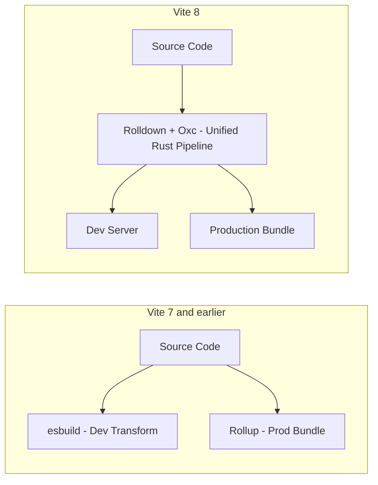

Your production build just went from 46 seconds to 6 seconds. No new hardware, no CI upgrade, no rewritten config — just a version bump. That's not a hypothetical. It's what Linear reported after moving to Rolldown, the Rust-based bundler now baked into Vite 8. If you're still running Vite 7 with the old Rollup pipeline, you're leaving real time on the table every single deploy.

Vite 8 went stable on March 12, 2026, and it's arguably the biggest architectural shift the project has made since Vite 2. For years, Vite ran on two separate bundlers stitched together: esbuild for the instant dev server, Rollup for the "real" production build. That split worked, but it also meant two transformation pipelines, two sets of edge cases, and a growing pile of glue code to keep them behaving the same way. Vite 8 collapses all of that into one Rust-powered engine. If you care about developer experience, CI costs, or just not staring at a spinning terminal before every deploy, this is worth your attention.

## Why This Isn't Just Another Version Bump

Most major-version releases in the JavaScript tooling world are incremental: a few deprecated APIs, a Node version bump, maybe a new config flag. Vite 8 is different because it changes what's actually running under the hood.

Rolldown, built by the VoidZero team (the same group behind Oxc, the Rust-based JS/TS compiler), was designed with one explicit goal: replicate Rollup's plugin API and mental model, but compile-native. In the team's own 19,000-module benchmark, a build that took Rollup 40.10 seconds finished in 1.61 seconds — roughly a 25x jump. That's not a synthetic number cherry-picked for a blog post either; it lines up with what companies reported during the beta:

- **Linear** — production builds dropped from 46s to 6s
- **Ramp** — 57% build time reduction
- **Mercedes-Benz.io** — up to 38% build time reduction
- **Beehiiv** — 64% build time reduction

Here's the pattern worth internalizing: gains scale with project size. A small side project might see a modest 2-5x speedup. A large monorepo with hundreds of modules is where the 10-30x numbers show up, because Rolldown is multi-threaded and compiled, while Rollup's JavaScript implementation runs single-threaded. More modules mean more parallelizable work, and that's exactly where Rust starts to pull away.

→ Read also: [The Developer Tools That Matter in 2026: Beyond the Hype](/2026-04-11--developer-tools-beyond-hype/)

## What Actually Changes Under the Hood

Before Vite 8, the architecture looked like this: esbuild pre-bundled your dependencies and handled dev-time transforms, Rollup took over for the production bundle and code splitting. Two engines, two configuration surfaces, two sets of quirks to remember.

With Vite 8, that diagram simplifies. Rolldown handles both dependency optimization and production bundling, while Oxc (the Rust-based parser, transformer, and linter also from VoidZero) handles the compilation layer. Vite becomes the orchestration layer sitting on top of a toolchain where the build tool, the bundler, and the compiler are developed in close coordination — which matters more than it sounds, because it means fewer "works in dev, breaks in prod" surprises caused by two engines disagreeing about how a module should be handled.

A few concrete additions came along with the rewrite:

- **Built-in tsconfig `paths` support** — no more needing `vite-tsconfig-paths` for basic path alias resolution (there's a small performance cost, so it's opt-in via `resolve.tsconfigPaths`).
- **Native `emitDecoratorMetadata` support** — useful if you're on NestJS, TypeORM, or anything leaning on decorator-based metadata, without pulling in an external plugin.
- **WASM SSR support** — `.wasm?init` imports now work during server-side rendering, not just in the browser.
- **Browser console forwarding** — client-side runtime errors get piped back into your terminal automatically when the tool detects you're working alongside a coding agent, which is a small but genuinely useful nod to how a lot of teams build in 2026.

## The Part That Actually Matters: Will Your Plugins Break?

This is the question every team asks before touching the `package.json` version number, and it's the right one to ask. The honest answer: probably not, but check anyway.

Rolldown's plugin interface is built to be near-identical to Rollup's. Vite's own team confirms that most existing Vite plugins work with Vite 8 without any changes, because the plugin API surface — hooks like `resolveId`, `transform`, `load` — carried over intentionally. That's not an accident; it's the entire reason Rolldown adopted Rollup's plugin design instead of inventing its own.

Where things get more interesting is with plugins that reach past the public API into Rollup's internal implementation details, or plugins built specifically around esbuild's transform pipeline. If a plugin calls `transformWithEsbuild`, esbuild is now an optional peer dependency you'll need to install manually — the recommended path forward is switching to the new `transformWithOxc` function instead. Vite still auto-converts `optimizeDeps.esbuildOptions` to the Rolldown equivalent for backward compatibility, but that shim is already flagged for eventual removal, so don't build new config around it.

Here's a rundown of what to actually check before you upgrade:

**Plugins that should just work:**
- Standard Rollup-API plugins (`@rollup/plugin-node-resolve`, `@rollup/plugin-commonjs`, and most community plugins built against the documented hooks)
- Framework plugins that have been tested against `rolldown-vite` — SvelteKit, React Router, Storybook, Astro, and Nuxt teams all tested early and fed fixes back upstream

**Plugins worth double-checking:**
- Anything using `transformWithEsbuild` directly
- Plugins depending on Rollup's internal, undocumented behavior (rare, but they exist)
- Custom build scripts that assume a single combined output pass — Rolldown generates each output separately rather than all at once, which is a subtle behavioral difference from Rollup if your plugin logic depends on cross-output state

**Also worth knowing:**
- Rolldown ships built-in native replacements for common ecosystem plugins, like a native `replacePlugin`, so you may be able to delete a JS dependency entirely once you check the docs
- Plugins that declare filters (matching specific `id`, `code`, or `moduleType` patterns) skip the Rust-to-JS bridge entirely when they don't match, so a well-written plugin barely taxes build time even at scale

## How to Actually Migrate (Without Breaking Your CI Pipeline)

Vite's own team recommends two paths depending on project size, and the distinction is worth respecting rather than skipping.

**Path 1 — Direct upgrade (small to medium projects).** Bump `vite` to `^8` in `package.json`, run your usual dev and build commands, and see what happens. Vite ships a compatibility layer that auto-converts existing `esbuild` and `rollupOptions` configuration into their Rolldown and Oxc equivalents, so a large share of projects will work with zero config changes.

**Path 2 — Gradual migration (larger or more complex codebases).** Before jumping straight to Vite 8, switch to the standalone `rolldown-vite` package while staying on Vite 7. This isolates whether a problem comes from the Rolldown swap specifically, or from an unrelated Vite 8 change. Once that's stable, upgrade to Vite 8 proper.

A practical checklist for the migration itself:

1. **Confirm your Node version.** Vite 8 requires Node 20.19+ or 22.12+ — the same floor as Vite 7, but worth confirming your CI runners match, since Vite 8 is ESM-only and relies on `require(esm)` support.
2. **Run a build on a branch first.** Don't merge straight to main. Diff the output bundle size and chunk structure against your current production build.
3. **Check `@vitejs/plugin-react`.** If you're on React, note that v6 uses Oxc for the React Refresh transform and drops Babel as a dependency — smaller install size, but if you rely on custom Babel plugins for JSX transforms, that's a compatibility point to verify. The good news: v5 still works fine with Vite 8, so you can upgrade in two separate steps.
4. **Budget for install size.** Vite 8 is roughly 15 MB larger than Vite 7 — about 10 MB from `lightningcss` (now a default dependency instead of optional) and 5 MB from the Rolldown binary itself. Irrelevant for most teams, but worth knowing if you're tracking Docker image size or serverless bundle limits.
5. **Re-benchmark, don't assume.** Run your actual production build twice — before and after — and record the wall-clock time. Teams that skip this step tend to undersell the win internally, and it's genuinely useful ammunition when you're asking for time to do the migration properly.

→ Read also: [INP Optimization 2026: The Developer's Guide to Fixing It](/inp-optimization-2026-developer-guide/)

## Where This Fits Against Turbopack and Rspack

No serious 2026 build-tool conversation skips this comparison, so let's be direct about it. Turbopack is Next.js's own bundler and the path of least resistance if you're already deep in the Next.js ecosystem — it passed all of Next.js's integration tests and became the default for `next dev`, but its production build path is still not considered fully stable, which matters if you're weighing a migration today rather than in six months. Rspack targets teams migrating off legacy Webpack configs, prioritizing drop-in compatibility with the Webpack plugin ecosystem over a from-scratch plugin model. Rolldown, by contrast, is framework-agnostic on purpose — it's the engine Vite is standardizing on, but it's also usable directly if you're building your own tooling.

The practical takeaway: if your stack is Vite-based (Vue, Astro, SvelteKit, React outside of Next.js, SolidJS), Vite 8 is not really an optional upgrade path — it's where the entire ecosystem is heading over the next six to twelve months as frameworks ship Rolldown-backed builds by default. If you're on Next.js specifically, keep watching Turbopack's production stability updates before jumping.

## Common Mistakes Teams Make During the Migration

**Upgrading without reading the plugin list first.** Skim through your `package.json` dependencies before you touch the version number. A five-minute audit of which plugins you actually use against the known compatibility notes saves an afternoon of confused debugging later.

**Ignoring the install size bump in size-constrained environments.** If you're deploying to a serverless function with a tight package size limit, the extra ~15 MB is worth checking against your budget before you're surprised by a failed deploy.

**Skipping the gradual path on large monorepos.** The temptation to just bump the version and see what happens is real, but on a codebase with dozens of internal packages and custom build scripts, isolating the Rolldown change from other Vite 8 changes will save you real debugging time.

**Not re-testing SSR and WASM-adjacent code paths.** If your app touches `.wasm?init` imports or has custom SSR logic, this is genuinely new territory (SSR support for WASM imports is a new feature, not a carryover), so don't assume prior behavior holds.

**Forgetting to check `optimizeDeps.esbuildOptions` usage.** It still works through automatic conversion today, but it's already flagged for removal. Migrating this now, while the interim compatibility shim exists, is cheaper than doing it later under deadline pressure.

## Frequently Asked Questions

**Do I need to rewrite my Vite config to upgrade?**
For most projects, no. Vite 8 includes a compatibility layer that auto-converts existing `esbuild` and `rollupOptions` settings into their Rolldown and Oxc equivalents. Larger or more customized configs are more likely to need small tweaks.

**Will my Rollup plugins stop working?**
Almost certainly not, for anything built against the documented plugin API. Rolldown intentionally mirrors Rollup's plugin interface. The exceptions are plugins reaching into Rollup's internal implementation details or relying specifically on esbuild's transform pipeline.

**Is Rolldown actually stable, or still experimental?**
Rolldown hit its 1.0 stable release on May 7, 2026, with a locked API and backward-compatibility guarantees, ahead of Vite 8's own stable release in March. Both are considered production-ready as of this writing.

**Should I wait for Turbopack instead if I'm on Next.js?**
If you're specifically on Next.js, it's reasonable to wait and watch — Turbopack passed Next.js's integration test suite and is the default dev bundler, but its production build path isn't yet stable enough to fully recommend. For any Vite-based framework, there's no equivalent reason to wait.

**What's the realistic build-time improvement I should expect?**
It depends heavily on project size. Small projects: expect a modest 2-5x speedup. Large codebases with hundreds of modules: the 10-30x range reported by the Vite team and companies like Linear and Beehiiv becomes realistic, because Rolldown's multi-threaded architecture has more work to parallelize.

## Conclusion

Vite 8 and Rolldown aren't a speculative bet on unproven tech — this is a stable release, backed by a year of public beta testing across major frameworks, with real production numbers from teams like Linear and Ramp to back up the marketing claims. If you're maintaining a Vite-based project of any real size, the question isn't really whether to migrate to Vite 8, it's when, and whether you take the direct path or the gradual one. Given how compatible the plugin ecosystem has turned out to be, for most teams the honest answer is: check your Node version, audit your plugin list, and just try it on a branch this week. Worst case, you learn something. Best case, your CI bill and your patience both get noticeably lighter.

→ Read also: [JavaScript SEO in 2026: How AI Crawlers Read React, Next.js, and Astro](/javascript-seo-ai-crawlers-react-nextjs-astro/)
