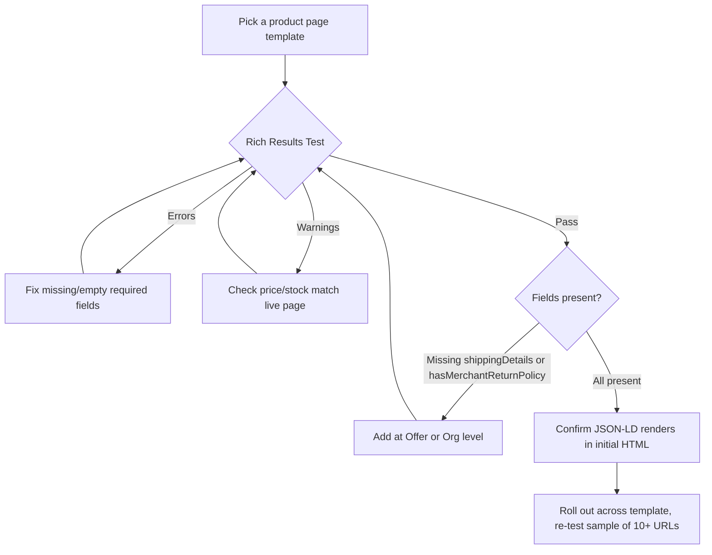

If your product pages lost their star ratings or price snippets sometime this year and you never touched the schema, you're not imagining things. Google didn't announce a big, headline-grabbing "Product Schema Update" — it just quietly moved three fields from "recommended" to what amounts to "required," and let the March 2026 core update clean house on everything that was gaming the old rules.

Here's the uncomfortable part: most of the schema guides still circulating online were written before that shift. They'll tell you `price`, `priceCurrency`, and `availability` are enough. In 2026, that's the bare minimum to avoid a hard error — not what actually earns you a rich result on a competitive shopping query.

## Why Product Schema Got a Lot More Complicated This Year

For years, product structured data was a "set it and forget it" checkbox. You added `name`, `image`, `offers`, maybe an `aggregateRating` if you were feeling ambitious, validated it in Rich Results Test, and moved on. That era is over, and it's over for a specific reason: Google spent 2024 and 2025 watching thousands of sites mark up reviews, FAQs, and ratings that had nothing to do with what was actually on the page.

The March 2026 core update was the correction. Rich result impressions for FAQ, Review, and How-To markup on non-primary content pages dropped roughly in half compared to the post-2023 baseline — and that's on top of the August 2023 restriction that had already limited FAQ rich results to a narrow set of authoritative government and health sites. If you were still leaning on FAQ schema for visibility on a blog post or category page, that lever is mostly gone now.

Product schema itself wasn't gutted the same way, because it maps to something Google can actually verify against your live page and your Merchant Center feed: a real price, real stock status, a real return window. That verifiability is exactly why Google leaned harder into it instead of pulling back. The fields that survived scrutiny got stricter, not looser.

## The Fields Google Quietly Made "Effectively Required"

Nothing in the schema.org spec technically changed — `Offers` still lists `shippingDetails` and `hasMerchantReturnPolicy` as optional properties. But eligibility for shopping rich results in 2026 doesn't run on the spec, it runs on what Google's parser actually rewards, and three fields crossed that line this year.

**Shipping details.** `OfferShippingDetails` — carrier, transit time, shipping cost, and delivery destination — is now expected alongside price and availability. Leave it out and your listing can still validate cleanly while quietly losing the shipping badge that competitors with it show up with in Shopping results.

**Merchant return policy.** This is the one catching the most stores off guard. `hasMerchantReturnPolicy` needs `returnPolicyCountry` (an ISO 3166 country code) and `returnPolicyCategory` (a schema.org URL like `MerchantReturnFiniteReturnWindow`) — both of which Google treats as required in practice even though only `returnPolicyCategory` is formally required by schema.org. Google also recommends `merchantReturnDays`, `returnMethod`, `returnFees`, and `itemCondition`, using schema.org enumeration URLs rather than plain text strings.

**Price validity.** `priceValidUntil` was always nice-to-have. In 2026 it's the difference between Google trusting your price enough to show it and quietly suppressing the rich result because it can't confirm the price is current.

Here's a JSON-LD block that reflects where the bar actually sits right now:

```json
{
  "@context": "https://schema.org",
  "@type": "Product",
  "name": "Trail Runner Hiking Boots — Men's",
  "image": [
    "https://example.com/images/trail-runner-boots-1.jpg",
    "https://example.com/images/trail-runner-boots-2.jpg"
  ],
  "description": "Waterproof trail running boots with Vibram outsole, built for multi-day hikes.",
  "sku": "TRB-2026-MEN-42",
  "brand": {
    "@type": "Brand",
    "name": "Sewwa Outdoor"
  },
  "offers": {
    "@type": "Offer",
    "url": "https://example.com/products/trail-runner-boots",
    "priceCurrency": "USD",
    "price": "129.00",
    "priceValidUntil": "2026-12-31",
    "availability": "https://schema.org/InStock",
    "itemCondition": "https://schema.org/NewCondition",
    "shippingDetails": {
      "@type": "OfferShippingDetails",
      "shippingRate": {
        "@type": "MonetaryAmount",
        "value": "0",
        "currency": "USD"
      },
      "shippingDestination": {
        "@type": "DefinedRegion",
        "addressCountry": "US"
      },
      "deliveryTime": {
        "@type": "ShippingDeliveryTime",
        "handlingTime": { "@type": "QuantitativeValue", "minValue": 0, "maxValue": 1 },
        "transitTime": { "@type": "QuantitativeValue", "minValue": 2, "maxValue": 5 }
      }
    },
    "hasMerchantReturnPolicy": {
      "@type": "MerchantReturnPolicy",
      "applicableCountry": "US",
      "returnPolicyCountry": "US",
      "returnPolicyCategory": "https://schema.org/MerchantReturnFiniteReturnWindow",
      "merchantReturnDays": 30,
      "returnMethod": "https://schema.org/ReturnByMail",
      "returnFees": "https://schema.org/FreeReturn"
    }
  },
  "aggregateRating": {
    "@type": "AggregateRating",
    "ratingValue": "4.6",
    "bestRating": "5",
    "worstRating": "1",
    "ratingCount": "214"
  }
}
```

Note the `itemCondition` field too — it's a small addition, but Google increasingly uses it to disambiguate new versus refurbished listings in Shopping, and leaving it out defaults you into a bucket you may not want.

## Review Schema and the New Rules for Ratings

If your `aggregateRating` block used to show stars with a handful of reviews, check it again — the practical threshold for star display has crept up to roughly 10 ratings for most product categories. Below that, Google will often accept the markup without throwing an error, but it just won't render the stars, which is a quieter failure mode than a validation warning and easy to miss unless you're actually checking the live SERP.

The bigger change is behavioral, not technical. Google's April 2026 review policy update explicitly bans review quotas, directing staff to solicit reviews under a named employee, and — the one that catches ecommerce teams — "self-serving reviews," where a business marks up its own first-party testimonials as if they were independently verified `Review` schema. If your `aggregateRating` is pulling from a widget that quietly includes internal QA notes or seeded launch reviews, that's exactly the pattern getting flagged now. The fix isn't clever markup, it's making sure the reviews behind the schema are the same reviews a shopper would actually find if they went looking.

→ Read also: [Faceted Navigation SEO 2026: Stop Killing Your Crawl Budget](/faceted-navigation-seo-2026-crawl-budget-ecommerce/)

## Why This Still Matters When AI Overviews Are Eating the Click

It's fair to ask whether chasing rich-result eligibility is worth the engineering time when a growing share of shopping-adjacent queries get answered inside an AI Overview before anyone reaches your site. But that's actually the strongest argument for getting product schema right, not the weakest one.

Gemini-powered AI Mode leans on structured data to verify claims, resolve entity relationships, and judge source credibility before it decides what to cite. A product page with accurate, current, verifiable `Offers` and `MerchantReturnPolicy` data reads as trustworthy to that system in a way that a page with stale or missing schema doesn't — even when no traditional rich result ever shows up in the classic SERP. Structured data was never a ranking factor by itself, but it's becoming the trust signal that decides whether an AI answer engine treats your product as a citable source or skips it for a competitor's listing. That's the same dynamic playing out across → Read also: [The Technical SEO Playbook for AEO: Why AI Crawlers Can't Read Your Best Content (2026)](/technical-seo-playbook-ai-crawlers-aeo-2026/) — schema is doing double duty now, feeding both the classic rich-result pipeline and the newer citation pipeline at once.

## How to Implement This Without Breaking Your Rich Results

Start with an audit, not a rewrite. Pull a sample of product URLs across your catalog — ideally one per template variant, since a single broken component can silently affect thousands of pages — and run them through Google's Rich Results Test and the schema markup validator. You're checking for three things: fields that are missing entirely, fields present but empty because a template renders blank on out-of-stock items, and fields that don't match what's actually visible on the page.

That last one is the mistake that costs the most in practice. If your markup says `"availability": "https://schema.org/InStock"` but the visible page shows "Out of Stock," or the schema price is $10 lower than what's on the page because a promotional price didn't sync back to the structured data, Google treats that mismatch as a trust violation and can drop the listing's eligibility outright — not just for that one field, but for the whole rich result. Ratings, stock status, and currency all need to match what a shopper actually sees, every time, which means schema generation has to be wired into the same data source as the page itself, not maintained as a separate static block that someone updates manually during a sale.

For the return policy field specifically, don't hand-write it per product. Set `hasMerchantReturnPolicy` once at the `Organization` or `OnlineStore` level as your default policy, then override at the offer level only for genuine exceptions — final-sale items, made-to-order products, anything with a shorter or different window. And make sure the JSON-LD numbers match your human-readable return policy page word for word; Google checks for that consistency, and a mismatch there generates warnings even when the schema itself validates.

One more implementation detail that trips up a surprising number of otherwise solid ecommerce sites: markup belongs in the initial HTML response, not injected client-side after hydration. If your product schema is rendered by a JavaScript component that mounts after the initial paint, you're depending on Google's renderer picking it up on a second pass — which happens, but adds latency and risk to a signal you want read reliably every crawl.



## Common Mistakes That Kill Rich Result Eligibility

The most frequent failure isn't exotic — it's a template that renders an empty `price` or `image` field for a subset of products, usually ones that are out of stock, bundled, or on a legacy template that never got the update everything else did. Because it only affects a slice of the catalog, it's easy to miss in spot checks and only shows up when someone finally audits the whole sitemap.

Stale schema is the second-most common issue, and it compounds over time rather than failing all at once. A product's price changes, its stock status flips, a promotion ends — and if the structured data pipeline isn't tied to the same source of truth as the visible page and the product feed, drift accumulates quietly until enough of it triggers a trust flag.

The third mistake is treating this as a one-time project instead of a monitoring habit. Google's requirements moved twice in the past twelve months without a formal announcement either time. The fix isn't reading every Search Central changelog — it's building a recurring audit (quarterly is reasonable for most catalogs) that re-validates a template sample and checks it against whatever Google's Rich Results Test is currently flagging, rather than assuming what passed last year still passes now.

## FAQ

**Do I need `hasMerchantReturnPolicy` if I sell digital products with no returns?**
Yes — use `returnPolicyCategory: "https://schema.org/MerchantReturnNotPermitted"` rather than omitting the field. An explicit "no returns" policy validates cleanly; a missing field doesn't tell Google anything and can suppress the rich result the same way an incomplete one does.

**Will adding `itemCondition` and `shippingDetails` actually move rankings?**
Structured data isn't a direct ranking factor, so no promises there. What it does is unlock the rich result surfaces — Shopping tab visibility, shipping badges, return-policy callouts — that drive click-through once you're already ranking, and it feeds the trust signals AI Mode uses when deciding what to cite.

**How many reviews do I need before star ratings will actually display?**
Plan for roughly 10 genuine ratings per product as the practical floor for most categories in 2026. Markup with fewer than that will often still validate without errors; it just won't render stars in the SERP.

## Conclusion

None of this requires a schema overhaul from scratch — it requires closing the gap between what your `Offers` block claims and what a shopper actually sees, and adding the three fields Google stopped treating as optional this year: shipping details, a properly structured return policy, and a price validity date. Do that consistently across your templates, keep the review data honest, and you're covering both the classic rich-result pipeline and the trust signals that decide whether an AI answer engine cites your product page at all. The stores getting burned right now aren't the ones with sloppy schema — they're the ones with schema that was correct in 2024 and never got a second look since.
