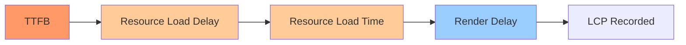

Here's an uncomfortable stat to start with: only around 62% of mobile sites pass the 2.5-second LCP threshold in 2026. Not INP, not CLS — LCP, the metric that's supposedly the "easy" one. If you've already run Lighthouse, seen the red number, and tried the usual advice ("compress your images!") without moving the needle, you're not alone. Most LCP guides repeat the same five generic tips and call it a day.

This list is different. Every fix below comes with the actual mechanism — why it works, not just that it works — plus the real before/after numbers from 2026 field data. We ranked them by leverage: how much LCP time a fix typically recovers versus how much engineering effort it takes. Start at #1 and work down; you'll usually be Core Web Vitals-compliant before you reach #6.

One quick refresher since it matters for half these fixes: LCP breaks down into TTFB + Resource Load Delay + Resource Load Time + Render Delay. Every fix on this list attacks one of those four buckets — know which bucket you're fixing and you'll stop guessing.



## 1. Preload + fetchpriority="high" the LCP Element

This is the single highest-leverage fix on the list, and it's the one most sites still get wrong. Preload solves *late discovery* — the browser doesn't find your hero image until it's parsed the CSS that references it as a background. fetchpriority solves *low prioritization* — even once discovered, the browser might rank it behind a font or a stylesheet in the download queue. You need both, not one or the other.

In Google's own 2026 testing, adding fetchpriority="high" to the above-the-fold hero image alone took LCP from 2.6 seconds to 1.9 seconds — a 700ms win from one HTML attribute. The catch: fetchpriority only works on actual `` tags and `rel="preload"` link tags. If your hero is a CSS background-image, the attribute silently does nothing, so you'll need the preload link instead.

```html
<link rel="preload" as="image" href="/hero.avif" fetchpriority="high">

```

Also check for the opposite mistake: lazy-loading your LCP image. `loading="lazy"` on a hero image can add 500ms+ of pure, unnecessary delay. And don't mark five images "high" priority — if everything is high priority, nothing is; reserve it for the one or two elements that are actually above the fold.

🔍 **SEO angle:** LCP is a confirmed Core Web Vitals ranking signal, and Google treats it as a tie-breaker between pages of similar content quality — in competitive SERPs, a 700ms LCP win from a single attribute is one of the cheapest ranking edges available.

## 2. Kill TTFB with Full-Page Edge Caching

TTFB isn't just "part of" LCP — it's the floor everything else builds on. The formula is blunt: TTFB + Render Time + Resource Load Time = LCP. Shave 470ms off TTFB and, all else equal, you shave 470ms off LCP without touching a single line of frontend code.

The gap between architectures is stark in 2026. A cached response from a nearby CDN edge node typically returns in 10–50ms. The same page rendered fresh from an origin server in another region can take 200–800ms. That's not a rounding error — it's most of your LCP budget gone before the browser even starts painting.

The fix, where your content allows it, is full-page caching at the edge: instead of re-rendering on every request, serve a static snapshot from the CDN node closest to the visitor. Pair that with HTTP/3 for faster connection setup and, for pages that can't be fully static, move the render itself to an edge function so compute happens closer to the user instead of a single distant origin.

🔍 **SEO angle:** Google's crawlers experience your TTFB too — a server that's slow for real users is slow for Googlebot's rendering pass, which compounds into both a Core Web Vitals penalty and reduced crawl efficiency on large sites.

## 3. Stop Blocking Render With CSS and JS You Don't Need Yet

The median website in 2026 still ships seven render-blocking resources totaling 100KB or more before the first pixel paints — adding 500 to 1,500ms of pure dead time on a typical mobile connection. It doesn't matter how fast your LCP image downloads if the browser is stuck parsing a stylesheet it doesn't need for the first screen.

The standard fix is critical CSS inlining: extract only the styles required to render the above-the-fold viewport, inline them directly in a `<style>` tag in the `<head>`, and load the full stylesheet asynchronously afterward. This lets the browser paint immediately instead of blocking on a network round-trip for an external file.

For JavaScript, defer or async anything that isn't required for the initial paint — analytics snippets, chat widgets, and non-critical UI libraries should never sit in the critical path. And for long off-screen sections, `content-visibility: auto` tells the browser to skip layout and paint work entirely until the user scrolls near them, freeing up the main thread for the content that actually needs to render first.

This one takes real engineering time compared to fix #1, but the payoff — up to 1.5 seconds recovered on a typical mobile connection — makes it worth the sprint.

## 4. Serve AVIF First, WebP as Fallback

Images are the LCP element on roughly 85% of desktop pages, and they account for close to half of average page weight. If you're optimizing anything else before your image pipeline, you're optimizing the wrong thing first.

WebP is the safe default in 2026 — universal browser support, roughly 30% smaller than JPEG. But AVIF goes further: 15–30% smaller than WebP and 40–50% smaller than baseline JPEG at matched visual quality, for photographic content specifically. That byte reduction shows up directly in your LCP number on mobile, where bandwidth is the bottleneck. The trade-off is encoding cost — AVIF takes 2–5x more CPU to decode than WebP — but for static images generated once at build time or through a CDN image service (Cloudinary, Imgix, Vercel Image Optimization), that cost is paid once, not per-request.

The practical pattern is a fallback chain, not a single format:

```html
<picture>
  <source srcset="/hero.avif" type="image/avif">
  <source srcset="/hero.webp" type="image/webp">
  
</picture>
```

AVIF first, WebP as the fallback, JPEG or PNG as the last resort for legacy browsers.

🔍 **SEO angle:** Image weight reduction is one of the few Core Web Vitals fixes that improves LCP for every visitor on every device simultaneously, rather than only the fastest connections — that consistency is what shows up in the 75th-percentile field data Google actually uses for ranking.

## 5. Fix Font Loading When Your LCP Element Is Text

If your largest above-the-fold element is a headline rather than an image, your web font sits directly on the LCP critical path — and font loading is one of the most under-optimized parts of the modern stack. Only about 12% of sites currently preload their fonts, which means this fix is a genuine content gap, not old advice everyone's already implementing.

The 2026 baseline is straightforward: every browser that matters supports WOFF2, so serve that format exclusively. Preload the specific font file you need with `<link rel="preload" as="font" crossorigin>`, subset it to only the characters your site actually uses, and set `font-display: swap` so the browser paints a fallback font immediately instead of leaving text invisible while the custom font downloads (the classic FOIT problem).

Done together — subset, preload, WOFF2, swap — this combination takes 500 to 1,000ms off LCP specifically on pages where text is the LCP element. That's a bigger win than most sites get from image optimization, and it's sitting there mostly untouched.

🔍 **SEO angle:** Text-heavy pages — blog posts, documentation, pillar content — are exactly the pages competing hardest in organic search, and they're disproportionately the ones with text-based LCP elements, so this fix targets your highest-value SEO pages directly rather than product images or hero banners.

## 6. Stop Abusing the "Priority" Prop in Next.js and Similar Frameworks

Framework defaults quietly sabotage LCP more often than developers realize. In Next.js specifically, the old `priority` prop (now replaced by explicit `preload={true}`) is meant for exactly one image: the true LCP candidate, typically a single above-the-fold hero. The common mistake is marking three or four images as priority "just to be safe" — each one adds its own `rel="preload"` tag, and now the browser is splitting bandwidth across resources that don't all need to arrive first, which defeats the entire point.

Two smaller fixes compound with this one. First, always set the `sizes` attribute on responsive images — getting it right can cut image payload by 40–60% by telling the browser exactly which resolution to fetch instead of over-downloading. Second, stop defaulting every component to `"use client"`. Client components ship their JavaScript to the browser; server components render on the server and send only HTML. Moving to a proper server/client split has been shown to cut client-side JavaScript bundles by roughly 35%, which speeds up Time to Interactive and indirectly helps LCP by freeing the main thread sooner.

→ Read also: [JavaScript SEO in 2026: How AI Crawlers Read React, Next.js, and Astro](/javascript-seo-ai-crawlers-react-nextjs-astro/)

## 7. Cut Third-Party Scripts That Block First Paint

Not every LCP problem lives in your own code. Carousel libraries, chat widgets, and A/B testing snippets that block first paint until their full script loads can add a full second of LCP delay on a slow mobile connection — and they're often added by a marketing team with zero visibility into Core Web Vitals impact.

Audit what's actually render-blocking versus what's merely present. A script tag with `async` or `defer` doesn't block the parser; one loaded synchronously in the `<head>` does. Multi-tenant CMS templates are a repeat offender here too — large, unoptimized stylesheets shared across every page on the platform block rendering until the entire file is parsed, even if 90% of the rules don't apply to the current page.

The fix isn't always "delete the script" — sometimes it's genuinely needed. It's usually: move it below the fold in load order, defer it until after the LCP element paints, or load it only on the pages where it's actually used instead of globally.

→ Read also: [INP Optimization 2026: The Developer's Guide to Fixing It](/inp-optimization-2026-developer-guide/)

## 8. Diagnose Before You Optimize — Confirm What Your LCP Element Actually Is

This one belongs last because it should really happen first, and skipping it is the reason so many optimization efforts miss. Developers routinely spend a sprint compressing a hero image, only to discover in Lighthouse that the actual LCP element was a lazy-loaded testimonial carousel three sections down, or a headline that renders after a web font finishes downloading.

Open Chrome DevTools' Performance panel or PageSpeed Insights, find the specific element flagged as LCP, and read its timing breakdown — how much came from TTFB, how much from load delay, how much from render delay. That breakdown tells you which of the seven fixes above actually applies to your page. A TTFB-dominated LCP needs fix #2, not fix #4. A text-dominated LCP needs fix #5, not fix #1.

🔍 **SEO angle:** Because Google's real-user field data (CrUX) — not your Lighthouse lab score — is what feeds the ranking signal, diagnosing against the actual element real visitors experience, on real devices and real connections, is the only way to know whether your fixes will move the field data Google actually measures.

## How to Choose Where to Start

If you only have a week, do #1 and #2 first — preload/fetchpriority and TTFB reduction require no design changes, no content changes, and typically recover the most milliseconds per hour of engineering time. If your LCP element is text rather than an image, jump straight to #5; it's the most overlooked fix on this list and the data backs that up (only 12% of sites preload fonts).

The through-line across all eight fixes is the same: Core Web Vitals is a confirmed, if secondary, Google ranking signal — a tie-breaker between pages of similar content quality, not a trump card over weak content. But in competitive niches where dozens of pages are fighting over the same query, that tie-breaker is exactly where rankings get decided. Treat LCP as infrastructure work worth doing properly, not a checkbox to clear once and forget — Core Web Vitals thresholds and the resources competing for bandwidth on your page both keep shifting, and what passed the audit six months ago won't necessarily pass it today.

## FAQ

**Does fixing LCP guarantee a ranking boost?**
No. Core Web Vitals functions as a tie-breaker between pages with comparable content quality and relevance — it won't push thin content above a stronger, slower competitor. But in competitive SERPs where content quality is roughly even, it's one of the few remaining levers you fully control.

**Which single fix has the best effort-to-impact ratio?**
Preload + fetchpriority="high" on the LCP element (#1). It's a one-line HTML change that recovered 700ms in Google's own 2026 testing — no design work, no infrastructure changes.

**How do I know if my LCP element is an image or text?**
Check the LCP entry in Chrome DevTools' Performance panel or run PageSpeed Insights — both explicitly flag which element on the page was measured as your Largest Contentful Paint.

**Is AVIF worth the extra CPU cost for every site?**
For photographic hero images on high-traffic pages, yes — the 15–30% size reduction over WebP shows up directly in mobile LCP. For icon-heavy or illustration-heavy sites, WebP alone is often close enough that AVIF's decode overhead isn't worth chasing.

→ Read also: [Core Web Vitals in the AI Overview Era: What Really Drives Citations](/core-web-vitals-ai-overview-citations-2026/)
