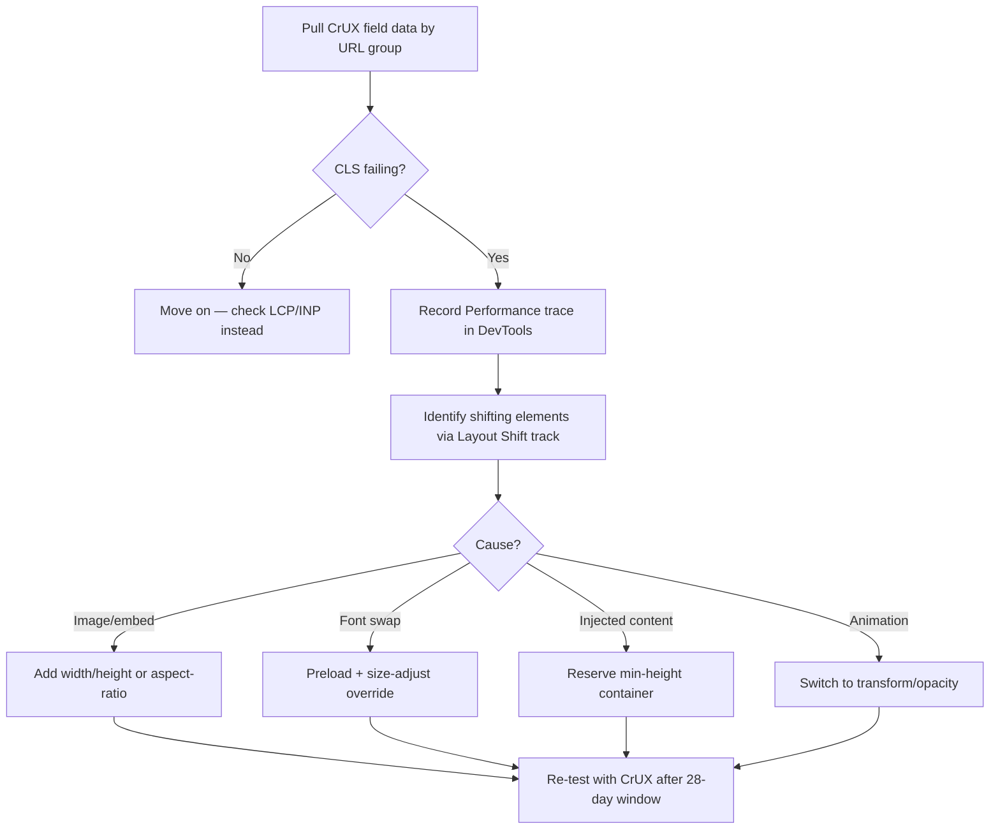

You click a link, start reading the second paragraph, and then the whole page jumps because an ad finally decided to load. You end up tapping a completely different link than the one you meant to. That's Cumulative Layout Shift, and for years it's been the Core Web Vital everyone quietly ignored — LCP got the fancy dashboards, INP got the developer conference talks, and CLS got a shrug because "it's usually fine, right?"

It's not fine anymore. Google's March 2026 core update quietly rewired how Core Web Vitals get evaluated, moving from per-page scoring to a site-wide aggregate. That means a handful of high-CLS templates — your product listing pages, your blog archive, that one legacy landing page nobody's touched since 2023 — can now drag down rankings for pages that individually pass every threshold. If you've been treating CLS as a nice-to-have, this is the year that assumption gets expensive.

## Why CLS Suddenly Matters (Again)

CLS has been part of Core Web Vitals since 2020, sitting alongside LCP and INP as one of three metrics Google uses to judge visual stability, loading performance, and interactivity. For most of that time, it behaved like a soft tiebreaker — a factor that mattered on the margins but rarely made or broke a ranking on its own.

That changed with the March 2026 rollout. Early data from third-party trackers showed nearly 80% of URLs sitting in the top three positions experienced some ranking movement during the twelve-day update window, and sites failing the new Core Web Vitals thresholds saw average drops of two to four positions — with some domains losing over half their organic traffic on their worst-hit sections. The mechanism that made this hurt more than past updates: Core Web Vitals are now evaluated holistically across an entire site rather than scored page by page. A category template with bad CLS doesn't just cost you rankings on that template — it pulls down your whole domain's CWV standing in aggregate.

The "good" thresholds themselves haven't moved. CLS below 0.1 is still good, 0.1–0.25 needs improvement, above 0.25 is poor, and you still need 75% of real-world visits to hit "good" for a page to pass. What's changed is the blast radius of failing it.

If you already have a handle on loading speed, this is worth pairing with LCP and INP fixes — between the three metrics, CLS is usually the cheapest to fix and the one most teams have never properly audited.

→ Read also: [8 LCP Fixes That Actually Move Core Web Vitals Scores in 2026](/lcp-optimization-2026-fixes-core-web-vitals-rankings/)

→ Read also: [INP Optimization 2026: The Developer's Guide to Fixing It](/inp-optimization-2026-developer-guide/)

## What Actually Causes Layout Shift

CLS isn't one bug. It's an accumulation of small layout-triggering moments, and most sites are guilty of at least three or four of these without realizing it.

**Images and embeds without reserved dimensions** are still the biggest offender by volume — recent crawl data puts the share of mobile pages with at least one dimensionless image well above 60%. The browser doesn't know how tall an image will be until it downloads it, so it renders the page as if the image takes up zero space, then yanks everything below it downward the instant the image arrives. The fix is almost embarrassingly simple: every `img` tag needs explicit `width` and `height` attributes (or an `aspect-ratio` in CSS), so the browser reserves the box before the pixels show up.

**Web fonts swapping in late** are the second-biggest, and the one people underestimate. Only a small fraction of sites preload their critical fonts, which means the browser paints text in a fallback font, then swaps to your custom typeface once it downloads — and if the two fonts have different metrics, every line of text reflows. Modern frameworks have made this close to a solved problem if you actually use the tooling: Next.js's `next/font` module self-hosts your fonts, calculates `size-adjust` and `ascent-override` values server-side, and generates a fallback font that matches your custom font's spacing almost exactly. If you're not on Next.js, you can do the same manually with `@font-face` metric overrides — it's more setup, but the shift reduction is worth it.

**Dynamically injected content** — ads, cookie banners, "sign up for our newsletter" bars, embedded tweets — is the category that causes the most user-visible frustration, because it's the one that actually moves things you're trying to click. The fix isn't "don't have ads," it's reserving space for them: wrap ad slots in a container with a `min-height` matched to your typical ad unit, and never inject new blocks above the current viewport unless the user directly triggered it. For sticky banners and cookie notices, use `position: fixed` or `position: sticky` so they overlay the page instead of pushing it down.

**Animations using the wrong CSS properties** are the sneaky one, because they often work fine visually while quietly wrecking your CLS score. Animating `top`, `left`, `width`, `height`, `margin`, or `padding` triggers layout recalculation on every frame — and each of those recalculations that shifts visible content counts toward your cumulative score. Swap to `transform` (translate, scale, rotate) and `opacity`, which run on the compositor thread and never trigger layout at all.

## Diagnosing CLS Before You Start Guessing

The mistake most teams make is opening PageSpeed Insights, seeing a red CLS number, and immediately guessing at fixes. Don't. Chrome DevTools' Performance panel has a dedicated "Layout Shift" track in the Experience lane — record a page load, and it'll show you the exact elements that shifted, by how much, and at what timestamp. Cross-reference that against your CrUX (Chrome UX Report) field data in Search Console, because lab data from DevTools won't always match what real visitors on real networks and real devices experience.

Here's the diagnostic order that actually saves time:



That last step matters more than people expect — CrUX field data rolls on a 28-day trailing window, so a fix you shipped yesterday won't show up as "resolved" in Search Console for almost a month. Lab tools (Lighthouse, PageSpeed Insights, WebPageTest) will confirm the fix immediately; treat them as your fast feedback loop and CrUX as your slow, authoritative confirmation.

## SEO & Search Implications

Here's the part that makes this more than a UX nicety: because Core Web Vitals now aggregate site-wide, a CLS problem confined to one template type can cap your entire domain's ranking ceiling — even on pages that were never the problem. If your blog archive pages have a bad CLS score because of an unoptimized ad slot, that doesn't just hurt the archive pages. It contributes to a site-wide signal that can quietly suppress your best-performing product or service pages too.

That also changes how you should prioritize fixes. Don't start with your highest-traffic page — start with your most-repeated template. A layout shift bug in a component used across 10,000 category pages does more aggregate damage than the same bug on one high-traffic landing page, because it's dragging down the site-wide score across a much larger footprint. Run your CrUX data grouped by URL pattern (not individual URL) to find which templates are actually failing at scale.

There's also a quieter interaction worth knowing about: pages that jump around visually are harder for both users and AI crawlers to parse cleanly on a single pass, and a layout that's still settling when a crawler renders it can affect what content gets captured for indexing or citation. It's not the primary reason to fix CLS — ranking and user experience are — but it's one more reason visual stability isn't purely cosmetic.

→ Read also: [Core Web Vitals in the AI Overview Era: What Really Drives Citations](/core-web-vitals-ai-overview-citations-2026/)

## Common Mistakes Teams Make Fixing CLS

The most common mistake is fixing CLS in a lab environment and declaring victory without waiting for field data to confirm it. A Lighthouse score of 0 doesn't guarantee real users see the same thing — slower devices, spotty connections, and third-party scripts that load unpredictably in the wild can all reintroduce shift that never shows up in a controlled test.

The second is treating third-party scripts as untouchable. Ad networks, chat widgets, and analytics tags are frequently the actual source of layout shift, and teams avoid touching them because "that's the vendor's code." You can still control the container: reserve space around the embed even if you can't control what's inside it, and lazy-load below-the-fold third-party widgets so they don't compete with your critical content for the browser's attention during initial render.

The third is over-rotating on images and missing fonts entirely. Image fixes are the most commonly cited advice, so teams fix every `img` tag and then wonder why CLS is still bad — because the font swap on their heading typeface was never addressed. Run the diagnostic in DevTools rather than pattern-matching from a checklist; the actual cause on your site might not be the one every blog post talks about first.

## Conclusion

CLS spent years as the Core Web Vital you could get away with half-fixing. That grace period ended with Google's March 2026 core update, and the shift to site-wide scoring means a handful of unaddressed templates can now suppress rankings across pages that were never individually the problem. The good news is that CLS is also, template for template, the cheapest of the three Core Web Vitals to fix — reserved dimensions, font preloading, and container min-heights aren't architectural rewrites, they're targeted CSS and markup changes you can ship this week.

Start with your CrUX data grouped by template, not your gut sense of which page feels janky. Fix the pattern that repeats across the most URLs first, confirm with lab tools immediately, and give it the full 28-day field-data window before you call it done. In a site-wide scoring world, that's the fix that actually moves the needle — not the one on your single highest-traffic page.

## FAQ

**What's a good CLS score in 2026?**
The thresholds haven't changed: below 0.1 is good, 0.1 to 0.25 needs improvement, and above 0.25 is poor. What changed is that 75% of your real-world visits now need to hit "good" across an aggregated, site-wide view rather than page by page.

**Does fixing CLS on one page improve rankings immediately?**
Not by itself, and not immediately. Because scoring is now site-wide and CrUX data uses a 28-day trailing window, a single-page fix takes time to show up, and its impact on your overall domain signal depends on how many pages share the problematic template.

**Can I trust PageSpeed Insights' CLS score over Search Console's CrUX report?**
Use both, for different jobs. PageSpeed Insights and Lighthouse give you fast lab feedback to confirm a fix worked technically. Search Console's Core Web Vitals report reflects real user field data and is what Google actually uses for ranking evaluation — it's slower to update but the one that matters for SEO.

**Is CLS harder to fix on framework-heavy sites like Next.js or React?**
Usually easier, not harder, if you use the built-in tooling — `next/font` alone eliminates most font-swap shift automatically. The bigger risk on framework-heavy sites is hydration: content that renders one way on the server and shifts once client-side JavaScript takes over. Test with JavaScript fully loaded, not just the initial server-rendered paint.

```json
{
  "@context": "https://schema.org",
  "@type": "FAQPage",
  "mainEntity": [
    {
      "@type": "Question",
      "name": "What's a good CLS score in 2026?",
      "acceptedAnswer": {
        "@type": "Answer",
        "text": "The thresholds haven't changed: below 0.1 is good, 0.1 to 0.25 needs improvement, and above 0.25 is poor. What changed is that 75% of real-world visits now need to hit 'good' across an aggregated, site-wide view rather than page by page."
      }
    },
    {
      "@type": "Question",
      "name": "Does fixing CLS on one page improve rankings immediately?",
      "acceptedAnswer": {
        "@type": "Answer",
        "text": "Not by itself, and not immediately. Because scoring is now site-wide and CrUX data uses a 28-day trailing window, a single-page fix takes time to show up in field data."
      }
    },
    {
      "@type": "Question",
      "name": "Can I trust PageSpeed Insights' CLS score over Search Console's CrUX report?",
      "acceptedAnswer": {
        "@type": "Answer",
        "text": "Use both for different jobs: lab tools like PageSpeed Insights confirm a fix worked technically and quickly, while Search Console's CrUX field data reflects real users and is what Google actually uses for ranking evaluation."
      }
    },
    {
      "@type": "Question",
      "name": "Is CLS harder to fix on framework-heavy sites like Next.js or React?",
      "acceptedAnswer": {
        "@type": "Answer",
        "text": "Usually easier if you use built-in tooling like next/font, which eliminates most font-swap shift automatically. The bigger risk is hydration-related shift, where content rendered server-side changes once client-side JavaScript takes over."
      }
    }
  ]
}
```
