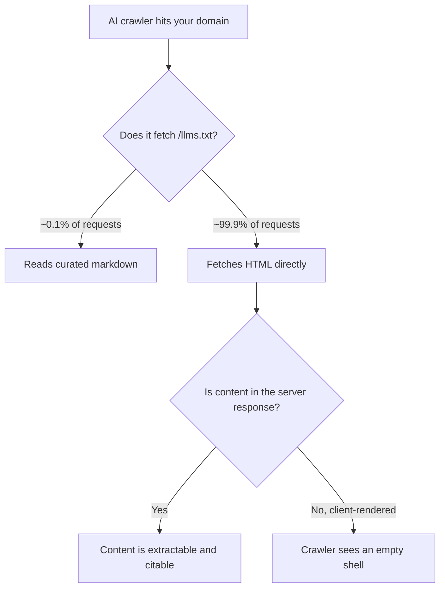

Eighteen months ago, half the SEO industry told you to ship an `llms.txt` file or get left behind in AI search. Plenty of teams did. Then the data arrived, and it's not kind.

Here's the short version: llms.txt in 2026 has roughly 10% adoption, near-zero crawler engagement, and no measurable relationship with AI citations. Meanwhile, the file that *is* quietly deciding whether ChatGPT, Claude, and Perplexity can see your content at all — `robots.txt` — is the one most teams haven't touched since 2019. That's the trade this article is about.

## What llms.txt Was Supposed to Do

The pitch was elegant. Search crawlers get `robots.txt`. Sitemaps get `sitemap.xml`. So LLMs get `llms.txt`: a markdown file at your root that hands models a clean, curated, token-efficient map of your best content, free of nav chrome, cookie banners, and 400KB of hydration payload.

Nobody hated the idea. It solved a real problem — models burning context on boilerplate — and it cost about half a day to implement. That's exactly the kind of low-friction, high-story-value tactic that spreads fast in SEO circles regardless of whether it works.

The problem is that a standard only exists if the consumers agree to consume it. And they didn't.

## The Numbers That Ended the Debate

SE Ranking crawled roughly 300,000 domains and found llms.txt on 10.13% of them. Fine — early standard, slow uptake, nothing damning yet. The damning part came next: across that sample, they found **no relationship between having an llms.txt file and how often the domain got cited in major LLM answers**. When they pulled llms.txt out of their citation prediction model entirely, accuracy went *up*. The file wasn't a weak signal. It was noise.

The adoption breakdown is its own tell. Low-traffic sites (0–100 visits) adopted at 9.88%, mid-traffic sites at 10.54%, and high-traffic sites (100,001+) at only 8.27%. If llms.txt worked, you'd expect the opposite gradient — the biggest, best-resourced, most data-driven sites adopting hardest. Instead they're the least likely to bother. Teams with real measurement capacity tested it and moved on.

Then there's the log-file evidence, which is the part that should settle it for any technical SEO. One analysis of over 500 million AI bot visits across a 90-day window found **408 requests** that touched `/llms.txt`. Another, smaller study across 62,100 AI bot visits found 84 — about 0.1% of AI crawler traffic. GPTBot, ClaudeBot, PerplexityBot, OAI-SearchBot, and Google-Extended overwhelmingly skip the file and crawl your HTML directly.

Google made its position explicit back in July 2025: Gary Illyes confirmed Google doesn't support llms.txt and has no plans to, and John Mueller compared it to the keywords meta tag — which, if you've been doing this a while, is about as brutal a comparison as exists in this field. To date, no major provider — OpenAI, Google, Anthropic, or Perplexity — has publicly confirmed its crawlers read the file.



## Why the Hype Outran the Evidence

Worth being fair here: the loudest positive case studies for llms.txt came from companies with a commercial interest in the standard succeeding — tooling vendors, agencies selling AEO packages, platforms that shipped llms.txt generators. The most rigorous independent tests found essentially no bot engagement. That asymmetry is the whole story.

There's also a structural reason it was never going to work the way people hoped. `robots.txt` succeeded because it's an *access control* file — the crawler operator has a legal and reputational incentive to respect it. `llms.txt` is a *comprehension* file: it asks a crawler to trust the site owner's curation of its own content. That's a trust model no serious crawler operator would adopt at scale, because the obvious failure mode is sites shipping an llms.txt that flatters their content far beyond what the HTML supports. Cloaking, basically, with a friendlier filename.

## SEO & Search Implications: What Actually Moves AI Citations

So where should that half-day go instead? Three places, in priority order.

**1. Make sure the HTML actually contains the content.** This is the boring one that keeps mattering. AI crawlers overwhelmingly fetch raw HTML and most of them do not execute JavaScript. If your product pages, docs, or article bodies only materialize after client-side hydration, the crawler is reading an empty div and your llms.txt is irrelevant. Server-render or statically generate anything you want cited — SSR, SSG, or ISR all work, CSR doesn't.

→ Read also: [JavaScript SEO in 2026: How AI Crawlers Read React, Next.js, and Astro](/javascript-seo-ai-crawlers-react-nextjs-astro/)

**2. Ship structured data, because that's the machine-readable layer that already has consumers.** Schema markup showed up in 55+ mentions across 90+ sources in 2026 SEO research for a reason: it's the standard that actually gets parsed. `Article`, `FAQPage`, `Product`, `Organization`, and `HowTo` all feed real downstream systems. It's the same job llms.txt was pitching — telling machines what your content means — except the machines already read it.

→ Read also: [Product Schema in 2026: The Fields Google Now Requires for Rich Results](/product-schema-2026-required-fields-shopping-rich-results/)

**3. Decide, deliberately, which AI crawlers you allow.** Here's where the real leverage sits, and almost nobody is treating it as a decision.

## The File You Should Actually Be Editing

The crawl-to-refer ratio measures how many pages an AI bot takes from you for every visitor it sends back. The 2026 numbers are striking. Cloudflare-derived baselines for June 2026 put Google near 5:1, Perplexity near 186:1, OpenAI near 848:1, and Anthropic near 4,580:1. Other cross-checks using Cloudflare Radar for July 2026 rank Mistral as the most extractive at 3,389:1, ahead of Anthropic at 2,237:1 and OpenAI at 217:1. The exact figures move depending on methodology and sample, but the shape doesn't: traditional search trades crawl for traffic at roughly single-digit ratios, and AI crawlers trade at hundreds-to-thousands-to-one.

Traffic share has shifted too. In July 2026 ClaudeBot took around 16–18% of AI-bot traffic versus GPTBot's roughly 9.7%, making Anthropic's crawlers collectively the largest AI-specific operator on the web.

Which means your `robots.txt` is now a business decision, not a hygiene file. Three defensible postures:

**Open to everything** — right if you're a SaaS, a docs site, a tool, or anyone whose growth comes from being *the recommended answer*. A 4,580:1 ratio still beats invisibility when one referral converts.

**Selective** — allow the crawlers that actually send traffic and that power the assistants your buyers use; block the pure-training bots. A reasonable starting point:

```
# Search + AI answer engines that send referrals — allow
User-agent: Googlebot
Allow: /

User-agent: OAI-SearchBot
Allow: /

User-agent: PerplexityBot
Allow: /

User-agent: ClaudeBot
Allow: /

# Training-only crawlers — opt out
User-agent: Google-Extended
Disallow: /

User-agent: CCBot
Disallow: /

# Protect endpoints that cost you money to serve
User-agent: *
Disallow: /search
Disallow: /api/
Disallow: /*?sort=
```

**Closed to AI** — only if your content *is* the product and you're monetizing it directly. Just be clear-eyed: you're opting out of the citation layer entirely.

Note the last block. Those `Disallow` lines on internal search, API routes, and sort parameters do more for your crawl economics than any llms.txt ever will, and they apply to Googlebot too.

→ Read also: [Answer Engine Optimization (AEO) 2026: Technical SEO Playbook](/technical-seo-playbook-ai-crawlers-aeo-2026/)

## Common Mistakes and the One Case Where llms.txt Is Fine

The biggest mistake is treating llms.txt as a *substitute* for the three things above. Teams ship the file, tell the client AI search is handled, and never look at whether the HTML is renderable or whether GPTBot is even allowed in. That's not a small gap, that's the whole job.

Second mistake: generating llms.txt automatically from a sitemap and letting it drift. A stale curated index of dead URLs is worse than nothing — if a crawler ever *does* start honoring the file, you've handed it a map of your 404s.

Third: assuming a blocked crawler can still cite you. It can't. If you `Disallow: /` for ClaudeBot and then wonder why Claude never mentions your brand, that's not an algorithm mystery.

That said, there's one honest use case left, and it isn't SEO. IDE-based coding agents — Cursor, Claude Code, and friends — do fetch `llms.txt` when a developer points them at your docs. If you sell a developer tool, an API, or a framework, a well-maintained llms.txt is genuinely useful documentation infrastructure for the agentic layer. Just file it under DX, not under search visibility, and don't put it on the SEO roadmap.

## Conclusion

The llms.txt 2026 verdict is about as clean as this industry ever gets: 300,000 domains, no citation lift, 0.1% crawler engagement, and explicit non-support from Google. It's not a scandal — it was a reasonable idea that the consumers declined to consume. The useful lesson is the pattern. A machine-readable file only matters if something reads it, and the standards that already have readers are HTML and schema.

So: half a day back. Spend it confirming your content is in the server response, that your structured data validates, and that your `robots.txt` reflects an actual decision about which AI crawlers get your pages and what they give back. Those three things determine whether you get cited. The fourth file doesn't.

## FAQ

**Should I remove my existing llms.txt file?**
No need — it costs nothing to leave up and does no harm. Just stop maintaining it as an SEO asset and don't let it appear in reporting as an AI-visibility line item.

**Does llms.txt help with Google AI Overviews?**
No. Google has publicly confirmed it doesn't support the file and has no plans to.

**What's the difference between llms.txt and robots.txt?**
`robots.txt` controls *access* — which crawlers may fetch which paths — and is broadly honored. `llms.txt` proposes *comprehension* — a curated summary of your best content — and is largely ignored.

**Is blocking AI crawlers good for SEO?**
It's a trade, not a win. Blocking protects your content from extractive crawling but removes you from AI answer surfaces entirely. For most businesses that depend on discovery, selective allow-listing beats a blanket block.

**Who should still ship llms.txt?**
Developer-tooling companies, API providers, and documentation-heavy sites, because coding agents do fetch it. Treat it as developer experience, not search optimization.

```json
{
  "@context": "https://schema.org",
  "@type": "FAQPage",
  "mainEntity": [
    {
      "@type": "Question",
      "name": "Should I remove my existing llms.txt file?",
      "acceptedAnswer": {
        "@type": "Answer",
        "text": "No need — it costs nothing to leave up and does no harm. Just stop maintaining it as an SEO asset and don't let it appear in reporting as an AI-visibility line item."
      }
    },
    {
      "@type": "Question",
      "name": "Does llms.txt help with Google AI Overviews?",
      "acceptedAnswer": {
        "@type": "Answer",
        "text": "No. Google has publicly confirmed it doesn't support the file and has no plans to."
      }
    },
    {
      "@type": "Question",
      "name": "What's the difference between llms.txt and robots.txt?",
      "acceptedAnswer": {
        "@type": "Answer",
        "text": "robots.txt controls access — which crawlers may fetch which paths — and is broadly honored. llms.txt proposes comprehension — a curated summary of your best content — and is largely ignored."
      }
    },
    {
      "@type": "Question",
      "name": "Is blocking AI crawlers good for SEO?",
      "acceptedAnswer": {
        "@type": "Answer",
        "text": "It's a trade, not a win. Blocking protects your content from extractive crawling but removes you from AI answer surfaces entirely. For most businesses that depend on discovery, selective allow-listing beats a blanket block."
      }
    },
    {
      "@type": "Question",
      "name": "Who should still ship llms.txt?",
      "acceptedAnswer": {
        "@type": "Answer",
        "text": "Developer-tooling companies, API providers, and documentation-heavy sites, because coding agents do fetch it. Treat it as developer experience, not search optimization."
      }
    }
  ]
}
```
