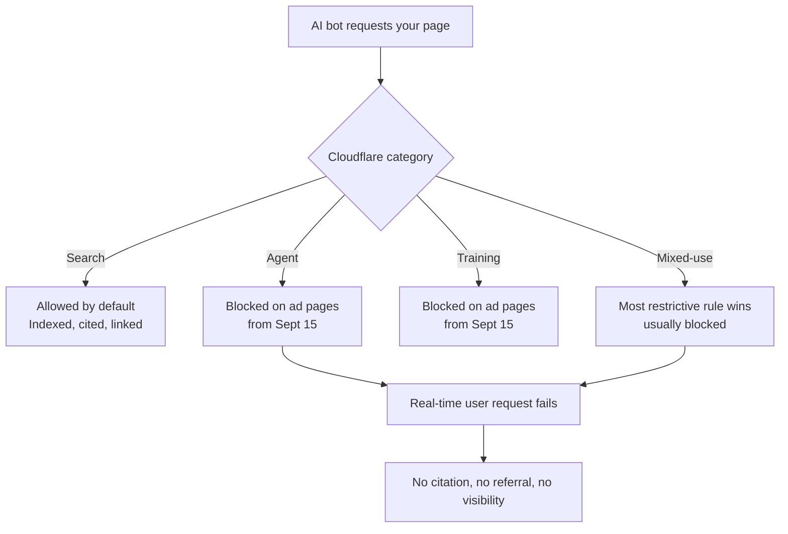

You have eleven days. On September 15, 2026, Cloudflare flips a default that most site owners have never consciously touched, and a chunk of the web will quietly stop feeding the systems that increasingly decide whether anyone finds you at all.

Here's the uncomfortable part. The Cloudflare AI crawler block isn't a bug or an outage. It's a deliberate policy change, it's probably good for publishers on the whole, and it will still hurt sites that don't check their settings — because "blocked by default" and "blocked on purpose" produce identical results in an AI answer. Nobody cites a page they couldn't fetch.

## What Actually Changes on September 15

Since July 1, 2026, Cloudflare has sorted AI bot traffic into three buckets rather than treating "AI crawler" as one undifferentiated blob:

- **Search** — bots that index a page so a system can answer questions about it later, with a link back to you.
- **Agent** — automated systems acting in real time on behalf of a user. ChatGPT's fetch bot, browser-driving agents, shopping agents.
- **Training** — crawlers that pull your content into a model's weights and send you nothing in return.

Those controls have been available to everyone, free tier included, for two months. What changes on the 15th is the *default*. From that date, Training and Agent get blocked on pages that display ads, while Search stays allowed.

And there's a sting in the tail: crawlers that serve multiple purposes get the most restrictive rule that applies to them. That's the "mixed-use" category, and it's where this gets genuinely messy. A bot that indexes for search *and* harvests for training is treated as a training bot. Cloudflare's message to AI companies is essentially "separate your crawlers or lose access," which is a reasonable negotiating position for a company sitting in front of roughly 20% of the web. But you are not the party being negotiated with. You're the terrain.

The changed defaults apply to new Cloudflare customers, new sites added by existing customers, and — this is the one that catches people — all existing free-tier customers. If you set up a Cloudflare zone in 2022, put it on the free plan, and haven't opened the dashboard since, this applies to you.

## Why This Is an SEO Problem, Not Just an Infrastructure One

The instinct in a lot of SEO circles right now is to shrug: Search crawlers are still allowed, so rankings are fine, so who cares?

That instinct is two years out of date.

Referral traffic from AI platforms grew roughly 25x in a single year. AI-driven retail orders grew 15x between January 2025 and January 2026. On Black Friday 2025, AI-referred traffic to US retail sites jumped 805% year over year. Whatever you think about the quality of that traffic, its trajectory isn't ambiguous. Meanwhile, Otterly's 2026 AI Citations Report found that 73% of sites had technical barriers blocking AI crawler access — mostly by accident, through robots.txt rules, CDN configuration, and JS rendering failures that nobody audited.

Here's the thing that makes the Agent category especially dangerous to block casually. Agent traffic is a *user who is trying to do something right now*. Someone asked ChatGPT to compare three products, or asked an agent to book something, or asked Claude to summarize a page they're reading. That's not a scraper hoovering up your archive. That's demand, arriving through a different door. Blocking Agent traffic on your ad-supported pages is closer to blocking a customer than blocking a bot.

Training is a genuinely different calculation, and blocking it is defensible — training crawlers take content into model weights and send you nothing back, ever. Most publishers should probably block it. The problem is that the September 15 default bundles Agent in with Training, and those two have opposite economics.



## The Audit: Four Things to Check Before the 15th

None of this takes long. Block out forty-five minutes.

**1. Find out which zones are actually affected.** Log into the Cloudflare dashboard and check each zone's plan tier and creation date. Free-tier zones and anything created recently are in scope for the default flip. Paid zones created before July 1 keep their existing behavior unless you changed something — but verify rather than assume, especially if someone else set the account up.

**2. Look at AI Crawl Control and decide each category deliberately.** In Security settings, you'll find the Search / Agent / Training controls. The point isn't to pick "allow everything" or "block everything." It's to make three separate decisions that match your actual business model:

- If you monetize through ads or subscriptions on content that took real work to produce, blocking Training is a reasonable stance.
- If any part of your revenue depends on being discovered, allow Agent. A blocked agent request is a lost customer interaction, not a saved server cycle.
- Keep Search allowed unless you have a specific reason not to.

If you want no change at all, you can opt out through Security settings — but only before September 15.

**3. Reconcile your robots.txt with your CDN rules.** Cloudflare's Content Signals Policy adds three fields to robots.txt — `search`, `ai-input`, and `ai-train` — and Cloudflare has auto-enabled it on over 3.8 million domains via managed robots.txt, with defaults of `search=yes`, `ai-train=no`, and `ai-input` deliberately left neutral. A fourth field, `content-use`, is being tested to describe what a crawler may keep and reuse after fetching.

That neutrality on `ai-input` is a decision Cloudflare punted to you. Leaving it neutral is itself a signal, and not necessarily the one you want. Set it explicitly.

Two rules to keep straight: robots.txt is a request, the CDN edge rule is enforcement. If they disagree, the edge wins and your robots.txt is just documentation of an intention nobody honors. Check both, make them say the same thing.

```
# robots.txt — Content Signals
# search: index and link to this content
# ai-input: use as grounding for real-time answers
# ai-train: do not use for model training
Content-Signal: search=yes, ai-input=yes, ai-train=no

User-agent: *
Allow: /
```

**4. Verify with logs, not with hope.** This is the step everyone skips, and it's the only one that tells you the truth. Server logs are the only record of what crawlers actually *did* on your site, request by request, rather than what your config says should happen. AI crawlers have been observed consuming up to 40% of total crawl activity on high-traffic sites, and AI-driven crawl traffic hit 52% of requests in June 2026 by Cloudflare's own measurement. Pull a week of logs, segment by user agent, and look specifically at status codes for GPTBot, ClaudeBot, PerplexityBot, OAI-SearchBot, Claude-SearchBot, and Google-Extended. A wall of 403s appearing after the 15th is your answer.

[→ Read also: How to Get AI Crawlers to Actually Index Your Site in 2026](/blog/optimize-website-ai-crawler-indexing/) — the same principle applies here: what your files declare matters far less than what your infrastructure actually serves.

## The Bigger Shift: Discoverability Is Now a Config File

Step back and something clarifies. For twenty years, technical SEO's core question was "can Googlebot reach and render this?" The answer lived in your robots.txt, your sitemap, your rendering pipeline.

That question hasn't gone away — it's multiplied. Now it's "which of eleven categories of automated agent can reach this, under which commercial terms, and does my CDN agree with my robots.txt about the answer?" Discoverability has become a negotiated commercial arrangement enforced at the edge, and the SEO team frequently isn't in the room when the CDN gets configured.

Cloudflare's Pay Per Crawl experiment is evolving into "Pay Per Use," where publishers get paid when content generates value in an AI answer rather than merely when a bot fetches it. That's a meaningfully better model — Cloudflare's data suggests over 50% of AI crawl traffic is re-fetching unchanged pages, which is pure waste on both sides. But it also means your visibility in AI answers is on its way to being something with a *price*, and prices are set by whoever configures the account.

The practical implication: if you do technical SEO, you need dashboard access to your CDN, or a standing relationship with whoever has it. [→ Read also: Technical SEO in 2026: Speed, Vitals & AI Crawlers](/blog/technical-seo-2026-speed-vitals-ai-crawlers/) covers the edge layer in more depth. The bot policy question is the same layer, same access problem.

And if the crawler does get through, everything else still has to work — server-rendered HTML, clean structured data, fast responses. [→ Read also: Answer Engine Optimization: How to Get Cited by AI Search in 2026](/blog/answer-engine-optimization-aeo-guide/) covers what happens after access is granted. Access is necessary, not sufficient.

## Conclusion

The Cloudflare AI crawler block is the clearest signal yet that the plumbing of discoverability changed while a lot of us were still arguing about content strategy. Blocking training crawlers is a legitimate choice. Blocking agent traffic on pages where you're trying to sell something is probably not the choice you'd make deliberately — but on September 15, it's the choice that gets made for you unless you intervene.

Open the dashboard. Check the three categories. Align robots.txt with your edge rules. Pull your logs a week later and confirm reality matches intent. That's the whole job, and it's a lot cheaper than working out in November why your AI referral traffic fell off a cliff in September.

## FAQ

**Does this affect Googlebot and my regular rankings?**
Traditional search indexing sits in the Search category, which remains allowed by default. But Googlebot is a mixed-use crawler — it indexes for search and collects data that feeds AI features. If you block Training aggressively, mixed-use bots get the most restrictive rule applied. Test rather than assume.

**I'm on a paid Cloudflare plan. Am I safe?**
Existing paid zones created before the policy shift keep their current settings. New zones you create do not. Verify each zone individually.

**Should I just allow everything to be safe?**
No. Training crawlers take content and return nothing, and allowing them by reflex gives away an asset for free. The point is three deliberate decisions, not one blanket one.

**What if I'm not on Cloudflare at all?**
The specific defaults don't apply, but the category framework is becoming an industry pattern — AWS and Akamai are moving in the same direction. Audit your own bot rules with the same Search / Agent / Training lens.

**How do I know if I'm already being blocked?**
Server logs. Filter for known AI user agents and check status codes. Otterly's 2026 report found 73% of sites had technical barriers blocking AI crawler access, and the overwhelming majority didn't know.
