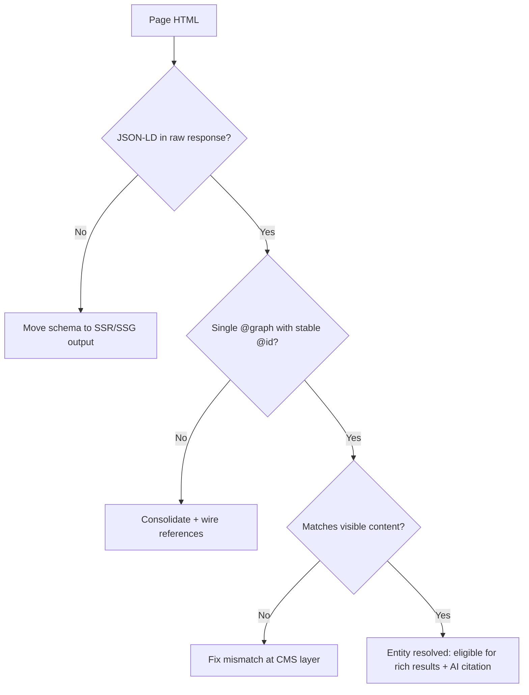

Two years ago, schema markup had a simple sales pitch: add the JSON-LD, get the pretty snippet, watch CTR climb. That pitch is mostly dead. Google spent 2025 and 2026 deleting rich result types faster than anyone could ship them, and in August 2026 it finally pulled FAQ rich result data out of the Search Console API entirely.

So a lot of teams quietly stopped caring. Which is a mistake — just not for the reason most blog posts claim. Structured data in 2026 didn't lose its value; it changed jobs. It stopped being a display trigger and started being the thing that tells machines who you are. Let's go through what actually got cut, what the data says about AI citations (it's messier than the hype), and what markup is genuinely worth your engineering time.

## What Google Actually Removed — and What It Didn't

Here's the timeline, because the panic usually comes from people compressing three years of small changes into one imagined apocalypse.

June 2025: Google's Henry Hsu announced the retirement of seven structured data types — Book Actions, Course Info, Claim Review, Estimated Salary, Learning Video, Special Announcement, and Vehicle Listing. Search Console reports, appearance filters, and Rich Results Test support for those seven went away on September 8, 2025. BigQuery appearance fields started returning NULL on October 1, 2025. (Small footnote worth knowing: in November 2025 Google quietly removed the deprecation banner from Book Actions, because something in Search still uses it. So even the deprecation list isn't stable.)

January 2026: PracticeProblem reporting disappeared.

May 7, 2026: the big one. FAQ rich results stopped appearing in Google Search. The appearance filter and Rich Results Test support followed in June 2026, and the FAQ data left the Search Console API in August 2026.

Now the part that gets misreported. `FAQPage` is **not** a deprecated Schema.org type. It's still valid vocabulary, it won't throw errors, and Google's John Mueller went on Reddit specifically to say Google is not killing schema. What died is the *SERP widget*, not the markup. Those are two very different things, and conflating them is how you end up ripping useful entity data out of your templates for no reason.

Rankings, by the way, were never affected by any of these removals. What changed is how your result looks — and, increasingly, how machine systems read your page.

## The Uncomfortable Data on Schema and AI Citations

Every "schema is now for AI!" post you've read this year leans on correlation studies. Let's actually look at them, because they disagree with each other and that disagreement is the most useful thing in this article.

**In the "it works" corner.** The AirOps analysis found `BreadcrumbList` associated with a 46.2% citation rate and `FAQPage` with 45.6%. Pages carrying JSON-LD showed a 38.5% citation rate versus 32.0% without — a 6.5 percentage point gap. UC Berkeley's GEO-16 framework logged a +39% lift in associations between structured data and citation.

**In the "it doesn't" corner.** Ahrefs ran a controlled test across 1,885 pages, adding schema and measuring what happened. Google AI Overviews citations *dropped* 4.6%. Across AI Overviews, AI Mode, and ChatGPT, adding schema produced no significant citation increase on any platform.

Both can be true. The correlation studies are measuring what well-maintained, well-structured sites tend to have. The Ahrefs test is measuring what happens when you bolt JSON-LD onto a page that was already fine without it. Schema isn't a switch you flip for citations. Sites that ship clean, accurate, connected markup tend to be sites that are also clear, well-organized, and trustworthy — and *that's* what gets cited.

Here's my honest take: treat schema as a clarity tax you pay so machines can't misread you, not as a growth lever. If your Organization entity is ambiguous, every AI system has to guess at who published this. Removing that guesswork is worth doing. Expecting a traffic graph to bend because you added `@type: Article` is not.

If you've been burned by this kind of hype before, you'll recognize the pattern — it's the same shape as the llms.txt story. [→ Read also: llms.txt in 2026: 300K Domains Say It Does Nothing](/blog/llms-txt-2026-does-it-work-what-to-do-instead/)

## Structured Data in 2026 Is an Entity Graph, Not a Pile of Blocks

This is the shift that actually matters, and it's the one most 2026 schema guides skip because it requires touching code.

Most sites ship schema as confetti: a standalone `Organization` block in the footer, a standalone `Article` block on posts, a `BreadcrumbList` somewhere, none of them aware the others exist. Machines parsing that get four disconnected assertions and no relationships. What AI Mode and Gemini need is a *graph* — a set of nodes that reference each other.

The mechanism is `@id`.

```json
{
  "@context": "https://schema.org",
  "@graph": [
    {
      "@type": "Organization",
      "@id": "https://example.com/#organization",
      "name": "Example Studio",
      "url": "https://example.com/",
      "logo": {
        "@type": "ImageObject",
        "@id": "https://example.com/#logo",
        "url": "https://example.com/logo.png"
      },
      "sameAs": [
        "https://www.linkedin.com/company/example-studio",
        "https://github.com/example-studio",
        "https://www.wikidata.org/wiki/Q00000000"
      ]
    },
    {
      "@type": "WebSite",
      "@id": "https://example.com/#website",
      "url": "https://example.com/",
      "name": "Example Studio",
      "publisher": { "@id": "https://example.com/#organization" }
    },
    {
      "@type": "BlogPosting",
      "@id": "https://example.com/blog/post-slug#article",
      "isPartOf": { "@id": "https://example.com/#website" },
      "headline": "Post title exactly as rendered in the H1",
      "datePublished": "2026-09-05",
      "dateModified": "2026-09-05",
      "author": { "@id": "https://example.com/#person-ronggur" },
      "publisher": { "@id": "https://example.com/#organization" }
    },
    {
      "@type": "Person",
      "@id": "https://example.com/#person-ronggur",
      "name": "Ronggur Mangaraja",
      "url": "https://example.com/about",
      "sameAs": ["https://x.com/handle"]
    }
  ]
}
```

Three rules make this work:

**Put everything in one `@graph` array.** One script tag per page, all entities inside it. This signals shared context and stops you from redeclaring the same Organization object five times with slightly different values.

**Use fragment URIs for `@id`, and keep them stable forever.** `https://example.com/#organization` is an identifier, not a URL. It doesn't need to resolve. Its only job is to be unique and identical everywhere you reference that entity — across every page, every template, every year. Change it and you've orphaned the graph.

**`sameAs` is for external descriptions of you, not for your own `@id`.** Wikipedia and Wikidata URLs belong in `sameAs`. Putting a Wikipedia URL in `@id` breaks the graph. And only list profiles you actually own and control — a dead LinkedIn URL in `sameAs` is a verification failure, not a signal.

The 2026 consensus from the citation studies, once you read past the headlines, lands here: the advantage comes from the connected entity graph, not from any individual block. That's the whole game.

## The Schema Types That Still Pay Rent

Google's Search Gallery still lists roughly 30 types, but the ones that reliably earn visible SERP treatment in 2026 have narrowed considerably:

- **Organization** — the anchor. Without a clear entity node, everything else has nothing to attach to. Ship this sitewide, on every page.
- **Product** with `AggregateRating` and `Review` — still the highest-value markup on the web, and the requirements got stricter this year. [→ Read also: Product Schema in 2026: The Fields Google Now Requires for Rich Results](/blog/product-schema-2026-required-fields-shopping-rich-results/)
- **BreadcrumbList** — cheap, still displayed, and the type with the strongest citation correlation in the AirOps data. Easy yes.
- **Article / BlogPosting** — no longer a flashy rich result, but it's how your author and publisher relationships get expressed. Keep it.
- **LocalBusiness** — unchanged in importance if you have physical locations.
- **Recipe** and **Video** — still generating rich results in their verticals.

And what about `FAQPage`? Keep it if the FAQ is genuinely primary content on the page. It costs nothing, it's still valid, and it structures your answers in a Q&A shape that AI systems parse cleanly. Delete it if you sprinkled it across product pages purely to farm the widget — that's exactly the abuse the March 2026 core update pushed back on, when Google reduced rich result display for FAQ, Review, and How-to markup placed on pages where it wasn't the main content.

## A 5-Step Structured Data Audit for 2026

Don't rewrite everything. Audit first.

**1. Inventory what you're actually emitting.** Crawl your own site and extract every JSON-LD block by template, not by page. Most sites have four or five templates producing everything; fix the template, fix thousands of URLs.

**2. Delete markup for dead types.** Course Info, Estimated Salary, Learning Video, Special Announcement, Vehicle Listing, Claim Review — if these are still in your templates, they're bytes with no consumer. Remove them.

**3. Check for content mismatch.** This is the failure that actually hurts. Schema claiming a 4.8 rating when the page shows 4.2, `datePublished` that doesn't match the visible date, a `headline` that isn't the H1. Accurate schema that matches visible content is what increases citation probability; inaccurate schema is a trust penalty. If your CMS and your frontend disagree, your markup lies. [→ Read also: 8 Headless CMS SEO Mistakes That Kill Indexing in 2026](/blog/headless-cms-seo-mistakes-2026-indexing-fixes/)

**4. Connect the graph.** Consolidate scattered script tags into one `@graph`, assign stable `@id` values, and wire up `publisher`, `author`, and `isPartOf` references. This is usually a half-day of template work and it's the highest-leverage step on this list.

**5. Verify it survives rendering.** If your schema is injected client-side, test what a non-rendering crawler sees. Plenty of AI crawlers don't execute JavaScript, and markup they never receive can't help you. Fetch your page with `curl` and grep for `application/ld+json` — if it isn't in the raw HTML, fix that before anything else.



## Mistakes That Quietly Kill Good Markup

**Rotating `@id` values.** A build that generates `#organization-{hash}` per deploy destroys entity continuity every release. Hardcode them.

**Duplicate Organization nodes.** Plugin emits one, theme emits another, your custom block emits a third — each with a slightly different `name` or `logo`. Now machines see three organizations. Pick one source of truth.

**Marking up content that isn't on the page.** Schema describes what's rendered. If the JSON-LD is the only place the information exists, you're not describing your page, you're making claims about it.

**Assuming validation equals eligibility.** The Rich Results Test tells you your syntax parses and whether Google supports the type. It does not tell you the page qualifies for anything. Valid ≠ eligible ≠ displayed.

**Treating schema as a substitute for crawlable content.** If AI crawlers can't reach or render your pages at all, no amount of JSON-LD helps. Access comes first. [→ Read also: Cloudflare's Sept 15 AI Crawler Block: Audit Your Site Now](/blog/cloudflare-ai-crawler-block-september-2026-seo-audit/)

## Conclusion

Structured data in 2026 asks for a different mental model than the one most of us built in 2021. You're no longer buying snippets. You're building a machine-readable identity — a graph that says, unambiguously, this organization published this article, written by this person, on this site. Rich results are what's left over when a type still has a widget attached.

The honest version of the pitch: schema won't manufacture citations on its own, and anyone selling you a causal link is ahead of the evidence. But ambiguity absolutely costs you. When a system synthesizing an answer has to guess whether your brand is authoritative, you want it reading a clean entity graph rather than inferring from footer text. That's a solvable problem, it's mostly template work, and it stays solved.

Start with step 4 of the audit. Consolidate the graph, fix the `@id` values, ship it, and stop worrying about the widgets Google took away.

## FAQ

**Is FAQPage schema dead in 2026?**
No. FAQ *rich results* stopped displaying on May 7, 2026, and reporting was fully removed by August 2026. The `FAQPage` type is still valid Schema.org vocabulary and won't cause errors. Keep it where the FAQ is real primary content; remove it where you added it purely for the widget.

**Does adding schema markup improve AI citations?**
The evidence is genuinely mixed. Correlation studies (AirOps, GEO-16) show meaningful associations, while Ahrefs' controlled test across 1,885 pages found no significant lift and a 4.6% drop in AI Overviews citations. The practical read: a connected, accurate entity graph reduces ambiguity, but schema alone is not a citation lever.

**Did any structured data removals hurt rankings?**
No. Google has been consistent that these deprecations affect search *appearance*, not ranking. What changed is display eligibility and, indirectly, CTR on pages that previously earned a widget.

**Should I use one JSON-LD block or several per page?**
One, containing a single `@graph` array with all entities. Multiple disconnected script tags produce isolated assertions instead of a graph, which is the exact structure you're trying to avoid.

**How often should I re-audit structured data?**
Quarterly is enough for most sites, plus an immediate check after any CMS migration, template refactor, or framework upgrade — those are when mismatches and duplicate nodes get introduced silently.
