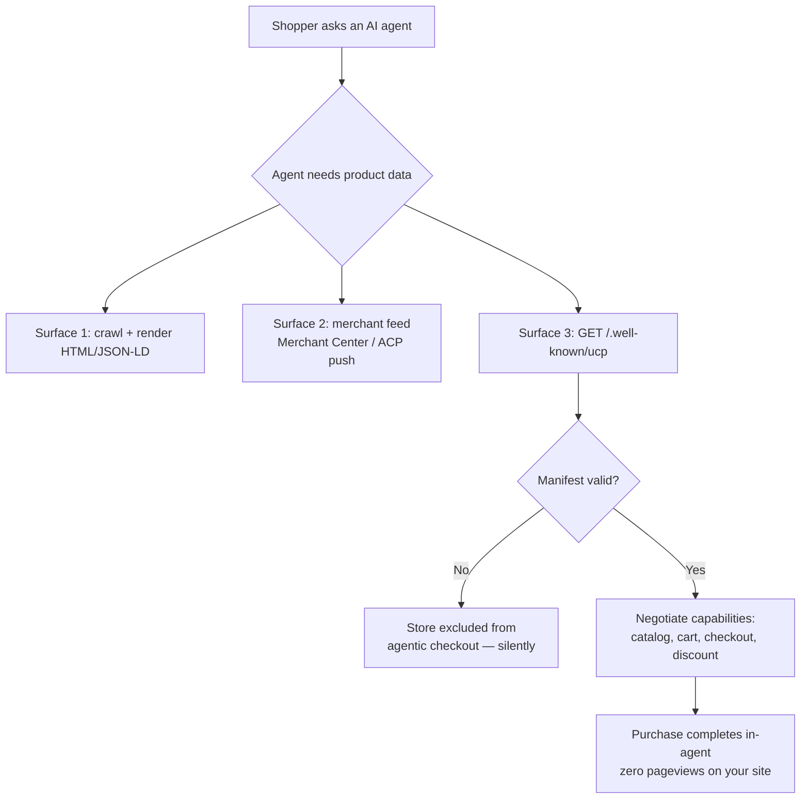

For about twenty-five years, ecommerce SEO had one job: get a crawler to your product page, make sure it renders, make sure the price and availability are readable. Everything else — schema, internal linking, crawl budget — existed to serve that one job.

That job is now one of three. And if you only do the first one, agents will quietly route buyers to a competitor who did all three, without your analytics ever recording that you were in the running.

Here's the uncomfortable part: this isn't speculative. Google's Universal Commerce Protocol shipped on January 11, 2026, with Shopify, Etsy, Wayfair, Target, and Walmart as co-developers and 20+ endorsing partners. OpenAI and Stripe's Agentic Commerce Protocol has been out since late 2025 and hit its `2026-04-17` spec revision with cart, feed, orders, and MCP compatibility. Both are live. Both are Apache 2.0. Both define, in writing, how an AI agent finds out your products exist — and neither of them starts by crawling your HTML.

## Why This Is a Search Problem, Not Just a Payments Problem

It's tempting to file UCP and ACP under "checkout infrastructure" and hand them to the payments team. That's a mistake, and it's the mistake most orgs are currently making.

Look at what the protocols actually specify. UCP covers five capabilities: checkout, identity linking, order management, cart, and — the one that should make every SEO sit up — **product discovery via catalog**. That capability lets an agent pull real-time product details straight from your store: variants, inventory, pricing. ACP's building blocks include "cart and feed: browse product catalogs." Discovery is baked into the protocol.

So the question "will an AI agent recommend my product?" is now partly answered by a JSON endpoint, not by your H1. That's a search problem. It belongs to whoever owns discoverability.

The traffic backdrop makes this urgent rather than academic. Cloudflare Radar's June 2026 data put automated requests at 57.5% of HTML web traffic against 42.5% human — the first time bots crossed the halfway line, which Cloudflare's CEO noted arrived roughly 18 months earlier than he'd predicted. HUMAN Security clocked agentic traffic growth at around 7,851% year over year. The audience for your product data is increasingly not a person with eyes.

## The Three Surfaces Your Products Now Live On

Think of product discoverability in 2026 as three separate surfaces, each with its own failure mode.

**Surface 1 — Rendered HTML plus structured data.** The classic. Googlebot fetches, renders, reads your `Product` JSON-LD. This still matters enormously, and not only for blue links: Google actively cross-checks what your page says against what your feed says, and mismatches erode trust in both. [→ Read also: Structured Data in 2026: What Still Works After Google's Cuts](/blog/structured-data-2026-what-still-works-after-google-cuts/)

**Surface 2 — The merchant feed.** For Google's UCP implementation, this is Merchant Center, and it's non-negotiable: you need an active account with checkout-eligible products, per-product `native_commerce` attributes, defined return policies, and customer support details on file. For ACP, the model inverts — merchants push a gzip-compressed feed to an OpenAI-provided endpoint with title, description, price in ISO 4217, availability, images, and eligibility flags. Different plumbing, same principle: the feed *is* the catalog.

**Surface 3 — The capability manifest.** This one is brand new and almost nobody is monitoring it. UCP requires a JSON manifest at `/.well-known/ucp` that declares which services and capabilities your store supports, plus payment handler configuration. An agent hitting your store fetches this first. If it's missing, malformed, or ambiguous, you are simply not in the agentic checkout consideration set — no error page, no soft 404, no Search Console warning. Just absence.



Notice what happens at the bottom right. The sale closes inside the agent. Your site records nothing.

## Pull vs. Push: Why Serving Both Protocols Isn't Copy-Paste

Most coverage treats UCP and ACP as interchangeable "agentic commerce standards." They're not, and the difference has direct operational consequences.

UCP is fundamentally a **pull** model. You publish a manifest at a well-known path; agents discover your capabilities dynamically and call your endpoints in real time. Freshness is your server's responsibility at request time. Your inventory endpoint being slow or flaky is now a lost transaction, not just a slow page.

ACP leans **push**. You ship a feed file to an endpoint, and the agent's index is only as fresh as your last upload. Freshness is a scheduling problem. A stale feed means an agent confidently recommends something you sold out of yesterday.

Practically, that means two different monitoring regimes. For UCP you watch endpoint latency, error rates, and manifest validity. For ACP you watch feed job success, file size, and time-since-last-successful-push. Treating them as one workstream is how stores end up half-integrated on both and reliable on neither.

There's also a governance wrinkle worth flagging: ACP is maintained by Stripe, OpenAI, and Meta; UCP by Google with Shopify and retail partners. These are competing distribution coalitions wearing open-standard clothing. Betting on one is a distribution bet, not a technical one.

## SEO & Search Implications

Here's where this lands on your actual roadmap.

**Data consistency stops being a nice-to-have.** A human shopper might not notice that your product page says $89 and your feed says $94. An agent comparing five retailers absolutely will, and inconsistency is a cheap signal for it to deprioritize you. Audit price, availability, shipping, and return policy across page, structured data, feed, and any marketplace listing. Every mismatch is a reason to pick someone else.

**Product schema quietly gets more valuable, not less.** Google deprecated a pile of rich result types over 2025–2026, and the reflex reaction was "schema is dying." Wrong conclusion. Schema stopped being a *display* trigger and became an *entity and trust* signal — and agentic commerce is exactly the use case where machine-readable product facts pay off. Get `sku`, `gtin`/`mpn`, `brand`, `offers.price`, `priceCurrency`, `availability`, and `itemCondition` right and keep them synced to the feed. [→ Read also: Product Schema in 2026: The Fields Google Now Requires for Rich Results](/blog/product-schema-2026-required-fields-shopping-rich-results/)

**Your analytics will lie to you.** UCP-completed transactions produce no pageview, no session, no GA4 event. The revenue is real; the traffic is invisible. If your team's performance is measured in sessions and on-site conversion rate, agentic commerce looks like decline while actually being growth. Start logging order source server-side at the API level *now*, tagging agent-initiated orders distinctly, so that when Merchant Center ships UCP conversion reporting you already have ground truth to reconcile against. This is the same measurement erosion pattern as the rank-tracking disruption earlier this year. [→ Read also: Google's /goto Redirect Broke Rank Tracking. Here's Your Fix](/blog/google-goto-redirect-2026-rank-tracking-seo-measurement/)

**Crawl and bot policy needs a second look.** If you've been aggressively blocking AI user agents at the edge, understand that some of those agents are now also *buyers*. Search, agent, and training crawlers are different things with different economics, and a blanket block can cut off transaction traffic along with training scrapes. [→ Read also: Cloudflare's Sept 15 AI Crawler Block: Audit Your Site Now](/blog/cloudflare-ai-crawler-block-september-2026-seo-audit/)

## The Technical Failures Nobody Warns You About

This is the part that makes me nervous, because it's where clean strategy meets messy infrastructure. A few concrete traps, from the shape of how these systems actually get deployed:

**Your framework may swallow `/.well-known/`.** Single-page apps and modern meta-frameworks love catch-all routes. A Next.js `middleware.ts` with a broad matcher, an Astro catch-all, or an SPA rewrite rule that sends everything to `index.html` will happily return a 200 with an HTML shell for `/.well-known/ucp`. The agent gets a valid HTTP response containing no manifest. Nothing errors. You just don't exist.

Exclude it explicitly. In Next.js middleware, that means a matcher that skips well-known paths:

```ts
export const config = {
  matcher: ['/((?!api|_next/static|_next/image|\\.well-known|favicon.ico).*)'],
};
```

And verify from outside your network, not from a browser tab that might be hitting a cache:

```bash
curl -sSI https://yourstore.com/.well-known/ucp
# expect: HTTP/2 200 and content-type: application/json
curl -sS https://yourstore.com/.well-known/ucp | jq '.ucp.capabilities[].name'
```

If `content-type` comes back `text/html`, you have a routing bug, not a protocol problem.

**CDN and WAF rules are the second landmine.** Bot-management rules written in 2025 to stop scrapers will cheerfully challenge or block a legitimate commerce agent hitting your checkout API. A JS challenge is fatal here — the agent isn't running a browser. Allowlist verified commerce agents by IP and reverse DNS the same way you'd verify Googlebot, and check your logs for 403s on protocol endpoints.

**Latency becomes a conversion metric.** When your product catalog endpoint is called synchronously mid-conversation, a two-second response isn't a Core Web Vitals problem — it's an agent timing out and moving on. Cache aggressively at the edge for catalog reads, keep the transactional path lean, and monitor p95 on those endpoints like they're checkout, because they are.

**Well-known paths are a public inventory of your capabilities.** Publishing `/.well-known/ucp` tells anyone who asks what your store supports and which payment handlers you've configured. That's the design intent, but treat the manifest as a public document: no internal endpoints, no debug config, no staging URLs left in. And put staging behind auth, or you'll have agents negotiating checkout against a test database.

## Where to Actually Start

If you own ecommerce discoverability and you're reading this with a sinking feeling, here's a sane sequence. Not everything at once.

1. **Audit consistency first.** Price, availability, shipping, returns — across page, JSON-LD, and feed. This is the cheapest work with the highest floor, and it improves classic SEO regardless of whether agentic checkout ever matters to you.
2. **Get Merchant Center clean.** Return policies defined, support contact present, product IDs that map to your checkout system (use `merchant_item_id` if they don't). This is the eligibility gate for Google's implementation.
3. **Check whether `/.well-known/` even resolves on your stack.** Two curl commands. Do it before you write a single line of manifest.
4. **Instrument order source server-side.** Before you need the data, not after.
5. **Then, and only then, decide on protocol integration.** UCP checkout is still rolling out via an early-access interest form and remains US-focused with global expansion planned through 2026. Being ready is more valuable right now than being first.

The uncomfortable truth is that steps 1 through 4 are all things a competent technical SEO should already be doing. Agentic commerce didn't invent new work. It raised the penalty for skipping the old work from "slightly worse rankings" to "excluded from the transaction entirely."

## Conclusion

Agentic commerce SEO isn't a replacement discipline. It's the same discipline with the tolerance for sloppiness removed. Your product page still matters. Your structured data still matters — arguably more, now that it feeds entity understanding rather than a rich snippet. What's changed is that two more surfaces sit alongside it, both machine-only, both capable of failing silently, and neither of them showing up in the reports your team currently reviews on Monday morning.

The stores that win the next two years won't be the ones that integrated UCP fastest. They'll be the ones whose price is the same number in four places, whose `/.well-known/` path actually returns JSON, and who can tell you on demand how many orders last month came from an agent. Start there.

## FAQ

**Do I need both UCP and ACP?**
If you sell in the US and care about both Google's surfaces (AI Mode, Gemini) and OpenAI's (ChatGPT shopping), eventually yes — they're backed by competing coalitions with different reach. Start with whichever your platform supports natively; Shopify activated UCP and MCP servers by default for merchants in its Winter 2026 Edition.

**Does UCP replace Product schema on my pages?**
No. Google cross-references your on-site structured data against your feed, and mismatches reduce trust in both. Schema is now the consistency anchor across surfaces, not a display trigger.

**Will I still get the customer relationship?**
Under both protocols you remain the merchant of record. You keep pricing, checkout logic, and customer data. What you lose is the on-site session — hence the attribution gap.

**Is `/.well-known/ucp` required if I use a hosted platform?**
Depends on the platform. If your store runs on a platform that implements UCP for you, it handles the manifest. On custom or headless builds, it's yours to publish and monitor — and it's the piece most likely to break during a framework upgrade.

**How do I tell agent traffic from scrapers in my logs?**
Same discipline as verifying Googlebot: reverse DNS plus forward-confirm the IP, don't trust the user-agent string alone. Segment commerce agents from training crawlers before you write any blocking rule.

**Is this worth doing for a small catalog?**
The consistency and Merchant Center work, yes — unambiguously, it pays off in classic Shopping surfaces too. Full protocol integration, probably not yet unless your platform gives it to you for free.
