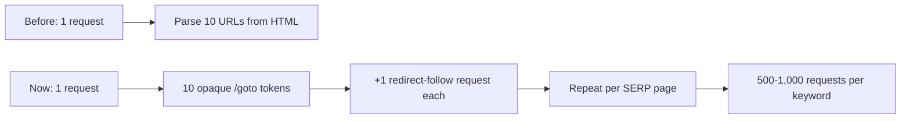

On August 26, 2026, Google confirmed something that half the SEO industry had already noticed in their logs: search result links no longer point at your website. They point at `google.com/goto?url=[opaque token]`, which then redirects the visitor onward.

Your rankings didn't change. Your traffic didn't change. Searchers land on exactly the same page they always did. But the machinery that tells you *where you rank* just got a lot more expensive to run — and that bill is going to land on your dashboard, whether or not anyone tells you about it.

Here's what actually happened, and what to do about it before your Monday reporting meeting turns awkward.

## What the google.com/goto redirect actually is

The change is simple to describe. Where a result link used to be `https://yoursite.com/pricing`, it's now a Google-owned endpoint carrying an encoded token that resolves to your URL. Click it and you get a server-side redirect to the real destination. From a searcher's perspective, nothing is different.

The behavior started as an intermittent test back in July 2026 and ran on and off for roughly four months. Rank tracking firm Nozzle logged near-total coverage across multiple residential IP providers on the same day Google confirmed it. So this isn't a slow rollout you can wait out — it's already the default state of the SERP.

Google's official comment was deliberately vague: a reference to its long history of technical measures against evolving forms of abuse. No mention of scrapers, rank trackers, or AI companies. But the mechanism tells you everything the statement doesn't.

**The tokens can't be decoded.** They can only be *followed*. That single design decision is the whole story.

## Why one design choice costs 500-1,000x

Think about how SERP scraping used to work. One HTTP request fetches a results page. The HTML contains ten destination URLs sitting right there in plain text. Parse them, done. One request, ten data points.

Now the HTML contains ten opaque tokens. To know which site sits at position 3, a tool has to issue a separate request per link and watch where the redirect lands. Ten links means eleven requests instead of one. And most rank tracking doesn't stop at page one — a five-page ranking check now needs somewhere between 500 and 1,000 requests where it previously needed a handful.

The ratio SEO analysts have landed on is roughly **1 : 10 : 510-1,010**. That's the request cost per tracked keyword before the test, during it, and now.

Nobody absorbs a three-orders-of-magnitude cost increase quietly. SISTRIX has already been pushed into an added-cost tracking workaround. Other vendors are making the same call right now, and they have exactly three levers to pull:

1. **Raise prices.** Straightforward, unpopular.
2. **Reduce crawl frequency.** Daily rank checks quietly become every-three-days.
3. **Sample instead of resolving.** Track fewer positions, fewer pages, fewer locations — and interpolate the rest.

Options 2 and 3 are the dangerous ones, because they degrade your data without changing the shape of your dashboard. The line chart still updates. It's just built on thinner evidence than it was last month.

## The good news: your actual SEO is untouched

Before anyone panics in a client call, let's be precise about what did *not* change.

**Rankings are unaffected.** The redirect is a link-rendering change in the results page. It has nothing to do with how Google evaluates or orders your pages. If your positions moved in late August, look for the August spam update, not for `/goto`.

**Referrer data appears to survive.** Independent testing across ten device and browser combinations found the referrer came through every single time, with visits still classified as Organic Search in Google Analytics. The redirect stays on Google's own domain, so what your analytics receives still reads as Google.

I'd add one honest caveat there: that's third-party testing, not a Google guarantee. Edge cases — unusual privacy settings, aggressive referrer policies, in-app browsers — could still push some organic sessions into the Direct bucket. Worth watching your Direct/(none) channel for an unexplained bump over the next few weeks. If it's flat, you're fine.

**Your Search Console data is completely unaffected.** GSC clicks and impressions are measured by Google, inside Google. The redirect changes nothing about that pipeline. Which, conveniently, points directly at the fix.

## SEO and search implications: the measurement stack is the real story

Here's where I'd push back on most of the coverage I've read this week. Nearly every article on `/goto` answers two questions — "does it hurt my rankings?" (no) and "does it break attribution?" (probably not) — and then stops. Both answers are correct and both are the least interesting part of this.

The interesting part is second-order. Rank tracking has, for twenty years, been a cheap commodity. That's *why* it became the default proxy for SEO performance in every agency report and every executive dashboard. When the cost of producing that data rises by 500-1,000x, the economics that made it the default quietly stop holding.

So the practical question isn't "is `/goto` bad for SEO." It's: **how much of your reporting rests on data you don't own, collected by a method Google just made expensive and is under no obligation to keep permitting?**

This isn't an isolated move, either. It's the same pattern we covered when Cloudflare flipped its default to block AI crawlers on ad-serving pages — infrastructure owners closing off free bulk access to data they'd previously left open. Different actor, identical logic.

[→ Read also: Cloudflare's Sept 15 AI Crawler Block: Audit Your Site Now](/blog/cloudflare-ai-crawler-block-september-2026-seo-audit/)

The web's big platforms are all making the same bet at the same time: unmetered machine access to their content and their interfaces is over. If your workflow depends on scraped data, it's now sitting on a foundation someone else controls and is actively hardening.

## How to rebuild your measurement on ground truth

The fix isn't complicated. It's mostly a shift in what you treat as the *primary* number versus the supporting one.

### 1. Make Search Console your source of truth, not your sanity check

Clicks, impressions, average position, and CTR in GSC come straight from Google's own measurement, and no scraping is involved anywhere in that chain. Move these to the top of your reports. Move third-party rank position to a supporting role.

Yes, GSC's average position is an average across queries and locations and can look mushier than a crisp "position 4." That mushiness is honesty, not a defect. A single scraped position from one datacenter IP in one location was always a narrower slice of reality than it appeared to be.

### 2. Set up the Bulk Data Export to BigQuery

This is the step most teams keep meaning to do. Do it this week.

In Search Console: **Settings → Bulk Data Export**, then link a Google Cloud project with BigQuery enabled. From that point GSC exports your full performance dataset daily — no 1,000-row UI cap, no manual pulls, and crucially, no 16-month expiry wiping your history.

You end up with a queryable dataset in your own Cloud project. You can join it to business data, define your calculations once in SQL, and keep years of history instead of rolling 16 months. Two things to keep in mind: anonymized queries are excluded from the export, and you're paying BigQuery storage and query costs (small for most sites, but not zero — set a budget alert).

### 3. Read your server logs

If you want to know which bots hit you, when, and what they got, the answer is in your access logs — and no intermediary can degrade or reprice that. Log analysis tells you crawl frequency, crawl waste, status-code patterns, and which of your templates Googlebot is actually spending its budget on. It's the one dataset in your stack that's genuinely yours.

### 4. Keep rank tracking, but demote it and interrogate it

I'm not telling you to cancel your Semrush or Ahrefs subscription. Competitive visibility, SERP feature tracking, and share-of-voice are real jobs that GSC simply can't do — GSC only knows about *you*.

But do ask your vendor two direct questions: *has your check frequency changed since late August, and are you resolving every position or sampling?* A vendor who answers clearly is one you can keep trusting. Vague reassurance is itself an answer.

### 5. Watch your Direct channel for four weeks

Cheap insurance. Set a note in your analytics and compare Direct/(none) sessions against the same period before August 26. A meaningful unexplained rise suggests referrer leakage in some browser or device combination that testing hasn't caught yet.

## Common mistakes to avoid right now

**Don't try to "fix" anything on your site.** There is nothing to fix. No redirect rule, no canonical change, no robots.txt edit affects this. If a tool or a consultant offers you a technical remediation for `/goto` on your own pages, that's a red flag.

**Don't attribute August ranking movement to this.** Two things happened in late August 2026: the spam update and the `/goto` rollout. Only one of them touches rankings. Mixing them up leads to fixing the wrong problem for a month.

**Don't strip or rewrite the referrer.** Some teams' first instinct is to add referrer-policy tweaks defensively. Don't — you'd be creating the attribution gap you're trying to prevent.

**Don't assume your dashboards are still telling you what they told you in July.** This is the one that actually costs money. A rank chart that silently changed from daily to every-third-day sampling looks identical to one that didn't. Ask.

## Conclusion

The `google.com/goto` redirect is a rare kind of SEO story: genuinely important, and genuinely not about your website. Your rankings are fine. Your traffic is fine. What changed is the price of *observing* the SERP from outside — and that price went up by a factor of five hundred to a thousand overnight.

The teams that come out of this ahead won't be the ones who found a clever workaround. They'll be the ones who used it as the nudge to stop treating scraped rank positions as the primary measure of organic performance, and moved their reporting onto data Google hands them directly: Search Console, exported to BigQuery, joined to their own server logs.

That stack was always the more defensible one. It just took Google making the alternative expensive for most of us to finally build it.

[→ Read also: llms.txt in 2026: 300K Domains Say It Does Nothing](/blog/llms-txt-2026-does-it-work-what-to-do-instead/)

## FAQ

**Does the google.com/goto redirect hurt my rankings?**
No. It's a change to how result links are rendered in the SERP, not to how Google ranks pages. Position, indexing, and crawl behavior are all unaffected.

**Will my Google Analytics still show organic search traffic correctly?**
In testing across ten device and browser combinations, the referrer was preserved every time and sessions were classified as Organic Search. The redirect stays on google.com, so the referrer your analytics receives still reads as Google. Monitor your Direct channel anyway as a precaution.

**Why did Google do this?**
Google's only public comment referenced technical measures against evolving forms of abuse. Because the tokens can be followed but not decoded, the practical effect is to make bulk SERP scraping 500-1,000x more request-intensive — which the search community broadly reads as an anti-scraping measure.

**Do I need to change anything on my website?**
No. There is no site-side action to take. Any recommended "fix" for `/goto` on your own pages is unnecessary.

**Is my rank tracking tool broken?**
Not broken, but more expensive to operate. Vendors are responding with price increases, reduced check frequency, or sampling. Ask yours directly which one applies to your plan, since reduced frequency won't be visible in the dashboard.

**What should I measure instead?**
Make Search Console clicks, impressions, average position, and CTR your primary metrics, exported daily to BigQuery for unlimited history. Add server log analysis for crawl behavior. Keep third-party rank tracking for competitive and SERP-feature visibility, but treat it as supporting evidence rather than ground truth.
