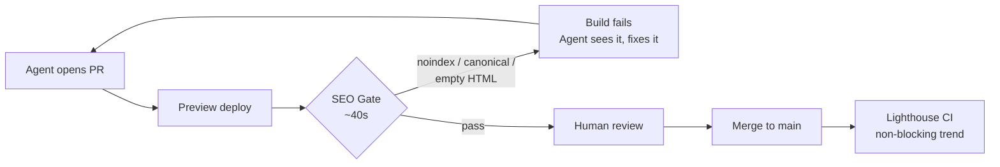

A coding agent refactors your layout component on a Tuesday afternoon. The diff looks clean, the tests pass, the preview deploy renders beautifully. Three weeks later you notice organic traffic to your blog templates has quietly fallen off a cliff — because somewhere in that refactor, a `robots` meta tag got hoisted into a shared layout and every article page has been serving `noindex` since Tuesday.

Nobody reviewed it. Nobody *could* have reviewed it, not really. The PR touched 40 files and your reviewer had six more in the queue.

This is the failure mode that SEO regression testing exists to catch, and 2026 is the year it stopped being a nice-to-have. Not because Google changed anything — but because the volume and velocity of code hitting your production templates changed completely.

## Why This Broke in 2026 Specifically

The numbers are blunt. As of mid-2026, roughly **90% of professional developers use AI coding agents at work at least weekly, and 68% use them daily**, according to JetBrains' adoption research. Claude Code alone is now used about twice as often as GitHub Copilot at work. Agentic coding went from "interesting experiment" to "default workflow" in about eighteen months.

Throughput went up accordingly. Empirical work across large enterprises found AI-assisted developers producing commits at **three to four times** their previous rate. That's the upside everyone talks about.

Here's the part that matters for your rankings: quality per unit of code did not keep pace. Pull requests containing AI-assisted code carry roughly **1.7x more issues** than human-written equivalents. Organizations report technical debt climbing **30–41% within six months** of broad AI tool adoption. One large-scale study tracking AI-generated code in the wild found unresolved issues growing from a few hundred in early 2025 to over 100,000 surviving issues by February 2026. On the security side, Veracode's testing across 100+ models found about **45% of AI-generated code samples introduce an OWASP Top 10 vulnerability**.

Security teams responded to this within about a quarter. They added SAST gates, dependency scanning, secret detection — automated, blocking, non-negotiable. SEO teams mostly did not. Most SEO "review" in 2026 is still a human squinting at a staging URL, if it happens at all.

So you have 3–4x more code changing your templates, reviewed by the same number of people, with no automated gate protecting the handful of HTML elements that determine whether Google indexes your site. That's not a tooling gap. That's a structural one.

## The Four Regressions That Actually Cost You Traffic

Not every SEO issue deserves a build failure. Most don't. If you gate on everything, your team disables the gate within a month — that's just how developer tooling works.

What deserves a red build is the short list of changes that are **silent, site-wide, and expensive to recover from**. Four of them.

**A `noindex` reaching production.** Usually inherited from a staging config, a feature flag default, or an agent copying a pattern from a page where `noindex` was correct. Deindexing is fast; recovery takes weeks of re-crawl. This is the single highest-cost regression on the list and it's trivially detectable.

**A canonical that points somewhere wrong.** Self-referencing canonicals dropped during a component refactor, or worse, a whole template canonicalising to the homepage because someone hardcoded a base URL. Google consolidates your signals into the wrong URL and your long tail evaporates.

**A `robots.txt` disallow on a priority path.** One line. Often added to block a genuinely useless path, with a pattern broad enough to catch `/blog/` too.

**A render regression that empties the HTML.** This one is framework-specific and the most likely to come from an agent. A `<Suspense>` boundary placed too high, a `use client` directive added to fix a hydration warning, a data fetch moved from server to client to "simplify" a component. The page still looks perfect in your browser. The server-rendered HTML is now an empty shell — and while Googlebot will usually render it eventually, **GPTBot, ClaudeBot, and PerplexityBot execute essentially no JavaScript**. Your content just left the AI answer layer entirely, and nothing in your analytics will tell you.

If you've read our breakdown of how ISR shell behavior affects crawlers, this category should feel familiar — the Cache Components changes made the boundary between "streamed to a crawler" and "invisible to a crawler" a per-`await` decision. That's a lot of decisions for an agent to get right unsupervised.

[→ Read also: 9 Next.js 16.3 Changes That Quietly Affect Your SEO](/blog/nextjs-16-3-seo-changes-2026/)

## Build the Fast Gate First

The most common mistake here is starting with Lighthouse. Don't.

A full Lighthouse run takes minutes, produces scores that fluctuate between runs, and generates enough noise that developers learn to ignore it. A five-second HTML assertion that catches a missing canonical is worth more than a seven-minute audit nobody waits for. Speed is what determines whether the gate survives contact with a real team.

So: two tiers. A fast blocking lint on every PR, and a slower non-blocking audit on merge to main.

Here's the fast tier as a Playwright spec. Point it at your preview deployment, cover one URL per template — not every URL, just one representative page per route type.

```ts
// tests/seo.spec.ts
import { test, expect } from '@playwright/test';

const BASE = process.env.PREVIEW_URL!;

const TEMPLATES = [
  { name: 'home',     path: '/' },
  { name: 'article',  path: '/blog/seo-regression-testing-2026-ci-guardrails-ai-code' },
  { name: 'category', path: '/blog/' },
  { name: 'product',  path: '/pricing' },
];

for (const t of TEMPLATES) {
  test(`[${t.name}] is indexable and self-canonical`, async ({ page }) => {
    const res = await page.goto(BASE + t.path, { waitUntil: 'commit' });
    expect(res?.status()).toBe(200);

    // 1. Nothing may ship noindex.
    const robots = await page.locator('meta[name="robots"]').getAttribute('content');
    expect(robots ?? '').not.toMatch(/noindex/i);

    // 2. Canonical must exist, be absolute, and match this path.
    const canonical = await page.locator('link[rel="canonical"]').getAttribute('href');
    expect(canonical, 'missing canonical').toBeTruthy();
    expect(new URL(canonical!).pathname).toBe(t.path);

    // 3. Exactly one H1, non-empty title.
    await expect(page.locator('h1')).toHaveCount(1);
    expect((await page.title()).trim().length).toBeGreaterThan(10);
  });
}
```

Three assertions. Two of them would have caught the Tuesday afternoon incident.

Now the render check — the one most teams skip, and the one that guards your AI-search visibility. The trick is to fetch the raw HTML with `fetch`, not through the browser, so you see exactly what a non-rendering crawler sees.

```ts
test('[article] ships real content in server-rendered HTML', async ({ request }) => {
  const res = await request.get(BASE + '/blog/seo-regression-testing-2026-ci-guardrails-ai-code');
  const html = await res.text();

  // Strip scripts — RSC payloads and JSON blobs inflate the byte count and lie to you.
  const visible = html
    .replace(/<script[\s\S]*?<\/script>/gi, '')
    .replace(/<[^>]+>/g, ' ')
    .replace(/\s+/g, ' ')
    .trim();

  expect(visible.length, 'server HTML looks like an empty shell').toBeGreaterThan(1500);
  expect(html).toContain('<h1');
  expect(html).toMatch(/application\/ld\+json/);
});
```

That `visible.length` threshold is the assertion that fails when an agent moves your article body behind a client component. Tune the number to your shortest real template and leave it alone.

Wire both into GitHub Actions as a blocking job:

```yaml
# .github/workflows/seo-gate.yml
name: SEO Gate
on: [pull_request]

jobs:
  seo:
    runs-on: ubuntu-latest
    steps:
      - uses: actions/checkout@v4
      - uses: actions/setup-node@v4
        with: { node-version: 22, cache: npm }
      - run: npm ci
      - run: npx playwright install --with-deps chromium
      - name: Run SEO assertions against preview
        env:
          PREVIEW_URL: ${{ github.event.deployment_status.target_url || vars.PREVIEW_URL }}
        run: npx playwright test tests/seo.spec.ts
```

Add one more guard outside the browser entirely — a diff check on `robots.txt`. It costs nothing and catches the one-line disaster:

```bash
# fails the build if a Disallow lands on a priority path
git diff origin/main -- public/robots.txt \
  | grep -E '^\+Disallow: /(blog|products|docs)' \
  && { echo "::error::Disallow added to a priority path"; exit 1; } || true
```

Once that's green and stable, add Lighthouse CI on merge to main for Core Web Vitals trending — non-blocking, just tracked. Field data from CrUX is still what actually matters for ranking, and lab scores mostly tell you when something moved.

[→ Read also: Cumulative Layout Shift in 2026: Why CLS Now Tanks Your Whole Site](/blog/cumulative-layout-shift-2026-fix-guide-site-wide-cwv/)



## SEO & Search Implications

Worth being precise about what this buys you, because "add tests" is the kind of advice that's easy to agree with and easy to under-value.

The first effect is **compressed time-to-detection**. A `noindex` caught in CI costs one build. The same `noindex` caught by a GSC coverage alert costs whatever your re-crawl and reindex cycle is — typically two to six weeks for the affected templates, longer on a site with thin crawl demand. The SEO damage isn't the bug, it's the detection latency. You're not preventing mistakes; you're changing how long they live.

The second is **AI-answer visibility**, and this one is newer. The render assertion above is functionally a GEO/AEO control. Traditional Googlebot has a rendering queue and will eventually catch client-rendered content. The AI crawlers feeding ChatGPT, Claude, and Perplexity largely don't — they take your server HTML and move on. A hydration-related refactor that Googlebot shrugs off can remove you from AI answers entirely, with no error in Search Console, no drop in your rank tracker, and no signal anywhere until someone notices a decline in referral traffic months later. Given how much of the crawl budget on high-traffic sites AI bots now consume, an empty shell is an expensive thing to serve them.

[→ Read also: llms.txt in 2026: 300K Domains Say It Does Nothing](/blog/llms-txt-2026-does-it-work-what-to-do-instead/)

Third, and most underrated: **the gate is a feedback channel an agent can read**. A failing build with a message like `missing canonical` is structured, immediate, and machine-consumable. The agent reads the CI output, understands the constraint, and fixes it — often without a human touching the PR. Prose in a wiki that says "please remember canonicals" is not a control. A red check is.

That last point suggests a second layer worth adding. Put the same rules in your `AGENTS.md` or `CLAUDE.md`, so the constraint arrives *before* the code is written rather than after:

```markdown
## SEO constraints (non-negotiable)

- Never add `noindex` to a shared layout or template component.
  Page-level only, and only when explicitly requested.
- Every indexable route must render a self-referencing absolute canonical.
- Article and product bodies must render on the server.
  Do not convert a content-rendering server component to a client component.
- Do not move H1 text into a client-only component or an effect.
- Schema (JSON-LD) lives in server components. Never in useEffect.
```

Belt and braces. The file shapes what gets generated; the CI gate catches what slips through anyway. Neither alone is sufficient, and I'd argue the file is the weaker of the two — instructions get truncated, ignored, or contradicted by the surrounding code patterns. The test doesn't have moods.

## Where Teams Get This Wrong

**Gating on too much.** The first version of this always includes image alt coverage, word count minimums, meta description length, heading hierarchy depth. Then a legitimate PR fails on a decorative image missing an alt attribute, someone adds `--skip-seo`, and the gate is dead. Ship four assertions. Add a fifth only after a real incident proves you needed it.

**Testing production instead of the preview.** If you only check production, you've built a monitor, not a gate. Useful — but it tells you about damage rather than preventing it. Run against the PR's preview deployment.

**Ignoring the staging-config problem.** Many teams serve `noindex` site-wide on preview deploys, which makes the noindex assertion fail everywhere and get disabled. Fix this by driving `noindex` from an env var and setting it to production values on the URL the test hits, or by asserting against a header your preview environment sets. Don't solve it by dropping the assertion.

**Forgetting structured data.** A single `contains('application/ld+json')` check catches the case where a component refactor silently drops your `@graph`. Cheap.

[→ Read also: Structured Data in 2026: What Still Works After Google's Cuts](/blog/structured-data-2026-what-still-works-after-google-cuts/)

**Running it only on frontend PRs.** Some of the nastiest regressions come from config and infrastructure changes — a middleware rule, a CDN redirect, an edge function. Run the gate on every PR that touches the app.

## Conclusion

SEO regression testing isn't a new idea. What's new is that the assumption it quietly depended on — that a human reads every change to your templates before it ships — stopped being true sometime in 2025, and in 2026 it isn't even close to true. Ninety percent weekly adoption, 3–4x commit velocity, and 1.7x the defect rate per PR is not a workload that careful manual review scales to.

Your security team already worked this out and automated their way through it. The equivalent move for organic search is roughly forty seconds of CI: four assertions on your indexability primitives, one check that your server HTML isn't hollow, and a `robots.txt` diff guard. That's a Friday afternoon of work and it permanently removes the category of traffic loss you only discover a month late.

Write the tests. Then let the agents ship as fast as they want.

## FAQ

**Does SEO regression testing replace regular technical SEO audits?**
No. The gate catches binary, machine-checkable regressions — is it indexable, does the canonical exist, is there content in the HTML. It says nothing about search intent, content quality, internal linking strategy, or whether your information architecture makes sense. Different job entirely.

**How many URLs should the gate cover?**
One per template, not one per page. Four to eight URLs covers most sites. The failures you're guarding against are template-level by nature — that's precisely why they're expensive.

**Will this slow the pipeline down?**
The fast tier runs in roughly 30–60 seconds against a warm preview deploy. Keep Lighthouse out of the blocking path and you won't notice it.

**Can I run this against a site I don't control the CI for?**
You can run the same Playwright spec on a schedule against production as an external monitor. Weaker — it detects rather than prevents — but far better than nothing, and it's a reasonable first step while you negotiate pipeline access.

**Does any of this help with AI Overviews or ChatGPT citations?**
The server-render assertion does, directly. Most AI crawlers don't execute JavaScript, so a template that only renders client-side is invisible to them regardless of how well it ranks in classic search. Guarding server HTML is one of the few genuinely mechanical AEO controls available.

```json
{
  "@context": "https://schema.org",
  "@type": "BlogPosting",
  "headline": "SEO Regression Testing in 2026: Guardrails for AI-Written Code",
  "description": "SEO regression testing is no longer optional. With 90% of devs shipping AI-written code weekly, here's how to gate noindex, canonical, and render bugs in CI.",
  "datePublished": "2026-09-11",
  "dateModified": "2026-09-11",
  "keywords": "SEO regression testing, CI/CD SEO checks, AI coding agents, technical SEO, JS SEO, Playwright SEO tests"
}
```
