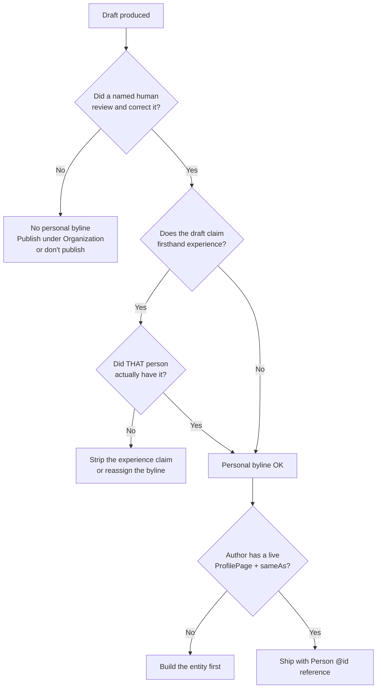

Your CMS has an author field. Somebody typed a name into it once, maybe three years ago, and nobody has thought about it since. Meanwhile an agent drafted four of last week's posts and they all went out under that same name.

Here's the uncomfortable question nobody on your team wants to answer out loud: is that byline true? And can a machine verify it either way?

Author entity SEO is the discipline that sits between those two questions. It's not about adding a headshot to a bio box. It's about whether the person credited on a page resolves to a real, disambiguated entity that Google and AI search systems can connect to a track record — and whether your publishing process can honestly stand behind the connection. In 2026 both halves got noticeably harder to fake.

## The byline stopped being decoration

For most of the last decade, author bios were a checkbox. You wrote "5 years of experience in digital marketing," dropped in a stock avatar, and moved on. Nobody audited it because nothing downstream depended on it.

That changed for a boring, mechanical reason: search systems now need to attribute content to *something* in order to trust it. Traditional ranking could get away with evaluating a page in isolation. Generative systems answering a question have to decide whose claim to repeat, and "some website said so" is a weak provenance chain. An identifiable person with a traceable history is a stronger one.

The data is suggestive rather than conclusive here, and it's worth being precise about that. A May 2026 study of 153,425 AI citations found roughly 77% of cited URLs sat *outside* the organic top 10 — the page that gets quoted often isn't the page that ranks. Separately, an Ahrefs analysis of around six million URLs found AI-cited pages were close to three times more likely to carry JSON-LD than non-cited pages. Neither of those proves author markup causes citations. Correlation, sample bias, the usual caveats all apply. But both point the same direction: machine-readable provenance is doing work that raw ranking position isn't.

And Google has been consistent about one thing — author identity is not a direct ranking signal. They've said it repeatedly and there's no reason to disbelieve them. The value isn't a lever you pull. It's entity resolution: helping search systems figure out *which* Sarah Chen wrote this, and what else she's credibly written.

## What actually changed in 2026

Three things, and they stack.

**February 1, 2026 — Google added an Authors section to Search Central documentation.** That's the part most teams missed. Google doesn't create a documentation section for something it considers irrelevant. The guidance itself is unglamorous: use Article, NewsArticle, or BlogPosting types; include `author`, `datePublished`, `dateModified`, `headline`, and `image`; make sure the author's entity type is correct; point `author.url` at a page that actually explains who this person is; and keep `author.name` to the name itself — not "Dr. Sarah Chen, Senior Content Strategist at Acme." That last one trips up a surprising number of sites, because CMS templates love to concatenate.

**The March 2026 core update re-weighted verifiable experience.** Post-update analysis across multiple independent sources converged on the same pattern: pages with named authors carrying external, checkable profiles held up, while anonymous content and generic "Admin" or "Editorial Team" bylines saw the most volatility. Google also appeared to lean harder on information originality — not "was this AI-generated?" but "does this page contain anything that exists nowhere else?"

**The quality rater guidelines got sharper on misleading authorship.** This is the one with teeth for AI workflows. The guidelines now flag *exaggerated* creator claims, not just outright fabricated ones. Inflated credentials. Manufactured expertise. Implied firsthand experience that didn't happen. If a model writes "in my fifteen years treating patients…" and no clinician was anywhere near the draft, that's a Low rating waiting to happen — and it's the single most likely way an otherwise decent AI-assisted content program shoots itself in the foot.

Notice what's *not* on that list: using AI. Google's position hasn't wobbled. The lowest-quality signal is low-effort, unoriginal, unsupervised content produced at scale — not the tool that typed it.

## Author byline vs. author entity: the gap machines care about

A byline is a string. An entity is a node with edges.

If your page says `"author": "Sarah Chen"`, you've given a search system a string it can't resolve. There are a lot of Sarah Chens. Nothing connects this one to the eleven other articles she wrote, the conference talk, or the LinkedIn profile where her actual job title lives.

Two properties close that gap, and they do different jobs:

- **`sameAs`** answers *who this is*. It's disambiguation — external identifiers that already exist in systems Google trusts. LinkedIn, X, GitHub, a Wikidata Q-ID if there is one, ORCID for academic or medical authors. These are the edges that merge your byline with a known entity instead of creating a new orphan one.
- **`knowsAbout`** answers *what this person is credible on*. It's topical scope, and it's the property people most reliably ruin. Listing thirty topics doesn't say "broad expertise" — it says "no specialty." Five to fifteen genuine topics is the useful range, and referencing each as a Wikidata `@id` rather than a bare string turns a keyword list into actual graph edges.

There's also **`ProfilePage`**, which is the type your author page itself should use. Its only required property is `mainEntity`, pointing at the `Person` (who needs, at minimum, a `name`). Google's own Article documentation says that when `author.url` points to an internal profile page, that page should be marked up with ProfilePage structured data. Most sites skip this and leave `author.url` pointing at a `/author/sarah-chen/` archive page that's just a paginated list of post titles with no markup and no bio. That's a dead end for entity resolution — the link exists, but it resolves to nothing meaningful.

[→ Read also: Structured Data in 2026: What Still Works After Google's Cuts](/blog/structured-data-2026-what-still-works-after-google-cuts/)

## The markup, end to end

Here's a working `@graph` for a single post. The important part isn't the properties — it's the stable `@id` fragments threading the nodes together, so the author node on your article is *the same node* as the one on the profile page rather than a duplicate.

```json
{
  "@context": "https://schema.org",
  "@graph": [
    {
      "@type": "BlogPosting",
      "@id": "https://example.com/blog/post-slug/#article",
      "headline": "Author Entity SEO in 2026",
      "datePublished": "2026-09-12T09:00:00+07:00",
      "dateModified": "2026-09-12T09:00:00+07:00",
      "author": { "@id": "https://example.com/author/sarah-chen/#person" },
      "publisher": { "@id": "https://example.com/#organization" },
      "mainEntityOfPage": { "@id": "https://example.com/blog/post-slug/#webpage" }
    },
    {
      "@type": "Person",
      "@id": "https://example.com/author/sarah-chen/#person",
      "name": "Sarah Chen",
      "url": "https://example.com/author/sarah-chen/",
      "jobTitle": "Principal Technical SEO",
      "description": "Technical SEO lead focused on JavaScript rendering and structured data.",
      "knowsAbout": [
        { "@type": "Thing", "name": "Search engine optimization",
          "@id": "https://www.wikidata.org/wiki/Q180711" },
        { "@type": "Thing", "name": "JavaScript",
          "@id": "https://www.wikidata.org/wiki/Q2005" },
        { "@type": "Thing", "name": "Structured data",
          "@id": "https://www.wikidata.org/wiki/Q26256362" }
      ],
      "sameAs": [
        "https://www.linkedin.com/in/example-sarah-chen/",
        "https://github.com/example-sarahchen",
        "https://x.com/example_schen"
      ],
      "worksFor": { "@id": "https://example.com/#organization" }
    }
  ]
}
```

And on the author page itself:

```json
{
  "@context": "https://schema.org",
  "@type": "ProfilePage",
  "@id": "https://example.com/author/sarah-chen/#webpage",
  "dateCreated": "2023-04-11T10:00:00+07:00",
  "dateModified": "2026-09-12T09:00:00+07:00",
  "mainEntity": { "@id": "https://example.com/author/sarah-chen/#person" }
}
```

Three rules that matter more than the JSON:

1. **One canonical Person node per human**, referenced by `@id` everywhere else. Don't inline a fresh `Person` object into every article — that's how you end up with 400 slightly-different Sarah Chens in a crawl.
2. **Every `sameAs` URL must be live, public, and actually about that person.** A 404 or a private profile is worse than omitting the property, because you've asserted an edge that doesn't resolve.
3. **The markup has to match the visible page.** If the JSON-LD claims a job title the bio doesn't mention, you've built a discrepancy a rater can spot in five seconds.

## Governance: the part that breaks when an agent drafts

Markup is the easy half. The hard half is deciding who legitimately gets the byline when a model produced the first draft — and that's a process question, not a schema question.

The honest framing: **the byline is a claim of accountability, not a claim of keystrokes.** Nobody thinks a bylined author personally operated the CMS, sourced every stat, and cut the images. What the byline asserts is that a named person stands behind the content — reviewed it, corrected what was wrong, and can defend it. That standard survives AI drafting perfectly well. What it doesn't survive is nobody doing the reviewing.

So the practical gate looks like this:



Three things fall out of that flow that are worth stating plainly.

**Organization-level attribution is a legitimate answer, not a cop-out.** If a piece is a straightforward reference explainer with no experiential claims and no single owner, crediting the organization is more honest than inventing a persona. What you must not do is invent a fake human with a generated headshot and fabricated credentials — that's precisely the "exaggerated creator claims" pattern the rater guidelines now target.

**Experience claims are the tripwire.** Scan drafts for first-person experiential language — "when I migrated," "in my testing," "we saw a 40% lift" — and verify each one against the actual bylined human. This is the check most content ops teams don't have, and it's the one with the clearest downside risk.

**Author entity work belongs in the pre-publish checklist, not a quarterly cleanup.** A missing `sameAs` on one post is noise. A CMS template that drops the `Person` reference across every post published since the last theme update is a site-wide problem you'll find eight weeks late. If you've already got automated SEO checks running in CI, an assertion that every article's JSON-LD resolves to a known author `@id` costs almost nothing to add.

[→ Read also: The Technical SEO Playbook for AEO: Why AI Crawlers Can't Read Your Best Content](/blog/technical-seo-playbook-ai-crawlers-aeo-2026/)

## Mistakes that quietly cost you

**The `/author/` archive that isn't a profile.** Default WordPress and most headless setups generate an author archive: a paginated list of posts, no bio, no markup, sometimes `noindex`. Then `author.url` points at it. You've built a link to an empty room. Fix the page before you fix the schema.

**Author name concatenation.** `"name": "Sarah Chen, MBA — Head of Growth"` is a formatting habit, not a name. Split it: `name`, `jobTitle`, `honorificSuffix`.

**Credential inflation because it "reads better."** "Over a decade of experience" when it's four years is exactly the mild exaggeration the 2026 rater guidance now treats as a Low signal. The upside of the stronger phrasing is approximately zero. The downside isn't.

**One shared "Editorial Team" account for everything.** It's convenient and it's an entity dead end — no external profiles, no topical specialty, nothing to resolve against. If you genuinely publish collectively, use Organization attribution properly rather than a fake person.

**Treating the author page as a bio and nothing else.** The pages that actually build an author entity link outward and get linked back: talks, podcast appearances, guest posts, open-source commits, a conference bio on someone else's domain. `sameAs` is a pointer to corroboration that exists elsewhere. If nothing exists elsewhere, the pointer has nowhere to point.

[→ Read also: 8 Headless CMS SEO Mistakes That Kill Indexing in 2026](/blog/headless-cms-seo-mistakes-2026-indexing-fixes/)

## Where this actually lands

Author entity SEO isn't a ranking hack, and anyone selling it as one is overpromising. Google says author identity isn't a direct ranking signal, and that's probably true. What's also true is that when a system has to choose whose sentence to quote in an answer, it does better with a page it can attribute to a resolvable person with a visible track record than one it can't attribute at all — and the 2026 evidence, imperfect as it is, keeps pointing that way.

The work splits cleanly. One half is markup: a single canonical `Person` node per human, threaded by `@id`, carrying honest `sameAs` edges and a tight `knowsAbout` list, with a real ProfilePage on the other end of `author.url`. That's an afternoon of template work and it stays done.

The other half is the one that'll take longer, because it's a process change: deciding, as a policy, that no byline goes out without a named human who actually reviewed it — and scanning for experience claims that human can't back. Agents will keep writing more of the first draft. The accountability layer is the part that has to stay human, and in 2026 it's also the part search systems have gotten measurably better at checking.

Start with your five highest-traffic posts. Check who's credited, whether that person's `@id` resolves, and whether the profile on the other end says anything a stranger could verify. That audit usually takes twenty minutes and tells you exactly how much of the rest of this you need.

## FAQ

**Is author schema a ranking factor?**
No — Google has repeatedly said author identity isn't a direct ranking signal. Its function is entity resolution: helping search systems connect a byline to a known person with a track record. The observed benefits show up in attribution and AI citation contexts, not as a rank boost you can isolate.

**Can I publish AI-assisted content under a real person's name?**
Yes, provided that person genuinely reviewed, corrected, and stands behind it. Google's policy targets low-effort unsupervised content, not the drafting tool. The line you can't cross is claiming firsthand experience the bylined person didn't have.

**What if we don't have named authors at all?**
Use Organization attribution with proper `Organization` markup and a real publisher entity. That's an honest answer. Inventing a persona with a generated photo and fabricated credentials is the pattern the 2026 rater guidelines specifically flag.

**Do I need a Wikidata entry for my authors?**
No. Wikidata Q-IDs help disambiguation when they exist, but LinkedIn, GitHub, ORCID, and a personal site are perfectly serviceable `sameAs` targets. Don't create a Wikidata entry for a person who doesn't meet notability criteria — it'll be deleted and you'll have a dead edge.

**How many `knowsAbout` topics should I list?**
Roughly five to fifteen, all genuine. A thirty-item list of tangential topics signals no specialty rather than broad expertise. Referencing each topic by Wikidata `@id` is stronger than a plain string.

**Should the author page be indexable?**
Yes, if it's a real profile with substance. Many setups `noindex` author archives to avoid thin-content issues — which is reasonable for an empty paginated list, but self-defeating once you've built an actual ProfilePage that `author.url` depends on.
