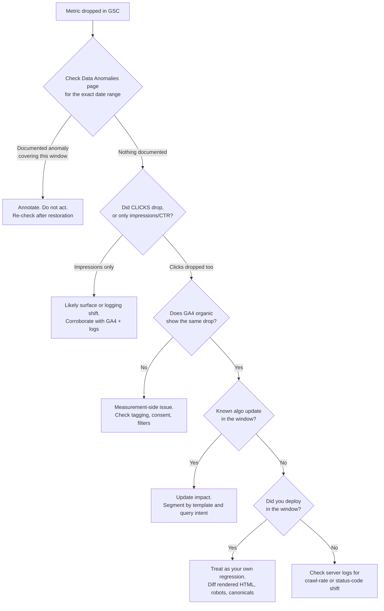

# Search Console Anomalies Broke Your 2026 Year-Over-Year Data

Q4 planning season is here, and somewhere right now an SEO is building a year-over-year impressions chart that is mathematically guaranteed to be wrong. Not slightly wrong. Structurally wrong, in a way no amount of filtering fixes.

Here's why: Google confirmed on April 3, 2026 that a logging error had been inflating Search Console impressions since May 13, 2025. Eleven months. The fix rolled forward — the corrupted history was never recalculated. So every YoY comparison you build between now and roughly May 2027 has one leg standing in a window Google itself has documented as unreliable.

That's not a reason to stop reporting. It's a reason to stop treating Search Console as a source of truth and start treating it like what it actually is: a third-party API with a public incident log. Once you make that mental switch, the engineering work becomes obvious.

## What Actually Broke, and When

Google maintains a [Data anomalies in Search Console](https://support.google.com/webmasters/answer/6211453) page. Most SEOs have never opened it. It reads like a status page for a service you depend on daily, which is exactly what it is.

Pull the 2026-relevant entries together and the picture gets uncomfortable:

- **May 13, 2025 – April 27, 2026** — the big one. A logging error inflated impressions across the Performance report. Clicks were unaffected. Everything *derived* from impressions — CTR, average position — was affected, because the denominator was wrong.
- **June 17, 2025** — AI Mode clicks, impressions, and position data started counting toward totals under the "Web" search type, with no filter to separate it. Ten blue links, featured snippets, AI Overviews, and AI Mode are now blended into one number.
- **September 12, 2025** — Google killed the `&num=100` parameter. Rank trackers had been scraping 100 results per request, and every URL on those pages was logging an impression nobody human ever saw. When it died, impressions fell off a cliff industry-wide.
- **April 16–27, 2026** — job listing impressions and clicks went missing.
- **August 13, 2026** — a logging error cut Discover clicks and impressions.
- **August 13–17, 2026** — the Generative AI performance report under-counted impressions. That data was later restored.

Six documented discontinuities in a single trend line. The one that matters most for planning is the eleven-month impression inflation, because it's the only one that was never corrected backwards.

Independent analysis by Passionfruit Labs across 17 properties put the inflation somewhere in the 30–50% range on most sites, with outliers far worse — one property logged 36.3 million impressions against 62,000 clicks, a 0.2% CTR that is almost entirely fictional. Treat those figures as a directional estimate from one agency's portfolio, not a constant you can apply to your own site. Google never published a magnitude, which is precisely the problem.

## Why "Fixed" Doesn't Mean "Corrected"

This is the part that trips people up, so let's be blunt about the arithmetic.

Google repaired the logging going forward. The historical rows in the Performance report still carry the inflated numbers. So your data now looks like this:

| Period | Impressions | Trustworthy? |
|---|---|---|
| Before May 13, 2025 | Clean | Yes |
| May 13, 2025 – Apr 27, 2026 | Inflated (magnitude unknown) | No |
| After Apr 27, 2026 | Clean | Yes |

Now try a normal YoY comparison in October 2026. You're comparing clean October 2026 against inflated October 2025. Your chart will show a decline. That decline is a data-quality correction, not a performance drop — but nothing in Search Console's UI tells you that, and nobody on your leadership team is going to intuit it.

The first genuinely clean year-over-year impression comparison you can run is **May 2026 vs May 2027**. Everything before that is comparing a repaired meter against a broken one.

Clicks, meanwhile, were never affected. Which means the honest short-term move is boring and correct: make clicks your primary KPI, demote impressions to a directional signal, and stop putting CTR in executive summaries until you have two clean quarters on both sides.

## The August 2026 Case Study: A Bug and an Update in the Same Week

If you want a single example of why ad-hoc interpretation fails, look at last month.

The Generative AI report under-counted impressions from **August 13 to August 17**. The August 2026 spam update rolled out from **August 18 to August 21**. And the Discover logging error hit **August 13**.

So a site owner opening Search Console on August 22 saw a dip spanning roughly ten days and had at least three plausible explanations sitting on top of each other — a reporting defect, an algorithmic update, or a regression they shipped themselves. Guess wrong and you either panic-rewrite content that was fine, or you ignore a real spam-update hit for a month while telling everyone "it's just the bug."

You cannot resolve that by staring at a line chart. You resolve it with a decision procedure and independent data sources.



## Build a Reporting Layer That Survives the Next One

There will be a next one. Five anomalies in five months isn't a fluke, it's a base rate. So build for it.

### 1. Own your own copy of the data

Search Console's UI gives you 16 months and a 1,000-row cap. The **Bulk Data Export to BigQuery** gives you every row, daily, forever — and critically, it gives you a snapshot taken *before* any future "going forward only" fix lands. Had more teams been exporting in 2025, the actual inflation magnitude would be a solved question instead of an agency estimate.

Settings → Bulk Data Export → link a Google Cloud project with BigQuery enabled. First 10 GiB of storage per month is free, and for most sites the query cost is rounding-error territory. There is no reason not to have done this yesterday.

You get two tables in the `searchconsole` dataset: `searchdata_site_impression` (property-level) and `searchdata_url_impression` (URL-level, with the appearance flags and the `url` column).

### 2. Make anomalies a first-class dimension

This is the bit almost nobody does, and it's the whole trick. Stop keeping the anomaly list in a Confluence page that goes stale. Put it in the warehouse next to the metrics, as a table you join against.

```sql
CREATE OR REPLACE TABLE `myproject.searchconsole.data_anomalies` AS
SELECT * FROM UNNEST([
  STRUCT(DATE '2025-05-13' AS start_date, DATE '2026-04-27' AS end_date,
         'impressions' AS affected_metric, 'inflated' AS direction,
         'Logging error inflated impressions. Never corrected retroactively.' AS note),
  STRUCT(DATE '2025-06-17', DATE '9999-12-31',
         'impressions', 'blended',
         'AI Mode merged into Web search type. No native filter.'),
  STRUCT(DATE '2025-09-12', DATE '2025-09-12',
         'impressions', 'deflated',
         'num=100 deprecated. Scraper impressions removed. Step change, not a drop.'),
  STRUCT(DATE '2026-04-16', DATE '2026-04-27',
         'impressions', 'missing',
         'Job listing appearance types not logged.'),
  STRUCT(DATE '2026-08-13', DATE '2026-08-13',
         'impressions', 'deflated',
         'Discover logging error.'),
  STRUCT(DATE '2026-08-13', DATE '2026-08-17',
         'impressions', 'deflated',
         'Generative AI performance report under-counted. Later restored.')
]);
```

Now every reporting query carries its own health warning:

```sql
SELECT
  d.data_date,
  SUM(d.clicks)                                       AS clicks,
  SUM(d.impressions)                                  AS impressions,
  SAFE_DIVIDE(SUM(d.clicks), SUM(d.impressions))      AS ctr,
  SAFE_DIVIDE(SUM(d.sum_top_position), SUM(d.impressions)) + 1 AS avg_position,
  LOGICAL_OR(a.start_date IS NOT NULL)                AS impressions_contaminated,
  STRING_AGG(DISTINCT a.note, ' | ')                  AS anomaly_notes
FROM `myproject.searchconsole.searchdata_site_impression` d
LEFT JOIN `myproject.searchconsole.data_anomalies` a
  ON d.data_date BETWEEN a.start_date AND a.end_date
 AND a.affected_metric = 'impressions'
GROUP BY d.data_date
ORDER BY d.data_date;
```

Two things happen once you ship this. Your BI layer can grey out or hatch contaminated ranges automatically, so a stakeholder physically cannot read a corrupted period as performance. And the YoY guard becomes trivial — if either leg of the comparison returns `impressions_contaminated = TRUE`, the dashboard suppresses the impressions delta and shows the clicks delta instead.

Notice the `avg_position` formula, by the way. It's `sum_top_position / impressions + 1`, not an average of an average. Plenty of homegrown GSC dashboards get this wrong and then wonder why their numbers don't match the UI.

### 3. Corroborate with something Google doesn't control

One source of truth is one point of failure. Three independent signals and you can triangulate:

- **GA4 organic sessions.** Clicks and sessions should track. When GSC clicks hold steady and GA4 sessions collapse, you have a tagging or consent problem, not a search problem.
- **Server logs.** Crawl rate, status-code distribution, and bot identity live here and nowhere else. If Googlebot's request volume to a template fell before your impressions did, that's a crawlability story — and it's also where you'll see AI crawlers, which matters more every quarter. We went deep on that side of the log file in [→ Read also: Cloudflare's Sept 15 AI Crawler Block: Audit Your Site Now](/blog/cloudflare-ai-crawler-block-september-2026-seo-audit/).
- **Your own deploy log.** Genuinely the highest-signal dataset most teams never join against performance data. Half of "mysterious" drops line up with a release.

That last point deserves its own guardrail. If your team is shipping frontend code fast — and with AI coding agents in the loop, nearly everyone is — the cheapest anomaly to rule out is the one you caused. Catching a stray `noindex` in CI beats explaining it to your CMO six weeks later: [→ Read also: SEO Regression Testing in 2026: Guardrails for AI-Written Code](/blog/seo-regression-testing-2026-ci-guardrails-ai-code/).

### 4. Write down the rebaselining rule before you need it

Put it in the same doc as your KPI definitions, in plain language:

> Impression-based YoY comparisons are suspended for any window overlapping 2025-05-13 to 2026-04-27. Clicks are the primary organic KPI through Q2 2027. CTR and average position are reported as directional only until we have four clean quarters on both sides.

Agree on that in September, and nobody has to relitigate it in a board meeting in January.

## Mistakes I Keep Seeing

**Treating the correction as a performance drop.** When impressions fall because Google stopped inflating them, that's your dashboard getting more honest. Communicate it proactively, with Google's own statement as the citation, before someone else notices the line going down.

**Assuming the September 2025 level was the real baseline.** It wasn't. Killing `&num=100` removed the scraper layer, but the logging bug was still running underneath. Sites that "rebaselined" in October 2025 rebaselined onto a still-inflated floor.

**Retrofitting a narrative onto contaminated data.** A lot of the "AI Overviews are eating our clicks" analysis from 2025 was built on an inflated impression denominator. AI Overviews do affect click behaviour — but the magnitude everyone quoted was measured with a broken instrument. Hold your priors loosely when the underlying metric has a documented defect.

**Deprioritizing content on CTR alone.** Inflated impressions mechanically depress CTR. Pages that got flagged for rewriting during the bug window may have been performing fine. Before you defund something, check whether clicks moved.

**Only distrusting the tools that aren't Google's.** We made the case earlier this month that rank trackers got structurally more expensive and less reliable after the `/goto` redirect, and that first-party data should be your ground truth: [→ Read also: Google's /goto Redirect Broke Rank Tracking. Here's Your Fix](/blog/google-goto-redirect-2026-rank-tracking-seo-measurement/). That still holds. But "first-party" means *your* warehouse, with *your* snapshots and *your* anomaly annotations — not an unexamined faith in the Search Console UI.

## Conclusion

Search Console data anomalies aren't an edge case anymore, and the 2026 record makes that hard to argue with. The eleven-month impression inflation is permanent in your history, the August logging errors landed in the same week as a spam update, and there is no reason to believe the next twelve months will be quieter.

The fix isn't a better dashboard template. It's treating search performance data the way you'd treat any upstream dependency: snapshot it into storage you own, model its known defects as data rather than folklore, corroborate it against sources that fail independently, and write the interpretation rules down before the incident instead of after.

Do that, and the next anomaly becomes a greyed-out band on a chart and a two-line Slack message. Skip it, and it becomes a quarter of bad decisions you only notice when someone finally reads the changelog.

Start with the BigQuery export. Seriously — it takes ten minutes, and the version of you reporting on Q1 2027 will be grateful.

## FAQ

**Will Google ever fix the historical impression data?**
Nothing published suggests it will. The April 2026 fix applied going forward, and Google hasn't stated that the May 2025–April 2026 window was recalculated. Plan as though it's permanent unless Google explicitly says otherwise.

**Were clicks affected by the logging bug?**
No. Google stated clicks were unaffected and that it was a logging issue only. Independent analysis found click trends stayed consistent with GA4 organic sessions across the period, which is the corroboration you'd want.

**Can I still use impressions for anything during the bug window?**
Directionally, within a single property. The bug appears to have inflated pages broadly rather than selectively, so relative comparisons between your own pages likely still hold. Absolute numbers, CTR, and cross-period trends do not.

**Does the BigQuery export backfill historical data?**
No — it starts collecting from the day you enable it. Which is the whole argument for enabling it now rather than when you next need it.

**How do I separate AI Mode data in Search Console?**
You can't natively. Since June 17, 2025 it's been merged into the "Web" search type with no filter. The Generative AI performance report gives you a partial view, but it carries its own anomaly history, including the August 2026 under-counting.

**What's the first clean year-over-year impression comparison I can run?**
May 2026 against May 2027. Anything earlier has at least one leg inside the contaminated window.

---

```json
{
  "@context": "https://schema.org",
  "@type": "BlogPosting",
  "headline": "Search Console Anomalies Broke Your 2026 Year-Over-Year Data",
  "description": "Search Console data anomalies in 2026 permanently corrupted a year of impressions. Here's how to build a reporting layer that survives the next one.",
  "datePublished": "2026-09-13",
  "dateModified": "2026-09-13",
  "keywords": "Technical SEO, Search Console, SEO Analytics, BigQuery, SEO Reporting, Data Quality",
  "articleSection": "Technical SEO",
  "about": {
    "@type": "Thing",
    "name": "Google Search Console data anomalies"
  }
}
```
