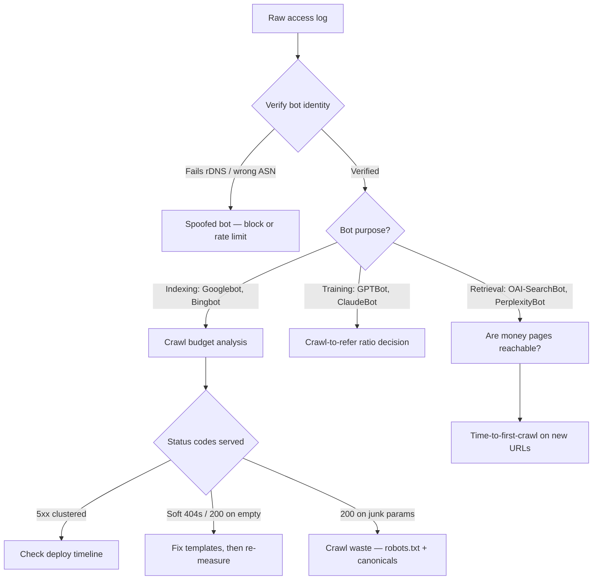

# 9 Things Your Server Logs Reveal That Search Console Can't

Your Search Console Crawl Stats report caps at 1,000 rows, arrives three days late, and shows you a representative sample rather than the truth. That was tolerable when Googlebot was basically the only robot that mattered. It is not tolerable now, when the bots hitting your origin don't even share a purpose — some index you, some train on you, some fetch you live to answer a question inside an assistant, and some are lying about being any of them.

Server log analysis for SEO is the only place all of that shows up in one file. Not a sample. Not an estimate. Every request, with a timestamp, a status code, a response time, and an IP you can verify.

This list is ordered by one criterion: **how much of the gap it closes between what you believe is happening and what actually happened.** Items 1 through 4 are things no other tool can tell you at all. Items 5 through 9 are things you might eventually learn elsewhere — days late, averaged, or after the damage. Start at the top.

## 1. Which AI Bots Are Actually on Your Site — and Whether They Can Ever Cite You

Here's the distinction almost nobody makes: not all AI crawlers are in the same business. Training crawlers like GPTBot and ClaudeBot take content to build models. Retrieval crawlers like OAI-SearchBot, Claude-SearchBot, and PerplexityBot fetch pages live to answer a question a human just typed — and those are the ones that can produce a citation with your name on it.

Your logs separate them by user agent. Nothing else does. And the split is uncomfortable: as of May 2026, search-purpose crawling accounted for **under 10%** of AI crawler requests. The other 90% was extraction.

The population itself has shifted faster than most teams' mental models. In global AI crawler traffic around May 2026, Googlebot sat near 27%, ClaudeBot had surged to roughly 20%, Meta-ExternalAgent around 12%, and GPTBot about 10%. ClaudeBot is a top-three crawler that a large share of SEO teams aren't tracking at all, because it never appears in any Google-owned interface. Grep your access log for it. You'll probably find it's been there for months.

> 🔍 **SEO angle:** If the retrieval bots that generate citations are barely touching your money pages while training bots hammer your archive, your AEO problem is a crawl-path problem, not a content problem — and only the log shows you that.

[→ Read also: Cloudflare's Sept 15 AI Crawler Block: Audit Your Site Now](/blog/cloudflare-ai-crawler-block-september-2026-seo-audit/)

## 2. Your Actual Crawl-to-Refer Ratio

This is the number that turns an abstract debate about AI and publishing into a line item you can put in front of a CFO. Count requests from a given AI bot in your log. Count referrals from that vendor's assistant in your analytics. Divide.

The published benchmarks are brutal. Mistral crawled roughly **3,389 pages for every referral** it sent back as of July 2026 — the most extractive bot measured. Anthropic sat at 2,237:1 in the same window, having fallen from 3,386:1 in June (and from a startling 10,300:1 in Cloudflare Radar data back in May). OpenAI improved to about 251:1 by July, slipping just under Perplexity's 289:1.

The part that ruins the usual engineering answer: more than 90% of the pages these bots crawl are **unique** content, not repeat hits on the same popular URLs. So caching doesn't save you. You're paying full origin cost for nearly every request.

Your own ratio will differ from the industry average, sometimes wildly. That's the point of measuring it. A publisher with a 40:1 ratio to one vendor and 4,000:1 to another has a very specific, very defensible robots.txt decision to make — and it's a decision, not a reflex.

## 3. Bots That Are Lying About Who They Are

Anyone can set their user agent string to `Googlebot/2.1`. Thousands of scrapers do it daily, precisely because so many sites wave Googlebot through every rate limit and paywall they own.

Logs are where you catch it, using the method Google itself documents: reverse DNS on the request IP, confirm it resolves to `googlebot.com`, `google.com`, or `googleusercontent.com`, then a forward lookup on that hostname to confirm it points back to the same IP. Both directions. You can't fake both without owning Google's DNS.

Two practical notes worth having. Google publishes its crawler IP ranges as JSON in CIDR notation, and **those files moved in March 2026** from the legacy `/search/apis/ipranges/` path to `/crawling/ipranges/` — if you built a verification script before then, it may be silently failing open right now. And you can skip most DNS lookups entirely by filtering on ASN first: Googlebot operates from AS15169 and AS396982. Anything claiming to be Googlebot from another ASN isn't.

> 🔍 **SEO angle:** Fake crawlers inflate your crawl-budget diagnosis and can mask genuine Googlebot starvation — you'll "optimize" for a crawl pattern that was never Google's.

## 4. Orphan URLs That Are Still Being Crawled

Run a site crawler and it starts from your homepage, following links. Which means, by construction, it will never find a page nothing links to.

Logs don't have that limitation. They record what was *requested*, regardless of how the requester learned the URL. So they surface the whole graveyard: pages that survived a redesign when their internal links didn't, URLs still sitting in someone's external backlink, old campaign landing pages, staging paths that leaked. Googlebot remembers URLs for a remarkably long time and keeps checking back.

Some of those orphans deserve rescue — a page with real external links and no internal ones is free equity sitting in a drawer. Others deserve a 410. Either way, the decision is impossible to make if you can't see the list, and a crawl simulation will never produce it.

## 5. The Status Code Crawlers Actually Received

Your browser gets a 200. That proves almost nothing about what a bot got at 3:41 a.m. from a different edge node with a different cache state.

Logs record the real response, per request, per bot, per timestamp. The patterns that matter most:

**Soft 404s** — pages returning 200 with "no results found" or an empty template. They look perfectly crawlable and indexable, so they consume budget indefinitely while dragging on site quality signals. Search Console flags a sample of them, eventually. Your log shows every one, today.

**5xx clusters aligned to deploys.** This is the one I'd check first on any site shipping multiple times a day. If Googlebot caught a 30-minute window of 503s during Tuesday's release, that's invisible in a browser test and shows up in Search Console — averaged, three days later, after you've stopped connecting it to a deploy.

**Redirect chains as actually walked.** Not as your redirect map claims. Bots follow a finite number of hops; logs tell you where they gave up.

[→ Read also: SEO Regression Testing in 2026: CI Guardrails for AI-Written Code](/blog/seo-regression-testing-2026-ci-guardrails-ai-code/)

## 6. Where Your Crawl Budget Is Being Burned

Group log requests by URL pattern instead of by URL, and the waste becomes obvious in about ten minutes. The usual suspects: faceted navigation parameter combinations, infinite calendar pagination, session IDs, sort orders, tracking parameters that survived a migration.

I've seen sites where over half of all Googlebot requests went to URL patterns nobody would want ranked. That's not a theoretical loss. Crawl budget is finite per site, and every request spent on `?color=red&size=m&sort=price_asc&page=7` is a request not spent on the product page you just rewrote.

The fix is boring and well documented — robots.txt disallow patterns, canonical discipline, parameter handling. What isn't available anywhere else is the *evidence* of which patterns are actually being hit hard enough to matter, so you fix the three that cost you something instead of the thirty that don't.

[→ Read also: Faceted Navigation SEO 2026: Stop Killing Your Crawl Budget](/blog/faceted-navigation-seo-2026-crawl-budget-ecommerce/)

## 7. How Long It Takes a New URL to Get Crawled

Publish a page. Note the timestamp. Search your log for the first Googlebot request to that path. The delta is your **time-to-first-crawl**, and it's one of the few genuinely honest measures of site health you can compute yourself.

Track it as a rolling median across new URLs and it becomes an early-warning system. Median creeping from four hours to two days usually means something structural changed: a sitemap that stopped updating, an internal linking regression, a server that got slower, a robots.txt edit nobody reviewed. You'll notice the crawl delay weeks before you notice the traffic dip it causes.

It also reframes a conversation editorial teams and engineers tend to have badly. "Publishing velocity" is a content metric until you express it as time-to-index — then it's a shared one.

## 8. TTFB as Crawlers Experience It, Not as CrUX Averages It

Most access log formats can record response time per request. That gives you something CrUX structurally cannot: server response time **segmented by bot, by URL pattern, and by hour**, from the origin's own point of view.

CrUX reports real users, which is correct for Core Web Vitals and useless for diagnosing crawl throttling. Googlebot adapts its crawl rate to how fast your server responds. If your category pages return in 180ms and your search results pages take 2.4 seconds under bot load, Google will quietly crawl less of the slow section — and no field data report will explain why, because real users weren't there at 4 a.m.

> 🔍 **SEO angle:** Crawl rate throttling from slow origin responses looks exactly like a demotion in aggregate reporting. The log distinguishes "Google doesn't want these pages" from "Google couldn't get these pages fast enough."

[→ Read also: 8 LCP Fixes That Actually Move Core Web Vitals Scores in 2026](/blog/lcp-optimization-2026-fixes-core-web-vitals-rankings/)

## 9. Agentic Browser Traffic — and the Half of It You Still Can't See

This one belongs last because it's the only item where the honest answer is "logs help, but they don't finish the job."

Agentic browsers — Perplexity's Comet, OpenAI's Atlas, Gemini features inside Chrome — now account for roughly **71% of observed agentic activity**, and the media category absorbs the largest share of AI agent traffic at about 45.6%. These are not crawlers. They're a browser acting on a real person's behalf, which makes them a traffic class your entire measurement stack was never designed for.

Here's the catch. Atlas does expose a `ChatGPT Atlas/... CFNetwork/... Darwin/...` user agent — but mostly on background favicon fetches. When Atlas or Comet actually navigates in agent mode, it sends **the same user agent as ordinary Chrome on that OS**. No token. No signature. Server-side, an agent reading your pricing page looks exactly like a human reading your pricing page.

So what do logs actually buy you? Partial visibility, and better than none: the favicon-fetch signature, request timing patterns no human produces, and the absence of the asset requests a real browsing session generates. Vendors like HUMAN Security and DataDome have built real detection for Atlas, Comet, and Mariner — but it requires active configuration, not a checkbox.

Treat this as a known unknown you're now tracking, rather than a solved problem. That's still a better position than assuming the traffic is human.

[→ Read also: Agentic Commerce SEO: UCP, ACP, and Your New Discovery Stack](/blog/agentic-commerce-seo-2026-ucp-acp-discovery-stack/)

## Honorable Mentions

**robots.txt fetch behavior.** How often each bot re-fetches your robots.txt, and what status it got. A 5xx on robots.txt can cause Google to pause crawling entirely — and that failure is nearly invisible everywhere except the log line that recorded it.

**Bot behavior around your llms.txt file.** If you shipped one, the log answers the only question that matters: is anything requesting it? (Usually: barely.)

[→ Read also: llms.txt in 2026: 300K Domains Say It Does Nothing](/blog/llms-txt-2026-does-it-work-what-to-do-instead/)

## A Triage Flow for Your First Pass



## How to Choose Where to Start

If you have one afternoon, do items 3 and 5 — verify your bots, then pull the status-code distribution per verified bot. Those two produce the highest ratio of "oh no" to effort, and both are grep-and-awk simple before you buy any tooling.

If you have a week and a stakeholder to convince, do item 2. A crawl-to-refer ratio computed on your own logs is the single most persuasive artifact in this entire list, because it converts an ideological argument about AI into a cost number with your domain on it.

If you're on a large site with a crawl-budget problem you've been guessing at for months, do item 6 and stop guessing.

The through-line across all nine: Search Console is a **third-party report about your site**, sampled and delayed, and 2026 has repeatedly reminded us it can be wrong for months at a time. Your access log is a first-party record of what your own server did. For an SEO discipline now operating across indexing crawlers, training crawlers, retrieval crawlers, and agents wearing Chrome's clothes, that difference between a report and a record isn't a nice-to-have. It's the only ground truth you own.

[→ Read also: Search Console Anomalies in 2026: Fixing Year-over-Year Reporting](/blog/search-console-anomalies-2026-year-over-year-reporting/)

## FAQ

**Do I need a paid tool to do server log analysis for SEO?**
No, not to start. `grep`, `awk`, and a spreadsheet will handle status-code distributions, bot counts, and orphan detection on a mid-size site. Screaming Frog's Log File Analyser is the common next step when you want visual pattern grouping. Tooling matters at scale, not at the beginning.

**How much log history should I keep?**
Thirty to ninety days covers most technical SEO questions. Anything longer starts running into privacy considerations — access logs contain IP addresses, which are personal data under GDPR, so define a retention period and anonymize or truncate IPs where you can.

**My site is on a managed host with no log access. What now?**
If you're behind a CDN, that's usually your best source — Cloudflare, Fastly, and Akamai all expose request logs, and you'll actually get better edge-level visibility than the origin would give you. Failing that, some hosts expose logs through a support request or a log-drain integration.

**Is Search Console's Crawl Stats report useless then?**
Not useless — just incomplete. It's genuinely good for spotting broad trends and for Google-side signals you can't derive from logs, like host status. Use it for direction and logs for evidence.

**Should I block AI training crawlers based on my crawl-to-refer ratio?**
That's a business decision, not an SEO one, and it depends on whether your content strategy is built on referral traffic or on brand presence inside assistants. Measure first. A ratio in the thousands justifies at least a conversation; blocking retrieval bots that can actually cite you is a different and much riskier move.

---

```json
{
  "@context": "https://schema.org",
  "@type": "ItemList",
  "name": "9 Things Your Server Logs Reveal That Search Console Can't",
  "description": "Server log analysis for SEO in 2026: nine findings — AI crawler splits, crawl-to-refer ratios, fake Googlebot, orphan URLs — that Search Console will never show you.",
  "itemListOrder": "https://schema.org/ItemListOrderDescending",
  "numberOfItems": 9,
  "itemListElement": [
    { "@type": "ListItem", "position": 1, "name": "Which AI bots are actually on your site — and whether they can ever cite you" },
    { "@type": "ListItem", "position": 2, "name": "Your actual crawl-to-refer ratio" },
    { "@type": "ListItem", "position": 3, "name": "Bots that are lying about who they are" },
    { "@type": "ListItem", "position": 4, "name": "Orphan URLs that are still being crawled" },
    { "@type": "ListItem", "position": 5, "name": "The status code crawlers actually received" },
    { "@type": "ListItem", "position": 6, "name": "Where your crawl budget is being burned" },
    { "@type": "ListItem", "position": 7, "name": "How long it takes a new URL to get crawled" },
    { "@type": "ListItem", "position": 8, "name": "TTFB as crawlers experience it, not as CrUX averages it" },
    { "@type": "ListItem", "position": 9, "name": "Agentic browser traffic — and the half of it you still can't see" }
  ]
}
```
