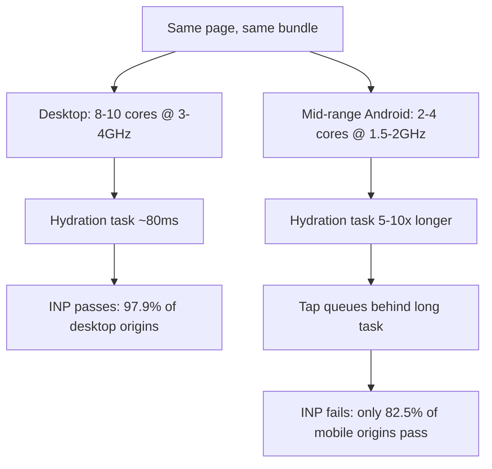

# Mobile vs Desktop Core Web Vitals: The 15-Point INP Gap

Your Core Web Vitals dashboard says you're passing. Your rankings say otherwise. Before you go hunting for some mysterious algorithmic penalty, check one boring thing first: which device the number you're looking at came from.

Because in 2026, mobile vs desktop Core Web Vitals aren't just slightly different. On INP, they're 15 percentage points apart — and most teams are staring at the wrong half of that gap.

## The number on your dashboard isn't always the number that matters

Here's the setup that catches people out. CrUX reports Core Web Vitals per form factor — phone, tablet, desktop. Search Console gives you a mobile view and a desktop view. Plenty of third-party dashboards, meanwhile, default to an origin-level blend, or quietly show you whatever device the person who set it up happened to care about.

That blend is where the trouble starts. As of the May 2026 CrUX release, roughly 55.9% of tracked origins pass all three Core Web Vitals when device categories are blended at the origin level. Comforting number. Except the mobile-only figure sits closer to 49% — and mobile is where the overwhelming majority of your users, and Googlebot's primary crawl, actually live.

So you're not looking at a lie, exactly. You're looking at an average that includes a population Google indexes second.

[→ Read also: Core Web Vitals in the AI Overview Era: What Really Drives Citations](/blog/core-web-vitals-ai-overview-citations-2026/)

## What the 2026 data actually says

Let's put real numbers on the gap, because the vague "mobile is slower, obviously" framing hides how uneven it is metric by metric.

The 2025 Web Almanac, working from CrUX data, put 48% of mobile origins passing all three Core Web Vitals against 56% of desktop origins. An 8-point spread at the "all three" level. That's the headline gap, and it's been remarkably stable.

But the aggregate hides the real story. Break it down by metric and INP is the outlier: **97.9% of desktop origins pass INP, against 82.5% on mobile.** A 15.4-point gap on a single metric. Meanwhile INP is the most commonly failed Core Web Vital in 2026 overall, with around 43% of sites still missing the 200ms threshold on at least one of their measured experiences.

Worth flagging honestly: published INP figures don't perfectly reconcile. A "43% of sites fail INP" stat and an "82.5% of mobile origins pass INP" stat are measuring different populations with different aggregation rules — page-level samples versus origin-level, all form factors versus phone-only. Don't stack them into a single narrative. The directionally reliable finding is the *shape*: desktop INP is close to solved, mobile INP is not.

And then there's the counterexample nobody expects. Looking at CrUX data for the top 1,000 media sites globally, only 59% were compliant on CLS for desktop, against 67% on mobile. Desktop lost that one. Ad slots and sidebar widgets that have room to misbehave on a 1,440px viewport simply don't have the same real estate on a phone.

Which is the actual point: the gap isn't a constant offset you can mentally subtract. It flips direction depending on the metric.

## Why mobile loses on INP: it's CPU, not bandwidth

If you've been optimizing for "slow mobile networks," you've been fighting the war from about 2016.

Alex Russell's 2026 update to the Performance Inequality Gap lays out the actual constraint, and it's silicon. The fastest chip you can buy in a 2026 phone is roughly **15 times more powerful** than the slowest chip still shipping in phones people are currently using. For JavaScript specifically, V8 on a budget Android runs about **5–10x slower** than on the MacBook you're reading this on.

Put concrete specs on it. A typical mid-range 2026 Android — a Redmi Note, a Galaxy A-series, a Moto G — gives you 2–4 cores at 1.5–2.0 GHz. Your dev machine has 8–10 cores at 3–4 GHz. Same HTML, same bundle, radically different main thread.

Now layer on what we're shipping to that main thread. Mobile JavaScript payloads have more than doubled since 2015, sitting at **680 KiB at P50 and 1.3 MiB at P75**. Median mobile page weight is 2.5x its 2015 value; at the 75th percentile it's 4x.

Here's why that hits INP specifically rather than LCP. Bandwidth affects how fast bytes arrive. CPU affects how fast bytes get *parsed, compiled, and executed* — and hydration is almost entirely the second thing. A CDN edge node cannot help you hydrate a React tree. Fewer than 25% of sites keep individual task durations under the recommended 50ms threshold, and on a 1.8 GHz core those tasks stretch proportionally. Every long task is a window where a tap sits in a queue, unanswered, accumulating input delay.

That's the mechanism. Mobile INP failure is a JavaScript execution problem wearing a network problem's clothes.

[→ Read also: INP Optimization 2026: The Developer's Guide to Fixing It](/blog/inp-optimization-2026-developer-guide/)



## The three metrics diverge for completely different reasons

Treating "the mobile gap" as one problem leads to one generic fix, which is how teams end up shipping a performance sprint that moves nothing.

**LCP** diverges on delivery. Slower and less consistent mobile networks stretch TTFB and resource load time, and viewport differences often mean a *different element entirely* is the LCP candidate on each device — a hero image on mobile, a carousel or headline block on desktop. You can be optimizing an element that isn't even in the running on the device that matters.

**INP** diverges on compute, as above. This is the big one and it's where the 15-point gap lives.

**CLS** diverges on layout, and here desktop frequently does worse. More viewport width means more slots for ads, embeds, and late-loading widgets to push content around. On mobile, a single-column stack is structurally harder to destabilize — as long as you've reserved dimensions.

Three different root causes, three different owners on most teams. That's the case for splitting the dashboard before splitting the backlog.

[→ Read also: Cumulative Layout Shift in 2026: Why CLS Now Tanks Your Whole Site](/blog/cumulative-layout-shift-2026-fix-guide-site-wide-cwv/)

## How Google actually uses the device split

Time to be precise, because there's a lot of confident nonsense on this topic.

Page experience became part of desktop ranking systems in February 2022, with rollout completing that March. So Google does evaluate both — desktop results are assessed against desktop signals, mobile results against mobile signals. It's not that desktop Core Web Vitals are ignored.

Two things make mobile the one to prioritize anyway.

First, mobile-first indexing has applied to 100% of sites since 2024. Googlebot crawls and renders as a mobile user agent. The *content and markup* evaluation is mobile's.

Second — and this is just arithmetic — mobile is where your failures are. Desktop INP is at 97.9%. There is almost nothing left to win there. Every point of realistic improvement available to you is on the mobile side of the ledger.

The threshold mechanics matter too: you need 75% of visits to a page to land in "Good" on all three metrics, measured from CrUX field data, not a lab tool. A Lighthouse run on your laptop tells you approximately nothing about whether you clear that bar, because Lighthouse isn't sampling your actual users on their actual phones.

One caveat I'd hold loosely: we've written before about the March 2026 core update appearing to weight Core Web Vitals more holistically across a site rather than strictly page by page. If that reading holds, a single badly-hydrated mobile template stops being a local problem. Google doesn't document aggregation behavior at that level of detail, so treat it as a working hypothesis backed by observation, not as settled mechanics.

## Getting a real device-split view

Practical part. Four sources, roughly in order of effort.

**Search Console → Core Web Vitals.** Free, already connected, and it separates mobile from desktop by default. Only two buckets, and it's grouped into URL-pattern clusters rather than individual URLs, but it's the fastest way to confirm you have a device gap at all. Just be careful reading trends across it — [→ Read also: Search Console Anomalies Broke Your 2026 Year-Over-Year Data](/blog/search-console-anomalies-2026-year-over-year-reporting/).

**CrUX API.** Where the real granularity is. It exposes phone, tablet, *and* desktop as separate form factors — finer than Search Console's two-way split — and you can query origin- or URL-level data. Tablet is worth pulling once even if you then ignore it; on some ecommerce templates it behaves nothing like either neighbor.

```bash
curl -s "https://chromeuxreport.googleapis.com/v1/records:queryRecord?key=$CRUX_KEY" \
  -H 'Content-Type: application/json' \
  -d '{
    "origin": "https://example.com",
    "formFactor": "PHONE",
    "metrics": ["interaction_to_next_paint", "largest_contentful_paint", "cumulative_layout_shift"]
  }'
```

Swap `PHONE` for `DESKTOP` and diff the two responses. If your INP p75 moves by more than about 80ms between them, you have the gap this article is about.

**CrUX on BigQuery.** The public dataset goes back to October 2017 and supports filtering by device *and* country simultaneously, which Search Console can't do. Useful when you suspect the gap is really a geography story — a mobile INP problem concentrated in markets with older device fleets isn't a code problem so much as a payload-budget problem.

**Your own RUM.** The one that actually closes the loop. CrUX tells you that mobile INP is 340ms; it doesn't tell you which interaction or which script. Field RUM with attribution data does. Capture the INP target element and the longest script, segment by device memory and hardware concurrency, and you'll find the offending component in an afternoon.

## Fix priority changes when you look at mobile first

The ordering most teams use is inherited from desktop-era audits and it's wrong for the device that ranks.

Start with **JavaScript budget, not image optimization.** Yes, images matter for LCP. But if mobile INP is your failing metric, shaving 40KB off a hero image does nothing for it. Cut, defer, or code-split the hydration work instead. Server components, islands, or plain progressive enhancement — the mechanism matters less than the byte count reaching that 1.8 GHz core.

Then **audit third-party tags on mobile specifically.** Tag managers, consent platforms, chat widgets, and analytics all queue long tasks. On desktop they disappear into spare CPU headroom. On mobile they're the difference between 180ms and 400ms INP. Load them on interaction or after the page is interactive, not at parse time.

Then **check whether your LCP element is even the same across devices.** Run the diagnosis per form factor before writing a ticket.

Finally, **throttle your test environment honestly.** Not "Fast 3G" — that's a network throttle and you now know the constraint is CPU. Use 4–6x CPU throttling in DevTools as a baseline, and keep one genuinely mid-range Android on the desk. Nothing recalibrates a team's sense of "fast" faster than watching a real device chew through their own bundle.

[→ Read also: 9 Next.js 16.3 Changes That Quietly Affect Your SEO](/blog/nextjs-16-3-seo-changes-2026/)

## Mistakes that keep the gap invisible

**Reporting the blended origin number to stakeholders.** It's the most flattering figure available and it systematically hides the failing half. If you only change one thing after reading this, change the default device filter on whatever dashboard your team looks at on Monday mornings.

**Using Lighthouse scores as the CWV source of truth.** Lighthouse is a lab tool running a synthetic profile. Google ranks on CrUX field data. They disagree constantly, and when they do, CrUX wins.

**Assuming desktop is always the good one.** The CLS data on media sites says otherwise. Check, don't assume.

**Treating tablet as mobile.** CrUX doesn't. Depending on your traffic mix, tablet can be a meaningful third profile with its own failure mode.

**Fixing mobile in a lab that has none of mobile's constraints.** An unthrottled Chrome window on a workstation is the single most misleading test environment in web performance.

## Conclusion

The mobile vs desktop Core Web Vitals gap isn't a rounding error and it isn't a network problem you can CDN your way out of. It's a 15-point INP spread driven by a 5–10x CPU deficit, aimed squarely at the device Google indexes first and the device most of your users are holding.

None of this makes Core Web Vitals a magic ranking lever — it's a tiebreaker among comparable results, and always has been. But it's a tiebreaker you're currently losing on a device you might not be measuring, and that's a fixable kind of loss. Split the dashboard by form factor this week. Pull the phone and desktop numbers from the CrUX API and diff them. If the INP delta is north of 80ms, you've found where your next performance sprint should point — and it probably isn't where your backlog currently says it is.

## FAQ

**Does Google use mobile or desktop Core Web Vitals for ranking?**
Both, applied to their respective result sets — desktop page experience signals have been live since early 2022. But mobile-first indexing means Googlebot crawls and renders as mobile, and mobile is statistically where nearly all remaining Core Web Vitals failures live.

**Why is my mobile INP so much worse than desktop?**
Almost always JavaScript execution rather than network speed. A budget Android runs V8 roughly 5–10x slower than a developer laptop, so the same hydration or third-party script that costs 80ms on your machine can block the main thread long enough to queue a tap on a real phone.

**How do I see Core Web Vitals by device?**
Search Console splits mobile and desktop for free. The CrUX API adds tablet as a separate form factor and supports URL-level queries. CrUX on BigQuery lets you cross device with country, which is where device-fleet-driven gaps become obvious.

**Is desktop always better than mobile on Core Web Vitals?**
No. On CLS, desktop often performs worse — wider viewports give ads, embeds, and late-loading widgets more room to shift layout. Check per metric rather than assuming a uniform direction.

**Should I optimize tablet separately?**
Pull the numbers at least once. CrUX reports tablet as its own form factor, and on layout-heavy templates it can behave unlike either phone or desktop. If your tablet traffic share is negligible, deprioritize it — but decide that from data, not by default.

---

```json
{
  "@context": "https://schema.org",
  "@type": "BlogPosting",
  "headline": "Mobile vs Desktop Core Web Vitals: The 15-Point INP Gap",
  "description": "Mobile vs desktop Core Web Vitals diverge hard in 2026 — 97.9% desktop INP pass rate against 82.5% on mobile. Here's why, and how to see the real split.",
  "datePublished": "2026-09-15",
  "dateModified": "2026-09-15",
  "keywords": "Core Web Vitals, INP, Technical SEO, Mobile SEO, Web Performance, CrUX"
}
```
