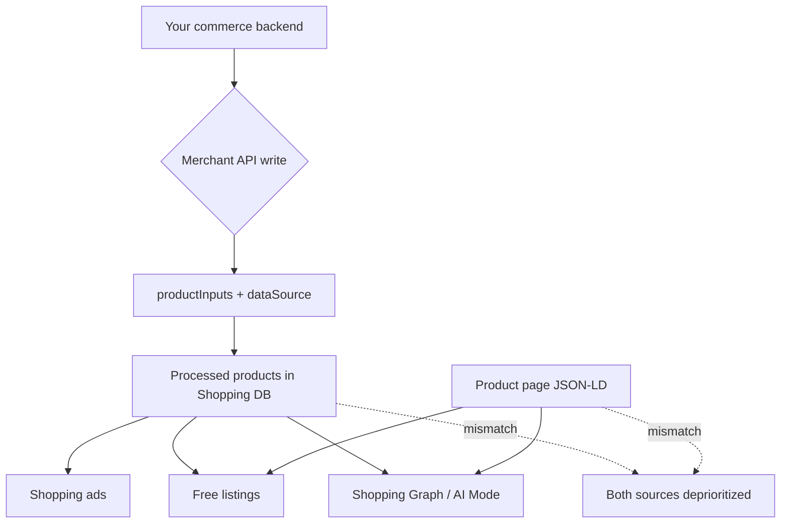

# Merchant API Migration 2026: The Silent SEO Risks in Your Product Feed

Most teams filed the Merchant API migration under "paid media plumbing" and handed it to whoever owns the Google Ads integration. That's the mistake. The same feed that powers your Shopping campaigns also powers free listings, the Shopping Graph, and the product answers Google's AI Mode assembles — so a sloppy cutover doesn't just break an ad account, it quietly deletes you from surfaces you never paid for.

And the deadline already started biting. Google shut down the Content API for Shopping on **August 18, 2026**, and from **September 1, 2026** the remaining requests began throwing progressive errors. If your integration is still limping along on extended access, you're inside the risk window right now.

Here's the part nobody's writing about: the failure mode isn't a loud 500. It's a 200 OK that writes wrong data to your live catalog.

## Why Your Feed Became an SEO Asset

For years the mental model was clean: structured data on your pages served organic search, and the Merchant Center feed served Ads. That line dissolved somewhere around 2024 and is now completely gone.

The Shopping Graph reads your feed. Free listings read your feed. AI Mode's shopping answers read your feed — and that graph is reportedly refreshing on the order of billions of listings per hour, which means staleness is no longer a weekly annoyance, it's a real-time confidence score. When your feed says "in stock, $89" and your product page's JSON-LD says "out of stock, $109," Google doesn't pick a winner. It deprioritizes both, because a disagreement between two sources you control reads as a trust problem, not a caching quirk.

That's the throughline for everything below. Your feed is a discoverability surface, your product page is a discoverability surface, and the Merchant API is the pipe between the two. Break the pipe and both surfaces degrade at once.

[→ Read also: Product Schema in 2026: The Fields Google Now Requires for Rich Results](/blog/product-schema-2026-required-fields-shopping-rich-results/)

## The Merchant API Is Not a Renamed Content API

This is where migrations go sideways. The Merchant API isn't `v3` of the old thing — it's an architectural rebuild with a new resource model, a new identifier scheme, and a new money type. Swap the base URL, keep your payloads, and your code will compile, authenticate, and return 200 while sending garbage into your catalog.

Three changes do most of the damage.

### 1. `productInputs` vs `products`

Content API had one product concept. Merchant API splits it: `productInputs` is what *you* submit, and `products` is the processed result Google computes by combining your inputs with supplemental data sources and feed rules. You write to inputs. You read from products.

Teams that mentally map "product = product" end up writing to the wrong resource, or — more commonly — reading back their own submitted values and concluding everything is fine, without ever checking what Google actually resolved. Your submitted title isn't necessarily the title in the Shopping Graph.

### 2. The `dataSource` parameter

Content API had an implicit single source. Merchant API makes you name the data source — primary or supplemental — on every write. Get this wrong and you either overwrite your primary feed with partial data or dump enrichment values into a source nothing reads.

Supplemental sources are genuinely useful here: they're the clean way to layer GTINs, better titles, or `shippingDetails` onto a primary feed you don't fully control. But "useful" and "safe to guess at" aren't the same thing.

### 3. The money type — the silent mispricing trap

This one deserves its own paragraph in your migration ticket. Content API expressed price as a string plus a currency. Merchant API uses `amountMicros`, an int64 where **one unit of currency equals 1,000,000 micros**, alongside `currencyCode`.

So $24.99 is `24990000`. Not `24.99`. Not `2499`.

Pass the old decimal straight through and you've just listed a product for a fraction of a cent. Pass cents through and you're off by 100x in the other direction. Either way the API accepts it, Merchant Center accepts it, and the first person to notice is a customer or an automated price-mismatch disapproval — after the wrong price has already propagated to free listings and, increasingly, to AI shopping answers that cite price directly.

Identifiers changed too: `Id` gave way to `name`, and child resources hang off `parent` fields. Those break loudly, which is a mercy. The price type breaks silently, which isn't.



## SEO & Search Implications

Let's make the organic cost concrete, because "your feed might break" is too abstract to get prioritized against a roadmap.

**Free listings vanish before ads do.** Paid campaigns have humans watching spend dashboards; a disapproval there gets noticed within hours. Free listings have nobody watching. A feed that stops syncing after the cutover keeps serving whatever Google last processed until it ages out — and when it does, your organic Shopping presence evaporates with no alert that maps to it in Search Console.

**AI surfaces punish disagreement harder than absence.** This is the shift worth internalizing. A missing attribute means an AI answer omits your product. A *contradictory* attribute — feed price vs on-page price, feed availability vs on-page availability, differing GTINs — reads as unreliability, and unreliable sources don't get cited. In a citation economy, being wrong is worse than being quiet.

**Mismatch is a migration-shaped risk.** Under a stable integration, feed and page drift slowly. During a cutover, you often have two systems writing for a while — old integration on extended access, new one in parallel — and drift becomes instant. That parallel-run window is exactly when your on-page structured data and your feed are most likely to disagree.

**Batching won't save your sync cadence.** Worth knowing before you architect the new pipeline: HTTP batching doesn't discount quota. A batch of 500 inserts is charged as 500 method calls, and you'll meet `quota/request_rate_too_high` and `quota/daily_limit_exceeded` on your own terms. If your plan for freshness was "batch everything hourly," model the quota math first — stale inventory is a ranking-confidence problem now, not just a customer-service one.

[→ Read also: Structured Data in 2026: What Still Works After Google's Cuts](/blog/structured-data-2026-what-still-works-after-google-cuts/)

## A Cutover Plan That Protects Organic Visibility

Treat this like a replatform, not a dependency bump. The sequence that actually works:

**Inventory your write paths first.** Not "which tool talks to Merchant Center" — which *code paths* write which attributes. Price, availability, and shipping usually come from three different places in a mature stack, and each one needs its own review against the new money type and data-source model.

**Build a diff harness before you build the integration.** Write to a staging Merchant Center account, then read back from `products` — not from your own submitted inputs — and diff the resolved values against what your product pages render. Price, availability, GTIN, title, and `shippingDetails` at minimum. This single step catches the micros bug, the data-source bug, and the feed-rule surprise in one pass.

**Run parallel, but make the old path read-only.** Two systems writing the same catalog is how contradictions get born. Let the new integration own writes, keep the old one for comparison only, and cut over per-attribute if your architecture allows.

**Add feed-vs-page assertions to CI.** If you already run SEO checks in your pipeline, this is a natural extension: fetch a sample of live product URLs, parse the JSON-LD, hit the Merchant API for the same SKUs, and fail the build on price or availability divergence beyond a threshold. It's maybe half a day of work and it permanently closes the mismatch class of bug.

[→ Read also: SEO Regression Testing in 2026: Guardrails for AI-Written Code](/blog/seo-regression-testing-2026-ci-guardrails-ai-code/)

**Watch the resolved values for two weeks, not two days.** Feed rules, supplemental sources, and Merchant Center processing all introduce lag. A cutover that looks clean on day one can surface a systematic title-truncation issue on day nine.

One more note for anyone fully manual: file uploads, scheduled fetches, and Google Sheets feeds are unaffected. This is an API-integration deadline. If you're on Shopify or a managed feed tool, your vendor has probably handled it — but "probably" is worth one email to confirm, because the accountability for a wrong price on your PDP lands on you either way.

## Common Mistakes Worth Naming

**Treating the migration as done when requests return 200.** Success responses tell you the shape was valid, not that the values were right. Verification means reading back processed products.

**Forgetting that the feed is now a public-ish document.** Agentic shopping buyers and AI answer engines increasingly read product data rather than product pages. Attributes you considered "internal feed hygiene" — return policy, shipping, availability granularity — are now inputs to whether a machine recommends you.

**Skipping GTIN and identifier consistency.** A GTIN that differs between feed and page is a quiet disqualifier across multiple surfaces at once.

**Assuming the deadline extension means safety.** Extended access buys time, not stability. You're running on a deprecated API that's already returning progressive errors for other merchants.

[→ Read also: Agentic Commerce SEO: UCP, ACP, and Your New Discovery Stack](/blog/agentic-commerce-seo-2026-ucp-acp-discovery-stack/)

## Conclusion

The Merchant API migration looks like infrastructure work because it is infrastructure work. But the infrastructure in question is now the primary feed into every machine-readable commerce surface Google operates — free listings, the Shopping Graph, AI Mode answers — which makes it squarely an SEO problem wearing an engineering costume.

Do the boring version well. Map your write paths, respect the micros, name your data sources, verify against processed products rather than your own payloads, and wire a feed-vs-page diff into CI so the mismatch class of bug can't come back. The upside isn't glamorous — nothing visibly improves when a migration goes right. But the downside is a catalog quietly mispriced across every surface that decides whether a machine recommends your products at all, and that's a trade worth two weeks of careful work.

## FAQ

**Is the Content API for Shopping completely dead?**
Google shut it down on August 18, 2026, with progressive errors beginning September 1, 2026. Extended access exists for merchants who applied, but it's a grace period on a deprecated system, not a supported path.

**Does this affect my organic free listings or only paid Shopping?**
Both. The same processed product data feeds free listings, the Shopping Graph, and AI Mode shopping answers. Paid campaigns just fail more visibly.

**I upload a CSV or use a Google Sheet. Do I need to migrate?**
No. Manual file uploads, scheduled fetches, and Sheets feeds continue to work. This deadline applies to API integrations.

**What's the single most dangerous bug in this migration?**
The price type. `amountMicros` is an int64 where 1,000,000 micros equals one currency unit, so $24.99 is `24990000`. Passing the old decimal or a cents value writes a wrong price that the API happily accepts.

**How long should the migration take?**
Standard integrations on a plugin or managed feed tool: roughly four weeks including validation. Custom enterprise integrations: six to eight weeks. Budget most of that for verification, not for writing the client.

**Should I fix feed-to-page mismatches before or after migrating?**
After the cutover, but verify during. The migration itself is the highest-risk window for new mismatches, so build the diff check first and let it catch both pre-existing and newly introduced divergence.

---

```json
{
  "@context": "https://schema.org",
  "@type": "BlogPosting",
  "headline": "Merchant API Migration 2026: The Silent SEO Risks",
  "description": "The Merchant API migration isn't just an Ads chore. Here's how a botched cutover quietly wrecks free listings, AI Mode visibility, and feed-to-page trust in 2026.",
  "datePublished": "2026-09-16",
  "dateModified": "2026-09-16",
  "keywords": "Merchant API, Ecommerce SEO, Product Feed, Technical SEO, Structured Data, AI Search"
}
```
