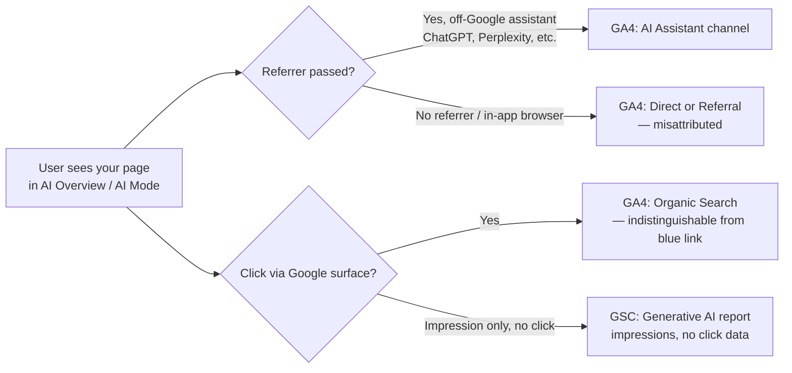

# GA4's AI Assistant Channel vs GSC: Your AI Traffic Still Doesn't Add Up

Two of the biggest analytics upgrades of 2026 landed within weeks of each other. GA4 quietly rolled out a native AI Assistant channel in May, and Search Console shipped a dedicated Generative AI performance report in June, going fully global by the end of August. On paper, that's the attribution puzzle solved — a tool that shows where AI-sourced sessions land, paired with a tool that shows where you're getting cited inside AI Overviews.

Except the two reports still don't talk to each other, and both of them have a shared blind spot that nobody's marketing deck mentions: Google's own AI Overviews. If you've been quietly congratulating yourself on finally having "AI traffic" visibility, it's worth sitting with what these two dashboards actually can and can't see before you present numbers to a client or a boss.

## Why This Is Suddenly a Reporting Problem, Not Just a Curiosity

For most of 2025, "AI traffic attribution" meant one thing: writing regex to catch ChatGPT and Perplexity referrers before GA4 dumped them into Direct. It was a hack, everyone knew it was a hack, and agencies billed for maintaining it.

Then Google did the sensible thing and baked it in. As of May 13, 2026, GA4's Default Channel Group includes an "AI Assistant" channel. When Analytics detects a referrer matching a recognized AI platform — ChatGPT, Gemini, DeepSeek, Copilot, Grok, and others — it automatically assigns the medium `ai-assistant` and groups the session accordingly, with a reserved `(ai-assistant)` campaign label. No custom channel definitions, no regex, no configuration. It just started working for every property globally by June 7.

That's genuinely useful. It's also nowhere near the full picture, and here's the part that should make you pause before you rebuild a client dashboard around it: **the update only catches traffic that arrives with a recognizable referrer.** A meaningful share of AI-assisted visits never send one — a user opens a link inside the ChatGPT app, or an in-app browser strips the header, or the assistant surfaces content without a click-through path at all. That traffic still lands in Direct or Referral, indistinguishable from someone who typed your URL from memory.

And this is where it gets genuinely interesting for anyone doing this for a living: a nine-month study tracking more than 50,000 tagged AI Overview events found an average misattribution rate of 22.4% — sessions that should have read as Organic Search but got logged as Direct instead, because the click routed through a `google.com` domain that GA4's heuristics treat as ambiguous. The worst single month in that dataset hit 29.3% misattributed. Across the full measurement window, AI Overview traffic accounted for roughly 7.5% of the site's total organic sessions — a chunk of performance that, without correction, simply reads as "Direct went up" with no explanation attached.

[→ Read also: The /goto Redirect Broke Rank Tracking. Here's Your Fix](/blog/google-goto-redirect-2026-rank-tracking-seo-measurement/)

## What the New GA4 Channel Actually Covers — and What It Structurally Can't

Worth being precise here, because the gap between "AI Assistant channel exists" and "AI Assistant channel sees everything" is where most reporting mistakes get made.

**What it catches well:** genuine off-Google AI assistants that pass a clean referrer — someone clicking a link ChatGPT generated in a desktop browser session, or a Perplexity citation opened in a new tab. For that traffic, you now get medium, channel, and campaign dimensions without lifting a finger, and it slots straight into your existing acquisition reports instead of living in a side spreadsheet.

**What it can't touch, structurally:** anything from Google's own AI Overviews or AI Mode. Those results render inside google.com, so a click through one looks, to GA4, exactly like a click on a traditional blue link — same domain, same referrer pattern, same "Organic Search" bucket unless you go looking with server-side signals or landing-page correlation. There's no assistant-detection heuristic that can fix this, because there's no distinguishing referrer to detect. Google Search itself is the AI assistant in this scenario, and GA4 was never going to build a channel that separates Google from Google.

Add to that the mobile-app and in-app-browser gap mentioned above, and you land on the honest summary industry researchers have been converging on all year: something like 60 to 70% of AI-influenced sessions still get misattributed by default, even with the new channel live. The update is real progress. It is not the fix the press coverage implied.

## What Search Console's Generative AI Report Adds — and Its Own Missing Half

Search Console's side of this ships a genuinely different kind of value, and it's worth being clear about the shape of it. Since June 3, 2026 — global as of August 31 — the Generative AI performance report shows impressions for your pages inside AI Overviews, AI Mode, and generative Discover surfaces, broken down by page, country, device, and date.

That's the piece GA4 will never give you: visibility into whether Google is *showing* your content inside an AI answer at all, independent of whether anyone clicked through. It's the closest thing to a citation-rate metric that exists in a first-party tool right now.

The catch, and it's a real one: no clicks, no CTR, no query data. You can see that a page generated 40,000 AI Overview impressions this month and have genuinely no idea whether that translated into two site visits or two thousand. Google has said more metrics are coming without committing to a date, which in practice means plan your reporting around what exists today, not what's promised.

If you haven't already built a workflow around this report specifically, it's worth reading through before you try to layer GA4 data on top of it — the report's dimensions and limitations shape exactly how far the reconciliation below can actually go.

[→ Read also: Search Console Anomalies Broke Your 2026 Year-Over-Year Data](/blog/search-console-anomalies-2026-year-over-year-reporting/)

## Building the Three-Way Reconciliation That Actually Works

Here's the mental model that holds up once you accept that no single tool gives you the full picture: GA4 tells you *where visitors who click through AI assistants land*, GSC's Generative AI report tells you *where you're being shown inside Google's own AI features*, and neither one, alone or combined, tells you the full conversion story for AI-influenced discovery. Treat all three legs — GA4, the Generative AI report, and your regular Search performance report — as partial instruments pointed at the same target, not as a single unified truth source.

In practice, that means a reconciliation workflow with three concrete steps:

**Step one — correlate, don't merge.** Pull your top pages by AI Overview impressions from the Generative AI report, then check those same URLs' Direct and Organic Search trend lines in GA4 over the same window. A page with rising AI Overview impressions and an unexplained Direct-traffic bump on the same URL is your best available proxy for "this is AI-driven, GA4 just can't label it." It's inference, not measurement — say so explicitly in any report you hand off, because a client who thinks this is precise attribution will make bad budget decisions on top of it.

**Step two — segment what GA4 can already tell you cleanly.** The AI Assistant channel is legitimately trustworthy for off-Google referrers. Don't discard it because Google Overviews are invisible to it — pull it into its own acquisition view, watch its month-over-month trend, and use it as a leading indicator for which non-Google assistants are actually sending qualified traffic. Anthropic Claude's referral share climbing from roughly 1.4% to 18.5% of B2B AI referrals in the space of eight months, per one widely cited traffic study, is exactly the kind of shift this channel will surface cleanly and a spreadsheet regex hack would have missed the day the pattern changed.

**Step three — supplement with a signal GA4 and GSC can't manufacture: ask people.** Several teams running this reconciliation in 2026 have added a lightweight "how did you find us?" field at signup or checkout specifically because the software-side gap is structural, not a configuration bug you can patch away. One SaaS team found roughly a quarter of new users cited ChatGPT by name in that field — a share meaningfully higher than anything GA4's AI Assistant channel reported for the same period. Self-reported attribution has its own noise, but it's noise in a different direction from the referrer-stripping problem, which makes it a genuinely useful cross-check rather than a redundant one.

[→ Read also: Server Log Analysis for SEO in 2026: What Search Console Misses](/blog/server-log-analysis-seo-2026-what-search-console-misses/)

## Where the Reporting Still Breaks — and What to Flag Before Someone Else Finds It

Two failure modes are worth naming explicitly, because they're the ones that turn a defensible report into an awkward meeting.

First: don't let "Direct traffic is up" become a lazy AI-attribution story on its own. Plenty of things inflate Direct — bookmarking behavior, dark social sharing, QR codes, app-to-web handoffs. The 22.4% misattribution figure from the AI Overview study is a *measured average from a specific, tagged dataset*, not a universal multiplier you can apply to any site's Direct-traffic increase. Use correlated landing-page and timing evidence before you attribute a Direct spike to AI Overviews specifically.

Second: resist the urge to present the AI Assistant channel's numbers as "total AI traffic." Every deck that does this is quietly excluding Google's own AI Overviews and AI Mode — very likely the single largest generative-AI surface most sites get cited in — because that traffic never left the Organic Search bucket. Label the channel for what it measures: assistant-driven referral traffic with a passed referrer header. It's a real and growing number. It is not the whole AI story, and saying so up front costs you nothing and saves you an uncomfortable follow-up question later.

## The Honest Takeaway

Google shipped two real improvements in 2026, and it's worth treating them as such rather than either over-hyping or dismissing them. GA4's AI Assistant channel finally gives non-Google AI referral traffic a proper home in standard reporting, no regex required. GSC's Generative AI performance report gives you a first-party window into AI Overview and AI Mode visibility that didn't exist a year ago. Neither one, individually or stacked together, closes the loop on how AI-driven discovery actually converts — because the biggest generative surface of all, Google's own, hides its clicks inside Organic Search by design.

Build your reporting around that honesty rather than around the marketing framing. Segment what GA4 can cleanly show you, correlate GSC impressions against landing-page traffic shifts as an inference (labeled as one), and add a self-reported signal to catch what both tools structurally miss. That's not a perfect measurement stack. In September 2026, it's the best one anyone actually has.

## FAQ

**Does the GA4 AI Assistant channel require any setup?**
No. It's part of the Default Channel Group automatically for every property, effective globally since June 2026. There's nothing to configure, though you can still layer custom channel definitions on top if you need finer-grained platform splits.

**Can I see clicks from AI Overviews in Search Console?**
Not yet. The Generative AI performance report currently shows impressions only — no clicks, CTR, or query-level data. Google has indicated more metrics are planned but hasn't committed to a timeline.

**Why does AI Overview traffic show up as Organic Search instead of a separate channel in GA4?**
Because the click routes through a google.com domain, which GA4's channel logic treats the same as a traditional organic result. There's no referrer signal that distinguishes an AI Overview click from a blue-link click, so no channel-assignment rule can currently separate them.

**Is the 22.4% misattribution figure representative of every site?**
It's from one nine-month study tracking a specific tagged dataset of AI Overview events, and the monthly rate in that study ranged from about 17% to 29%. Treat it as an illustrative benchmark for the scale of the problem, not a number to apply directly to your own traffic without your own correlation work.

**Should I stop trusting GA4's Direct channel entirely?**
No — most Direct traffic is still genuinely direct. The point is to stop treating unexplained Direct increases as neutral noise and start checking whether they correlate with rising AI Overview impressions on the same landing pages before drawing conclusions either way.
