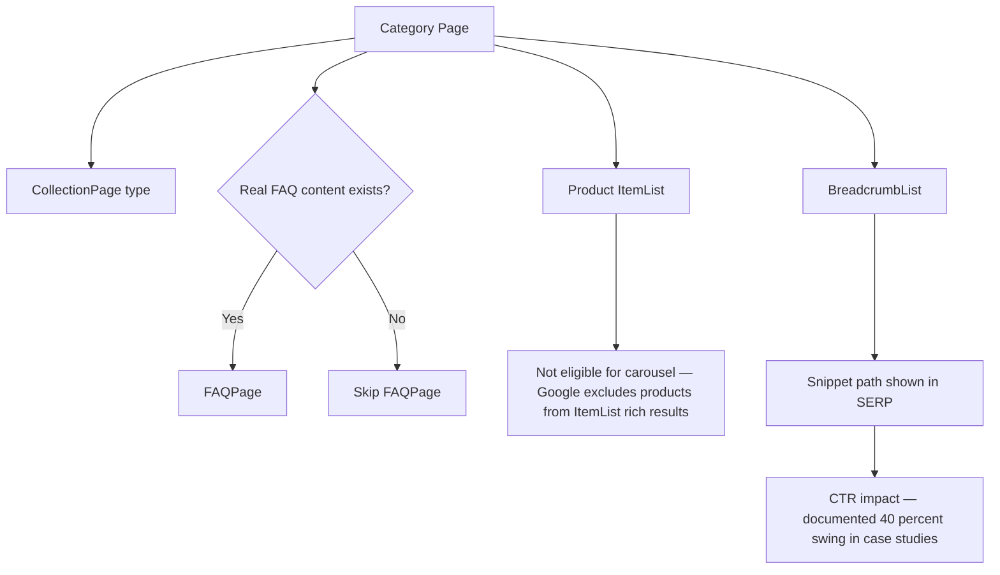

# Category Page Schema in 2026: What Actually Gets Rich Results

Go search "category page schema markup" right now. Nine out of ten results will tell you to slap `ItemList` on every collection page, wrap each product tile in an `Item`, and wait for the carousel rich result to roll in. Here's the problem: Google has said, repeatedly and in plain language, that it doesn't want `ItemList` markup for products. Not "use it carefully." Not "use it with caveats." Doesn't want it.

That gap between what the SEO content mill keeps repeating and what Google's own documentation actually says is exactly why category pages are one of the most mismanaged corners of ecommerce structured data. You've got a template that's already live on thousands of category URLs, quietly failing to do the one thing everyone assumed it was doing.

This one's for the SEOs and developers who maintain the collection-page template — the "shoes," "espresso machines," "winter coats" pages that pull in a huge share of non-brand search traffic but get a fraction of the schema attention product pages do.

## Why Category Pages Get the Schema Treatment Wrong

The confusion starts with a reasonable-sounding assumption: if `Product` schema gets you rich results on a product detail page, then something like it should work on the page that *lists* those products. Makes sense on paper. It's also not how Google's eligibility rules are written.

[Google's own merchant listing documentation](https://developers.google.com/search/docs/appearance/structured-data/merchant-listing) is specific about what counts as a product page: a page focused on a single product, or variants of the same product. "Shoes in our shop" is explicitly called out as *not* a specific product. That's your category page, described almost word for word.

And on the `ItemList` side, Google is even more direct: itemList markup is scoped to courses, movies, recipes, and restaurants for carousel eligibility — not products. So the pattern a lot of ecommerce platforms ship out of the box — wrapping each product tile in `ListItem` inside an `ItemList`, hoping for a shopping carousel — isn't violating a soft best practice. It's marking up content in a schema type Google has said, flatly, it isn't going to reward the way people expect.

This matters more in 2026 than it did a couple of years ago, because Google's March 2026 core update tightened enforcement around schema that doesn't match a page's actual eligible content type. Markup that's technically valid JSON-LD but doesn't map to a real rich-result eligibility path isn't neutral anymore — at best it's dead weight bloating your page, at worst it's a signal of a template that doesn't match what's actually on the page, which is the kind of mismatch recent core updates have gotten stricter about.

## What Category Pages Are Actually Eligible For

Strip away the "product carousel" fantasy and the real toolkit for a category page is narrower, but it's not nothing.

**CollectionPage.** This is the correct `@type` for the page itself — it tells Google "this URL organizes and describes a collection," as opposed to being an article or a single product. Worth flagging up front: `CollectionPage` isn't itself eligible for a distinct rich result. Google doesn't offer a visual enhancement tied to it. What it does is set the page's identity correctly for every other schema entity nested inside it, and it costs you nothing to include — so there's no real argument for leaving it off.

**BreadcrumbList.** This is the one piece of category-page schema with genuine, measured upside, and it's the one people skip most often because it feels too basic to bother with. One documented case: a site that lost its breadcrumb schema during a template migration watched organic CTR fall from 6.6% to 4.1% — a nearly 40% relative drop — and recovered to 7% within three weeks of restoring it. A separate SearchPilot test on breadcrumb visibility and markup found a statistically significant traffic uplift from reintroducing it. None of that is about rankings directly; it's about the SERP snippet showing a clean path (Home > Running Shoes > Trail Running) instead of a raw URL, which changes whether people click.

**FAQPage**, if — and only if — the category actually has a genuine FAQ section with real, user-facing questions and answers rendered on the page. Bolting an FAQ block onto a shoe category purely to get the schema hook is exactly the kind of markup-content mismatch Google's spam policies for structured data call out directly: don't mark up content that isn't genuinely, visibly present for users.

That's it. Three schema types, one of which (`CollectionPage`) is invisible scaffolding, one of which (`BreadcrumbList`) is your actual lever, and one of which (`FAQPage`) is conditional on real content existing. If your category page template currently has `ItemList` wrapping every product tile and nothing else, you've built the one piece that doesn't work and skipped the one that does.



## Faceted Navigation Is the Real Category-Page Problem, and Schema Doesn't Fix It

Here's the part that gets buried under all the ItemList advice: the bigger risk on category-page templates isn't missing markup, it's the sheer number of URLs faceted navigation generates underneath them. A mid-size catalog of 10,000 products can spin off 500,000+ crawlable filter-combination URLs — size, color, price-range, in-stock, sorted-by, paginated, and every intersection of those. Structured data doesn't touch that problem. No amount of `CollectionPage` markup rescues a crawl budget that's being burned on `?color=red&size=9&sort=price_asc&page=4`.

The current guidance splits every filter URL into one of four buckets: index-worthy (has real, distinct search demand — canonical version, full markup), canonicalizable (variant of a page that should rank, canonical tag pointing to the parent), blockable (no unique value, robots.txt disallow — not noindex, since noindexed pages still get crawled and burn budget), or AJAX-only (client-side filter with no separate URL at all). Pick one bucket per filter type and apply it consistently across the template — the mistake isn't picking the wrong bucket, it's leaving filters unclassified so Googlebot has to figure it out crawl by crawl.

[→ Read also: Faceted Navigation SEO 2026: Stop Killing Your Crawl Budget](/blog/faceted-navigation-seo-2026-crawl-budget-ecommerce/)

Get that bucket-assignment right first. Schema on top of an uncontrolled faceted-navigation mess is decoration on a structural problem.

## SEO & Search Implications

The practical upshot for anyone maintaining ecommerce templates: audit what your category page schema is actually claiming, not what your platform's default theme shipped with. Pull up a live category page, run it through Google's Rich Results Test, and look specifically for `ItemList` entries wrapping `Product` nodes. If you see it, that markup isn't earning you anything — it's dead code that adds page weight and, post-March-2026, sits in a gray zone where mismatched markup gets flagged more readily than it used to.

The fix costs almost nothing: swap the wrapper to `CollectionPage`, make sure `BreadcrumbList` is actually present (not just referenced in a schema library you imported and forgot to wire up), and only add `FAQPage` where there's a real, visible FAQ block. If your platform's default Shopify or Magento theme is generating product `ItemList` schema on collection pages — check, because a lot of them still do — that's a quick, low-risk cleanup ticket for whoever owns the template.

None of this is glamorous. It's not going to unlock a new SERP feature overnight. But breadcrumb CTR swings of 30-40% in documented cases, and the crawl-budget stakes of faceted navigation running unchecked underneath the category template, both matter more to organic revenue on a large catalog than most of the "advanced schema tricks" content out there.

## Common Mistakes to Avoid

**Copying product-page schema onto category pages wholesale.** `Product`, `Offer`, and `AggregateRating` belong on pages about one specific item. A category page listing forty products isn't "about" any single one of them, and stuffing `Product` schema into a list context is the kind of mismatch spam guidelines are increasingly built to catch.

**Treating CollectionPage as if it does something visible.** It's structural, not decorative. Add it because it's correct and free, not because you expect a rich result from it — you won't get one.

**Skipping breadcrumbs because they seem "too basic" to matter.** This is backwards. It's the one schema type on this page type with actual documented CTR evidence behind it, and it's usually the cheapest to implement correctly since most templates already render a visible breadcrumb trail — the markup just needs to match what's on screen.

**Marking up an FAQ that doesn't visually exist on the page.** If you want the FAQ rich-result shot, the content has to be real and rendered, not schema-only. Google's structured data spam policy exists specifically to catch this pattern.

**Ignoring faceted navigation while polishing schema.** Fixing markup on a template that's still generating half a million uncontrolled filter URLs is optimizing the wrong layer first.

## Conclusion

The honest version of "category page schema" advice for 2026 is smaller than most guides make it sound, and that's actually good news — it means the fix is cheap. Set the page type correctly with `CollectionPage`, make sure `BreadcrumbList` is really wired up and matches what's visible on the page, add `FAQPage` only where genuine FAQ content exists, and stop wrapping product tiles in `ItemList` hoping for a carousel that Google has explicitly said isn't coming for products. Then turn your attention to the faceted-navigation URL sprawl underneath the template, because that's where the actual crawl-budget and indexing risk on category pages lives — schema was never going to fix that part anyway.

### FAQ

**Does ItemList schema help category pages rank higher in Google?**
No. Google has stated ItemList markup is scoped to courses, movies, recipes, and restaurants for carousel eligibility — not ecommerce products. Adding it to product-listing category pages doesn't unlock a rich result and, post-March-2026, risks being read as a content/markup mismatch.

**What schema should a category page actually use?**
`CollectionPage` for the page type, `BreadcrumbList` for the navigation trail (the one with measurable CTR impact), and `FAQPage` only if a real, visible FAQ section exists on the page.

**Will removing incorrect schema hurt my rankings?**
Removing `ItemList`/`Product` markup that was never eligible for a rich result in the first place has no downside — it wasn't generating any SERP enhancement to lose. It reduces page weight and removes a potential mismatch flag.

**Is faceted navigation a schema problem?**
No — it's a crawl-budget and indexation problem that schema markup can't solve. It needs to be handled separately through canonicalization, robots.txt rules, and AJAX-based filtering, as covered in the faceted navigation guide linked above.

```json
{
  "@context": "https://schema.org",
  "@type": "BlogPosting",
  "headline": "Category Page Schema in 2026: What Actually Gets Rich Results",
  "description": "Most ecommerce schema guides tell you to add ItemList to category pages. Google says don't. Here's what category page markup actually does in 2026.",
  "datePublished": "2026-09-20",
  "dateModified": "2026-09-20",
  "keywords": "Category Page SEO, Structured Data, Ecommerce SEO, Technical SEO, Schema Markup"
}
```
