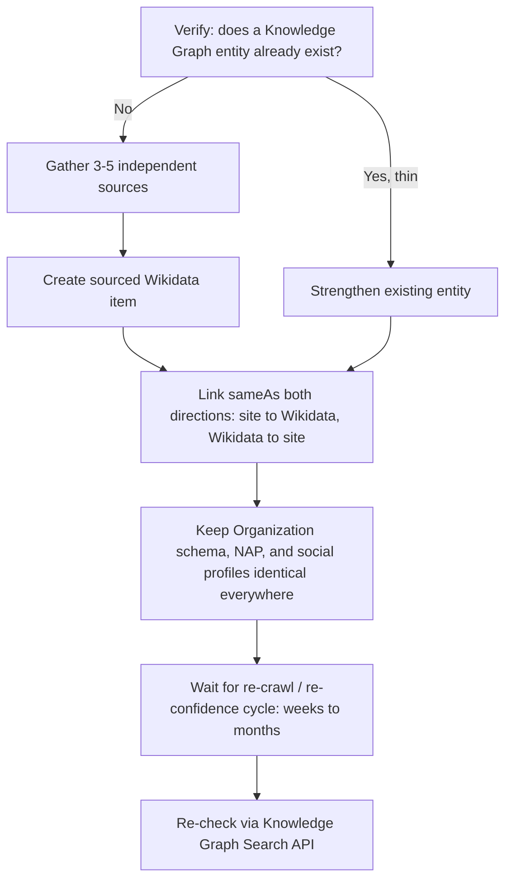

# Organization Schema in 2026: How to Actually Earn a Knowledge Panel

You've probably seen the box. Someone searches your brand name, and next to (or above) the results sits a neat little card with your logo, a one-line description, your social links, maybe a "founded in" date. That's a Knowledge Panel, and no, you can't just request one. Google builds it for you, automatically, once it's confident enough about who you are — and in 2026, that confidence isn't optional set-dressing anymore. It's the gate standing between your brand and being cited in AI Overviews and Gemini answers at all.

Here's the thing. Most "how to get a Knowledge Panel" content out there reads like a checklist copied from 2019: fill in your schema, claim your Wikipedia page, done. That advice isn't wrong, exactly. It's just incomplete in a way that wastes months of your time, because it skips the part where you actually verify Google recognizes you as an entity before you keep piling on signals that go nowhere.

## Why Entity Recognition Became the Whole Game

Google's Knowledge Graph has ballooned into something like 1.6 trillion facts about 54 billion entities, and it isn't just a Search sidebar feature anymore — Gemini, AI Overviews, and AI Mode all ground their answers in it. That's the part that should change how you prioritize this work. A May 2026 citation study tracking 153,425 AI Overview citations found that roughly 77% of cited URLs sat outside the organic top 10. Read that twice. Ranking well and being cited are no longer the same fight, and entity recognition is increasingly what wins the second one.

So when you see a competitor's brand card pop up in an AI Overview answer while your objectively-better content gets ignored, it's usually not a content quality problem. It's that Google, Gemini, or Perplexity can't confidently answer the question "who is this, and can I trust the data associated with them?" That's the exact question a Knowledge Panel exists to answer for a human, and the exact question an entity graph answers for a machine.

[→ Read also: Author Entity SEO in 2026: Who Signs Your AI-Written Draft?](/blog/author-entity-seo-2026-ai-written-content-bylines/) covers the same problem for individual bylines — this piece is the organization-level counterpart, and the two aren't interchangeable. A `Person` node proves a human wrote something. An `Organization` node proves the company behind the domain is real, verifiable, and consistent. You need both, but conflating them (stuffing founder bios into your Organization schema, say) is one of the more common ways brands sabotage their own entity signals.

## What Actually Builds a Knowledge Panel (Spoiler: Not a Form)

There's no submission button. Google needs three things to be true simultaneously before it'll display a panel: a Knowledge Graph entry already exists for you, your notability clears whatever bar Google sets for that entity type, and your entity data is corroborated across independent sources rather than just self-asserted on your own site.

That last condition is where most brands quietly fail. You can have flawless Organization schema on your homepage and still get nothing, because schema on your own domain is a claim, not a corroboration. Google is explicitly looking for the same facts — same name, same founding date, same logo, same social handles — showing up on sources it doesn't control: Wikidata, Wikipedia, LinkedIn, Crunchbase, industry directories, press coverage. When five independent sources agree on the same set of facts, that's a corroborated entity. When your About page says one thing and your Crunchbase profile says another, you're not building trust, you're generating noise Google has to resolve — and it usually resolves it by doing nothing.

This is also why the notability requirement trips people up. Wikidata's bar is lower than Wikipedia's — it accepts entities that can be described with serious, publicly available references, without Wikipedia's stricter "significant coverage" threshold. But lower isn't zero. A Wikidata entry with no real sourcing gets flagged and deleted, and a deleted entry is worse for your entity graph than no entry at all, because it's now a documented signal that your claimed facts didn't hold up under scrutiny.

## The Organization Schema That Actually Carries Weight

Assuming your facts are real and corroborated elsewhere, here's what your Organization JSON-LD needs to do the actual disambiguation work, not just tick a validator's boxes:

```json
{
  "@context": "https://schema.org",
  "@type": "Organization",
  "@id": "https://www.example.com/#organization",
  "name": "Example Co",
  "legalName": "Example Company, Inc.",
  "url": "https://www.example.com/",
  "logo": "https://www.example.com/logo.png",
  "description": "One clear, factual sentence describing what the company does.",
  "foundingDate": "2015-03-01",
  "founder": {
    "@type": "Person",
    "@id": "https://www.example.com/about/jane-doe/#person"
  },
  "address": {
    "@type": "PostalAddress",
    "addressLocality": "City",
    "addressRegion": "State",
    "addressCountry": "US"
  },
  "sameAs": [
    "https://www.wikidata.org/wiki/Q000000",
    "https://en.wikipedia.org/wiki/Example_Co",
    "https://www.linkedin.com/company/example-co",
    "https://www.crunchbase.com/organization/example-co",
    "https://github.com/example-co"
  ]
}
```

The `sameAs` array is doing more work than any other line in that block. It's the property that literally connects your domain to the corroborating sources Google needs. When Google's disambiguation logic hits multiple companies sharing a similar name, the one with a clean `sameAs` chain into Wikidata wins the panel. Skip Wikidata and lean only on social profiles, and you're leaving the strongest disambiguation signal on the table.

Two details people get wrong constantly: `founder` should reference a `Person` node with its own stable `@id`, not just a plain string — the same pattern [→ Read also: Structured Data in 2026: What Still Works After Google's Cuts](/blog/structured-data-2026-what-still-works-after-google-cuts/) covers for stitching a `@graph` together with fragment identifiers instead of duplicating entities inline. And `logo` needs to be an actual clear brand mark at a reasonable resolution — a stretched favicon or a screenshot of a business card won't get pulled into a panel even when everything else validates.

## Wikidata: The Realistic Path, Not the Wishful One

If you don't already have a Wikidata item, this is the highest-leverage single action available to you, and it's also the step brands most often botch by treating it like a marketing asset instead of a reference database. Wikidata wants verifiable statements backed by independent sources — press coverage, regulatory filings, industry databases, anything that isn't your own website talking about itself. A page that reads like a press release, sourced entirely to your own blog, gets rejected or stripped down to almost nothing.

Practical sequence that actually works: gather three to five independent, durable sources that already mention your company's basic facts (name, founding date, HQ, what you do). Create the Wikidata item citing those sources for every statement, not just the item description. Link your official website property back to your domain, and make sure that domain's Organization schema lists the new Wikidata URL in its own `sameAs` array — the corroboration needs to run in both directions. Then wait. This isn't a same-week win; Google's re-crawl and re-confidence cycle for a new entity typically plays out over weeks to a few months, not days.

## Verify You Actually Have an Entity Before You Do Anything Else

Here's the step almost every listicle skips, and it's the one that saves you the most wasted effort: check whether Google's Knowledge Graph already has an entry for you before you spend another hour optimizing schema for an entity that doesn't exist yet.

Google's Knowledge Graph Search API (now being steered toward Cloud Enterprise Knowledge Graph for new integrations, though the original endpoint still works for lookups) lets you query by name and get back any matching entity, including its Knowledge Graph ID (`kgmid`) if one exists:

```bash
curl -s "https://kgsearch.googleapis.com/v1/entities:search?query=Example+Co&key=YOUR_API_KEY&limit=5&indent=True"
```

No result, or a result with the wrong entity type and no `detailedDescription`? You don't have a usable entity yet, and the fix isn't "add more schema" — it's "get corroborated externally first." A result with a `kgmid` but a thin or stale `detailedDescription`? That's an existing entity you can strengthen rather than one you need to build from scratch, and your priority shifts to consistency and freshness instead of initial discovery.

## Where Brands Actually Sabotage Their Own Entity Graph

The failure mode isn't usually "no schema." It's inconsistency dressed up as thoroughness. A few patterns worth checking against your own setup:

Your legal name, trading name, and the name in your schema all differ slightly across your site, your Wikidata item, and your LinkedIn page — "Example Co," "Example Company, Inc.," and "Example.co" scattered inconsistently. Pick one canonical form for `name` and use `legalName` for the registered variant, then keep it identical everywhere else.

Your `sameAs` array points at a personal LinkedIn profile instead of your company page, or at an inactive social account nobody's touched since 2022. Every `sameAs` target should be an actively maintained, brand-owned profile — a dead link here is worse than no link, since Google may have already indexed the stale association.

You're using Organization schema to describe a person, or Person schema on your About page to describe the company. This one's increasingly common now that AI drafting tools generate schema alongside content without a human checking entity types — exactly the failure mode [→ Read also: Author Entity SEO in 2026: Who Signs Your AI-Written Draft?](/blog/author-entity-seo-2026-ai-written-content-bylines/) documents for bylines, just showing up one level up the entity hierarchy.

And finally: you built a Wikidata item, then never touched it again while your company rebranded, moved headquarters, or changed founders. A stale Wikidata entry actively works against you, because it's now a corroborating source that contradicts your current schema instead of reinforcing it.



## FAQ

**Can I pay Google to get a Knowledge Panel?** No. There's no paid product for this, and any agency promising a guaranteed panel on a timeline is selling you the Wikidata and PR work, not the panel itself — which still depends on Google's own confidence threshold.

**How long does it take?** Realistically weeks to a few months after your entity data becomes genuinely consistent and corroborated, not from when you first add schema. New Wikidata items in particular take time to propagate into Google's confidence model.

**Do I need Wikipedia, or is Wikidata enough?** Wikidata is the more realistic near-term target since it has no notability threshold as steep as Wikipedia's. A Wikipedia article helps significantly if you clear that bar, but plenty of legitimate Knowledge Panels exist for brands with a solid Wikidata item and no Wikipedia page at all.

**Does this help with AI Overview citations too, or just the Search sidebar?** Both draw from the same underlying Knowledge Graph, which is exactly why this work compounds — strengthening your entity for Search recognition strengthens the same signals AI Overviews, AI Mode, and Gemini use when deciding whether to cite you.

## Conclusion

There's no shortcut here, and that's honestly the useful part of the story: it means the brands doing this properly — sourced Wikidata entries, consistent schema, a `sameAs` chain that actually resolves — have a real, defensible advantage over the ones bolting on Organization JSON-LD and hoping. In an AI search landscape where citation increasingly runs on entity trust rather than ranking position, that advantage compounds every time Gemini or an AI Overview has to decide who to believe. Check whether you've even got an entity first. Then go build the corroboration that makes it undeniable.

```json
{
  "@context": "https://schema.org",
  "@type": "BlogPosting",
  "headline": "Organization Schema in 2026: How to Actually Earn a Knowledge Panel",
  "description": "Google won't hand you a Knowledge Panel for asking. Here's the 2026 Organization schema, sameAs, and Wikidata workflow that actually builds one.",
  "datePublished": "2026-09-22",
  "dateModified": "2026-09-22",
  "keywords": "Organization Schema, Entity SEO, Knowledge Panel, Structured Data, Technical SEO"
}
```
