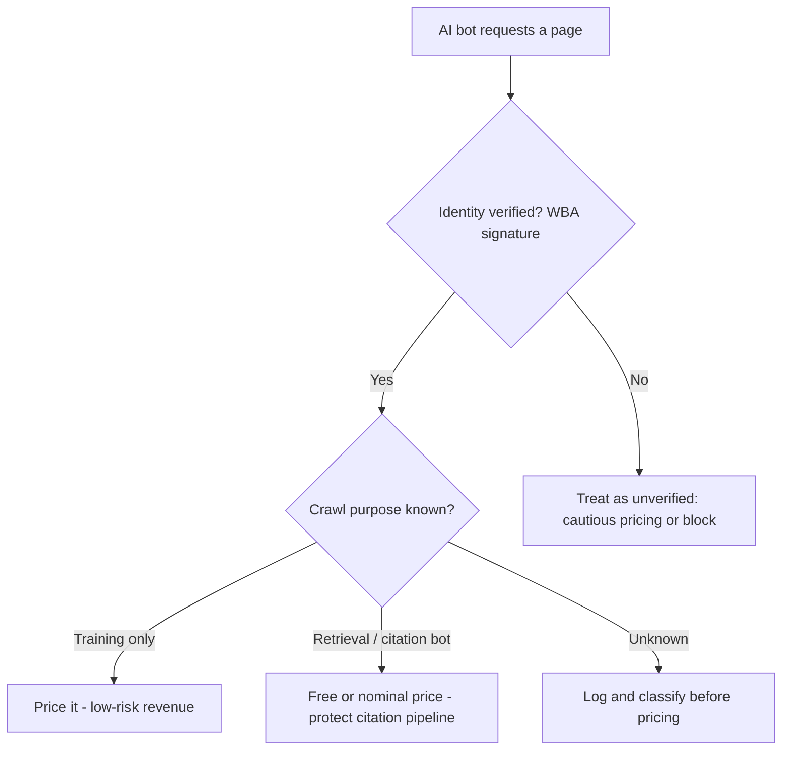

# AI Bot Monetization 2026: AWS, Akamai, and Cloudflare's Toll Roads for AI Crawlers

Somewhere in the last twelve months, the "402 Payment Required" status code went from HTTP trivia — the one nobody ever actually returns — to the centerpiece of a new business model. AWS switched it on for every CloudFront customer in June. Akamai wired it into 150 billion daily bot requests through a partnership announced back in September 2025. Cloudflare, which started this whole thing, is now rebuilding its own version on top of the same open protocol the other two picked. If you run a site that AI crawlers touch — and in 2026, that's every site — you now have a lever you didn't have a year ago: charge the bots for access.

The catch is that the lever doesn't come with a warning label. Flip it the wrong way and you don't just lose some scraping traffic — you can quietly cut yourself out of the AI Overviews, ChatGPT answers, and Perplexity results that are increasingly where your next customer finds you first.

## The New Toll Booth on the Web

Cloudflare fired the opening shot on July 1, 2025, with Pay Per Crawl: flat, per-request pricing, a straightforward 402 response, no cryptocurrency required to get started. It was novel but limited — one platform, one pricing model, opt-in only for sites already on Cloudflare's network.

A year later, the picture looks completely different. AWS WAF shipped AI traffic monetization on June 15, 2026, available to every CloudFront customer at no extra charge beyond standard WAF pricing. Akamai took a different route entirely, partnering with TollBit and Skyfire in September 2025 under the banner "No Free Crawls" — Akamai's edge network detects the bot, then hands it off to TollBit's "tollbooth," which authenticates the agent, sets access terms, and processes payment, while Skyfire layers on cryptographically verified agent identity tokens so trusted bots can skip the redirect entirely.

Then, in July 2026, the two biggest of these — AWS and Cloudflare — converged on the same underlying rail: x402, an open protocol from Coinbase that resurrects the dormant HTTP 402 status code as a machine-readable payment handshake. AWS's CloudFront support went generally available first; Cloudflare followed on July 6, 2026, opening a waitlist for a "Monetization Gateway" that layers x402 on top of what Pay Per Crawl started. Coinbase says the broader x402 ecosystem processed 169 million payments across 590,000 buyers and 100,000 sellers in its first year — this isn't a niche crypto experiment anymore, it's quietly becoming default web infrastructure.

## How x402 Actually Works (and Why That Matters for a Bot, Not Just a Human)

The mechanics are almost aggressively simple, which is exactly why three major infrastructure providers converged on it independently. A crawler requests a gated resource. The server responds not with a 403 block or a redirect, but with an HTTP 402 and a JSON price manifest — machine-readable terms an AI agent can parse and act on without a human in the loop. The client (or the wallet behind it) pays and retries the request with cryptographic proof of payment attached. A facilitator — Coinbase's, in both the AWS and Cloudflare implementations — verifies the payment on-chain, and the server serves the content. Settlement happens in USDC, primarily on Base, with transaction costs described as "a fraction of a cent," which is the only reason micropayment-per-page-view is even economically sane.

On AWS specifically, the implementation is more granular than the "flat fee" model Cloudflare launched with. AWS WAF now recognizes more than 650 distinct AI bot types — GPTBot, Claude-Web, PerplexityBot, and hundreds more — and sorts them into two tiers: **verified** bots that prove their identity through a Web Bot Auth (WBA) Ed25519 cryptographic signature, and **unverified** bots recognized only by user-agent string and behavioral pattern-matching. Content owners then set pricing rules by content path, by bot category, or by verification tier, through what AWS calls protection packs. Crucially, the monetize action only works on CloudFront-associated web ACLs, so this is a CDN-edge decision, not something you bolt onto an origin server after the fact.

Akamai's model looks different on the surface — no direct 402 rule-writing, just detection-and-redirect to TollBit's paywall — but the economics are the same idea wearing a different coat: TollBit currently redirects around 450 million bot requests per quarter to its paywall across more than 3,000 publisher sites, out of roughly 1.5 billion quarterly scrapes it monitors. Whether you use AWS's native pricing rules, Cloudflare's Pay Per Crawl, or Akamai's TollBit/Skyfire handoff, you've arrived at the same fork in the road: every AI bot hitting your site is now a line item you can price, and the pricing decision you make has consequences that reach well past your server bill.

## SEO & Search Implications: The Citation Trap

Here's the part the monetization press releases don't spend much time on, and it's the reason this belongs on an SEO blog rather than a fintech one: **not all AI bot traffic is the same traffic, and charging it indiscriminately can quietly sever the exact pipeline that sends you customers.**

Roughly 80% of AI bot activity, by Cloudflare's own breakdown, is training-purpose crawling — bots harvesting content to fine-tune a model, with no connection back to a specific user query and no citation ever generated. We've documented elsewhere on this blog just how lopsided that traffic already is: crawl-to-refer ratios that hit 2,237:1 for Anthropic and north of 3,000:1 for Mistral as of July 2026 (see our [llms.txt investigation — llms.txt in 2026: 300K Domains Say It Does Nothing](/blog/llms-txt-2026-does-it-work-what-to-do-instead/)). Charging *that* slice of traffic is close to a free win — you're monetizing bandwidth that was never going to send you a visitor anyway.

The other slice is different. Retrieval-purpose crawlers — OAI-SearchBot, Claude-SearchBot, PerplexityBot — are the ones that actually fetch a page in direct response to a live user query and can turn into a citation, a link in an AI Overview, or a referral click. Our own log-file research found search-purpose crawling made up under 10% of total AI crawler requests as of May 2026 ([→ Read also: Technical SEO Playbook: AI Crawlers & AEO in 2026](/blog/technical-seo-playbook-ai-crawlers-aeo-2026/)) — a thin, valuable slice sitting inside a much larger training-crawl haystack. Toll that slice the same way you toll the training bots, and you're not protecting your content; you're paying to make yourself invisible to the exact surfaces where AI-referred traffic is already surging (Adobe's 2026 data put AI-referred traffic to US retailers up 393% year over year). As one industry commentator put it bluntly while covering this shift: "the crawler you would charge and the answer that refers a customer to you are often the same pipeline." Get the segmentation wrong and you've built a toll booth on your own driveway.

This is exactly where AWS's granular, per-bot-category pricing has a real edge over a flat-fee model — you can, in principle, set training-purpose bots to a real price, leave known retrieval/citation bots free or nominally priced, and use the verified/unverified tier to decide how much you trust a claimed identity before you even get to the pricing question. That verification layer also closes a gap we flagged when covering fake-Googlebot detection in server logs: an unverified bot claiming to be a citation-driving crawler is a much weaker signal than one carrying a Web Bot Auth cryptographic signature, and treating the two identically is how sites end up either overpaying trust to impersonators or accidentally tolling the traffic they most want to keep.

## Should You Actually Turn This On? A Decision Framework

Before you touch a single WAF rule, answer three questions honestly.

**Does an appreciable share of your traffic come from AI citations today, or is it aspirational?** If AI referral traffic is already a measurable line in your analytics, the calculus changes completely — you have something concrete to protect, not just a hypothetical future channel.

**Can you actually distinguish training bots from retrieval bots in your logs right now?** If the answer is no, monetization isn't your first move — a crawl-purpose audit is. You can't price what you can't classify, and pricing blind is how you end up tolling your own citation pipeline by accident.

**Is your traffic volume large enough that per-request stablecoin settlement is worth the operational overhead?** Sub-cent transaction fees sound trivial until you're reconciling thousands of micropayments a month with no native invoicing — a gap even the protocol's own community has flagged, since VAT compliance and consolidated billing for high-volume payers remain genuinely unresolved as of this writing.

If you clear all three, the rollout order that makes sense is: start on the CDN you're already using rather than migrating for this feature alone, price training-purpose traffic first since it's the lowest-risk revenue, and leave your known citation-driving bots alone until you have a few weeks of data showing what, if anything, changed.

## Common Mistakes and Advanced Considerations

The single most common mistake so far has been treating "AI bot" as one undifferentiated bucket and applying a blanket price or block to all of it — which is precisely the trap the SEO implications section above walks through. A close second: enabling this at the CDN layer without first checking whether your `robots.txt` and Content Signals fields already say something different. If you've set the `ai-input` and `ai-train` fields we covered in our piece on [Cloudflare's September crawler policy — Cloudflare's Sept 15 AI Crawler Block: Audit Your Site Now](/blog/cloudflare-ai-crawler-block-september-2026-seo-audit/) to permissive values, and then quietly start charging the same bots at the edge, you've created a policy contradiction that's invisible until someone — a researcher, a journalist, an AI lab's own crawler-behavior audit — notices the mismatch between what your robots.txt promises and what your WAF actually does.

There's also a genuinely open question about where this heads next as agent-to-agent commerce matures. The same x402 rail powering AI-bot content tolls is architecturally adjacent to the agentic-commerce payment and discovery protocols reshaping ecommerce — UCP's capability negotiation and ACP's feed-based model, which we covered in depth in our [agentic web standards piece — Agentic Web Standards: MCP, A2A, and What They Mean for SEO](/blog/agentic-web-standards-mcp-a2a-seo/). Don't be surprised if, within a year or two, "pay this agent to complete a purchase" and "charge this agent to read your page" converge into a single machine-payments layer that every site owner has to think about as one policy, not two.

## Conclusion

The pay-per-crawl era isn't a Cloudflare curiosity anymore — it's an AWS default, an Akamai partnership spanning 150 billion daily requests, and a converging open protocol that two of the three biggest infrastructure providers now speak natively. That's real leverage for publishers who've spent a decade getting scraped for free. But the SEO angle here isn't "should you charge AI bots" — it's "do you actually know which AI bots are worth charging, and which ones you'd be paying to lose." Get your crawl-purpose classification right before you touch a pricing rule, and this becomes a genuine new revenue line. Get it backwards, and you'll have built an expensive, cryptographically-verified wall between your content and the exact AI answers that were about to send you a customer.

## FAQ

**Does charging AI bots affect my Google Search rankings?**
No — these monetization tools target AI-specific bots (GPTBot, Claude-Web, PerplexityBot, and similar), not Googlebot itself, which continues to crawl and index for classic Search under its own separate policy. Confirm your rules aren't accidentally matching Googlebot's user agent before deploying anything broad.

**Will this block me from appearing in ChatGPT or Perplexity answers?**
It can, if you price or block the retrieval-purpose crawlers (OAI-SearchBot, PerplexityBot, Claude-SearchBot) the same way you price training crawlers. Segment by purpose first.

**Do I need to hold cryptocurrency to use any of this?**
Not directly as a publisher — settlement happens in USDC to a provider-managed wallet (AWS, Cloudflare) or through TollBit's payment processing (Akamai), and AWS explicitly states it doesn't take a fee or require you to touch the payment rail yourself.

**Which platform should I use if I'm not already on any of these three?**
Use whichever CDN you're already on. Migrating specifically for bot monetization rarely pays for itself; the bigger win is getting the training-vs-retrieval classification right, which matters regardless of vendor.

**Is this worth setting up for a small site?**
Probably not yet, unless you already see meaningful AI-crawl volume in your logs. Start with classification and monitoring — the pricing decision only matters once you know what you'd actually be pricing.
