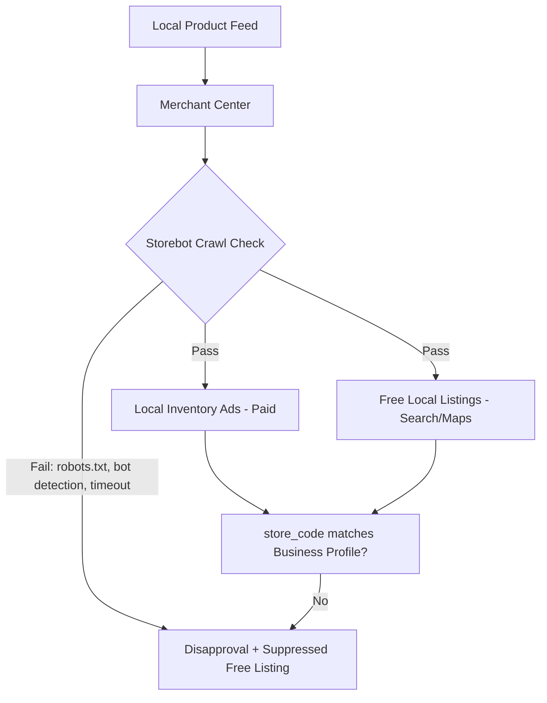

# Local Inventory Ads Default 2026: The Silent SEO Risk in Your Feed

On July 20, 2026, Google quietly published a developer blog post that most SEOs never saw. Three sentences in, and one line changed everything for anyone selling in physical stores: starting August 31, every Shopping campaign would enable Local Inventory Ads by default, whether you asked for it or not. No opt-out. No warning banner in the Ads UI. Just a backend flip that turned your product feed's local data — the stuff you maybe filled in once and forgot about — into a live, always-on signal.

Here's the thing nobody's saying out loud: this isn't really an ads story. It's a technical SEO story wearing an ads-policy costume, and if you've been treating your local inventory feed as a "nice to have" for Local Inventory Ads, you're about to find out it was never optional in the first place.

## What Actually Changed on August 31

Before this update, `enable_local` was a field you set yourself. Want Local Inventory Ads? Flip it to `true`. Don't want your in-store stock showing up in ads? Leave it `false` and move on. That switch is gone for Shopping campaigns. Google Ads API v25.1 and later will now throw a `ContextError.OPERATION_NOT_PERMITTED_FOR_CONTEXT` error if any script tries to set it to `false` — the backend overrides the value to `true` regardless. If you're still on an older API version, it's worse: your disable request gets silently ignored. No error, no warning. Your campaign just quietly starts serving local inventory while your automation dashboard reports everything as configured the way you left it months ago.

Performance Max for Retail and Demand Gen campaigns aren't touched by this — they've had their own `enable_local` behavior for a while, and Performance Max for Retail already defaulted to local serving. This change specifically closes the gap for plain Shopping campaigns, aligning them with where Google's Performance Max ecosystem already was. It also lands right after the January–March 2026 product ID split enforcement, where Google forced merchants to submit separate product IDs for online versus in-store inventory. Put those two changes together and the pattern is obvious: Google has spent 2026 systematically making local and online inventory two distinct, independently-tracked data streams — and now it's making sure the local stream actually gets used.

If you sell in physical stores and run Shopping campaigns, this already happened to you three and a half weeks ago whether you noticed or not.

## Local Inventory Ads Were Never Just an Ads Feature

Here's where most of the coverage on this change gets it wrong. Every PPC blog covering the August 31 flip is writing it as an Ads API compliance story — audit your scripts, add an inventory filter, done. That's necessary, but it misses the bigger structural fact: the same local inventory feed that powers paid Local Inventory Ads also powers **free local listings** on Google Search and Maps.

Google's own Business Profile documentation confirms it plainly: verified local inventory data can show your in-store products directly in Search results for nearby product queries, on your Business Profile card, and in the Shopping tab — with zero ad spend attached. That's organic-adjacent, discovery-driving real estate, and it runs off the exact same feed infrastructure as the paid side. Which means feed quality was never a pure-ads concern. A missing `store_code`, a stale `availability` value, or a price mismatch between your feed and your landing page doesn't just risk a disapproved ad — it can quietly suppress your free organic visibility for "buy [product] near me" searches too, the same searches [→ the three-layer SEO-AEO-GEO framework](/blog/seo-aeo-geo-three-layer-strategy/) argues are getting harder to win in the AI era.

Before August 31, sloppy local feed data mostly hurt advertisers who'd deliberately opted in. Now it surfaces automatically, for every Shopping advertiser with a linked Business Profile and a local feed sitting somewhere in Merchant Center — including ones who never consciously decided to compete for local visibility at all.

## Meet StoreBot: The Crawler Nobody Audits

If you've spent any time hardening your `robots.txt` against AI crawlers — and if you've read our piece on [Cloudflare's September AI crawler block](/blog/cloudflare-ai-crawler-block-september-2026-seo-audit/), you probably have — there's a good chance you've never once thought about Storebot-Google. It's a separate, purpose-built crawler that exists solely to verify price, availability, and pickup options on in-store product pages before Google will trust your local inventory data enough to show it anywhere, paid or free.

Storebot doesn't behave like Googlebot, and that's exactly the problem. It gets caught by the same technical barriers that block any automated visitor: a `robots.txt` rule that blanket-disallows crawlers, a bot-detection system with an incomplete allowlist, a CDN or WAF that fingerprints requests and 403s anything that isn't a browser, or a landing page slow enough to time out before Storebot finishes rendering it. None of these are exotic misconfigurations. They're the standard defensive crawler-blocking moves a lot of sites already made this year in response to aggressive AI scraping — and Storebot can get caught in that same net purely by accident.

When that happens, Merchant Center flags an "inconsistency" between what your feed says and what your landing page shows, because Storebot literally couldn't check. Left unresolved, that inconsistency now cascades into both your paid Local Inventory Ads (disapprovals) and your free local listings (silent suppression) — because after August 31, there's no longer a separate "local-inventory-off" state to fall back into. Fixes typically take 12 to 48 hours to propagate once you've whitelisted the user agent, but you have to know to look for it first, and most technical SEO audits simply don't check for a bot they've never heard of.

## The Feed Requirements You Can No Longer Ignore

Google's local inventory data spec isn't new, but it's no longer something you can quietly under-fill and get away with. At minimum, your local feed needs:

- `store_code` values that exactly match the store codes linked to your verified Google Business Profile locations — a mismatch here is the single most common cause of local inventory rejection
- Accurate `id`, `availability`, `quantity`, and `price` fields per store, kept in sync with what a customer actually sees walking in the door
- Products that are genuinely obtainable today or tomorrow at that physical location — not "usually in stock," not a warehouse SKU dressed up as store inventory
- Manufacturer UPC/EAN identifiers where applicable, feeding the same GTIN matching logic covered in our [Google Shopping price and availability edge cases](/blog/google-shopping-price-availability-schema-edge-cases-2026/) piece — local inventory inherits every one of those edge cases, plus its own

If any of this sounds familiar, it should — it's the same discipline the Merchant API migration forced on the online side of your feed. The difference is that local inventory data has historically gotten a fraction of the QA attention, precisely because it used to be optional.

## The Technical SEO Audit You Need Now

Treat this like any other forced-default policy change — the same way we approached the [Merchant API migration SEO risks](/blog/merchant-api-migration-2026-feed-seo-risks/) — and run through it methodically rather than reactively:

1. **Grep every script and integration touching the Google Ads API for `enable_local`.** If you're pre-v25.1, silent overrides mean your monitoring can't be trusted here — check actual campaign settings, not what your code believes it set.
2. **Decide, deliberately, whether you want local serving on.** If you genuinely don't, the only real path now is a `CampaignCriterionService` listing-scope filter with `product_channel` set to `ONLINE`, or an inventory filter splitting budgets by channel. There's no simpler switch anymore.
3. **Verify Storebot access explicitly.** Check your `robots.txt`, your bot-detection allowlist, and your CDN/WAF rules for the Storebot-Google user agent specifically — don't assume "we allow Googlebot" covers it, because it doesn't.
4. **Reconcile `store_code` values against your live Business Profile list.** Do this quarterly at minimum; store openings, closures, and rebrands are exactly the kind of change that silently breaks this link.
5. **Spot-check price and availability parity** between your feed and 10–15 real landing pages, store by store, not just at the catalog level.



## Common Mistakes and What Advanced Teams Are Doing Instead

The single biggest mistake we're already seeing: treating the August 31 change as a one-time cleanup task instead of a permanent shift in what "good feed hygiene" means. Local inventory data now behaves like your main product feed — it's live, it's always eligible to surface, and it needs the same ongoing monitoring cadence, not a one-off audit that gets filed away.

The second mistake is assuming an opt-out is a real fix rather than a workaround. Filtering by `product_channel: ONLINE` stops local ads from serving, sure, but it does nothing for Storebot access or free local listing eligibility if you actually want that organic exposure — and given how much harder AI-mediated search has made organic visibility generally, deliberately switching off a free discovery surface because the paid side got noisy is usually the wrong trade.

What smarter teams are doing instead: building a lightweight automated check — even a weekly cron job hitting a sample of store landing pages with the Storebot user agent string spoofed, comparing response codes and load times against your feed's declared availability. It's a small script, and it catches exactly the kind of silent drift this policy change is designed to expose.

## Frequently Asked Questions

**Does this affect Performance Max campaigns?**
No. Performance Max for Retail already defaulted to local serving before this change, and Demand Gen campaigns keep their own independent `enable_local` setting. This specifically closes the gap for standard Shopping campaigns.

**Can I still fully disable local inventory ads?**
Not through the `enable_local` field anymore. Your working alternative is a listing-scope filter (`product_channel: ONLINE`) via `CampaignCriterionService`, or channel-based inventory filters in your campaign settings.

**Will this affect my organic rankings directly?**
Not your web rankings in the traditional sense — but it directly affects whether your in-store inventory appears in free local listings on Search and Maps, which is a real, zero-cost discovery surface that a feed error can now silently take away from you.

**How do I know if Storebot is blocked on my site?**
Check Merchant Center's diagnostics for local inventory disapprovals citing landing page inconsistency, then specifically test whether your `robots.txt`, WAF, or bot-detection layer allows the Storebot-Google user agent — most general "we allow Googlebot" audits don't check this separately.

**How long do fixes take to reflect?**
Google states 12–48 hours after resolving a Storebot access issue and triggering a recrawl via Merchant Center's "Request review" or "Fetch now" options.

## Conclusion

Google didn't announce a marketing shakeup on July 20 — it announced an infrastructure decision, and infrastructure decisions are exactly the kind of thing technical SEO is supposed to catch before they become a crisis. The teams who'll come out ahead here aren't the ones scrambling to patch an Ads API integration. They're the ones who recognize that a local product feed is now a live, always-on discoverability channel with its own crawler, its own data spec, and its own failure modes — and who start auditing it with the same rigor they already apply to `robots.txt`, structured data, and Core Web Vitals. If your local feed has been an afterthought, August 31 already made that decision for you.

```json
{
  "@context": "https://schema.org",
  "@type": "BlogPosting",
  "headline": "Local Inventory Ads Default 2026: The Silent SEO Risk in Your Feed",
  "description": "Google made Local Inventory Ads default for every Shopping campaign on Aug 31, 2026. Here's the technical SEO and crawlability fallout retailers are missing.",
  "datePublished": "2026-09-26",
  "dateModified": "2026-09-26",
  "keywords": "Local SEO, Ecommerce SEO, Technical SEO, Google Shopping, Structured Data"
}
```
