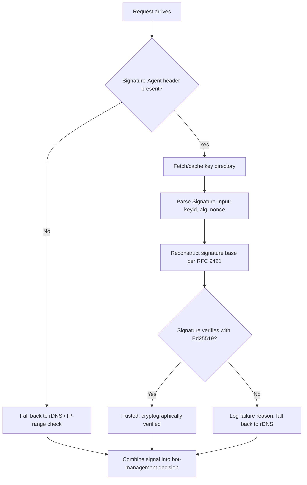

# 7 Steps to Implement Web Bot Auth and Verify Googlebot in 2026

Here's a weird gap in the SEO content world right now. Google quietly shipped an experimental way to cryptographically verify that a request really came from Googlebot — and a dozen publications rushed to explain *what it is*. Search Engine Journal covered it twice. Search Engine Land ran a piece. So did half a dozen agency blogs. Open any of them and you'll get the same three paragraphs: cryptographic signatures, better than IP checks, still experimental. Not one shows you the actual headers, the actual verification code, or the mistakes that make your implementation silently fail.

That's the gap this piece fills. If you run a site that cares about which bots are really hitting it — and if fake Googlebot traffic has ever thrown off your log analysis or made you nervous about a cloaking accusation, you care — this is the implementation guide the news cycle skipped. Seven steps, in the order you'd actually build them, each with the specific thing that trips people up.

## 1. Understand Why Reverse-DNS Verification Is Starting to Show Its Age

The classic way to confirm a crawler claiming to be Googlebot is legit hasn't changed in over a decade: do a reverse DNS lookup on the requesting IP, confirm it resolves to a `googlebot.com` or `google.com` subdomain, then do a forward DNS lookup on that hostname to confirm it maps back to the same IP. It works. It's also two DNS round trips per verification, it depends entirely on Google publishing accurate IP ranges (which it [moved to a new URL in March 2026](/blog/server-log-analysis-seo-2026-what-search-console-misses/), silently breaking scripts that hardcoded the old path), and it says nothing cryptographic — it's trusting DNS records, not a signature.

That matters more than it used to, because the crawler landscape isn't just "Googlebot vs. everyone else" anymore. Google alone now ships a growing roster of distinct user agents — `Google-Agent` for actions taken on a user's behalf, `Google-Extended` for AI training, `Google-InspectionTool`, `Google-GeminiNotebook`, and more — and each one needs the same trust question answered. rDNS doesn't scale cleanly to that, and it's exactly the kind of belief-vs-reality gap that shows up when you dig into your server logs instead of trusting Search Console's dashboard.

🔍 **SEO angle:** every downstream decision — crawl budget allocation, bot-management rules at the CDN, whether you can defend yourself against a cloaking accusation — rests on knowing who actually requested the page. A cryptographic signature is a fact. An IP range lookup is a probability.

## 2. Know Exactly What's Live Today — and What Isn't

Before you write a line of code, get the scope right, because the SERP's "it's here now" framing oversells it. Google added the Web Bot Auth documentation to its crawling docs on **May 4, 2026**, and the `Google-Agent` user agent itself was only introduced on **March 20, 2026**. Google's own page is explicit about the limits: it's labeled experimental, *not all* Google user agents implement it yet, and Google doesn't sign *every* request even from the agents that do participate. Right now, `Google-Agent` is the one that's actually signing a subset of its traffic.

That one fact should shape your whole rollout plan. You're not building a replacement for your existing verification — you're building an additional, stronger signal that layers on top of it for the traffic that happens to carry it. Treat "no signature present" as "not yet supported," not as "fake."

## 3. Stand Up the Public Key Directory Fetch

Google's signing keys live at a predictable, standardized location:

```
https://agent.bot.goog/.well-known/http-message-signatures-directory
```

This is the pattern defined by the IETF's Web Bot Auth working group (the `draft-meunier-webbotauth-httpsig-directory` spec), and it's the same `.well-known` convention other signed-agent systems are converging on — it's worth knowing this is the identical mechanism referenced in [AWS WAF's verified-vs-unverified crawler pricing tiers](/blog/ai-bot-monetization-2026-aws-akamai-cloudflare-pay-per-crawl/), so the plumbing you build here has a longer shelf life than just Googlebot.

The response is a JSON Web Key Set (`Content-Type: application/http-message-signatures-directory+json`) containing the public keys currently valid for that agent. Fetch it, cache it with a sensible TTL (respect the response's cache headers; don't hammer the endpoint on every request), and index the keys by their `kid` (key ID, a JWK thumbprint). A minimal Node example:

```javascript
import { importJWK } from 'jose';

let keyCache = { keys: {}, fetchedAt: 0 };

async function getSigningKeys() {
  const ONE_HOUR = 60 * 60 * 1000;
  if (Date.now() - keyCache.fetchedAt < ONE_HOUR) return keyCache.keys;

  const res = await fetch('https://agent.bot.goog/.well-known/http-message-signatures-directory');
  const { keys } = await res.json(); // standard JWKS shape
  const imported = {};
  for (const jwk of keys) {
    imported[jwk.kid] = await importJWK(jwk, 'EdDSA');
  }
  keyCache = { keys: imported, fetchedAt: Date.now() };
  return imported;
}
```

## 4. Parse the Signature-Agent, Signature, and Signature-Input Headers

A signed request carries three headers, all defined by RFC 9421 (HTTP Message Signatures) and serialized using RFC 9651 (Structured Field Values):

- **`Signature-Agent`** — a quoted URL pointing at the key directory from Step 3, e.g. `Signature-Agent: "https://agent.bot.goog"`
- **`Signature-Input`** — metadata about the signature: which components were signed, the `keyid` to verify against, the algorithm, a timestamp, and a nonce
- **`Signature`** — the actual signature value, base64-encoded and wrapped in colons, like `sig1=:MEUCIQ...:`

The label (`sig1` above, sometimes shown as `g=` in Google's examples) ties the three headers together — you're matching the same label across all three before you do anything else. Pull the `keyid` out of `Signature-Input` and use it to look up the right key from the directory you cached in Step 3. If the `keyid` isn't in your cached set, refetch the directory once before failing — keys do rotate.

## 5. Reconstruct the Signature Base and Verify with Ed25519

This is the step every explainer article skips, because it's the one that actually requires writing code instead of summarizing a concept. The signature isn't over the raw request — it's over a reconstructed "signature base," built by concatenating the specific components named in `Signature-Input` (typically `@authority` and `signature-agent`) with the signature parameters themselves, each on its own line, in the exact order and format RFC 9421 specifies.

```javascript
import { compactVerify } from 'jose';

async function verifyWebBotAuth(headers, signingKeys) {
  const sigAgent = headers['signature-agent'];
  const sigInput = headers['signature-input']; // e.g. sig1=("@authority" "signature-agent");keyid="...";alg="ed25519"...
  const signature = headers['signature'];      // sig1=:base64...:

  const keyid = /keyid="([^"]+)"/.exec(sigInput)?.[1];
  const key = signingKeys[keyid];
  if (!key) return { valid: false, reason: 'unknown-keyid' };

  // Reconstruct the signature base per RFC 9421 §2.5
  const base =
    `"@authority": ${headers.host}\n` +
    `"signature-agent": ${sigAgent}\n` +
    `"@signature-params": ${sigInput.split('=', 2)[1]}`;

  const sigBytes = Buffer.from(signature.split(':')[1], 'base64');
  try {
    // verifying raw Ed25519 bytes against the reconstructed base
    const valid = await verifyEd25519(key, Buffer.from(base), sigBytes);
    return { valid, reason: valid ? 'ok' : 'bad-signature' };
  } catch {
    return { valid: false, reason: 'verify-error' };
  }
}
```

(Treat the `verifyEd25519` call as a stand-in for whichever low-level primitive your crypto library exposes — `jose`'s high-level `compactVerify` expects a JWS envelope, so a lot of real implementations drop to Node's `crypto.verify` with the `Ed25519` algorithm directly against the reconstructed base string.) Also check the timestamp and nonce for freshness — a valid-looking signature on a replayed five-day-old request shouldn't pass.

🔍 **SEO angle:** this is the difference between "the user agent string said Googlebot" and "I cryptographically confirmed this exact request came from a key Google controls." The first is a courtesy. The second is evidence.

## 6. Avoid the Three Mistakes That Silently Break Verification

Implementers hit the same handful of bugs, and because a broken verification just falls through to "unsigned" instead of throwing an error, they're easy to ship without noticing:

**Leaving `Signature-Agent` out of the signature base.** It has to be one of the signed components, not just a header you read separately — if you reconstruct the base without it, every signature will fail to verify even though the headers all "look" present.

**Forgetting subdomains in `@authority`.** If you're matching `@authority` against a hardcoded hostname instead of the actual `Host` header from the request, traffic on a subdomain (a CDN edge, a regional mirror) will fail verification even when it's completely legitimate.

**Serialization mismatches** — using base64url where the spec wants plain base64, dropping the required quotes around the directory URL in `Signature-Agent`, or getting the parameter order wrong in `Signature-Input`. None of these throw a helpful error. They just make every signature invalid, and if your fallback logic is permissive (which it should be, per Step 7), you won't notice until you go looking.

Log the specific failure reason — not just `valid: false` — for exactly this reason. A spike in `bad-serialization` failures across all requests from one source is a bug in *your* code, not an attack.

## 7. Treat It as Defense-in-Depth, Not a Gate

Given everything in Step 2, don't 403 unsigned requests from `Google-Agent` or any other Googlebot variant. The rollout is partial and Google says so explicitly — a strict gate today just blocks legitimate crawling. The right posture:

- **Fail open.** No `Signature-Agent` header present → fall back to your existing rDNS/IP-range check, exactly as before.
- **Log the signed ratio over time.** What fraction of traffic claiming to be `Google-Agent` (or other participating UAs, as Google adds them) actually carries a valid signature? That ratio climbing is your signal the rollout is expanding — more useful than re-reading the changelog every week.
- **Combine signals, don't replace them.** A request that's both rDNS-clean *and* cryptographically signed is about as confident as bot verification gets in 2026. One without the other is still useful; neither alone should be your only gate.
- **Watch for expansion beyond Google.** The underlying spec is an IETF working-group effort, not a Google-only mechanism — it's the same `.well-known` pattern [Cloudflare and AWS are already building monetization tiers around](/blog/ai-bot-monetization-2026-aws-akamai-cloudflare-pay-per-crawl/) for AI agent traffic generally. Building the verification plumbing now means you're ready when OpenAI, Anthropic, or Perplexity's retrieval bots start signing too, instead of bolting on a second implementation later.

## Honorable Mentions

**Google's own GitHub reference implementations**, linked from the crawling docs page, are worth a read even if you don't use the language — they're the closest thing to a canonical example right now, and most third-party guides haven't caught up to referencing them yet.

**The broader Web Bot Auth ecosystem beyond Googlebot** — Cloudflare's agentic-traffic signing for AI bots, and the signed-vs-unsigned pricing tiers AWS WAF launched for crawler monetization — all speak the same `.well-known` directory and RFC 9421 dialect. If you build the verification function in Step 5 generically (pass in the directory URL instead of hardcoding Google's), you get coverage for all of it from one piece of code.

## Conclusion

If you only take one step from this list and ship it this week, make it Step 3 and Step 7 together: stand up the key-directory fetch, and wire your logging so you can see the signed ratio climb over the coming months. That alone turns "is this really Googlebot" from a guess into a measured trend line, without you having to gate anything or risk blocking real crawl traffic during an admittedly experimental rollout.

The bigger picture is worth sitting with for a second. For twenty years, bot verification has been a trust exercise built on self-reported strings and DNS records that happen to be hard to fake *today*. Cryptographic signing changes the category entirely — it's not harder-to-fake, it's mathematically-can't-fake (for the subset of traffic that's signed, anyway). As more AI agents and retrieval crawlers adopt the same IETF mechanism, the sites that already have verification plumbing in place won't be scrambling to build it under deadline pressure. The ones that wait for the next "SEO agencies must know" explainer piece will be doing this exact implementation work six months later than they needed to.

## FAQ

**Is implementing Web Bot Auth required for SEO?** No. It's experimental, opt-in on Google's side, and your existing rDNS/IP verification still works for the vast majority of crawl traffic. Treat this as a forward-looking addition, not an urgent migration.

**Does Web Bot Auth replace robots.txt or the Content Signals fields?** No — they solve different problems. Robots.txt (and the `ai-input`/`ai-train` Content Signals fields covered in our [Cloudflare AI-crawler audit](/blog/cloudflare-ai-crawler-block-september-2026-seo-audit/)) declare *policy* — what you allow. Web Bot Auth proves *identity* — who's actually asking. You need both.

**Which crawlers support it right now?** Only `Google-Agent`, and only for a subset of its requests, as of this writing. Watch Google's crawling-docs changelog for expansion to other user agents.

**Should I block unsigned requests once I've built verification?** No. See Step 7 — fail open. Blocking unsigned traffic today means blocking most of Googlebot's actual crawling, since the broader rollout hasn't happened yet.

**How does this relate to the AI bot monetization trend?** The same cryptographic-signing pattern underpins how AWS WAF and Cloudflare now price verified-vs-unverified AI crawler traffic differently — see our [AI bot monetization breakdown](/blog/ai-bot-monetization-2026-aws-akamai-cloudflare-pay-per-crawl/) for how that market is shaping up. Building Web Bot Auth verification now gives you the same plumbing those pricing models depend on.


