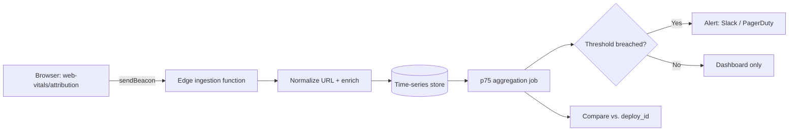

# Core Web Vitals RUM in 2026: Build Your Own INP Pipeline

Here's a scenario that should sound familiar. You ship a "small" checkout update on a Tuesday. Two weeks later, your INP numbers in Search Console start creeping into the red, impressions on your money pages dip a little, and nobody can point to the commit that caused it. By the time Google's Chrome UX Report (CrUX) fully reflects the damage, you've lost almost a month of clean ranking signal — and the regression is buried under three sprints of other changes.

This is the exact problem real user monitoring (RUM) exists to solve, and 2026 is the first year the tooling to build your own is genuinely good, free, and not locked behind a $500/month vendor contract. Chrome shipped the Long Animation Frames (LoAF) API to stable in Chrome 149 back in May, and Google's own `web-vitals` JavaScript library added LoAF integration to its attribution build in version 5.0. Put those two things together and you get something that used to require an enterprise observability platform: field-accurate, root-cause attribution for Interaction to Next Paint (INP), running on your own infrastructure, feeding your own dashboards.

This article walks through what that actually looks like to build — not the marketing pitch, the wiring.

## Why CrUX Alone Isn't Enough Anymore

Core Web Vitals are a confirmed page experience ranking signal, and Google's own Chrome UX Report is the dataset it uses to judge you. The problem is CrUX was never designed to be your monitoring system — it was designed to be Google's monitoring system, and you happen to get read access to it.

Three structural gaps matter here. First, CrUX only reports on origins and URLs that clear a popularity threshold, so most long-tail pages — the exact pages where a slow third-party script or an unoptimized component quietly tanks interactions — never show up at all. Second, CrUX aggregates by the 75th percentile over a rolling 28-day window. That window isn't a "28-day delay" in the way people assume (the underlying data itself is only about two days old), but it is a slow-moving average: after a fix ships, you're looking at roughly a week before the trend is visible and the full month before the old bad data rolls out completely. Third — and this is the one that actually costs you — CrUX tells you *that* a page is slow. It doesn't tell you *why*. No script name, no DOM element, no stack trace. Just a percentile.

RUM closes all three gaps, because you control what gets collected, from which pages, and how much detail comes with it.

[→ Read also: Mobile vs Desktop Core Web Vitals: The 15-Point INP Gap](/blog/mobile-vs-desktop-core-web-vitals-2026-inp-gap/)

## The Pieces: web-vitals, Attribution, and LoAF

Google's `web-vitals` library has quietly become the de facto standard for field measurement — it's the same code PageSpeed Insights and the Chrome team themselves reference. The standard build gives you the headline numbers (LCP, INP, CLS, plus TTFB and FCP). The **attribution build** is a separate, slightly heavier import (`web-vitals/attribution`) that adds the diagnostic payload you actually need to act on a regression.

For INP specifically, the attribution object now includes:

- `interactionTarget` — a CSS selector for the element the user actually interacted with
- `inputDelay`, `processingDuration`, and `presentationDelay` — the three-phase breakdown of where the 200ms (or 500ms, for "needs improvement") actually went
- `longAnimationFrameEntries` — the Long Animation Frame entries that overlapped the interaction, when the browser supports LoAF

That last one is the 2026 upgrade. Before LoAF, you got the Long Tasks API, which only fires once a single task crosses 50ms and tells you almost nothing about what ran inside it. LoAF captures the *entire* animation frame — every script that executed, by source URL and function name, plus how much of the frame went to forced style/layout work. A slow interaction caused by five medium-sized third-party scripts stacking up, instead of one obviously huge one, was basically invisible before LoAF. Now it isn't.

[→ Read also: INP Optimization 2026: The Developer's Guide to Fixing It](/blog/inp-optimization-2026-developer-guide/)

Here's a minimal collector that captures all three Core Web Vitals plus full attribution and ships them with `sendBeacon` so it never blocks navigation:

```javascript
import { onCLS, onINP, onLCP } from 'web-vitals/attribution';

function send(metric) {
  const body = JSON.stringify({
    name: metric.name,
    value: metric.value,
    rating: metric.rating,
    id: metric.id,
    navigationType: metric.navigationType,
    url: location.pathname,
    attribution: metric.attribution,
  });

  // Prefer sendBeacon; fall back to fetch with keepalive for older browsers
  if (navigator.sendBeacon) {
    navigator.sendBeacon('/rum/collect', body);
  } else {
    fetch('/rum/collect', { body, method: 'POST', keepalive: true });
  }
}

onCLS(send);
onINP(send);
onLCP(send);
```

Feature-detect before you lean on LoAF-specific fields, since support is still Chromium-only (Chrome, Edge, Opera, Brave — Safari and Firefox measure INP but don't expose LoAF attribution yet):

```javascript
const supportsLoAF =
  PerformanceObserver.supportedEntryTypes?.includes('long-animation-frame');
```

## Building the Ingestion and Storage Layer

The collector is the easy 20%. The part that actually makes this a *pipeline* rather than a script is what happens after `/rum/collect` receives a beacon.

A few practical decisions you'll need to make:

**Sample, don't collect everything.** At any real traffic volume, logging every single metric event is wasteful and gets expensive fast. Sample at 10–20% of sessions for high-traffic templates, and consider collecting 100% only on your highest-value pages (checkout, product, landing pages tied to paid spend). You can do this client-side with a simple `Math.random()` gate before the beacon fires, or server-side if you want central control over the rate.

**Put the ingestion endpoint at the edge.** A Cloudflare Worker, Vercel Edge Function, or any similarly lightweight edge runtime is the right shape for this: low latency, no cold-start penalty blocking the user, and you can do cheap enrichment (geo, device type from the User-Agent Client Hints header, deploy version from a build-time environment variable) before writing the row.

**Store it as a time series, keyed by URL template, not raw URL.** Normalize `/products/4471-blue-jacket` to `/products/:id` at write time. This is the single biggest thing that makes aggregation useful later — nobody wants a p75 computed per unique product URL when what you actually need is "is the product template regressing."

A simple schema, whether you're writing to ClickHouse, BigQuery, Postgres with TimescaleDB, or even a flat Parquet file on object storage:

```sql
CREATE TABLE rum_events (
  ts            TIMESTAMP,
  metric_name   TEXT,        -- 'INP' | 'LCP' | 'CLS'
  value         DOUBLE,
  rating        TEXT,        -- 'good' | 'needs-improvement' | 'poor'
  url_template  TEXT,        -- normalized, e.g. '/products/:id'
  deploy_id     TEXT,        -- git sha or build id, for regression correlation
  device_type   TEXT,
  country       TEXT,
  longest_script_source TEXT,  -- from attribution.longAnimationFrameEntries
  longest_script_duration DOUBLE
);
```

That `deploy_id` column is doing more work than it looks like. Once you have it, correlating a p75 jump with a specific release becomes a five-minute `GROUP BY` instead of three weeks of guessing — which, incidentally, is exactly the diagnosis time one engineering team reported cutting down after wiring up LoAF attribution on a Webflow site where a single interaction handler was adding 380ms of INP.



## SEO & Search Implications

This is the part that turns a performance engineering project into something an SEO owns too. The whole point of catching an INP or CLS regression in your own RUM data is that you're acting on it before it ever shows up where it actually costs you: in the CrUX dataset Google uses for the page experience signal, and in Search Console's Core Web Vitals report, which inherits straight from CrUX.

Run the math on timing. If a regression ships and sits undetected for even one sprint, you're looking at roughly a week just for CrUX's 28-day rolling window to start reflecting it, and closer to a month before the dashboard fully "catches up" to how bad it actually is — all while URLs on the affected template potentially sit in the "needs improvement" or "poor" bucket for live ranking evaluation. RUM collapses that detection window from weeks to minutes. You find out from your own beacon, not from a Search Console email a month later.

There's a second, less obvious SEO payoff: coverage. CrUX only reports on pages and origins that clear a traffic threshold, which quietly excludes a huge share of long-tail content — exactly the pages that compound into real organic traffic for most sites. Your own RUM pipeline has no such floor. You can see the p75 INP on a page that gets forty visits a month, which is precisely the kind of page that never earns a line in the CrUX dashboard but still gets crawled, rendered, and evaluated.

If you're already running the kind of SEO regression gate in CI that catches a bad canonical or an accidental noindex before merge, a RUM alert on p75 INP breaching threshold for a template is the production-side complement to that — one catches the mistake before it ships, the other catches the one that only shows up under real traffic and real devices. It's also a more trustworthy signal than Search Console alone on a day when something upstream is acting strange — a lesson worth remembering given how often GSC's own reporting has had its own anomalies this year.

[→ Read also: Search Console Anomalies Broke Your 2026 Year-Over-Year Data](/blog/search-console-anomalies-2026-year-over-year-reporting/)

## Common Mistakes to Avoid

**Trusting lab data as a proxy for INP.** Lighthouse and PageSpeed Insights lab runs use a synthetic interaction (usually a scripted click), and that single data point tells you almost nothing about how the metric behaves across a real population of devices, network conditions, and genuinely unpredictable user behavior. INP in particular is a field-only metric in practice — build the RUM pipeline instead of trusting a lab score.

**Attributing by raw URL instead of template.** If your dashboard is a wall of individual product or article URLs each with their own tiny sample size, you'll chase noise instead of signal. Normalize to templates first, always.

**Ignoring the cross-origin and iframe blind spots.** LoAF attribution goes empty for scripts running in cross-origin iframes (a lot of ad units and some embeds) and doesn't see inside Web Workers. If your checkout widget or chat embed lives in an iframe, expect a gap in `longAnimationFrameEntries` there — it doesn't mean nothing happened, it means the API structurally can't see it.

**Forgetting to sample consistently across cohorts.** If you sample 10% of desktop traffic but 100% of mobile, your aggregates will look worse on mobile for reasons that have nothing to do with actual performance. Keep your sampling rate consistent, or weight your aggregation to correct for it.

**Treating this as a one-time setup.** A RUM pipeline earns its keep over months, through deploys you haven't shipped yet. Wire the `deploy_id` correlation in from day one, because retrofitting it after your first mystery regression is a much worse week than building it up front.

## Conclusion

Core Web Vitals RUM used to mean choosing between an expensive vendor platform or flying blind until CrUX eventually told you something was wrong. The LoAF API landing in stable Chrome and web-vitals' attribution build picking it up changes that math: the hard part — getting root-cause attribution for INP, not just a number — is now a free, open-source import away. What's left is genuinely plumbing work: a collector, a sampling policy, a normalized schema, and an alert threshold.

Build it once, and you stop finding out about a ranking-relevant regression from a Search Console email a month after it started costing you traffic. You find out from your own dashboard, the morning after it shipped — while you can still trace it to the exact deploy that caused it.

## FAQ

**Does RUM data replace CrUX for SEO reporting?**
No — CrUX stays the dataset Google actually uses for the ranking signal, so it's still your ground truth for "how does Google see us." RUM is your early-warning system and your diagnostic layer; use both together rather than picking one.

**Is the web-vitals attribution build safe to ship on every page?**
Generally yes — the extra payload is small (roughly 1.5KB brotli-compressed) and it ships asynchronously via `sendBeacon`, so it shouldn't meaningfully affect the metrics you're trying to measure. Sampling is still worth doing for cost control at scale, not because the library itself is heavy.

**What if my site mostly runs on Safari or Firefox traffic?**
INP itself is now measurable across Safari 26.2+ and Firefox 144+, so the headline metric still works everywhere. LoAF-based attribution — the "why" behind a slow interaction — is currently Chromium-only, so non-Chromium sessions will give you the number without the root cause until other engines ship support.

**Do I need a dedicated observability vendor to do anything useful here?**
Not to get started. The collector, ingestion function, and storage layer described here can run on a free-tier edge function and an open-source time-series database. A vendor platform buys you faster dashboards and less maintenance, not capability you can't otherwise get.
