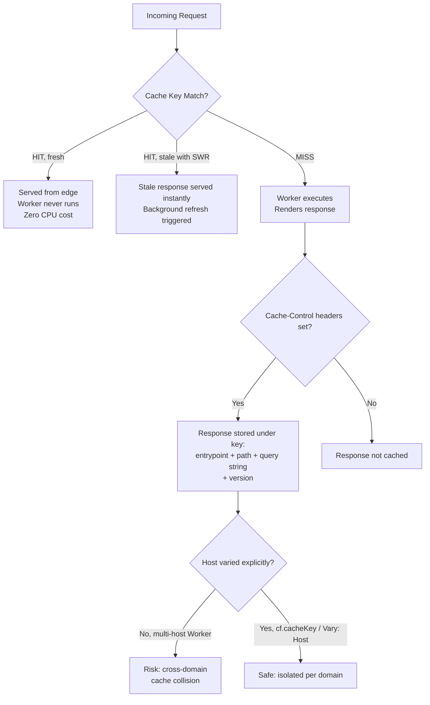

# Cloudflare Workers Cache in 2026: The SEO Risk Hiding in Your Cache Key

On July 6, 2026, Cloudflare shipped something that sounds, on paper, like pure good news: Workers Cache, a tiered caching layer that sits directly in front of every Worker, on every plan, free. Cache hits skip your Worker entirely. No CPU time billed, no cold render, just an instant response straight from the edge. If you're running server-side rendering on Workers, that's a free TTFB win waiting to happen.

Here's the thing, though. Nobody's really talked about what the cache *key* is actually made of — and if you build on Workers without reading that fine print, you can end up serving the wrong page to the wrong domain, or quietly fragmenting your own crawl budget. Not because Cloudflare did anything wrong. Because the defaults assume you already know how Workers are architected, and a lot of SEO and dev teams don't.

## Why This Matters Right Now

Edge rendering has become the default way serious sites ship fast pages — personalization, A/B tests, geolocation-aware content, all computed at the edge instead of round-tripping to an origin server three regions away. We've covered the technical risks that come with rendering at the edge before [→ Read also: The Technical SEO Playbook for AEO: Why AI Crawlers Can't Read Your Best Content (2026)](/blog/technical-seo-playbook-ai-crawlers-aeo-2026/). Workers Cache changes the equation again, because now there's a caching layer sitting *between* that edge logic and the response Googlebot actually sees.

That's not a hypothetical concern. The broader security community has spent 2026 cataloguing what researchers now call "tenant-aware caching bugs" — a whole class of issues where a cache doesn't fully understand which tenant, domain, or user a cached response belongs to, and ends up serving it to the wrong one. Workers Cache isn't accused of having that bug. But its design choices put the burden of avoiding it squarely on you, the developer, and that's exactly the kind of detail that gets skipped when a team is excited about a free performance upgrade and isn't thinking about search implications at all.

## What Workers Cache Actually Does

Let's get the mechanics straight first, because they matter for everything that follows.

Before Workers Cache existed, the typical setup had Workers running *in front of* Cloudflare's cache and your origin — your Worker decided what to do, then either served a response or reached back to origin. Workers Cache flips part of that: now a caching layer can sit *in front of* your Worker when you're doing server-side rendering, intercepting the request before your code ever runs.

The headline benefit, straight from Cloudflare's own announcement: "If there's a fresh cached response, Cloudflare returns it directly — your Worker doesn't run, and you don't pay CPU time for it." That's not a minor optimization. For a dynamic page that would otherwise re-render on every request, a cache hit turns a compute-bound response into a static-file-speed one. Combine that with `stale-while-revalidate` — Cloudflare's example sets `Cache-Control: public, max-age=300, stale-while-revalidate=3600` — and every visitor gets a cache-speed response while a background refresh quietly updates the content behind the scenes. Nobody waits on a render, including the person who triggered the refresh.

There's also request collapsing: if ten requests hit an uncached URL at the same moment, Cloudflare runs your Worker once and serves that single response to all ten waiting requests, instead of rendering the same page ten times in parallel. For high-traffic pages — the ones Googlebot and AI crawlers hit hardest — that's a meaningful reduction in origin load and a smoother TTFB curve under crawl pressure.

So far, so good. This is a legitimately good piece of infrastructure. The problem shows up once you look at what's actually *inside* the cache key.

## The Cache Key Most Teams Won't Expect

Cloudflare's own documentation is explicit about what makes up the default Workers Cache key: the target entrypoint, the **path and query string** (with parameter order treated as significant — `?a=1&b=2` and `?b=2&a=1` are literally different cache entries), and the Worker version. What's notably absent is the request **host**. Workers are zoneless, so by default, the same Worker code serving multiple hostnames doesn't automatically separate its cache by domain.

Sit with that for a second. If you run one Worker behind several hostnames — a multi-tenant SaaS product, a staging domain alongside production, regional ccTLD variants of the same storefront — and your code returns different content for different hosts without explicitly varying the cache on `Host`, you have the ingredients for cross-host cache collisions. One domain's cached render can end up served under a different domain's URL. For a human visitor that might just look like a glitch. For a crawler indexing both domains, it's a duplicate-content or wrong-brand-content problem baked directly into what gets stored at the edge — and it happened without anyone writing a bug in the traditional sense. It happened because nobody told the cache the two domains were different.

The query-string behavior cuts the other way but causes a related headache. Because `?a=1&b=2` and `?b=2&a=1` are separate cache entries, and because query strings are included in the key by default, any URL that carries tracking parameters, session identifiers, or facet filters in inconsistent order fragments your own cache. You end up with dozens of cache entries for what is, from a canonicalization standpoint, the exact same page — paying full Worker-execution cost on each unique parameter permutation instead of serving a shared cache hit. If that sounds familiar, it's the same underlying problem we covered in our faceted-navigation piece [→ Read also: Faceted Navigation SEO 2026: Stop Killing Your Crawl Budget](/blog/faceted-navigation-seo-2026-crawl-budget-ecommerce/) — except now it's not just crawl budget on the line, it's your cache hit rate and CPU bill too.

Cloudflare does give you the tool to fix this: a Worker can override the URL component of its own cache key via `cf.cacheKey`, stripping tracking parameters before the key is computed, so `?utm_source=newsletter` and no UTM param at all resolve to the same cached entry. That's the right move. It's just opt-in, and nothing forces you to notice you need it until something's already gone sideways.

## SEO & Search Implications

Here's where this stops being a backend curiosity and starts being an SEO problem.

First, the upside is real and worth claiming: cache hits that skip Worker execution entirely are a direct lever on Time to First Byte, and TTFB is upstream of Largest Contentful Paint. A page that used to re-render dynamically on every request and now serves from edge cache in single-digit milliseconds has a genuinely better shot at passing LCP thresholds under real-world CrUX conditions, not just synthetic Lighthouse runs — particularly for pages Googlebot hits repeatedly, where request collapsing keeps response times stable instead of degrading under crawl pressure.

Second, and this is the part that deserves real attention: cache-key design is now a crawlability and duplicate-content control, not just a performance knob. If your cache doesn't distinguish hostnames and your Worker serves multiple domains without an explicit `Vary: Host` (or equivalent) strategy, you risk Googlebot and AI retrieval crawlers indexing cross-contaminated content — the wrong canonical page's HTML showing up under the wrong URL in Google's index. That's a far messier cleanup than a normal duplicate-content issue, because the cached response itself was never wrong on its own; it was just served to the wrong address.

Third, `stale-while-revalidate` interacts directly with content freshness and re-indexing speed. A background refresh means the *first* crawl after you publish an update might still see the stale version, with the fresh one only appearing on a subsequent crawl once the revalidation completes. For most content that's a non-issue — a five-minute staleness window is nothing. But for time-sensitive pages (price changes, breaking news, availability updates), a long `max-age` plus a long `stale-while-revalidate` window is exactly the kind of setting that quietly delays what Googlebot actually sees, independent of how fast your crawl rate is.

None of this means "don't use Workers Cache." It means cache-key hygiene now belongs on the same checklist as canonical tags and robots.txt rules — treated as a search-facing control, not purely an infrastructure decision.



## How to Audit Your Own Setup

Start by asking one question: does a single Worker of yours answer requests for more than one hostname? If the answer is yes — multi-tenant app, staging + production sharing a Worker, regional domain variants — check immediately whether your cache strategy accounts for `Host`. If your responses differ by hostname and you're not explicitly isolating the cache key per host (via `cf.cacheKey` or a `Vary` strategy that includes host-equivalent logic), treat that as a priority fix, not a backlog item.

Next, pull a sample of your most-crawled URLs from server logs and check for parameter-order inconsistency — the same canonical page reachable through `?category=shoes&sort=price` and `?sort=price&category=shoes`. If your analytics or CMS generates links with inconsistent ordering (common with faceted navigation, pagination, or tracking parameters appended by different systems), you're fragmenting your own cache without realizing it. Strip or normalize those parameters via `cf.cacheKey` before they ever hit the cache layer, the same way you'd already be handling them for canonical tag purposes.

Then check your `Cache-Control` values against content volatility. A marketing page can comfortably sit at `max-age=3600` with a generous `stale-while-revalidate` window. A page showing live inventory, pricing, or anything you want Googlebot to see fresh within minutes of a change needs a much shorter fresh window — or should bypass Workers Cache entirely and rely on your Worker's own freshness logic. Finally, build `Cf-Cache-Status` into your monitoring. The header returns `HIT`, `MISS`, `EXPIRED`, `REVALIDATED`, `STALE`, `UPDATING`, or `BYPASS` — logging that alongside user-agent lets you confirm, concretely, what state Googlebot's requests are actually hitting, rather than assuming.

## Common Mistakes and Advanced Tips

The single most common mistake will be teams enabling Workers Cache purely for the performance win — and plenty of teams will do exactly that once this spreads beyond early adopters — without ever running the hostname check above. The second most common: assuming zone-level cache rules apply the way they used to. They don't. Workers Cache is controlled entirely through HTTP response headers inside your Worker code; your old dashboard-configured cache rules won't touch it.

An advanced move worth adopting early: bake a cache-key audit into the same CI gate you already use for canonical-tag and indexability regressions — we've written about building exactly that kind of guardrail before [→ Read also: SEO Regression Testing in 2026: Guardrails for AI-Written Code](/blog/seo-regression-testing-2026-ci-guardrails-ai-code/). A quick automated check that flags any Worker response varying by host without a corresponding cache-key strategy catches this before it ships, not after Search Console starts showing duplicate-content warnings you can't immediately explain.

And if you're already running bot-management rules at the Cloudflare edge — Content Signals fields, AI-crawler blocking — it's worth re-reading those alongside your new cache configuration [→ Read also: Cloudflare's Sept 15 AI Crawler Block: Audit Your Site Now](/blog/cloudflare-ai-crawler-block-september-2026-seo-audit/), since both now live in the same request path and can interact in ways that are easy to miss when they were set up by different people at different times.

## Conclusion

Workers Cache is a genuinely good addition to Cloudflare's platform — free CPU savings on cache hits, request collapsing that protects you under crawl pressure, and a real shot at better TTFB-driven Core Web Vitals for anyone doing server-side rendering at the edge. But "free performance upgrade" and "zero SEO review needed" are not the same thing. The cache key's blindness to hostname, combined with a query-string-sensitive key where parameter order counts, means the same infrastructure decision that speeds up your site can also fragment your crawl budget or, in the multi-host case, hand a crawler the wrong domain's content entirely. Run the hostname check this week. It's a five-minute audit against a mistake that's much more than five minutes to untangle once Google's already indexed it.

## FAQ

**Does Workers Cache replace Cloudflare's regular zone-level cache?**
No. Zone-level cache rules don't apply to Workers Cache at all — it's controlled entirely through `Cache-Control` headers set inside your Worker's response, configured via a `[cache]` block in your Wrangler config.

**Will Workers Cache cache a redirect or a 404 by default?**
Only if your Worker explicitly sets caching headers on that response. Caching follows standard HTTP semantics (RFC 9111), so nothing is cached automatically just because it's a redirect or an error — you decide.

**How do I stop tracking parameters from fragmenting my cache?**
Override the cache key's URL component with `cf.cacheKey`, stripping parameters like `utm_source` before the key is computed, so variants collapse into one shared cache entry — the same normalization you likely already apply for canonical tags.

**Can I check whether Googlebot is getting cache hits or misses?**
Yes — every response carries a `Cf-Cache-Status` header (`HIT`, `MISS`, `STALE`, `REVALIDATED`, etc.). Log it alongside user-agent and you'll see exactly what state crawler requests are landing in.

**Is the hostname cache-key gap a Cloudflare bug?**
No — it's a documented design consequence of Workers being zoneless. It only becomes a problem if your Worker serves meaningfully different content across multiple hostnames without explicitly isolating the cache per host.

```json
{
  "@context": "https://schema.org",
  "@type": "FAQPage",
  "mainEntity": [
    {
      "@type": "Question",
      "name": "Does Workers Cache replace Cloudflare's regular zone-level cache?",
      "acceptedAnswer": {
        "@type": "Answer",
        "text": "No. Zone-level cache rules don't apply to Workers Cache at all — it's controlled entirely through Cache-Control headers set inside your Worker's response, configured via a [cache] block in your Wrangler config."
      }
    },
    {
      "@type": "Question",
      "name": "Will Workers Cache cache a redirect or a 404 by default?",
      "acceptedAnswer": {
        "@type": "Answer",
        "text": "Only if your Worker explicitly sets caching headers on that response. Caching follows standard HTTP semantics (RFC 9111), so nothing is cached automatically just because it's a redirect or an error."
      }
    },
    {
      "@type": "Question",
      "name": "How do I stop tracking parameters from fragmenting my cache?",
      "acceptedAnswer": {
        "@type": "Answer",
        "text": "Override the cache key's URL component with cf.cacheKey, stripping parameters like utm_source before the key is computed, so variants collapse into one shared cache entry."
      }
    },
    {
      "@type": "Question",
      "name": "Can I check whether Googlebot is getting cache hits or misses?",
      "acceptedAnswer": {
        "@type": "Answer",
        "text": "Yes, every response carries a Cf-Cache-Status header (HIT, MISS, STALE, REVALIDATED, etc.) that can be logged alongside user-agent to confirm what state crawler requests are hitting."
      }
    },
    {
      "@type": "Question",
      "name": "Is the hostname cache-key gap a Cloudflare bug?",
      "acceptedAnswer": {
        "@type": "Answer",
        "text": "No, it's a documented design consequence of Workers being zoneless. It only becomes a problem if a Worker serves meaningfully different content across multiple hostnames without explicitly isolating the cache per host."
      }
    }
  ]
}
```
