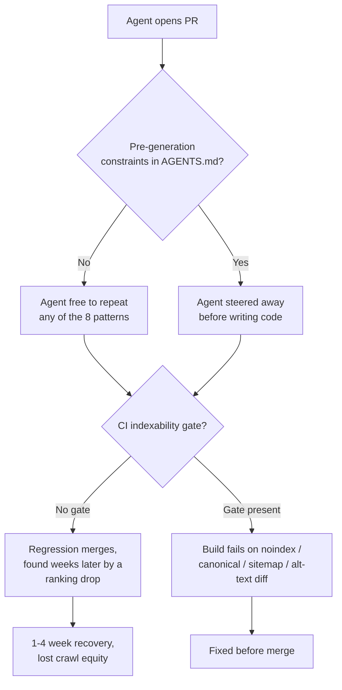

# 8 SEO Regressions AI Coding Agents Keep Shipping in 2026

Your agent closed twelve tickets this week. The build is green, the Playwright suite passed, the PR got an LGTM from a teammate who skimmed the diff between meetings. And somewhere in there, a crawler stopped seeing half your page.

That's the part nobody budgets for. Most "AI breaks SEO" content out there is still talking about vibe-coded landing pages built from scratch by someone who's never heard of a canonical tag — missing title tags, no alt text, a default favicon. Real problems, sure, but Day-1 problems. What we're talking about here is different and honestly scarier: production codebases that already rank, already convert, already have years of accumulated SEO equity, getting agentic PRs merged into them 3-4x faster than a human-only team ever shipped — and nobody's watching the eight places that equity actually lives in the code.

We picked these eight by three things: how often they show up in real agentic workflows, how quietly they ship (green CI, clean visual QA, invisible until a crawler or a ranking report notices), and how expensive they are to walk back once they're live. If you want the CI-gate side of this story — the actual Playwright specs and GitHub Actions workflow to catch regressions before merge — we've already written that up in [→ Read also: SEO Regression Testing in 2026: Guardrails for AI-Written Code](/blog/seo-regression-testing-2026-ci-guardrails-ai-code/). This piece is the "here's what you're actually guarding against" half of that story.

## 1. The "use client" Reflex Strips Your Server-Rendered Content

Ask most agents to "make this interactive" and the fastest path to a working demo is slapping `"use client"` at the top of the file. It compiles, the button works, the PR merges. What nobody checks is whether that directive just pulled a chunk of your previously server-rendered content into a client-only render tree — invisible to any crawler that doesn't execute JavaScript, and a coin-flip for the ones that do but time out before hydration finishes.

This is the same mechanism we dug into in [→ Read also: JavaScript SEO in 2026: How AI Crawlers Read React, Next.js, and Astro](/blog/javascript-seo-ai-crawlers-react-nextjs-astro/) — most AI crawlers still don't render JS, and the ones that do are stingier with execution budget than Googlebot. An agent optimizing for "does this component work in the browser" has zero incentive to notice that it quietly moved content from the HTML response to a client-side render pass. The fix isn't banning client components — it's a component boundary discipline: keep the content-bearing JSX server-rendered and push only the interactive leaf nodes to the client, and review every new `"use client"` the way you'd review a new environment variable.

## 2. Canonical Tags Get Copy-Pasted, Not Computed

Agents are pattern-matchers. Point one at a page template with a hardcoded `<link rel="canonical" href="https://example.com/product/widget" />` and ask it to duplicate that template for a new section, and it will very often duplicate the string along with the markup — because nothing in the diff looks wrong. You end up with forty new pages all canonicalizing to `/product/widget`, silently telling Google your entire new category is a duplicate of one old product page.

The fix is boring and that's the point: canonical tags should be computed from the current URL at render time, never hardcoded, and that computation should be a lint rule or a template-level abstraction an agent can't accidentally bypass by copying nearby code. If you're running the CI guardrails from the regression-testing piece above, a one-line Playwright assertion that `canonical === current URL` on every template catches this before it ships, full stop.

## 3. Slug Renames Ship Without a Redirect Map

"Can you clean up these URLs, they're ugly" is a completely reasonable ask, and an agent will absolutely do it — rename `/blog/post-slug-2024-final-v2` to `/blog/post-slug`, update every internal link it can find, and call it done. What it won't reliably do is generate the 301 redirect for the old path, because redirects live in a routing config or a middleware file that isn't always in the context window, and "the old URL still works" isn't a test anyone wrote.

Multiply this by however many pages got touched in a bulk rename and you've got a pile of 404s inheriting years of backlink equity straight into a dead end. Treat every URL change as a two-file commit, non-negotiably: the route change and the redirect entry, in the same PR, with a test that actually requests the old path and checks for a 301 rather than just checking the new page renders.

## 4. Sitemaps Quietly Stop Matching Your Routes

If your sitemap is hand-maintained or generated from a route list that isn't the same source of truth as your actual router, an agent restructuring routes has no reason to touch it — it's not in the dependency graph from the compiler's point of view, even though it's absolutely load-bearing for crawl discovery. The result is a sitemap advertising URLs that now 404, missing the new ones entirely, or both at once.

The only durable fix is making the sitemap derive from the same route manifest the app actually uses, generated at build time, not maintained by hand or by whoever remembers to update it. If that's not feasible this sprint, at minimum add a CI check that diffs the sitemap's URL set against a live crawl of the build output and fails loudly on drift — the same spirit as the indexability-regression monitoring that's becoming a standard guardrail in 2026 agentic pipelines, for exactly this reason.

## 5. Alt Text Dies in the "Cleanup" Pass

Ask an agent to refactor a component for readability and it will, with total confidence, "simplify" the props — and `alt` attributes are prime casualties, because to a model optimizing for clean JSX, an empty or missing `alt` prop often looks tidier than a long descriptive string sitting in the markup. It's not malicious, it's aesthetic: the agent genuinely thinks it improved the code.

This one has a real SEO tie-in beyond accessibility — descriptive alt text is still a meaningful signal for image search indexing and context for any model building an understanding of your page content for citation purposes. A pre-commit check that flags any diff removing or emptying an existing `alt` attribute is cheap insurance, and it's the kind of rule you can hand an agent directly in its own instructions file so it stops before it starts.

## 6. JSON-LD Gets Orphaned or Duplicated During Component Extraction

Extracting a repeated block into a shared component is exactly the kind of refactor agents are good at — and exactly the kind that breaks structured data, because a `<script type="application/ld+json">` block embedded in the original markup doesn't always travel cleanly when the surrounding JSX gets pulled into a new file. Sometimes it gets left behind in the old location and now renders on every page that imports the "cleaned up" component, duplicating the same Product or Article schema site-wide. Sometimes it just doesn't get moved at all, and the new component renders with no schema whatsoever.

We went deep on why schema discipline matters as an entity signal — not a display trick — in [→ Read also: Structured Data in 2026: What Still Works After Google's Cuts](/blog/structured-data-2026-what-still-works-after-google-cuts/), and the core advice holds here too: one `@graph` per page, injected from a single predictable location tied to the page's data, not hand-placed inline where a refactor can orphan it. If your JSON-LD generation is a function call rather than a copy-pasted script tag, there's nothing for the agent to accidentally leave behind.

## 7. Staging's noindex Rides Along to Production

This is the one that should scare you most, because it's not really an AI problem — it's an environment-config problem that agentic velocity makes dramatically worse. An `X-Robots-Tag: noindex` header, a CMS "discourage search engines" toggle, or an environment variable that fails to flip correctly between staging and prod has always been a risk. What's changed is how many deploys per day now carry that risk, because an agent merging four or five PRs before lunch means four or five chances for a config drift to slip through review that used to happen once a week.

The asymmetry is brutal: a stray noindex can get recrawled and acted on within a day or two, but reversing the damage typically takes one to four weeks of re-crawling and re-ranking to recover — a thirty-second mistake costing a month of organic revenue. Treat your indexability directives — robots meta, X-Robots-Tag, robots.txt — as production config with the same change-control rigor as a database migration, and add the one-line CI check that fails the build if `noindex` ever appears in a response from a production-flagged environment.

## 8. One Template, Ten Thousand Duplicate Titles

Scaffolding is where agents genuinely shine — ask for a new page template and twenty populated instances, and you'll have them in minutes. The failure mode is that "populated" doesn't always mean the title tag and meta description got real per-page interpolation; it's just as easy for an agent to ship a template where `<title>{pageName} | Brand</title>` works for the three pages tested in the demo and silently falls back to a static string for anything the agent didn't explicitly verify, because the interpolation variable wasn't threaded all the way through.

At small scale this is a minor annoyance. At the scale agents actually operate — scaffolding whole category trees, locale variants, or programmatic SEO pages in a single session — it's thousands of duplicate titles and descriptions landing in the index at once, which reads to Google as a quality signal about the whole domain, not just those pages. Spot-check a sample of generated pages' `<title>` and `<meta name="description">` output for uniqueness before merging any PR that scaffolds more than a handful of pages, and make uniqueness a named acceptance criterion in the ticket, not an assumption.

## Honorable Mentions

Two more worth a line each. Hreflang mappings drift the same way canonical tags do during i18n refactors — an agent duplicating a locale directory copies the hreflang block along with it, often pointing every locale at the same URL. And "fixing" a broken internal link by having the agent point it at whatever page title-matches closest can quietly create redirect loops or link to the wrong resource entirely, because title-matching isn't the same as actually resolving intent.

## How to Catch These Before They Ship

None of these eight are exotic. They're the same categories of SEO regression that have always existed — rendering, canonicalization, redirects, crawl discovery, image accessibility, structured data, indexability directives, content uniqueness. What's new in 2026 isn't the failure mode, it's the throughput: teams running agentic coding workflows are shipping commits at 3-4x the old rate, and detection latency that used to be "someone notices during the next sprint" doesn't scale to that velocity. The gap isn't that agents write worse code than humans on any one of these dimensions — it's that nobody put a machine-readable check in front of the thing a human reviewer used to catch by habit.

If you take one thing from this list, make it this: every item above has a cheap, specific, automatable check, and bolting all eight onto a single CI gate is a weekend project, not a quarter-long initiative. Pair it with constraints written directly into your agent's own instructions file — the same AGENTS.md / CLAUDE.md pattern we covered as a release-level control in [→ Read also: 9 Next.js 16.3 Changes That Quietly Affect Your SEO](/blog/nextjs-16-3-seo-changes-2026/) — so the agent is steered away from the mistake before it's even in the diff, not just caught after. That combination, a pre-generation constraint plus a post-generation gate, is the only approach that scales as agentic throughput keeps climbing; the productivity side of that same tradeoff is one we broke down in [→ Read also: The AI Coding Productivity Paradox: Why Senior Developers Are Getting Slower](/blog/ai-coding-productivity-paradox-senior-developers/), and the SEO cost described here is a big part of why that paradox exists.



## FAQ

**Is this just "vibe coding is bad for SEO" again?**
No, and that's the point — most of what's written about vibe coding describes greenfield sites built from scratch, where the problem is missing SEO basics from day one. This is about agentic coding tools making changes inside mature, already-ranking codebases, where the problem is a regression in infrastructure that used to be correct.

**Can't a thorough human code review catch all of this?**
In theory, yes. In practice, review throughput hasn't scaled with commit throughput — teams reviewing 3-4x the PR volume aren't reading every diff 3-4x more carefully, they're skimming faster. That's exactly why a machine-readable gate matters more now than it did two years ago.

**Which of these eight is the highest priority if I can only fix one thing this week?**
Staging noindex leaking to production (#7) and canonical tag mangling (#2) carry the worst damage-to-effort ratio — both are a single CI assertion to catch, and both can cost weeks of recovery if they ship unnoticed.

**Does this apply if we're using Copilot-style autocomplete rather than a full agentic workflow?**
Less acutely, but the same categories apply any time generated code touches canonical tags, redirects, structured data, or indexability directives — the risk scales with how much unreviewed surface area ships per unit of time, not with which specific tool wrote it.

```json
{
  "@context": "https://schema.org",
  "@type": "ItemList",
  "name": "8 SEO Regressions AI Coding Agents Keep Shipping in 2026",
  "description": "AI coding agents ship PRs 3-4x faster, and these 8 SEO regressions keep riding along silently. Here's what to catch before they tank your rankings.",
  "datePublished": "2026-10-05",
  "dateModified": "2026-10-05",
  "itemListElement": [
    { "@type": "ListItem", "position": 1, "name": "The \"use client\" Reflex Strips Your Server-Rendered Content" },
    { "@type": "ListItem", "position": 2, "name": "Canonical Tags Get Copy-Pasted, Not Computed" },
    { "@type": "ListItem", "position": 3, "name": "Slug Renames Ship Without a Redirect Map" },
    { "@type": "ListItem", "position": 4, "name": "Sitemaps Quietly Stop Matching Your Routes" },
    { "@type": "ListItem", "position": 5, "name": "Alt Text Dies in the \"Cleanup\" Pass" },
    { "@type": "ListItem", "position": 6, "name": "JSON-LD Gets Orphaned or Duplicated During Component Extraction" },
    { "@type": "ListItem", "position": 7, "name": "Staging's noindex Rides Along to Production" },
    { "@type": "ListItem", "position": 8, "name": "One Template, Ten Thousand Duplicate Titles" }
  ],
  "keywords": "AI Coding Agents, Technical SEO, JS SEO, Developer Productivity"
}
```
