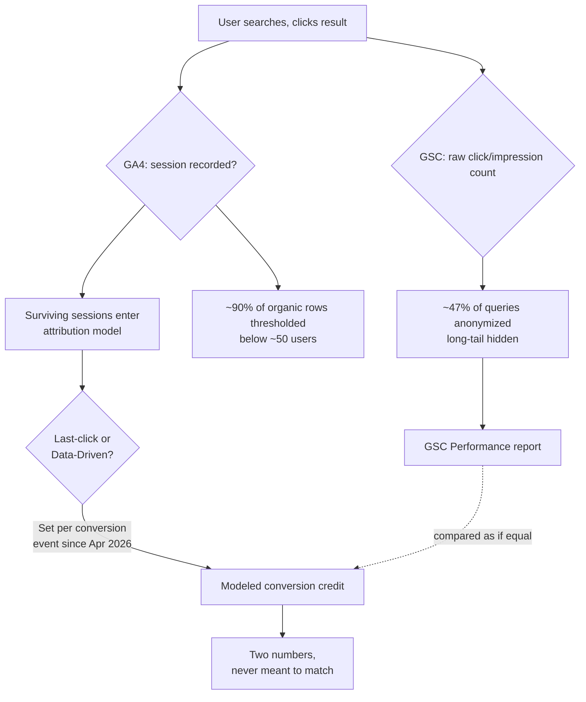

# GA4 vs Search Console 2026: Why Organic Search Never Matches

You pull up Search Console. It says 40,000 clicks last month. You pull up GA4. Organic Search shows 31,000 sessions and, worse, the conversions number keeps changing depending on which attribution tab you're looking at. Somebody on your team asks which number is "right," and you realize you don't actually have an answer — you have two systems that were never built to agree in the first place.

Here's the thing almost nobody tells you: that gap isn't a bug you can patch with a UTM parameter or a sampling toggle. It's structural, and in 2026 it's gotten one layer deeper than the "timezones and bot filtering" explanation everyone keeps repeating.

## Why GSC and GA4 Were Never Going to Agree

Google's own documentation on Search Console data discrepancies lists the usual suspects: crawl timing, URL coverage differences, bot filtering, JavaScript dependency, timezone offsets (GSC runs on Pacific time, GA4 on your account's timezone), a 2-3 day publication lag, and a hard 1,000-row cap on what the UI will show you. That's real, and it explains a meaningful chunk of the day-to-day wobble between the two dashboards.

But that list treats both tools as if they're measuring the same thing with slightly different rulers. They're not. Search Console counts something that happened: a person saw your result, a person clicked it. No model, no weighting, no judgment call — just a tally. GA4's organic search number, on the other hand, is increasingly something GA4 *decided*, not something it counted. That distinction is the part the "here's why your numbers differ" articles keep skipping, and it's the part that actually matters if you're trying to prove organic search's value to someone holding the budget.

[→ Read also: Search Console Anomalies Broke Your 2026 Year-Over-Year Data](/blog/search-console-anomalies-2026-year-over-year-reporting/)

## The Attribution Layer Nobody's Pricing In

Since November 2023, Google quietly killed off first-click, linear, time-decay, and position-based attribution in GA4. What's left are exactly two options: last-click and data-driven attribution (DDA). DDA has been the default for most conversion reporting since it rolled out broadly, and it doesn't assign a session's credit to one channel — it distributes fractional credit across every touchpoint in a user's path, weighted by a machine-learning model trained on your property's own conversion patterns.

Sounds smarter than last-click. It mostly is. But it means the "Organic Search: 847 conversions" line you're staring at in GA4 isn't a count of 847 users who converted after an organic click. It's a sum of partial credits — 0.3 here, 0.6 there — assigned by a model you can't see inside of, recalculated continuously as more data comes in. Two pulls of the same report on different days can return different numbers for the same historical period, because the model itself shifts as it learns.

Then April 2026 added a second wrinkle. Google restructured GA4's attribution settings so they're no longer one property-wide dial — they're configurable per conversion event. That's good news if you want purchases on data-driven and a micro-conversion like newsletter signups on last-click. It's bad news for anyone trying to reconcile "organic search performance" as a single number, because the model governing that number can now differ event by event on the exact same property, sometimes without anyone on the team realizing the setting was ever touched.

Practitioners have flagged a related pattern for years: DDA tends to over-credit branded search and direct traffic, because those are the touchpoints GA4 tracks almost perfectly — same device, same session, clean click. A user who sees a product on social, doesn't click, and converts two days later by searching your brand name gets that conversion attributed entirely to branded organic search. The channel gets the credit; the channel that actually created the demand gets nothing. Non-branded, discovery-stage organic search — the kind SEO teams actually want credit for — sits on the losing end of that same dynamic, because it rarely gets to be the *last* touch.

Meanwhile, Search Console has none of this. A click is a click. There's no model deciding whether that click "deserves" credit relative to some other touchpoint. That's the real mismatch: you're not comparing two counts with different edges trimmed off. You're comparing a raw tally against a statistically modeled estimate, and expecting them to converge.

[→ Read also: GA4's AI Assistant Channel vs GSC: Your AI Traffic Still Doesn't Add Up](/blog/ga4-ai-assistant-channel-search-console-attribution-gap/)

## Two Different Kinds of Data Loss, Stacked on Top

Even before attribution modeling enters the picture, both platforms are independently hiding chunks of your own data — in opposite directions.

On the Search Console side, Ahrefs' analysis of 22 billion clicks across nearly 900,000 properties found 46.77% of queries anonymized as of April 2025, essentially flat since 2022 (46.08%). Google anonymizes any query that isn't "issued by more than a few dozen users over a two-to-three month period" — which sounds like a rare-event edge case until you realize that's exactly where long-tail, emerging, and conversational queries live. The distribution skews ugly, too: plenty of sites lose 45-80% of their query-level data this way, and the author's reasonable expectation is that AI Overviews and longer, more conversational searches will push that number higher, not lower.

On the GA4 side, it's thresholding. Google has never published the exact cutoff, but the community's best reverse-engineered estimate sits around 50 users per row, and independent measurement across real properties found roughly 89.5% of traffic-source rows — organic search included — get hidden at that threshold. The rows that vanish represent about 90% of your report's line items but only around 5% of total traffic: the long tail. Which, again, is exactly where new keywords, newly-ranking pages, and emerging query patterns show up first. You lose visibility into organic search's growth edge on both ends of the pipeline, for completely unrelated reasons, before attribution modeling even touches the number.

So the full stack looks like this: GSC hides long-tail queries through anonymization → GA4 hides long-tail sessions through thresholding → the sessions that survive both filters get run through a black-box attribution model that redistributes their conversion credit based on patterns in your historical data → and the two final numbers you're left with get compared as if they were ever measuring the same thing.



## How to Actually Reconcile the Two

Stop trying to make GA4 and GSC agree. Reconcile them by treating them as three separate metrics, not two competing versions of one metric:

**1. GSC clicks and impressions = raw demand signal.** No model, no attribution, no touchpoint logic. This is your cleanest read on whether the content is being surfaced and chosen, full stop. Treat it as the ground truth for visibility, never for revenue.

**2. GA4 organic sessions (last-click) = a conservative behavioral baseline.** This is the closest GA4 gets to a simple count, and it's useful specifically because it's *not* fractionally split. Use it to sanity-check session volume against GSC clicks (accounting for the known gaps above), not to argue for budget.

**3. GA4 organic conversions (data-driven) = a modeled estimate of incremental value.** Useful for understanding organic search's role across a multi-touch journey, genuinely weak as a standalone performance number because it changes as the model recalculates and now varies per conversion event.

For the actual mechanics, skip the UI entirely where you can. GA4's BigQuery export gives you unsampled, unthresholded event-level data — the UI reports apply thresholding that the raw export doesn't. Pair that with Search Console's Bulk Data Export to BigQuery (also unthresholded, with no 1,000-row cap) and you can join session-level and query-level data in SQL instead of eyeballing two dashboards that were never going to line up.

```sql
-- Simplified reconciliation skeleton: GSC clicks vs GA4 organic sessions, by date
SELECT
  gsc.data_date,
  gsc.clicks AS gsc_clicks,
  COUNT(DISTINCT ga4.user_pseudo_id) AS ga4_organic_sessions
FROM `project.searchconsole_dataset.searchdata_site_impression` gsc
LEFT JOIN `project.analytics_dataset.events_*` ga4
  ON ga4.event_date = gsc.data_date
  AND ga4.traffic_source.medium = 'organic'
  AND ga4.traffic_source.source = 'google'
GROUP BY gsc.data_date, gsc.clicks
ORDER BY gsc.data_date DESC
```

That's a skeleton, not a finished query — real-world joins need session-start filtering and date-boundary handling to avoid double-counting — but it illustrates the point: the moment you're comparing raw export tables instead of UI widgets, "why don't these match" stops being mysterious and starts being a documented, explainable gap you can write down once and stop re-litigating every reporting cycle.

[→ Read also: Google's /goto Redirect Broke Rank Tracking. Here's Your Fix](/blog/google-goto-redirect-2026-rank-tracking-seo-measurement/)

## Common Mistakes Teams Keep Making

The biggest one is building a dashboard that silently blends GSC clicks and GA4 conversions into one "organic performance" number, as if subtracting one from the other produces a meaningful delta. It doesn't — you're subtracting a raw count from a modeled estimate and calling the remainder "data quality issues."

The second is assuming your attribution model is still whatever it was set to the last time anyone checked. After the April 2026 restructure, it's worth an actual audit: open every meaningful conversion event and confirm which model is assigned, because a property can now run last-click on one goal and data-driven on another without anyone having flipped a global switch.

The third is treating a GA4-vs-GSC gap as evidence something is broken, full stop, rather than checking whether the gap is stable. A consistent 20% gap month over month is just how these two systems structurally behave together. A gap that suddenly widens is the signal worth chasing — and that's a job for server logs and GA4's own anomaly tooling, not for staring harder at the percentage.

[→ Read also: The GA4 Blind Spot: Why AI Browsers and WebMCP Break Your Tracking](/blog/ga4-blind-spot-ai-browsers-webmcp-tracking-2026/)

## Conclusion

GA4 and Search Console were never going to hand you one clean, reconciled organic search number, and chasing that outcome is a waste of a reporting cycle. GSC gives you an honest, unmodeled count of demand that's missing nearly half its long tail to anonymization. GA4 gives you a session count that's missing most of its long tail to thresholding, feeding into an attribution model that can now legally disagree with itself across different conversion events on the same property. None of that makes either tool wrong. It makes them two different instruments measuring two different things, and the fix isn't a smarter spreadsheet formula — it's accepting the three-metric framework above, pulling the unthresholded data where it counts, and explaining the gap once instead of re-discovering it every month.

## FAQ

**Why do GA4 and Search Console never show the same numbers for organic search?**
They're not measuring the same thing. GSC counts raw clicks and impressions with no attribution logic. GA4's conversion numbers for organic search are the output of an attribution model — usually data-driven attribution — that redistributes credit across a user's full journey, so the figure you see is a modeled estimate, not a session count.

**Should I switch GA4 back to last-click attribution to match GSC better?**
No — last-click will still diverge from GSC's raw click count because of thresholding, anonymization, timezone, and bot-filtering differences covered above. Switching models changes which number is wrong, not whether the two tools agree.

**What's the GA4 data thresholding cutoff, exactly?**
Google has never published the number. Community estimates, reverse-engineered from real properties, cluster around 50 users per row, with measured impact hiding roughly 89.5% of traffic-source rows (organic search included) at that threshold.

**Does Google Search Console sample data the way GA4 does?**
Not in the same way, but it hides data differently: Search Console anonymizes any query that doesn't clear a minimum-user threshold over a two-to-three month window, which Ahrefs measured at 46.77% of all queries as of April 2025.

**What changed with GA4 attribution in April 2026?**
Google restructured attribution settings to be configurable per conversion event instead of one property-wide setting, so different key events on the same property can now legitimately run under different attribution models at the same time.

**What should I actually report to stakeholders — GSC or GA4?**
Both, as separate lines: GSC clicks/impressions for visibility and demand, GA4 last-click sessions as a conservative behavioral check, and GA4 data-driven conversions only when you're explicitly discussing organic search's role in multi-touch journeys — never blended into a single reconciled figure.

```json
{
  "@context": "https://schema.org",
  "@type": "FAQPage",
  "mainEntity": [
    {
      "@type": "Question",
      "name": "Why do GA4 and Search Console never show the same numbers for organic search?",
      "acceptedAnswer": {
        "@type": "Answer",
        "text": "They measure different things. GSC counts raw clicks and impressions with no attribution logic, while GA4's organic search conversions are the output of an attribution model, usually data-driven attribution, that redistributes credit across a user's journey."
      }
    },
    {
      "@type": "Question",
      "name": "Should I switch GA4 back to last-click attribution to match GSC better?",
      "acceptedAnswer": {
        "@type": "Answer",
        "text": "No. Last-click will still diverge from GSC's raw click count because of thresholding, anonymization, timezone, and bot-filtering differences. Switching models changes which number is wrong, not whether the two tools agree."
      }
    },
    {
      "@type": "Question",
      "name": "What's the GA4 data thresholding cutoff, exactly?",
      "acceptedAnswer": {
        "@type": "Answer",
        "text": "Google has never published the exact number. Community estimates cluster around 50 users per row, with measured impact hiding roughly 89.5% of organic/traffic-source rows at that threshold."
      }
    },
    {
      "@type": "Question",
      "name": "What changed with GA4 attribution in April 2026?",
      "acceptedAnswer": {
        "@type": "Answer",
        "text": "Google restructured attribution settings to be configurable per conversion event instead of one property-wide setting, so different key events on the same property can run under different attribution models simultaneously."
      }
    }
  ]
}
```
