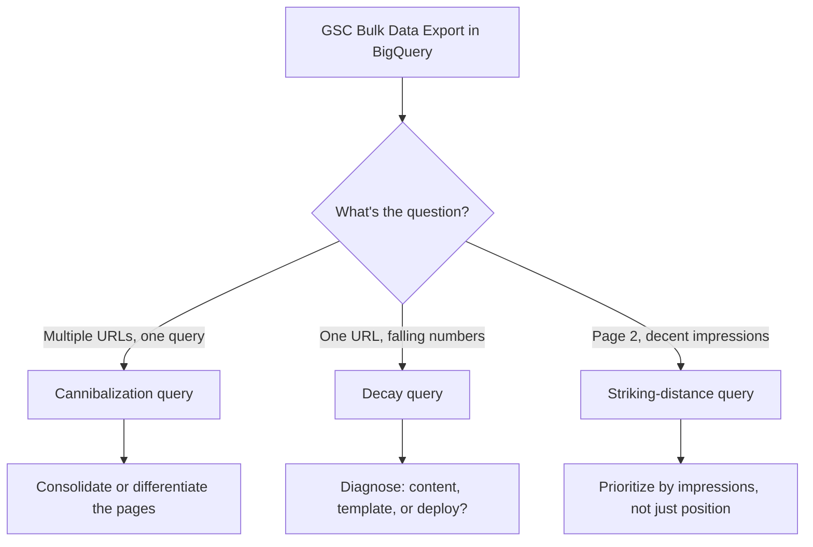

# The GSC-to-BigQuery SQL Cookbook: Cannibalization, Decay, and Striking Distance

You already know the Search Console UI caps out at 1,000 rows and samples your data the moment a site gets big enough to matter. You've probably even enabled Bulk Data Export to BigQuery because someone told you it was the "real" way to do SEO analytics now. And then... you opened the BigQuery console, stared at `searchdata_url_impression`, and closed the tab.

Here's the thing. Every guide on exporting GSC to BigQuery stops exactly where it gets useful. They'll walk you through enabling the export, connecting a billing account, maybe building a Looker Studio chart on top. Then they leave you to figure out the actual SQL for the questions that matter: which queries are cannibalized across multiple URLs, which pages are quietly losing traffic before the dashboard graph turns red, and which keywords are one nudge away from page one. This piece ships the three queries themselves, ready to paste.

## Why Your Search Console Dashboard Can't Answer These Questions

The GSC UI isn't broken, it's just scoped for a different job. It's built for "how am I doing," not "where exactly is the problem." Three structural limits make that gap permanent: the Performance report tops out at 1,000 rows per view, so a mid-sized site with 50,000 ranking queries never sees 98% of its own data in the UI at all. Low-volume queries get anonymized or folded into aggregate buckets the moment they drop below Google's privacy threshold. And comparing "this month vs three months ago vs a year ago" means manually exporting CSVs and stitching them together in a spreadsheet, which is exactly the kind of task a database exists to make unnecessary.

Bulk Data Export solves the access problem — full, unsampled, unthresholded site data landing in BigQuery daily, going back as far as you've had the export turned on. But access to the data isn't the same as answers from the data. That gap is the actual topic of this article.

If you haven't set up the export yet, Google's own [Bulk Data Export announcement](https://developers.google.com/search/blog/2023/02/bulk-data-export) covers the setup steps well enough — a Cloud project, a billing account, and a few clicks in GSC settings. Assume from here that you've got data landing in two tables and want to know what to actually run against them.

## The Two Tables You Need to Know

Bulk Data Export gives you two tables, and conflating them is the single most common mistake once people start writing their own queries.

**`searchdata_site_impression`** is aggregated at the property level — one row per query, country, device, and date, with no URL attached. It's lighter and faster to query, which makes it the right choice for site-wide trend questions. **`searchdata_url_impression`** adds the `url` dimension, plus around two dozen boolean flags for rich-result features (AMP, FAQ snippets, structured data types, and so on). It's heavier, but it's the only one that can tell you *which page* is involved — which means it's the only one that can answer any of the three questions in this cookbook.

Both tables use the same core metric columns, and they're the part everyone gets wrong at least once: `impressions` and `clicks` are plain sums, but there's no `position` column. Instead you get `sum_top_position`, a running total you have to convert yourself:

```sql
average_position = SUM(sum_top_position) / SUM(impressions) + 1
```

The `+1` exists because `sum_top_position` is zero-indexed internally, while every position number you've ever looked at in the GSC UI starts at 1. Forget the `+1` and every "average position" you compute will read one spot better than reality — not a huge error, but a distracting one.

Every query below filters `search_type = 'WEB'` (Image, Video, and News search live in the same tables and will quietly inflate your numbers if you forget to exclude them) and uses `data_date` for the date range, since both tables are partitioned on it — meaning BigQuery only scans the days you actually ask for, which is what keeps these queries cheap even on a few years of history.

## Query #1 — Catching Keyword Cannibalization Before It Costs You Rankings

Cannibalization is what happens when two or more of your own URLs compete for the same query, and Google can't decide which one deserves the click — so it keeps testing both, neither one consolidates authority, and both rank worse than a single, clear page would. The fix starts with finding it, and "finding it" means grouping by query first, then checking how many distinct URLs show up underneath each one.

```sql
WITH query_url_performance AS (
  SELECT
    query,
    url,
    SUM(impressions) AS total_impressions,
    SUM(clicks) AS total_clicks,
    SAFE_DIVIDE(SUM(sum_top_position), SUM(impressions)) + 1 AS avg_position
  FROM `your-project.searchconsole.searchdata_url_impression`
  WHERE data_date BETWEEN DATE_SUB(CURRENT_DATE(), INTERVAL 90 DAY) AND CURRENT_DATE()
    AND search_type = 'WEB'
    AND is_anonymized_query = FALSE
  GROUP BY query, url
),
query_rollup AS (
  SELECT
    query,
    COUNT(DISTINCT url) AS competing_urls,
    SUM(total_impressions) AS query_impressions
  FROM query_url_performance
  GROUP BY query
)
SELECT
  p.query,
  r.competing_urls,
  r.query_impressions,
  p.url,
  p.total_impressions,
  p.total_clicks,
  ROUND(p.avg_position, 1) AS avg_position
FROM query_url_performance p
JOIN query_rollup r ON p.query = r.query
WHERE r.competing_urls >= 2
  AND r.query_impressions >= 100
ORDER BY r.query_impressions DESC, p.query, p.total_impressions DESC
```

Read it query by query, not row by row. A query with two or three URLs each pulling meaningful impressions, none of them clearly dominant, and average positions that are all mediocre (think 8 to 25, nobody winning) is a textbook cannibalization candidate. A query with one URL at position 3 and a second URL barely scraping position 60 usually isn't a problem worth chasing — that's just a thin page accidentally matching a broader query, not two pages actively competing.

## Query #2 — Spotting Query Decay Before Your Traffic Graph Tanks

Decay is the opposite failure mode: not too many pages fighting for a query, but one page's performance quietly eroding, query by query, long before the site-wide traffic chart shows anything worth an alert. By the time a decay problem shows up as a dip in the aggregate graph, it's usually been running for weeks on the specific pages that actually caused it.

This query compares the trailing 28 days against the 28 days before that, at the query-and-page level, and surfaces the biggest click losses:

```sql
WITH recent AS (
  SELECT url, query,
    SUM(clicks) AS clicks_recent,
    SUM(impressions) AS impressions_recent
  FROM `your-project.searchconsole.searchdata_url_impression`
  WHERE data_date BETWEEN DATE_SUB(CURRENT_DATE(), INTERVAL 28 DAY) AND CURRENT_DATE()
    AND search_type = 'WEB'
  GROUP BY url, query
),
prior AS (
  SELECT url, query,
    SUM(clicks) AS clicks_prior,
    SUM(impressions) AS impressions_prior
  FROM `your-project.searchconsole.searchdata_url_impression`
  WHERE data_date BETWEEN DATE_SUB(CURRENT_DATE(), INTERVAL 56 DAY) AND DATE_SUB(CURRENT_DATE(), INTERVAL 29 DAY)
    AND search_type = 'WEB'
  GROUP BY url, query
)
SELECT
  COALESCE(r.url, p.url) AS url,
  COALESCE(r.query, p.query) AS query,
  IFNULL(p.clicks_prior, 0) AS clicks_prior,
  IFNULL(r.clicks_recent, 0) AS clicks_recent,
  IFNULL(r.clicks_recent, 0) - IFNULL(p.clicks_prior, 0) AS click_delta,
  SAFE_DIVIDE(IFNULL(r.clicks_recent, 0) - IFNULL(p.clicks_prior, 0), p.clicks_prior) AS pct_change
FROM recent r
FULL OUTER JOIN prior p ON r.url = p.url AND r.query = p.query
WHERE IFNULL(p.clicks_prior, 0) >= 20
  AND SAFE_DIVIDE(IFNULL(r.clicks_recent, 0) - IFNULL(p.clicks_prior, 0), p.clicks_prior) <= -0.3
ORDER BY click_delta ASC
LIMIT 200
```

The `clicks_prior >= 20` floor matters more than it looks — without it, a page that went from 2 clicks to 0 shows up as a "100% decline" and buries the pages that actually matter under statistical noise from your long tail. Raise or lower that threshold depending on your site's traffic scale, but don't skip it. And if a chunk of your decayed URLs cluster around one publish date or template, that's not a coincidence worth ignoring — it's usually a redirect, a canonical change, or a content refresh that didn't land the way you thought. The [SEO regression-testing piece](/blog/seo-regression-testing-2026-ci-guardrails-ai-code/) covers how to catch that kind of thing before it ships rather than after, if this query keeps surfacing the same deploy twice.

## Query #3 — Finding Your Striking-Distance Keywords

Striking-distance keywords are the ones sitting on page two, close enough to page one that a focused push — an internal link, a content refresh, a better title tag — has a real shot at moving them, instead of the much longer slog of ranking from nothing.

```sql
SELECT
  query,
  url,
  SUM(impressions) AS impressions,
  SUM(clicks) AS clicks,
  SAFE_DIVIDE(SUM(sum_top_position), SUM(impressions)) + 1 AS avg_position,
  SAFE_DIVIDE(SUM(clicks), SUM(impressions)) AS ctr
FROM `your-project.searchconsole.searchdata_url_impression`
WHERE data_date BETWEEN DATE_SUB(CURRENT_DATE(), INTERVAL 90 DAY) AND CURRENT_DATE()
  AND search_type = 'WEB'
  AND is_anonymized_query = FALSE
GROUP BY query, url
HAVING avg_position BETWEEN 4 AND 20
  AND impressions >= 50
ORDER BY impressions DESC
LIMIT 300
```

Position 4 is the lower bound on purpose — queries already in the top three are usually better served by defending the spot than chasing it further, and the effort-to-reward ratio flips hard once you're already winning. Sort this output by impressions, not position: a query sitting at position 18 with 4,000 monthly impressions is a far better use of an afternoon than one sitting at position 6 with 40. Position tells you how close you are. Impressions tell you whether it's worth the trip.

## Why You Still Need to Read the SQL, Even When an AI Agent Writes It

Here's a trend worth naming honestly: 2026 has brought a wave of MCP servers and GPT-based tools that sit on top of exactly this data and promise to skip the SQL entirely. One BigQuery-connected [MCP server marketed at SEOs](https://suganthan.com/blog/bigquery-mcp-server/) literally advertises "just ask questions in plain English" while Claude or another model "writes the SQL for you" behind the scenes, with the actual query hidden unless you go dig through the GitHub repo. That's genuinely useful for a quick gut-check. It's a bad foundation for a decision your manager is going to ask you to defend.

The three queries above aren't meant to replace a tool like that — they're meant to make you dangerous enough to use one responsibly. When an agent hands you a cannibalization report, you should be able to glance at the underlying logic and know whether it's grouping by query the way the first query here does, or whether it's quietly missing the `is_anonymized_query` filter and padding its numbers with queries Google won't even tell you the text of. The agent model is only as trustworthy as your ability to audit it, and auditing SQL you've never written yourself is a lot harder than auditing SQL you understand cold.



## Common Mistakes When Running These Queries

A few things will quietly wreck your results if you're not watching for them. First, forgetting `search_type = 'WEB'` — Image and Video search rows share the same table and will mix query performance from an entirely different surface into your totals. Second, treating `sum_top_position` as a position you can average directly — it's a sum, not an average, and skipping the division (and the `+1`) is the single most common error people copy-paste into production dashboards. Third, running the decay query without a minimum-clicks floor, which drowns real signal in long-tail noise, as covered above. And fourth, forgetting that `searchdata_url_impression` is a much larger table than the site-level one — querying 18 months of it with no `WHERE data_date` filter on a large site is how you burn through your BigQuery free tier in one afternoon instead of one query.

If you're pairing this with Google Analytics data for a fuller attribution picture, keep the two platforms' numbers conceptually separate rather than forcing them into one blended metric — the [GA4 vs Search Console attribution piece](/blog/ga4-vs-search-console-2026-organic-search-attribution-mismatch/) goes deep on exactly why GSC clicks and GA4 sessions will never match row-for-row, and a join in BigQuery should account for that rather than paper over it.

## Conclusion

BigQuery access to your Search Console data was never the hard part — Google handed you that for free back in 2023. The hard part has always been knowing what to ask it, and that's precisely the gap between "we turned on Bulk Data Export" and a team that actually uses it every week. These three queries won't cover every question you'll ever have about your organic performance, but cannibalization, decay, and striking-distance keywords are the three that come up constantly, across almost every site, almost every month — which makes them the right place to start treating your GSC data like the database it actually is, rather than a dashboard you check once and forget.

## FAQ

**Do I need a paid BigQuery plan to run these?**
No. BigQuery's free tier includes 1TB of query processing per month, which comfortably covers these queries on most sites as long as you keep your date ranges reasonable and let the date partitioning do its job.

**Why is my cannibalization query returning almost nothing?**
Check your `query_impressions` threshold first — 100 is a reasonable floor for a mid-sized site, but a smaller property might need to drop it to 20 or 30 to see anything. Also confirm the export has been running long enough to cover your date window; a brand-new export only has data from the day you turned it on.

**Can I run these on `searchdata_site_impression` instead?**
Not for cannibalization or striking-distance by page — that table has no `url` column, so it can't tell you which page is involved. It works fine for a site-wide decay check if you genuinely don't care which URL is responsible, but you'll lose the ability to act on what you find.

**How far back does my data actually go?**
Only as far back as the date you enabled Bulk Data Export — it doesn't backfill. If you just turned it on, the 90-day and 56-day windows in these queries won't have enough history yet; narrow them until they do.

**Should I schedule these to run automatically?**
Once you trust the output, yes — a scheduled query writing results to a permanent table, refreshed daily or weekly, turns this from a one-off investigation into an early-warning system you can build a Looker Studio alert on top of.

```json
{
  "@context": "https://schema.org",
  "@type": "BlogPosting",
  "headline": "GSC BigQuery SQL Cookbook: 3 Queries Every SEO Needs",
  "description": "Copy-paste BigQuery SQL for Search Console data: catch keyword cannibalization, detect query decay, and surface striking-distance keywords today.",
  "datePublished": "2026-10-07",
  "dateModified": "2026-10-07",
  "keywords": "SEO, Developer Tools, Coding, BigQuery, Search Console, SQL"
}
```
