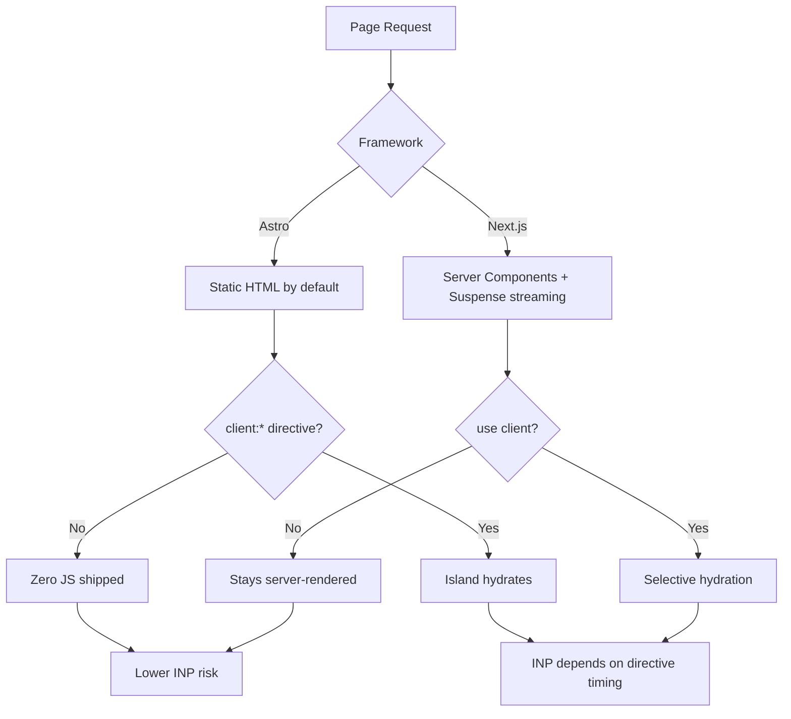

# 8 Next.js vs Astro Core Web Vitals Differences in 2026

Every "Astro vs Next.js" post you've skimmed this year probably ends the same way: a feature table, a shrug, and "it depends on your use case." Fair enough, as far as it goes. But if the thing you actually care about is Core Web Vitals — not "which framework is trendier," but which one ships less JavaScript, hits LCP faster, and doesn't quietly wreck your redirects — that table is useless. It compares marketing bullet points, not mechanisms.

So here's a different cut. Eight specific technical mechanics where Next.js and Astro genuinely diverge in how they affect LCP, INP, and CLS, ranked by how much they actually move the needle for a real production site. Some of these are things the "which should you pick" posts gloss over entirely — one of them, Astro's static-redirect behavior, is a straight-up SEO trap that most comparison content doesn't mention at all. We checked.

## 1. Hydration cost: islands vs. selective RSC hydration

This is the one everyone half-remembers, so let's get the mechanism right. Astro's islands architecture renders every component to static HTML by default — zero JavaScript ships unless you explicitly opt a component in with a `client:*` directive (`client:load`, `client:idle`, `client:visible`). Next.js's App Router takes the opposite default: components are Server Components unless you mark them `"use client"`, and the HTML streams at `<Suspense>` boundaries with React's selective hydration picking up the client pieces as they arrive.

Both approaches are trying to solve the same problem — ship less JS, hydrate less of the page — but they start from opposite poles. Astro assumes "mostly static" and asks you to earn interactivity. Next.js assumes "mostly React" and asks you to earn the exemption. Frigade's own migration to Server Components reported a 62% bundle-size reduction and a 63% faster Speed Index, which tells you the React side can get there too — it's just opt-out instead of opt-in, and teams drift toward client components by habit far more easily than they drift toward islands by accident.

**SEO angle:** INP is a real-user, main-thread metric — [our INP optimization guide](/blog/inp-optimization-2026-developer-guide/) goes deep on exactly why that main-thread work is so expensive. Every kilobyte of unnecessary client JS is work a crawler-rendering budget and a mobile CPU both have to pay for, and Astro's default makes that bill smaller unless you actively choose otherwise. That cost lands hardest on mobile, where CPUs are weakest — a gap we measured directly in our [mobile vs. desktop Core Web Vitals piece](/blog/mobile-vs-desktop-core-web-vitals-2026-inp-gap/).

## 2. Who gets a fast TTFB by default: static-first vs. hybrid-dynamic

Astro's default build output is fully static — HTML files served straight from a CDN edge, no origin round-trip, no cold start. Next.js's App Router defaults are a hybrid: static where it can be, dynamic where it can't, with [Next.js 16.3's Cache Components](/blog/nextjs-16-3-seo-changes-2026/) making that split more explicit (and, as we covered there, occasionally serving an unprerendered loading shell to the first visitor on a route — which can be a crawler).

That difference shows up directly in TTFB. A static Astro page is about as fast as physically possible to serve. A dynamic Next.js route needs an edge or serverless function to run, even if that function finishes in milliseconds — and TTFB is the floor every other Core Web Vital builds on top of. This isn't an argument that Astro is "faster" in general; a Next.js site using ISR or full static export behaves identically. It's that Astro's *default* leans static, and Next.js's default leans dynamic-capable, which means the two frameworks fail in opposite directions when a team doesn't think about it: Astro sites accidentally ship stale content, Next.js sites accidentally ship slow TTFB.

## 3. The image pipeline: build-time Sharp vs. on-demand edge optimization

Both frameworks optimize images with Sharp under the hood, and both can output AVIF and WebP. The difference is *when* that work happens. Astro's Image component (`astro:assets`) runs optimization at build time — the final, resized, correctly-formatted image file exists before anyone requests it. Next.js's `next/image` can do the same for static imports, but its real differentiator is on-demand optimization: images from a CMS or dynamic source get resized and format-converted at request time by a serverless or edge function (classically backed by something like CloudFront + Lambda on non-Vercel infra), then cached.

On-demand is genuinely more flexible — you don't need to know every size variant at build time, which matters a lot for a headless-CMS catalog with thousands of product photos. But it also means the first request for any given size/format combination pays a cold-optimization penalty before the CDN cache fills, which is exactly the kind of invisible LCP tax that only shows up in field data, not in your local Lighthouse run.

**SEO angle:** if your LCP element is an image and you're on Next.js with dynamic sources, warm your cache for your highest-traffic pages after every deploy — don't let Googlebot or a real visitor be the one who pays the first-hit cost. For the full playbook on LCP sub-metrics beyond images, see [our LCP fixes guide](/blog/lcp-optimization-2026-fixes-core-web-vitals-rankings/).

## 4. Font loading: next/font is stable, Astro's Fonts API still isn't

`next/font` has been a stable, default part of Next.js since version 13 — it self-hosts Google Fonts (or any font) at build time, generates a `size-adjust` fallback automatically, and eliminates layout shift from font-swapping essentially for free. Astro shipped a comparable Fonts API — supporting Adobe, Bunny, Fontshare, Fontsource, Google, Google Icons, NPM, and local fonts, with automatic fallback-font generation to reduce CLS — but as of the 2026 docs, it's still sitting behind an experimental flag. It works well. It's just not the thing you get by default when you scaffold a new project, and "experimental" means the API surface can still move under you.

**SEO angle:** font-swap CLS is one of the easiest layout-shift regressions to introduce without noticing, and it's one that disproportionately hits text-heavy content pages — exactly the pages carrying your organic traffic. We go deeper on this class of regression, including the March 2026 shift to site-wide CLS scoring, in [our CLS fix guide](/blog/cumulative-layout-shift-2026-fix-guide-site-wide-cwv/).

## 5. Redirects: Astro's meta-refresh trap on static hosts

Here's the item the generic "which framework should I pick" posts skip entirely, and it's a real landmine. When Astro builds to static output with no server adapter, configured redirects don't become HTTP 301s. Astro's own docs are explicit about it: "Astro will output HTML files with the meta refresh tag by default," and because the response is an HTML file, "the status code is not used by the server." A redirect you configured with a 301 status, on a pure static build, ships as a client-side meta-refresh page with no HTTP status at all.

Add a server adapter and this changes — the adapter writes the redirect into your host's own config, and the 301 default (configurable to 302) actually hits the wire as a real HTTP response. But plenty of Astro sites run fully static, by design, which means plenty of Astro redirects quietly degrade into the weakest redirect signal that exists. Next.js's `redirects()` config, by contrast, always emits a real HTTP 301/308 regardless of whether the route is static or dynamic, because the framework assumes a server (or Vercel's edge layer) is always in the response path.

**SEO angle:** a meta-refresh isn't a 404, so nothing breaks loudly — but it passes link equity far less reliably than a 301, and if you migrated URLs on a static Astro build without an adapter, you may be sitting on this right now without knowing it.

## 6. Sitemaps and Route Handlers: a static file vs. a route that might not be cached

Astro's sitemap, via `@astrojs/sitemap`, is a static file generated at build time — it's as cheap to serve as any other asset, every time, forever, with no caching decision to get wrong. A Next.js sitemap built with `generateSitemaps` runs as a Route Handler, and here's the gotcha a lot of 2025-era advice still gets wrong: starting with Next.js 15, GET Route Handlers are no longer cached by default. Older guidance that assumes "Route Handlers are cached automatically" is simply out of date — you need to opt in explicitly (`export const dynamic = 'force-static'`, or an appropriate fetch cache config) or your sitemap route recomputes on every single crawler hit.

For a 50,000-URL sitemap (Google's per-file cap, which is also why `generateSitemaps` exists to split large sites into multiple files), an uncached regeneration on every Googlebot request isn't catastrophic, but it's unnecessary origin load for a document that changes maybe once a day.

## 7. Third-party scripts and INP: a built-in API vs. bring your own

Next.js ships `next/script` with explicit loading strategies — `beforeInteractive`, `afterInteractive`, `lazyOnload`, and a `worker` strategy that runs scripts off the main thread via Partytown. That's a structured, documented way to keep your analytics pixel or chat widget from blocking input responsiveness. Astro has no equivalent built-in primitive; third-party scripts are typically just `<script>` tags with manual `async`/`defer` attributes, or handled by whatever ad-hoc integration a community package provides.

This doesn't make Astro worse at INP by default — islands already mean less JS is competing for the main thread in the first place. But it does mean that when a marketing team inevitably adds five tag-manager snippets after launch, Next.js gives engineers a documented lever to pull, and Astro gives them a blank `<script>` tag and good intentions.

## 8. Personalized content without tanking CWV: Server Islands vs. Cache Components

Both frameworks eventually have to answer the same question: how do you serve mostly-static content with a personalized sliver (a cart count, a login state) without making the whole page dynamic? Astro's answer is `server:defer` — a Server Island renders its personalized piece on-demand while the rest of the page stays static and fast. Next.js's answer, as of 16.3, is Cache Components layered on Partial Prerendering — a static shell streams immediately while dynamic `await`s resolve behind `<Suspense>` boundaries (the mechanics we broke down in our [Next.js 16.3 SEO changes piece](/blog/nextjs-16-3-seo-changes-2026/), including the footgun where an unprerendered route can serve a loading shell to whoever hits it first).

Functionally, these solve the same problem from each framework's own starting position: Astro bolts dynamism onto a static-first model, Next.js bolts static-shell streaming onto a dynamic-first model. Neither is "solved" in a way that lets you stop thinking about it — both still require you to know exactly which parts of a page are safe to defer.

## Honorable Mentions

**Build-time type safety for content collections** (Astro's Content Layer API vs. Next.js's reliance on your own data-fetching conventions) doesn't move Core Web Vitals directly, but it reduces the kind of silent content bugs that turn into thin or broken pages. **CSS delivery** — Astro's scoped, zero-runtime CSS vs. Next.js's dependence on whatever CSS solution you bring — is worth a full piece of its own once more 2026 field data on CSS-in-JS runtime cost is available.

## How to Choose

None of this adds up to "Astro wins" or "Next.js wins" — that's the trap the generic comparison posts fall into when they try to crown one framework overall. What it adds up to is a checklist of specific defaults each framework asks you to override. If you're on Astro, go verify your redirects aren't silently downgrading to meta-refresh, and decide deliberately whether you need the Fonts API flag on. If you're on Next.js, go confirm your sitemap route is actually cached post-15, and audit how many client components crept in since launch.

The SEO tie-in here isn't abstract: Core Web Vitals are a confirmed ranking signal, and both LCP and INP are measured from real-user field data via CrUX — not your local Lighthouse score. A framework default that quietly adds 200ms of main-thread work or silently weakens a redirect doesn't show up until you check Search Console's Core Web Vitals report or run a CrUX query by URL pattern. Pick the framework that fits your team and your content model. Then go read its docs for the defaults that fight your rankings instead of assuming the marketing page already told you.



## FAQ

**Is Astro faster than Next.js for Core Web Vitals?**
Not inherently — Astro's *defaults* lean static, which tends to produce a faster baseline TTFB and less shipped JS out of the box. A well-tuned Next.js site with ISR, Cache Components, and disciplined client-component usage can match it. The gap is about what you get for free, not a hard performance ceiling.

**Does Astro's meta-refresh redirect issue affect SSR Astro sites?**
No — it's specific to static output with no server adapter. Add any supported adapter (Node, Vercel, Netlify, Cloudflare) and your configured redirects write into the host's real config instead, shipping as actual HTTP 301/302 responses.

**Do I need to manually configure caching for a Next.js sitemap route?**
If you're on Next.js 15 or later and generating your sitemap via a Route Handler, yes — GET Route Handlers aren't cached by default anymore. Export `dynamic = 'force-static'` (or an equivalent fetch cache config) or expect it to recompute on every request.

**Is Astro's Fonts API production-ready?**
It works and ships real self-hosting with automatic fallback generation, but as of 2026 it's still behind an experimental flag, meaning the API can change between minor versions. Treat it as "usable, not yet frozen."

**Which framework should an SEO-first team default to?**
Neither default is automatically correct. Pick based on your content model and team skill set, then treat this list as your post-setup audit — the mechanism that bites you is almost always the one nobody checked.

```json
{
  "@context": "https://schema.org",
  "@type": "ItemList",
  "name": "8 Next.js vs Astro Core Web Vitals Differences in 2026",
  "description": "Next.js and Astro ship Core Web Vitals very differently in 2026. These 8 rendering, image, font, and redirect mechanics decide which one protects your rankings.",
  "itemListElement": [
    {"@type": "ListItem", "position": 1, "name": "Hydration cost: islands vs. selective RSC hydration"},
    {"@type": "ListItem", "position": 2, "name": "Static-first vs. hybrid-dynamic TTFB defaults"},
    {"@type": "ListItem", "position": 3, "name": "Image pipeline: build-time Sharp vs. on-demand edge optimization"},
    {"@type": "ListItem", "position": 4, "name": "Font loading: next/font stable vs. Astro's experimental Fonts API"},
    {"@type": "ListItem", "position": 5, "name": "Redirects: Astro's meta-refresh trap on static hosts"},
    {"@type": "ListItem", "position": 6, "name": "Sitemaps and Route Handlers: static file vs. cache-or-not server route"},
    {"@type": "ListItem", "position": 7, "name": "Third-party scripts and INP: next/script vs. bring your own"},
    {"@type": "ListItem", "position": 8, "name": "Personalized content without tanking CWV: Server Islands vs. Cache Components"}
  ],
  "datePublished": "2026-10-08",
  "dateModified": "2026-10-08",
  "keywords": "SEO, Frontend, Web Development, JavaScript, Core Web Vitals, Next.js, Astro"
}
```
