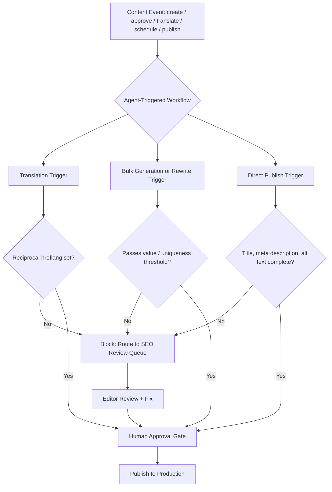

# Agentic CMS SEO Risks: A 2026 Governance Checklist

Here's a weird coincidence nobody in your martech stack seems to be talking about. Gartner spent May 2026 telling the world that "agentic CMS" is the next category to watch — platforms where AI agents don't just suggest content, they create, translate, and publish it themselves. And right now, Google is four weeks into its longest-running spam update of 2026, one that explicitly calls out "automated rewriting and translation" as a scaled content abuse pattern. Nobody appears to be connecting those two dots. That's the gap this piece fills.

## Why Agentic CMS Changes the Content Supply Chain

For years, "headless CMS" meant decoupling content from presentation so developers could ship it anywhere — a React frontend, a mobile app, a smart display, whatever. The content itself was still written and approved by humans, one piece at a time.

Agentic CMS is a different animal. Gartner's May 12, 2026 report, *Innovation Insight: Agentic CMS* (analysts Irina Guseva and Mike Lowndes), frames it as a shift from traditional web content management and headless CMS toward systems built around three new capabilities: automation, decisioning, and orchestration. The report's framing is blunt — AI agents are already "browsing, summarizing, and transacting on your content," but most CMS platforms "were built for humans alone."

That's not a future-tense warning. It's describing what's already shipping. Sanity's remote MCP server went generally available in December 2025 with more than 40 tools an AI agent can call directly — create, query, patch, publish, unpublish, and delete documents; retrieve and even deploy schema changes; run semantic search; manage entire datasets. Storyblok launched FlowMotion on April 1, 2026, letting content events — create, update, approve, translate, schedule, publish — trigger automated workflows across a whole content ecosystem. Payload gives developers hooks to chain AI steps on save, backed by their own vector database. Acquia has gone all-in with AI content agents built into its SaaS CMS. None of this is vaporware. It's the default feature set being sold to content teams right now.

If you've read our piece on [8 SEO Regressions AI Coding Agents Keep Shipping in 2026](/blog/ai-coding-agents-seo-regressions-production-2026/), this is the content-layer mirror image of that problem. That article covered what happens when agents touch your frontend code — stripped alt text, orphaned JSON-LD, drifting canonicals. This is what happens when agents touch the *content itself*, at the CMS layer, often without a developer anywhere in the loop.

## What Sanity, Storyblok, Payload, and Acquia Are Actually Shipping

It's worth being specific about what "agentic" means in practice, because the governance implications change depending on how much autonomy a platform hands the agent.

Sanity's approach leans on attribution and staging. Agents authenticate through your existing login, so every AI-made edit shows up under your name in revision history — not an anonymous bot account. Content Releases let teams stage coordinated changes and verify them before anything goes live, and scoped API tokens restrict exactly what an automated workflow can touch. Payload takes the opposite philosophy: fully self-hosted, TypeScript-native, with retrieval-augmented generation running on your own PostgreSQL database via pgvector. You build the AI logic yourself, which means you also own every governance decision yourself — no vendor guardrails to lean on, for better or worse.

Storyblok's FlowMotion sits in the middle. It doesn't translate or publish content on its own; it watches for events (a draft gets approved, a price changes, a translation request comes in) and runs a workflow in response — and that workflow can pause for human sign-off, apply governance rules, or run only in specific regions. A Storyblok-commissioned survey found 84% of marketers said stronger governance controls would actually increase their trust in using AI for everyday content work, which tells you plenty about where the market's anxiety currently sits.

The common thread: every one of these platforms treats governance as a feature to configure, not a default you get for free. And that's exactly where the SEO gap opens up.

## The Governance Checklists Already Out There Miss One Thing

Before writing this, we went looking for existing "agentic CMS readiness" frameworks, because if someone had already solved the SEO side, there'd be no article here. Two of the most detailed ones we found both miss it in the same way.

Brightspot publishes a 7-point agentic CMS readiness checklist: stable versioned APIs, webhook architecture for multi-agent pipelines, structured content modeling, human-in-the-loop governance with audit trails, role-based access extended to AI agents, real-time delivery for retrieval pipelines, and compliance readiness (logging, rollback, provenance). It's a genuinely useful framework — scored out of 35 points — and it never once mentions SEO, hreflang, canonical tags, or indexing. Metadata gets exactly two passing mentions, both framed as "can the agent read and modify taxonomy," never as "will search engines see a complete, correct page."

Naturaily's 2026 playbook, *Preparing Your CMS for AI Search Shifts*, goes deeper on discoverability — but almost entirely through the AEO/GEO lens: structured data for AI citations, nosnippet and max-snippet controls, a written AI-use policy, disclosure rules, and a warning to watch out for "scaled content abuse" in passing. It never mentions hreflang. It never mentions canonical tag handling. It never asks whether an auto-published page actually has a finished meta description before it goes live.

Here's the pattern: readiness frameworks measure whether an AI agent *can* operate your CMS safely from a compliance and infrastructure standpoint. None of them measure whether what the agent *publishes* is safe from a traditional technical-SEO standpoint. Those are two different questions, and right now only the first one has checklists.

## SEO & Search Implications: Four Regressions Hiding in Your Agent Pipeline

This is where the Core Rule of running an SEO-and-dev blog actually earns its keep — because "AI agents can now publish directly to your CMS" isn't interesting trivia, it's a crawlability and rankings risk if nobody's watching the exits.

### 1. Hreflang gaps from auto-translation triggers

A "translate" event in a system like FlowMotion can spin up a locale variant in seconds. What it doesn't automatically do is wire up reciprocal hreflang annotations between the new page and its siblings. We checked one of the only dedicated hreflang-for-AI-translation guides currently published, and it's a generic how-to with a 2025-dated body wearing 2026 branding — it covers the mechanics of hreflang just fine, but it never once considers the case where the translation itself was triggered by an autonomous workflow rather than a person sitting down to localize a page. If your translate-trigger doesn't also fire a hreflang-update step, you're generating duplicate-content risk at the exact speed that made the feature attractive in the first place.

### 2. Metadata shipped incomplete

On October 1, 2026, Google quietly updated its generative AI content guidance to say AI-generated content should be manually fact-checked before publication — and it specifically named titles, meta descriptions, and alt text as things to verify, not just body copy. That's a direct response to exactly the failure mode an agentic "publish" trigger makes possible: a page goes live the instant a workflow condition is met, whether or not a human actually finished populating its metadata fields.

### 3. Scaled content abuse, by another name

Google's spam policy page (revised August 28, 2026) lists five illustrative patterns of "scaled content abuse." One of them, verbatim in spirit, is "scraping or automated rewriting and translation" at volume with little added value. Google's September 24, 2026 spam update — which, per John Mueller, is "likely to take longer than some of the previous ones" and had no confirmed end date as of early October — explicitly targets this policy category. Nothing in that policy exempts automation because it happens to run inside a CMS vendor's officially supported workflow instead of a scrappy third-party script. Volume plus low added value plus ranking intent is still the trigger, regardless of which tool generated the pages.

### 4. Draft content leaking into retrieval pipelines

Sanity's MCP tooling includes semantic search across embedding indices — a feature built for agent convenience, not for public exposure. If token scoping isn't configured tightly, there's a real governance question worth auditing: can an agent's retrieval tool (or anything consuming the same endpoint) surface draft or unpublished content that was never meant to be citable? This isn't a confirmed incident anywhere we found — it's a structural risk worth checking before it becomes one, the same way you'd audit a staging environment for an accidental `noindex` leak, which is a mistake our [8 Headless CMS SEO Mistakes That Kill Indexing in 2026](/blog/headless-cms-seo-mistakes-2026-indexing-fixes/) piece already covers from the opposite direction.

## Building Your Governance Checklist: A Practical Audit

If you're adopting or already running an agentic CMS, here's where the existing frameworks (Brightspot's infrastructure checklist, Naturaily's AEO/GEO playbook) leave off and where your technical-SEO review should pick up:

- **Audit every "publish" trigger for a metadata-completeness gate.** Title, meta description, and alt text should be required fields the workflow checks, not optional ones it ships blank. This is the same discipline we recommended for CI pipelines in [SEO Regression Testing in 2026: Guardrails for AI-Written Code](/blog/seo-regression-testing-2026-ci-guardrails-ai-code/) — just moved one layer up, from code to content.
- **Pair every "translate" trigger with a hreflang step**, not as a separate manual task someone might forget, but as part of the same workflow definition.
- **Set a volume-and-uniqueness threshold on bulk generation or rewrite workflows.** If an agent can produce 50 pages in the time a human produces one, decide in advance what "adds enough value" means for your site, and gate the workflow on it — before Google's crawlers decide for you.
- **Scope RAG and MCP retrieval tools to published content only**, and check that assumption rather than trusting it by default.
- **Use per-task autonomy, not a global AI switch.** Sanity's per-user attribution and scoped tokens, and Storyblok's governance-rule pauses, both exist specifically so "publish" can require a human checkpoint while "draft" doesn't.

## Common Mistakes Teams Make Right Now

The single most common mistake is treating "agentic CMS readiness" and "SEO readiness" as the same audit. They're not — as the Brightspot and Naturaily frameworks show, you can score perfectly on infrastructure governance and still have zero visibility into whether your agent-published pages have working canonicals. A close second: assuming Content Releases or FlowMotion's approval pauses are "on" by default. They're configuration options, and plenty of teams flip on an agentic CMS feature set to move faster, then discover months later that the approval gate was never actually wired into the publish trigger. And a third, subtler one: treating the September 2026 spam update as something that only concerns link-spam sites or scraper farms. It targets a *policy*, not a reputation tier — a well-intentioned brand running an under-governed translation workflow qualifies just as much as a content farm does.

## Conclusion

Agentic CMS platforms are a genuine productivity leap, and nothing here is an argument against adopting one. But the governance frameworks currently being published to evaluate them — the Brightspot checklists, the AEO-focused playbooks — were written by people thinking about infrastructure and AI-answer visibility, not about canonical tags, hreflang, and metadata completeness. The agentic CMS SEO risks are real, they're specific, and right now the responsibility for catching them sits entirely with whoever configures the workflow. Until the vendor checklists catch up, that's you.



## FAQ

**Does using an agentic CMS automatically violate Google's scaled content abuse policy?**
No. Google's policy targets volume plus low added value plus ranking-manipulation intent — automation alone isn't the trigger. AI-assisted, human-assisted, and fully human content are all covered by the same rule; what matters is whether the output adds value at the scale it's produced.

**What's the single biggest SEO gap in agentic CMS readiness checklists today?**
Neither of the most detailed public frameworks we reviewed — Brightspot's 7-point checklist or Naturaily's AI-search playbook — scores for hreflang handling, canonical tag correctness, or metadata completeness. They measure infrastructure and AI-answer visibility, not traditional crawlability.

**Can AI agents accidentally leak draft content into search or AI answers?**
It's a structural possibility worth auditing wherever retrieval tools (RAG, MCP semantic search) aren't explicitly scoped to published-only content — not a confirmed widespread incident, but exactly the kind of gap that's cheap to check and expensive to discover after the fact.

**Do I need to disable AI auto-publish entirely to stay safe?**
No. Platforms already ship the controls — Sanity's Content Releases staging, Storyblok's FlowMotion approval pauses — the fix is configuring those gates to include an SEO check, not turning AI off.

**How long does recovery take after a scaled content abuse demotion?**
There's no reconsideration request for an algorithmic spam action. Google's own documentation describes recovery as "a period of months" once the issue is fixed and the site is re-crawled and re-assessed by its automated systems.

**Where should I start auditing my own agentic CMS setup?**
Start with every "publish" and "translate" trigger in your workflow engine and ask two questions of each: does it check metadata completeness before going live, and does it update hreflang or canonical tags automatically. Those two gaps account for most of what the existing readiness checklists miss.

```json
{
  "@context": "https://schema.org",
  "@type": "BlogPosting",
  "headline": "Agentic CMS SEO Risks: A 2026 Governance Checklist",
  "description": "Agentic CMS platforms let AI agents publish and translate content automatically. Here's the technical SEO governance checklist nobody's written yet in 2026.",
  "datePublished": "2026-10-09",
  "dateModified": "2026-10-09",
  "keywords": "Agentic CMS, Technical SEO, Headless CMS, AI Content Governance, Structured Data"
}
```
